001_原文和译文

2025年01月31日 11:17

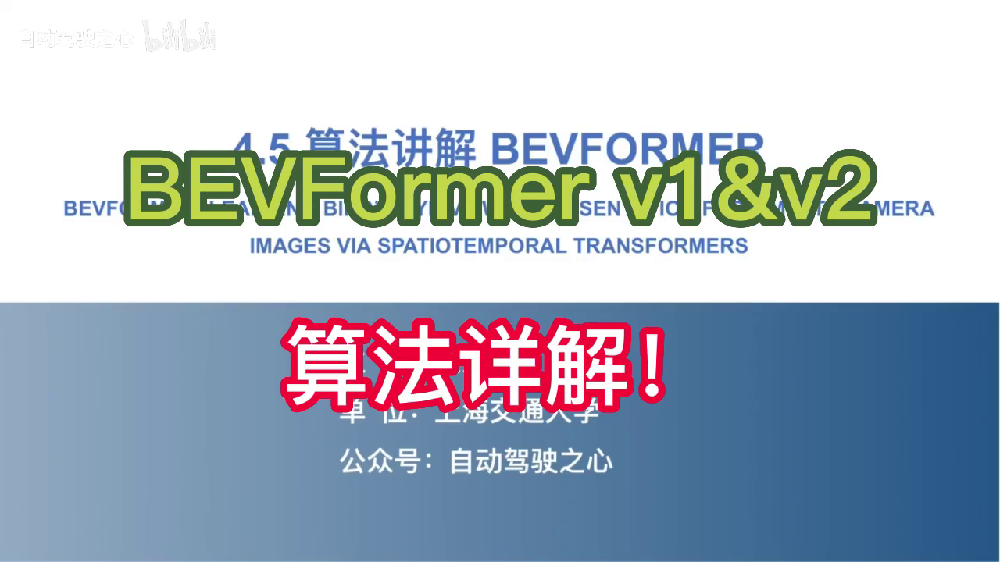{width="5.972222222222222in"
height="3.388888888888889in"}

OK,
hello大家好。今天我们就来给大家分享一下一个在BV感知算法里面，算是比较基础，也是比较具有开创性的一个工作，叫b
reformer。论文方面的讲解流程，我们还是按照算法动机，然后主体结构损失后处理，然后一些性能对比，未来展望一些方面去展开。我们这一节课程还是围绕这个BV
formal的框架来进行讲解的。后续会有一节单独的课程，会给大家详细讲解一下BV
former有关代码方面的一些问题。包括环境配置，模块化的一些流程，还有后续的群evaluation，就是一些运行方面的讲解，会在一个额外在课程上面去给大家做单独的一个说明。我们这里就开始这个BV
former的一个讲解。

はい、こんにちは。今日は、BV知覚アルゴリズムの中で、比較的基礎的で、比較的独創的な仕事であるb
reformerをお見せしましょう。論文側の説明の流れは、我々はやはりアルゴリズムの動機に基づいて、その後、主体構造が損失した後に処理して、いくつかの性能比較、将来展望のいくつかの方面で展開する。私たちのこのコースは、このボリュームフォールの枠組みを中心に説明しています。あとは単独のコースがあります。BV
formerのコードに関する問題を詳しく説明します。環境配置、モジュール化されたプロセス、そして後続のグループresponseは、いくつかの運営面での説明で、追加のコースで個別の説明をします。ここでこのBV
formerの説明を始めましょう。

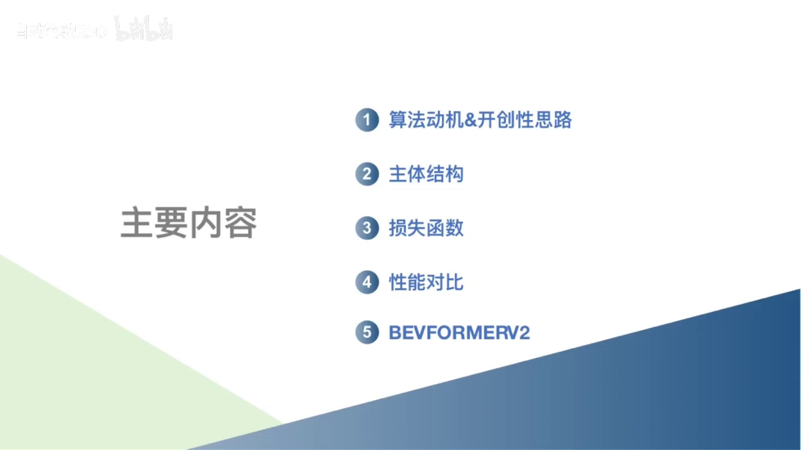{width="5.972222222222222in"
height="3.388888888888889in"}

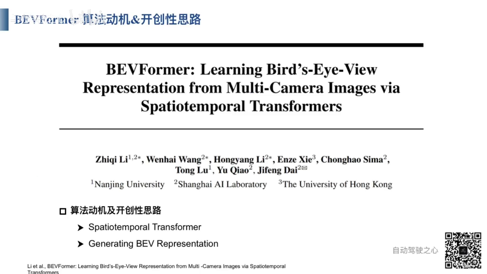{width="5.972222222222222in"
height="3.388888888888889in"}

第二眼的题目其实是很能概括出这个作者的一个中心思想的，所以我们从题目入手，这个题目叫BV
former，我们把它拆分开来看，前面是BV后面其实是former。对于BV这一块我们其实已经讲过很多次了。所谓的BEV其实是鸟瞰图，也就是俯视图，对吧？那former是什么呢？我们在CV这个领域当中，我们所讲的很多的这个former，它其实就是一个全方面，也就是题目后面提到的一个transformer的一个结构OK除了这两个内容之外，除了这个BV和transformer之外，题目还给了我们其他什么信息呢？

第二の目のテーマは実はこの作者の中心的な思想を要約することができます。前はBVの後ろは実はformerです。BVについては何度も話しました。BEVというのは鳥塚図、つまり平面図ですよね?フォーマーは何ですか私たちはCVの分野で、私たちが話している多くのformerは、実は一つの全面的な側面、つまりテーマの後に言及したtransformerの一つの構造OKは、この二つの内容を除いてこのBVとtransformer以外に、テーマは私たちにどんな情報を与えてくれたのでしょうか

那首先它提供了一个我们从哪学BEV的一个信息。它这个learn
from从哪学BEV呢？从muti
camera这个图像当中去学BV反过来他告诉我们什么呢？它提示了我们他这个BV
former是基于这个muti camera图像的一个输入的。

まず、BEVをどこから学ぶかという情報を提供します。このlearn
fromはどこからBEVを勉強しますか?Muti
cameraという画像からBVを勉強して逆に彼は私たちに何を教えてくれたのでしょうか?このBV
formerはこのmuti camera画像の入力に基づいていることを示しています。

通过什么样的架构去提这个BEV呢？他提了一个transformer的一个架构，他这里还提供了transformer，有一个形容词叫special
temporal的一个transformer。那special
temple又是什么意思呢？是一个空间上时序上的一个界定。所以从题目上我们这个文章的它的内容其实已经非常清晰了。它本身的作者他的目的是从他这个mark
cable的图像当中去学习这个BV的一个表征。使用的模块是这里提到的这个空间持续的transformers模块。

どのような枠組みでこのBEVを言及するのでしょうか?彼はtransformerの枠組みを提案しました。彼はここでtransformerを提供しました。スペシャルテンプルとはどういう意味ですか?空間的な時系列的な定義である。だから、テーマから私たちのこの文章の内容は実ははっきりしている。自身の作者は、彼のマークケーブルの画像からこのBVの特徴を学ぶことを目的としている。使用したモジュールは、ここで言及したこの空間継続的なtransformersモジュールである。

所以按照题目来归纳的话，文章其实它就有两个创新点。一个核心的点其实是可以分为两块的那首先我们如何去做这个special
temporary的它这个transformer的模块，另外一个是我们如何去生成这个BV的表征。两个方面。前面第一个方面是这个special
temper的它的transformer要怎么做，另外一个是这个BV的表征要怎么做。它主要分为这两块，后续我们会按照这两块去给大家做一个讲解。

だから、テーマによってまとめたら、文章には二つの革新点があります。一つの核心的な点は、実は二つのブロックに分けられます。まず、私たちはどうやってこのスペシャルコンベヤーのこのtransformerのモジュールを作りますか?二つの側面。前の第一の側面は、このスペシャリティテンパーのtransformerがどうするか、もう一つはこのBVの特徴がどうするかである。これは主にこの二つに分けられています。これからはこの二つに沿って説明します。

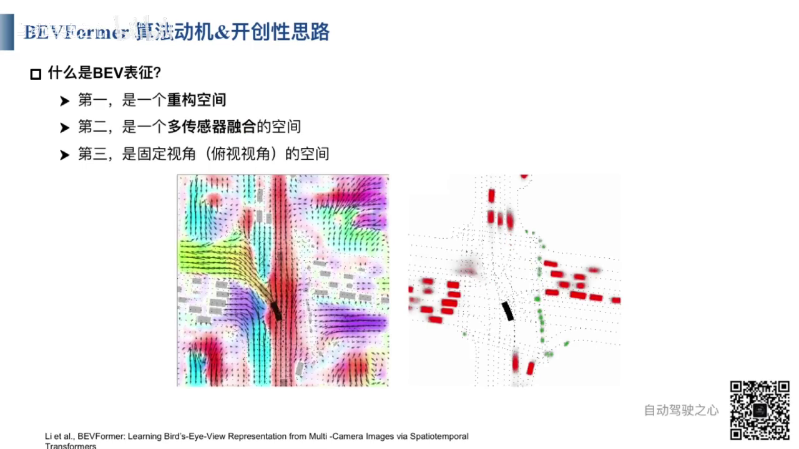{width="5.972222222222222in"
height="3.388888888888889in"}

首先我们在介绍这个完整的流程之前，因为formal的流程之前，我们先来复习一下两个知识点。什么是BV表征和什么是transformer。这两个点其实我们在之前的讲解过程中也提到过很多次，我们这里给大家做一个复习。

まず、この完全なプロセスを紹介する前に、formalのプロセスの前に、二つの知識点を復習してみましょう。BV特徴とtransformer。この二つの点は実は前の説明の過程でも何度も言及しました。ここで復習します。

首先我们说第一个模块，什么是BV表征？对于BV表征而言，它首先是一个重构空间。什么叫重构空间呢？重构空间其实意味着他这个空间并不是真实存在的，我们是不能通过传感器去获取到的，而是通过某些额外的手段去构造出来的一个空间。第二点，它是一个多传感器的空间。我们常见的传感器包括有雷达点云、毫米波雷达，还有一个多视角相机等等。这些传感器采集到的数据，通过某些融合处理的方式，它可以得到我们这里所谓的这个BV空间。

まず、最初のモジュールについて話します。BVの特徴とは何ですか?BVの特徴は、まず再構築空間である。再構築空間とは何ですか?空間を再構築するということは、彼のこの空間が実在しているわけではないということです。センサーでは取得できません。2つ目はマルチセンサの空間です。我々がよく見ているセンサーには、レーダー点群、ミリ波レーダー、多視点カメラなどがある。これらのセンサーが収集したデータは、いくつかの融合処理方式によって、ここでいうBV空間を得ることができる。

另外一点，它是一个固定视角的空间。重构也好，融合也好，它需要是对重构和融合的方向做一个界定的。我们往哪重构，我们上哪去做融合呢？所以说BV这里我就给了一个比较明确的一个界定。他把这个融合的空间已经固定到俯视视角的空间。所以有了我们这个BEV的标准。

もう一つは固定視野角の空間です。再構築も融合も、再配置と融合の方向を定義する必要がある。私たちはどこに再構築し、私たちはどこに融合するのでしょうか?だから、BVここで私は比較的明確な定義を与えた。彼はこの融合した空間を視野角を見下ろす空間に固定した。だから私たちのBEVの基準があります。

我们这里就给大家先比较简单的复习一下这个视觉重构的俯视视角的特征是什么样子的，双人的这个BV我们再给大家复习一下transformer是干什么。我在之前的课程中也强调过，我们理解transformer可以不用把它当成一个网络去理解。我们大家其实把它当成一个模块，和卷积、磁化它这些网络一样，是一个很小的一个功能性的模块。那它这个模块可以实现什么功能呢？它是一个注意力的机制，通俗的讲，它这个注意力是突出强调视觉特征中的某一部分。

ここでは、この視覚再構成の見下ろす視点の特徴がどのようなものかを簡単に復習してみましょう。二人のこのBVはtransformerが何をしているのかを復習します。私は以前の授業でも、transformerはそれをインターネットとして理解しなくてもいいと理解していることを強調した。私たちはこれをモジュールと思っています。畳み込み、磁化のネットワークと同じように、小さな機能的なモジュールです。このモジュールはどのような機能を実現できるのでしょうか?これは注意力のメカニズムであり、通俗的に言えば、この注意力は視覚的特徴の一部を強調している。

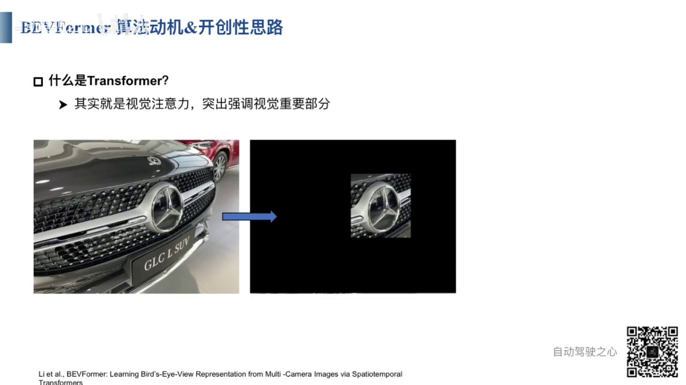{width="5.972222222222222in"
height="3.388888888888889in"}

那我这里给了一张示意图片，比如说这是一张奔驰车的图片，通过什么样的特征去判断这辆车是奔驰车是最靠谱的呢？我们一眼就看出来，因为车标。很明显，但我们通过合理的训练之后，transformer最后会关注哪个位置呢？显然是这个车标的位置。

では、私はここで、例えばこれはベンツ車の写真で、どのような特徴でこの車がベンツ車であることを判断するのが最も信頼できるのでしょうか?私たちは一目でわかります。車の標識があるからです。明らかですが、私たちは合理的な訓練を受けた後、transformerは最後にどの位置に注目するのでしょうか?明らかにこの車の位置です。

后续再给大家扩展一下，就是我们之前也提到过，像BVSN那节课程中也提到过，里面设计了一个模块叫SE这个模块。这个SE模块也是一种注意力机制，它的注意力你只是作用在通道域上面的。就是说图像中所能看到的不同颜色的权重，它其实表示了不同注意力的一个权重的。通过对通道数值的重新加权，网络会自适应的关注或者忽略某一部分的特征。我们可以假定它颜色比较深的区域是权重比较大的地方。通过加权之后，这个权重比较大的地方特征会自信的得到一个加强。这个权重比较小的这个浅色区域的位置，它的权重就会被压，它的特征的值它就会被压下来。后续我们在对前面的这个特征去做一个判断的时候，网络就自然而然的不会注意到权重很小的这个位置。

あとで拡張してみましょう。私たちは先にも言ったように、BVSNの授業でも述べたように、SEというモジュールを設計しました。このSEモジュールも注意力のメカニズムであり、その注意力はチャネル領域に作用するだけである。つまり、画像に見られる異なる色の重みは、実際には異なる注意力の重みを表している。チャネルの数値を再重み付けすることで、ネットワークはある部分の特徴に適応的に注目したり無視したりする。色が濃い領域は重みが大きいと仮定できます。重み付けをすることで、この重みが比較的大きいところの特徴が自信を持って強化される。この重みが比較的小さいこの明るい領域の位置は、その重みが押され、その特徴の値が押される。その後、私たちは前の特徴を判断するとき、ネットは自然に重みの少ない位置に気付かない。

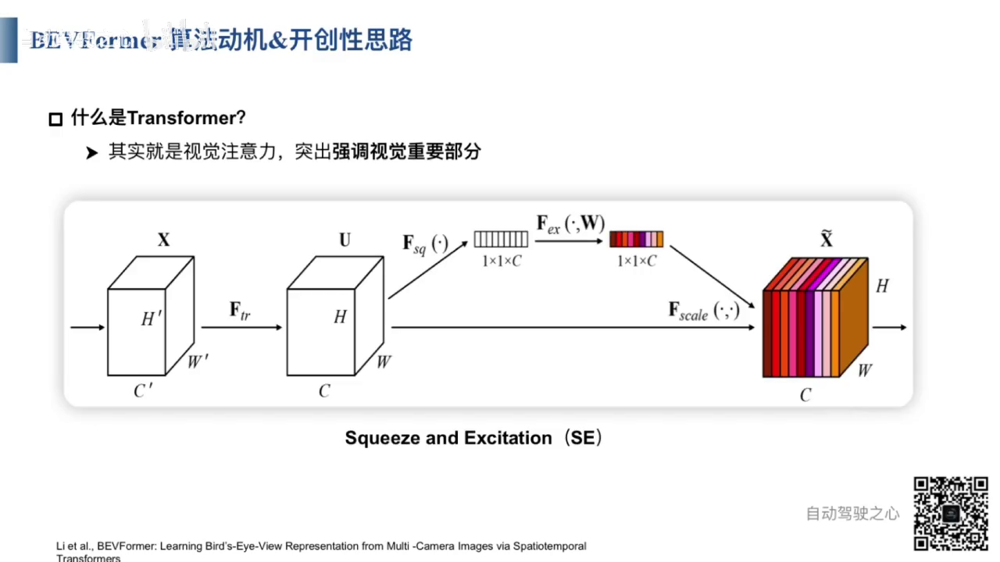{width="5.972222222222222in"
height="3.388888888888889in"}

前一部分给大家稍微复习一下这个BV和transformer的相关内容。BV其实就是一个俯视图的空间，将我们这个前端传感器所采集到的图像数据也好，还有点云数据也好，统一的映射到这个空间当中。Transformer其实就是一个注意力机制，它会引导网络去忽略或者关注某一区域的特征，从而对我们后续的这个任务能起到一个促进的作用。

前の部分では、このBVとtransformerの内容を少し復習してみましょう。BVは実は平面図の空間で、私たちのフロントエンドセンサが収集した画像データも、点群データも、この空間に統一的にマッピングされている。Transformerは実は注意力のメカニズムで、ある地域の特徴を無視したり注目したりして、私たちの後続の任務を促進する役割を果たす。

{width="5.972222222222222in"
height="3.388888888888889in"}

从这里开始，我们给大家具体介绍一下EV
former是一个怎么样的流程。开一个网络，我们首先从这个输入输出开始。输入这个很清楚，是这个muti
view的input，是一个多视角的一个输入。我们提到过很多次了。这个BV
formal的输入是一个mute view
input，是一个它是一个多视角图像的一个输入。那输出在哪呢？它这个网络这个图画的输出比较隐晦一点，它输出其实是在这边，它是一个分割和检测的一个头，是用来做输出的。通过这个输入的多视角图像，我们可以得到这个输出的结果。

ここからはEVフォーマーがどのような流れなのか具体的にご紹介させていただきます。ネットワークを開くには、まずこの入出力から始めます。これを入力するのははっきりしていて、このmuti
viewのinputで、多視点の入力である。私たちは何度も話したことがある。このBV
form lの入力はmute view
inputで、多視点画像の入力である。出力はどこですか?このネットのこの絵の出力は比較的に暗いです。その出力は実はここにあります。この入力された多視野角画像から、この出力の結果を得ることができる。

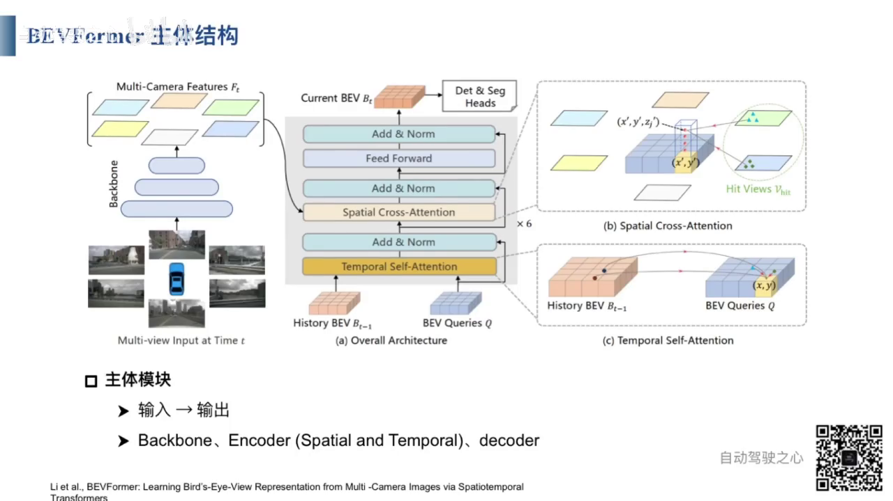{width="5.972222222222222in"
height="3.388888888888889in"}

明白了网络功能之后，我们按照网络的这个流程走向来看一下这个网络有哪些模块。它这个网络的流程走向也比较曲折，我这里给大家做一个标注。以这个图像为输入的话，首先图像是通过这个backbone网络的。通过backbone网络我们可以得到这个muti
camera的future。那也就是这个图像特征和有历史BV特征和BV curry
BV查询向量同时输入到我们看的这个很像一个transformer的一个结构。同时输入到这个结构当中会得到我们当前这个BEV，就是current
BEV的一个future。我们再将这个current BV
fusion送入到后续的分割还有检测网络头里面，那我们就可以得到最终的一个结果。

ネットワークの機能を理解したら、ネットワークの流れに沿って、このネットワークにどのようなモジュールがあるかを見てみましょう。このネットワークの流れも曲がりくねっているので、ここでマークをつけましょう。この画像を入力にしますと、まず画像はこのバックボーンネットワークを経由します。バックボーンネットワークを通して、私たちはこのmuti
cameraの未来を得ることができます。つまり、この画像の特徴と歴史的なBVの特徴とBV
curry
BVのクエリベクトルが同時に入力されたのは、transformerのような構造です。この構造に入力すると、現在のBEV、current
BEVの未来が得られます。このcurrent BV
fusionを次の分割とネットワークヘッドに送ると、最終的な結果が得られます。

按照这个流程来讲的话，框架其实是很清晰的。前面第一个输入是一个marketing
build的input，通过backbone我们可以得到future图像level的future图像level
future和历史数据，和查询数据合在一起，可以生成我们当前状态下的俯视图的特征。然后利用这个俯视图的特征，我们可以做很多的任务。无论是检测也好，分割也好等等等等，还有包括一些轨迹预测也好等等任务。我们可以利用这个VEV特征去做很多的任务。后续这个任务其实可以依赖于我们个人设计的。

この流れで言えば、枠組みは実ははっきりしている。前の最初の入力はmarketing
buildのinputで、バックボーンを介して未来画像レベルの未来画像レベルの未来と履歴データを取得し、クエリデータを結合することができます私達の現在の状態の平面図の特徴を生成することができます。そして、この平面図の特徴を利用して、私たちは多くの任務を遂行することができる。検査でも、分割でも、軌跡予測でも、タスクでもあります。私たちはこのVEVの特徴を利用して多くの任務を遂行することができる。次の任務は実は私たち個人が設計したものに依存できる。

行，我们如果对这个流程有了一个基本了解之后，我们可以对每个模块去进行一个分开的讨论。我们首先讨论的是这个backbone的部分，讨论backbone还是先看这个输入输出是什么。首先输入是这个multiple
input，是一个多视角的图像。那输出的是什么呢？是这个multi
timer的future，是这个多视角图像输入图像所对应的这个多视角的特征。那用什么网络去做这个事情呢？我们怎么样才能将输入变成特征呢？就是这个backbone网络要做的事情。

はい。このプロセスについて基本的な理解ができたら、モジュールごとに別々の議論をすることができます。私たちが最初に議論したのはこのバックボーンの部分で、バックボーンを議論するか、この入出力が何であるかを見てみましょう。まず、このmulti
inputを入力して、多視点の画像です。その出力は何ですかこのmulti
timerのfutureは、この多視野角画像入力画像に対応する多視野角の特徴である。それはどんなネットワークでこのことをするのでしょうかどうすれば入力を特徴にすることができますか?このバックボーンネットワークがやるべきことです。

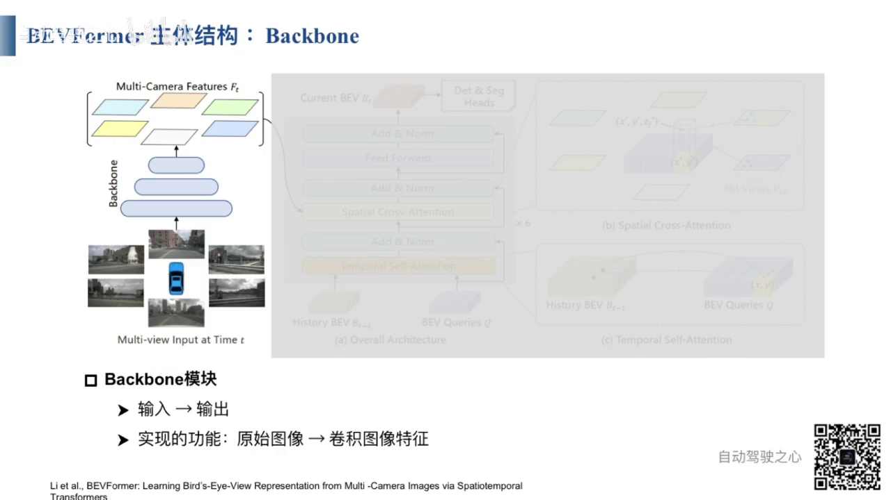{width="5.972222222222222in"
height="3.388888888888889in"}

你这个backbone网络它就是一个图像特征提取的这个网络，是我们常见的，比如这个rest
net，还有deep
net，还有resent加PN等等这些网络。这些网络属于很基础的深度图像处理网络了，我们这里就不会再详细展开了。了解了backbone网络，我们知道这个backbone网络其实它输出的是market
cable的future。也就是说输出的是视觉图像特征，并且是多视角的视觉图像特征。后续我们怎么处理这个特征呢？我们怎么样利用这个视觉图像特征去得到我们想要的这个BEV特征呢？后续这个模块就是干这个事情的。

あなたのこのバックボーンネットワークは画像の特徴抽出のネットワークで、私たちがよく見ているものです。例えば、rest
net、deep
net、そしてresentとPNなどのネットワークです。これらのネットワークは基礎的な深度画像処理ネットワークであるため、ここでは詳細には展開しない。バックボーンネットワークを理解すると、このバックボーンネットワークはマーケットケーブルの未来を出力していることがわかった。つまり、視覚画像の特徴を出力し、多視野角の視覚画像の特徴である。この特徴をどう扱うのでしょうか?どうやってこの視覚画像の特徴を利用して、私たちが欲しいBEVの特徴を得るのでしょうか?次のモジュールはこのことをしています。

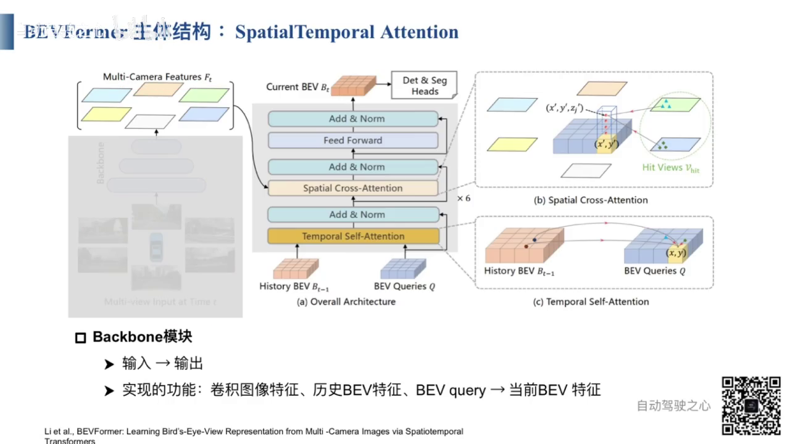{width="5.972222222222222in"
height="3.388888888888889in"}

后续这个框架其实是BV
former的一个核心内容。它涉及到我们如何把我们得到的这个matic
camera的future，去生成我们当前需要的这个future。为了看懂这个网络，我们还是从这个输入输出讲起。它输入其实包括三个模块。首先第一个模块是这个muti
camera的future，另外一个模块就是这个历史的俯视图的特征，还有一个是这个BV
corry。

次のフレームワークは、実はBV
formerの中核的な内容である。これは私達がどうやって私達が得たこのmatic
cameraの未来を、私達が今必要としているこの未来を生成するかに関連しています。このネットワークを理解するために、私たちはこの入出力から始めます。入力には3つのモジュールがあります。まず最初のモジュールはこのmuti
cameraの未来で、もう一つのモジュールはこの歴史の平面図の特徴で、もう一つはこのBV
corryです。

所谓这个历史的俯视图特征，我们可以把它理解成一个时序的特征，对吧？因为它的题目叫special
temper attention空间时序。这个muti camera
future属于空间层面的，历史的BV特征属于时序层面的。他们俩怎么做一个有机的融合呢？这个空间特征和历史特征是怎么做融合的呢？所以我们就用到了这个BV
query。BV cory其实是起到了在muti camera future和历史的BEV
future之间一个很好的桥接的作用。

この歴史の平面図の特徴とは、時系列的な特徴と理解できるでしょうかそのテーマは「スペシャリティテンプル」と呼ばれています。このmuti
camera
futureは空間レベルに属し、歴史的なBVの特徴は時系列レベルに属する。彼ら二人はどうやって有機的な融合をしたのでしょうかこの空間的特徴と歴史的特徴はどのように融合しているのでしょうかそこで私たちはこのBV
queryを使いました。BV coryは実はmuti camera futureと歴史のBEV
futureの間で良いブリッジの役割を果たしています。

灰色部分是这个模块的一个详细的结构，我们从流程上可以把这个模块再仔细看一下。它这个模块其实是一个从下往上的一个模块。首先是将历史的BV和这个BV
quality送入temple self attention，一个持续的self
attention的一个结构。通过这个temple self
attention之后，它是第一步，通过temporary self attention之后送入到special
cross
attention。先做持续的，然后再做空间的。当做完两步之后我们会得到current
bv也就是他当前状态下的俯视图的特征。

グレーの部分はこのモジュールの詳細な構造で、プロセスからこのモジュールをよく見ることができる。このモジュールは下から上へのモジュールです。まず、歴史のBVとこのBV
qualityをテンプルセルフアテンションに送り、持続的なセルフアテンションの構造である。このテンプルセルフアッテンションを通過した後、それは最初のステップであり、エボリューションを通過した後、スペシャルクロスアッテンションに送られる。先に継続的なことをしてから、空間的なことをします。二歩が終わるとcurrent
bv、つまり彼の現在の状態での平面図の特徴が得られます。

我们之前讲过，我们做注意力机制的一个主要目的是得到需要强调的部分。这个部分通道的也好，空间的也好，持续的也好，是我们需要特别去关注的部分。所以我们才把它称之为注意力机制。我们带着这样一个基本思想去进入到下一个模块。按照这个逻辑结构来讲的话，我们还是先给大家强调一下这个temple
attention，然后再说special
attention。因为它是一个从下往上的一个结构，所以说我们后续也是先讲这个持续注意力怎么做的，然后再讲空间注意力是怎么做的。

私たちは先に言ったように、私たちが注意力のメカニズムを作る主な目的の一つは強調すべき部分を得ることである。この部分の通路のものも、空間のものも、持続的なものも、私たちが特に注目しなければならない部分である。注意力の仕組みと呼ばれています。私たちはこのような基本的な思想を持って次のモジュールに入ります。この論理構造によると、私たちはまずこのテンプル・アッテンションを強調してから、スペシャル・アッテンションを説明します。それは下から上への構造なので、私たちはこの継続的な注意力がどうなっているかを話してから、空間的な注意力がどうなっているかを話します。

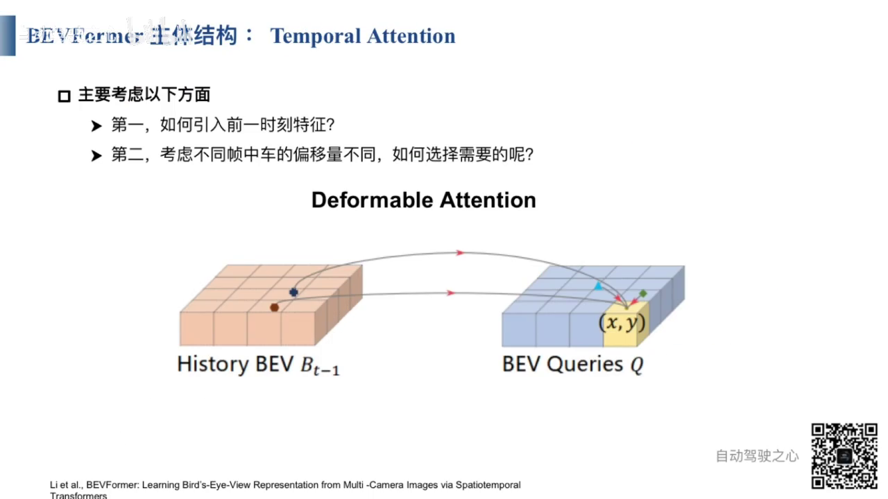{width="5.972222222222222in"
height="3.388888888888889in"}

我们先讲一下temptation，就是这个持续注意力是怎么做的。按照作者论文中所阐述的方面，持续注意力网络的设计，它主要考虑以下两个方面。前面第一个方面是我们要怎么引入前一时刻的特征。因为他既然称之为时序注意力，时序它是考虑到前一帧和当前帧之间的一个关联的。所以说我们如何把前一帧时刻的特征引入到我们当前BV特征的计算，是一个很关键的问题。图上我们能看到，我们作者是想通过这个历史BV信息来去对我们当前这个BV
quality去做一个加强的。另外一个我们要考虑的点是，它在不同帧中车的偏量是不同的。所以我们如果设定一个固定的这样的一个attention的机制来去建模这样一个不确定性的话，他其实不太合理的一个事情。

まず、この持続的な注意力がどのようにして行われたのかを教えてみましょう。著者の論文で述べた方面によると、持続的な注意力ネットワークの設計は、主に以下の二つの方面を考慮している。前の第一の側面は、前の時刻の特徴をどのように導入するかである。彼は時系列注意力と呼ばれている以上、時系列は前のフレームと現在のフレームとの関連を考慮しているからである。だから、私たちはどのようにして前のフレーム時刻の特徴を私たちの現在のBV特徴の計算に導入するかは重要な問題である。図から分かるように、私たちの作者はこの歴史的なBV情報を通じて、私たちの現在のBV
qualityを強化したいと思っています。もう一つ考慮すべき点は、フレームによって車のずれ量が異なることです。だから、私たちは固定的なこのようなattentionのメカニズムを設定して、このような不確実性をモデル化すると、彼は実際にはあまり合理的ではない。

考虑到以上两点，所以作者提出了一个也比较提出引入了一个，因为这个是已有的一个工作，他引入了一个叫可形变注意力的他这样一个模块。那他这种注意力与我们通常意义上讲的注意力有什么区别呢？这里一个九宫格举例。传统的注意力是怎么做的呢？比如说我想计算一个叉号，这个位置这个特征应该是什么？计算插到这个位置的时候，我们可能会考虑它临近厢一点的一个特征。那我们比如说我们先指定好考虑这三个点，它这三个三角形位置的特征。那我们对这三个三角形位置特征去进行一个加权，乘一定的系数，比如说0.5、0.2、0.3乘到这个原始的特征上，生成我们叉号这个位置的特征，那就是我们通常意义上讲的视觉注意力的一个做法。

以上の2点を考慮して、著者は一つを提案した。これは既存の仕事で、彼は変形注意力と呼ばれる彼というモジュールを導入した。彼の注意力は私たちの通常の意味での注意力とどのように違うのでしょうか?ここは九宮格の例です。伝統的な注意力はどうしたのでしょうか例えば、フォークを計算したいのですが、この位置という特徴は何でしょうかこの位置に挿入することを計算するとき、私たちはそれが隣接している点の特徴を考えるかもしれない。例えば、この3つの点、この3つの三角形の位置の特徴を考慮するように指定します。では、この3つの三角形の位置の特徴を重み付けして、一定の係数、例えば0.5、0.2、0.3をこの原始的な特徴に乗じて私たちのフォークという位置の特徴を生成することは、私たちの通常の意味での視覚的注意力の一つである。

那这个informal
attention它可行骗的这个attention是怎么做的呢？我们还以这个九宫格举例。比如说我们刚刚想算叉号位置的特征，我们采用的是与它邻近的这个三角形焦点的特征。我们后续实验可能发现这个特征并不能满足我们的要求。它是一个固定位置的，但它这个固定位置并不是适合于通用场景，所以就提出了这个可行变attention的他这种思路，它会计算一个offset。这个offset其实表示的是我要计算的那个点位置的特征和我当前点它之间的一个偏移量，也就是一个距离。

では、このインフォメーションはどうやってやったのでしょうか?私たちはこの九宮格で例を挙げます。例えば、バツ印の位置の特徴を計算したいですが、隣接する三角形の焦点の特徴を採用しています。私たちは次の実験でこの特徴が私たちの要求を満たすことができないことを発見したかもしれない。これは固定位置であるが、この固定位置は共通のシーンには向いていないので、可能であればattentionを変えるという他の考え方を提案し、オフセットを計算する。このオフセットは、実は私が計算したい点の位置の特徴と私の現在の点との間のずれ量、つまり距離を表しています。

比如说我想计算叉号这个位置，那我采用的特征，我通过预测得出的它的一个偏移量可能离它很远，可能在可能在原圈这个位置。那我利用圆圈这个位置去计算叉号这个位置的特征，它可能是更准确的。我们以前的通用的方法是用这个三角形的位置来去计算的那这样子可能在某些场景下是不合理的那我们通过整个offset这样一个预测批量的预测，我们发现可能采用旁边那个圆圈，一个点、两个点、三个点。可能采用这三个圆圈点来去算这个叉号位置的特征，它可能是更合理的。所以就提出了我们这个可行变对力的网络，利用一个可适应的、可学习的，它这样一个offset一个偏移去对特征去做一个更好的一个提取预测。还是以这个叉号为基准的网络，可以自行预测偏移量。

例えば、私はフォークという位置を計算したいです。私が採用した特徴は、予測によって得られた一つのずれ量はそれから遠いかもしれません。円という位置を使って、フォークという位置の特徴を計算します。もっと正確かもしれません。私たちの以前の一般的な方法は、この三角形の位置を使って計算したもので、ある場面では合理的ではないかもしれないので、私たちはオフセット全体という予測ロットの予測で私たちは隣の円、一つの点、二つの点、三つの点を採用する可能性があることを発見した。この3つの丸点を使ってこのフォークの位置の特徴を計算するのは、もっと合理的かもしれない。だから、私たちのこの実行可能な対力ネットワークを提案して、適応可能で学習可能なネットワークを利用してこのようにオフセットして、特徴に対してより良い抽出予測を行う。やはりこのフォーク番号を基準としたネットワークは、自分でオフセット量を予測することができる。

它是可以预测出来就是说我哪个点的特征对我当前点特征是有争议的。利用这个预测出来的点去对我我当前点去做一个加权。这样可以得到一个更应该是逻辑更自洽的一个特征提取。

これは予測できます。つまり、私のどの点の特徴が私の現在の点の特徴に対して論争があります。この予測した点を利用して、私の現在の点に重み付けをします。これにより、より論理的であるべき特徴抽出を得ることができる。

OK我明白了这点之后，我们再回到这个持续注意力上，对于每一个BV
corry，我们可以理解成它是一个叉号的这个点。网络会来判断哪个BV对我当前BV
corry是有用的。以此的方式我们就恰好的能利用到这个历史BV的特征会在这个XY上。

OK私はそれを理解した後、私たちはこの継続的な注意力に戻って、すべてのBV
corryについて、それがバツ印であることを理解することができます。インターネットはどのBVが私の現在のBV
corryに役立つかを判断します。このようにして、私たちはこの歴史BVの特徴をこのXYに利用できる。

比如说这个BVPXY，我们会去找哪一个历史BV对我当前的他这个XY是有用的。我们可以找到这个褐色的点和这个蓝色的点来对我这个BEV是有用的。所以我们就会把它引入进来，是第一个模块。

例えば、このBVPXYは、どの歴史BVが私の現在の他のXYに役立つかを探しに行きます。この茶色の点と青い点を見つけることができます。最初のモジュールに導入します。

我们把历史第一位算完之后，former会同时的去在它原始的这个特征图上去做第二次的这个self
tension。这个self
tension。呢图上也进行一个标注，我给大家圈一下这个深绿色的位置和这个浅蓝色的位置。考虑到BVK上对我当前点有争议的一个位置，它是一个self
attention的一个计算过程。利用这两个方式来自于历史BV的和BV
quality它自身的一个特征加权。通过这种方式BV发布的作者认为是可以得到一个很好的查询检验的。

私たちは歴史の第一位を計算した後、formerは同時にその原始的な特徴図に2回目の自己tensionを作る。このセルフテンション。この図にも表示があります。この濃い緑の位置とこの水色の位置を囲んでみましょう。BVKで私の現在の点に論争がある場所を考えると、それはセルフアテンションの計算過程である。この2つの方式を利用して、歴史的なBVから来たとBV
quality自身の特徴的な重み付け。この方式でBVが発表した著者は、良い照会検査が得られると考えている。

因为BV
quality本身是作为一个查询向量产生的那有了一个历史BV的引导之后，BV跨瑞的查询的协议会更好，也就是说我们对当前应该形成怎样的BV是有一个初步预期的那就是初步预期其实是来源于我们历史BEV的数据的。后续我们再结合我们当前提取到的空间特征和已经有很强的BV鲜艳的他这个BV
query，我们就能生成更好的BV future。后续我们有了这个BV
querrey，有了我们已经提取好的这个matty
camera的future，我们怎么样去生成我们想要的这个BV
future呢？而且是当前状态下的BV
future？所以作者提出了另外一个主体结构，叫special
attention空间注意力的结构。

BV
quality自体は一つのクエリベクトルとして生成されたもので、歴史的なBVの誘導があった後、BVは瑞を越えたクエリの協議がより良くなるからであるつまり、私たちは現在どのようなBVを形成すべきかについて初歩的な期待を持っているのは、実は私たちの歴史BEVのデータに由来しているということである。その後、私たちが現在抽出している空間的特徴と、すでに強いBV鮮やかな他のBV
queryを組み合わせることで、より良いBV
futureを生成することができる。その後、私たちはこのBV
queryを持って、私たちが抽出したこのmatty
cameraの未来を持って、私たちはどのようにして私たちが欲しいこのBV
futureを生成するのでしょうか?そして現在の状態でのBV
future?そこで著者はもう一つの主体構造を提案した。

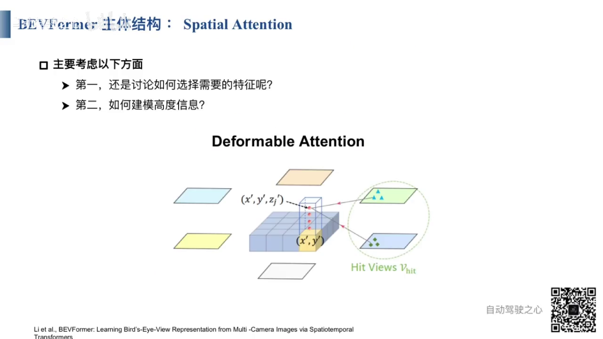{width="5.972222222222222in"
height="3.388888888888889in"}

BV方面的作者还是考虑了以下两个方面。首先第一个方面讨论一下如何选择需要的特征。因为空间其实很大的，对吧？那这个空间中它并不是所有信息全都是我要去构造这个俯视图特征所需要的信息的。其中也包含了很多种的信息，那我们如何选择我们需要的特征呢？另外一个点是考虑的一个比较有意思的信息，就是我们如何建模高度。

BV側の著者はやはり以下の二つの側面を考慮した。まず第一に、必要な特徴をどのように選択するかを検討する。空間が広いからですよね?この空間では、すべての情報が私がこの平面図の特徴を構築するために必要な情報であるわけではない。その中にはいろいろな情報も含まれていますが、私たちが必要としている特徴をどのように選ぶのでしょうか?もう一つのポイントは、私たちがどのように高度をモデル化するかという興味深い情報です。

我们首先说第一个点，我们如何选择需要的特征。在选择特征的方面，我们就不得不引入我们我们在上一节所提到的那个BV
corry，我们是利用这个BV corry对muti
camera的future去进行一个查询。我来举个例子，我们是利用这个BV power。

まず第一に、必要な特徴をどのように選ぶかです。特徴を選ぶ上で、私たちは前の節で述べたBV
corryを導入しなければなりません。私たちはこのBV corryを利用してmuti
cameraの未来を調べます。例を挙げてみましょう。私たちはこのBV
powerを利用しています。

我们首先讨论第一个问题，如何选择我们需要的这个特征？自然离不开我们上节所生成的已经有很强先验信息的这个BV
quality。利用这个BV quality去对我们the
future去进行一个特征的查询。我们去问一问，你有我这个位置的特征吗？没有那就没你事了对吧？

私たちはまず最初の問題を討論し、どのように私たちが必要としている特徴を選ぶのか?もちろん、私たちが前節で生成した、すでに強い事前情報を持っているこのBV
qualityは欠かせない。このBV qualityを利用して、私たちのthe
futureを特徴的に調べます。私たちは聞いてみましょう。あなたは私のこの場所の特徴を持っていますか?それがなければあなたは大丈夫ですよね?

我们举个例子，比如我们想查询这个X一撇Y一撇这个位置的特征，他可能先去问上面这个你有我特征吗？你没有我特征。那他再去问旁边，你有我特征吗？我可能有你的特征。那于是他就按照我们query提供的这个索引去找我们所对应这个视角下的特征，空间位置的特征。

例を挙げてみましょう。例えば、私たちはこのXを調べたいと思って、彼は先にこれを聞いて、あなたは私の特徴を持っていますか?あなたには私の特徴がありません。彼はまた隣に行って、あなたは私の特徴を持っていますか?あなたの特徴があるかもしれません。そこで、彼は私たちのqueryが提供したこのインデックスに基づいて、私たちが対応するこの視点での特徴、空間位置の特徴を探しています。

那我们怎么找呢？同时还是一样的引入了这个可行面注意的机制，我们将XY先映射到它这个视角下所对应的这个位置上，通过去找这个位置临近的相邻点的一个特征去进行一个融合，然后生成它当前视角下需要被融合的特征。后续的话他把这个多视角全都查询完之后，会生成他当前这个X一撇Y一撇位置上，通过这个market
future融合好的一个特征。那那这个特征显然也是经过了这个腾审机制的。我们刚提到是在每一个视角下去做这个地方的tension，去做这个可形变注意力，来提取空间位置上我们需要额外关注的一些特征。

どうやって探しましょうか同時に、この実行可能な注意のメカニズムを導入し、XYをこの視点で対応する位置にマッピングしこの位置に近い隣接点の特徴を探して融合し、現在の視点で融合する必要がある特徴を生成する。その後、彼はこの多視点をすべて調べた後、彼の現在のX一投Y一投位置に、このmarket
futureを通じて融合した特徴を生成する。その特徴は明らかにこの審査機構を経たものです。私たちは、あらゆる視点でこの場所のtensionをやって、この変化可能な注意力をやって、空間的な位置で私たちがもっと注目しなければならない特徴を抽出すると言った。

第二点，他考虑了一个很有意思的一个事情，是这个高度信息。我们为什么要考虑高度信息呢？是因为BV方面的作者认为我们如果是不同目标的话，它在高度上是具有显著差异的。比如说一个人是一个那么高的对吧？他一个路牌他可能很矮，它是有显著差异的。是因为目标种类的不同而导致这个高度上的一个差异变化。一般的我们所讲的俯视图，它是拍扁的，拍扁的话就会损失掉高度维度的这个特征，所以说BV
former它在这里设置了一系列的uncle，用于匹配不同高度的目标。

第二に、彼は面白いことを考えて、この高度な情報である。なぜ私たちは高度な情報を考えるのでしょうか?BV側の著者は、私たちが異なる目標であれば、高さに顕著な違いがあると考えているからです。例えば、一人はそんなに高いですよね?彼は道路標識が低いかもしれないが、それは明らかな違いがある。目標の種類によって、この高さの違いが変わった。一般的に私たちが話している平面図は、フラットにして、フラットにすると高さ次元の特徴が失われるので、BV
formerはここに一連のuncleを設置しています異なる高さのターゲットを合わせるために使用します。

我们说到这，其实BV方面的一个主要模块已经给大家讲解完了。那按照我们前面的分析，我们对里面的一些很重要的模块去做了一个比较详细的一个讲解。我们接下来会结合损失函数，把这个整体的流程再复习一遍，BV方面的整体流程，我们经过前面的拆解，应该相对而言是比较清晰的。它首先是经过一个marty
view的input，我画一下。然后通过这个muti view
input，然后经过一个backbone网络去得到一个market
care的future，也就是一个多视角相机的特征。通过多视角相机特征历史的BV特征和这个BV
pod的特征，我们通过一个所谓的叫special temper
attention的一个网络去生成的BV就是我们当前BV空间的特征。利用当前BV空间的特征就可以做一些我们后续很关心的任务，比如说检测也好，分割也好，或者说轨迹预测、轨迹规划等等。后续这个任务是我们可以人为自定义的那因为我们这里提到损失函数，损失函数这个部分其实根据我们后面子任务去定义的。

私たちはこれについて話しましたが、実はBVの主要なモジュールについて説明しました。私たちの前の分析によると、私たちは中の重要なモジュールについて詳しく説明しました。私たちは次に損失関数を結合して、この全体の流れをもう一度復習します。BV側の全体の流れは、前の分解を経て、相対的にはっきりしているはずです。まずmarty
viewのinputを通って絵を描きます。そして、このmuti view
inputを通して、バックボーンネットワークを通ってmarket
careの未来、つまり多視野角カメラの特徴を得る。多視野角カメラの特徴の歴史的なBVの特徴とこのBV
podの特徴を通して、私たちはスペシャルテンパードと呼ばれるネットワークを通じて生成したBVは私たちの現在のBV空間の特徴である。現在のBV空間の特徴を利用して、私たちが引き続き関心を持っているタスクを行うことができます。例えば、検査でも、分割でも、あるいは軌跡予測、軌跡計画などです。次のタスクは、私たちが人為的にカスタマイズできるものです。ここで損失関数について言及しています。損失関数という部分は、実は私たちの後面子タスクによって定義されています。

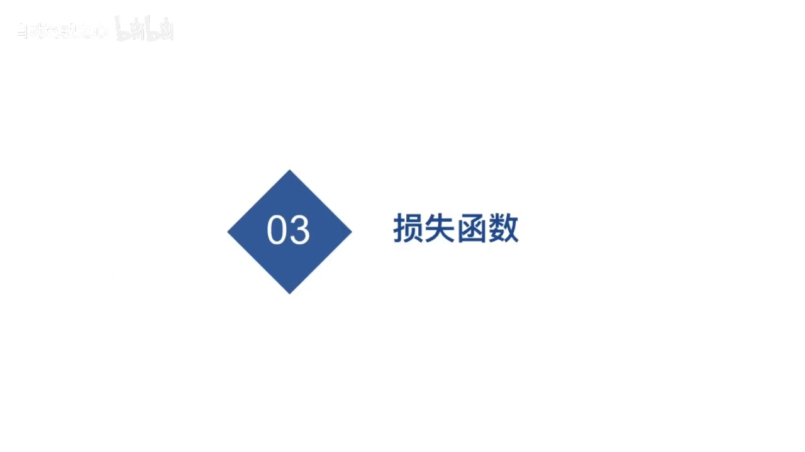{width="5.972222222222222in"
height="3.388888888888889in"}

后面loss这一块是与我们任务相关的那比如说3D检测任务，那就是一个边界框分类和回归的函数。那要是3D分工任务，那就是点云或者是网格分类损失函数等等。这个流程很清楚了之后，实验设计的部分我们可以推理出来BV项目作者他会做哪些实验呢？按照我们流程来讲的话，它首先是一个market
view的一个input，是一个多视角的输入，通过backbone得到特征。首先第一个实验，前序的图像处理，这个backbone它对我们整体性能有没有影响呢？是第一个实验。

次のグロは、我々のタスクに関連する、例えば3D検出タスクで、境界枠の分類と回帰の関数である。それが3D分業任務であれば、点群やメッシュ分類損失関数などである。この流れがはっきりした後、実験設計の部分はBVプロジェクトの作者がどのような実験をするのかを推論できるのか?私たちの流れによると、それはまずmarket
viewのinputであり、多視点の入力であり、バックボーンによって特徴を得ます。まず、最初の実験、前序の画像処理、このバックボーンは私たち全体の性能に影響を与えているのでしょうか?最初の実験です。

后续第二个实验也很明了了，他special
temple它这个transformer。后续第二个实验其实也比较明了了，前面一个medicare的future，然后一个历史BV1个BV通过这个时序的是通过空间的tention可以得到最后的这个BE
refuge map。这个temple self
attention它是可去掉的网络。我们通过刚刚讲解也知道，它这个temple持续attention，它最后输出的是一个带有强烈先验信息的BV
curry，那我们把这个网络去掉，无非就是说他这个先验信息没有了，它不会对这个网络的输入输出有其他额外的影响。输入输出的数目还是固定的对吧？他有BV
corry还是有BVK，那他无非是BV
corry本身额外的已经编码。好的这个宣传信息没有了。那后续第二个实验我们就显然可以去掉，把这个temple
self给去掉，看它对网络的性能有是否有很大的影响。

次の2つ目の実験も明らかになりました。次の2つ目の実験も明らかになった。前のmedicareの未来、そして歴史BV1のBVがこのタイミングで空間のtentionを通して最後のBE
refuge
mapを得ることができる。このテンプルは、削除可能なネットワークです。私たちは先ほどの説明でも知っていますが、このテンプルは継続的にattentionしています。最後に出力されたのは強い事前情報を持つBV
curryです。このネットワークを削除します。ただ、彼の事前情報がなくなって、このネットワークの入出力に追加の影響を与えることはない。入出力の数は固定されていますよね?彼はBV
corryを持っていますか?それともBVKを持っていますか?彼はBV
corry自身の余分なコードにすぎません。はい、この宣伝情報はなくなりました。次の2つ目の実験は明らかに削除できます。このテンプルを削除して、ネットワークの性能に大きな影響があるかどうかを確認します。

另外一个我们刚才也提到，无论是空间的腾审还是持续的腾审，这个special腾审也好，temple
attention也好，他们俩都离不开一个叫可行变重力的一个模块，也就是我们刚才的deforming
attention。这个deforming
attention是否对网络很重要呢？我们带着上面的推断可以进入到这个性能对比的方面。

もう一つは先ほども言いましたが、空間の騰審であろうと、持続的な騰審であろうと、このスペシャル騰審であろうと、テンプルアッテンションであろうと、彼ら二人とも、実行可能な重力と呼ばれるモジュール、つまり私たちの先ほどのdeforming
attentionを離れることができない。このdeforming
attentionはネットワークにとって重要なのでしょうか?私たちは上の推定を持ってこの性能比較の面に入ることができる。

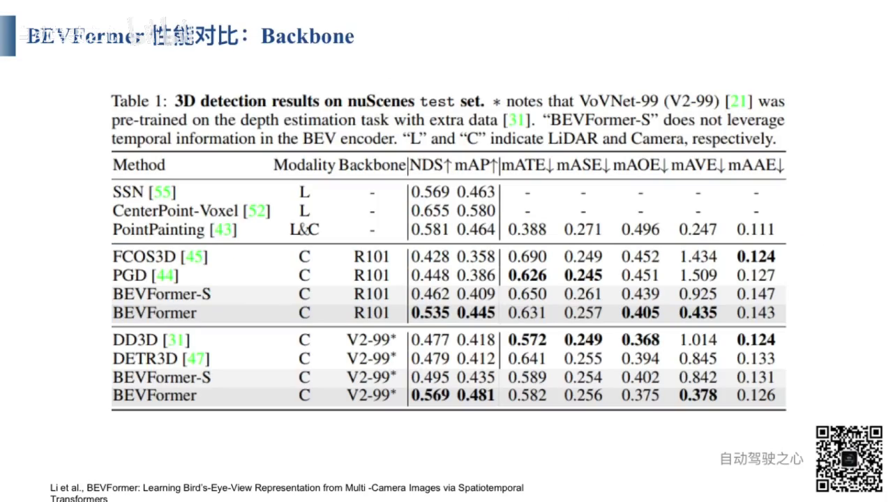{width="5.972222222222222in"
height="3.388888888888889in"}

性能对比我们强调两个方面，前面第一个方面是一个总体结果。从总体结果上来看的话，比一些比较基础的模块，就是一些比较基础的3D检测方法，还是有一定的性能提升的。比如说这个101这个框架，比如说他在使用同等backroom的情况下，我们大家都使用101的情况下，这个BV
former比f
cos还是好那么一点的。它是53.5，它是42.8，好了，将近十个点，十个点多一点。如果我们换一个更好的back榜，比如说换到了这个V299，这个V299它的性能提升就更明显了。这个必备方法是如果是基于V299的book的话，比101要好了将近0.03个点。

性能比較は二つの方面を強調し、前の一つは全体的な結果である。全体的な結果から見ると、いくつかの比較的な基礎的なモジュールは、いくつかの比較的な基礎的な3D検査方法で、まだ一定の性能向上がある。例えば、この101という枠組みは、例えば、彼が同等のbackroomを使っている場合、私たちは皆101を使っている場合、このBV
formerはfcosよりも少しいい。これは53.5です。42.8です。いいです。10時近く、10時過ぎです。もし私たちがもっと良いbackランキングを変えたら、例えばこのV299に変えたら、このV299の性能向上はもっと顕著になります。この必須の方法は、V299ベースのbookであれば、101よりもほぼ0.03ポイント良くなった。

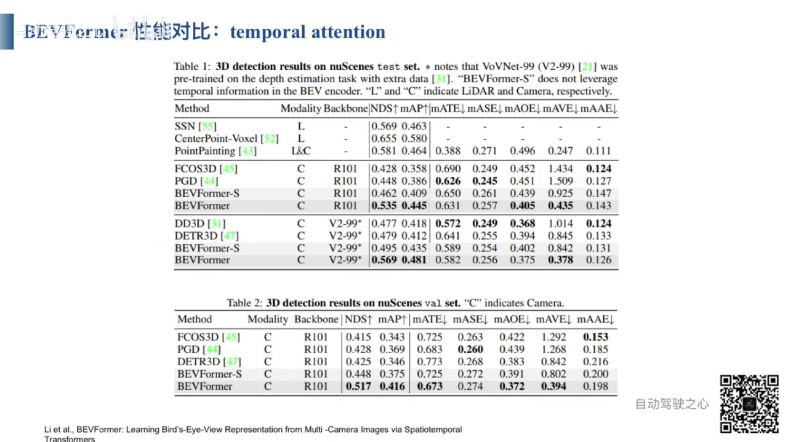{width="5.972222222222222in"
height="3.388888888888889in"}

另外一个实验，其实我们刚刚也提到，这个持续注意力模块是可以拿掉的那我们这里的这个BV
former s其实就是拿掉持续注意力之后的这个网络，我们也可以比较一下这个BV
former s和这个BV
formal之间的一个差异。我们可以发现如果没有持续注意力模块的话，我们本身的这个BV
correa其实是没有历史BEV的。这个新闻信息的性能是下降了很多的。大家可以看一下，53.5和46.2，它这个性能其实下降的特别多的那BV方面中讨论第三个点，就是说我们这个网络非使用这个可前面卷积不可，能不能使用别的这样一个助力机制呢？这里其实也是给了一个性能比较的，显然是可以使用其他注意机制的那性能也是会受到一定的影响。

もう一つの実験ですが、実は先ほど言ったように、この持続的な注意力モジュールは取れます。私達のところのBV
former sは実は持続的な注意力を取った後のネットワークです。このBV former
sとこのBV form
lの違いを比較することもできます。継続的な注意力のモジュールがなければ、私たち自身のこのボリュームコライザには歴史的なBEVがないことがわかります。このニュース情報の性能はかなり低下している。53.5と46.2を見てみましょう。この性能が実際に低下しているのは、3番目のポイントで、私たちのネットワークはこれを使っていないと前に畳み込むことができないということです他のこのような補助機構を使ってもいいですか?ここでも実際には性能比較を与えているが、明らかに他の注意機構を使用できる性能も一定の影響を受ける。

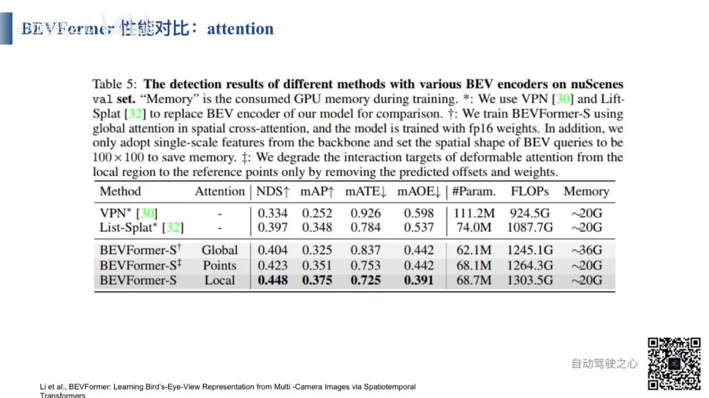{width="5.972222222222222in"
height="3.388888888888889in"}

作者这里其实给了3种注意力机制，它一个叫全局注意力，也就是我这里给的这个global，也就是这个表中所提到的这个global。它一种是这个points，一种是local。我们还是以九宫格举个例子来说明一下这三个特征有什么样的一个区别。首先我们这是一个九宫格，他这里提到的global
tension，它是什么意思呢？是考虑这个九宫格内的所有特征，去给它做一个加权。我们会得到这个global的特征是一个全局性质的一个特征。那什么叫point？还是以九宫格举例，后一次特征其实是我们会对这个区域内去做一些点的指定，比如说我要那比如说我要算这个点的特征，那我会指定我这个区域的特征以一个点、两个点、三个点、四个点为代表，无论什么样的区域，我全都是用这四个点的特征作为我这个区域的一个reference特征，一个代表性的特征。

作者はここで実は3つの注意力のメカニズムを与えました。一つは全体の注意力といいます。つまり、私がここで与えたこのグローバル、つまりこの表で言及したこのグローバルです。その一つはこのpointsで、一つはlocalです。私たちはやはり九宮格を例に挙げて、この三つの特徴にどのような違いがあるかを説明します。まず、私たちは九宮格です。彼がここで言及しているglobal
tensionとはどういう意味ですかこの九宮格内のすべての特徴を考慮して、重み付けをします。このグローバルな特徴はグローバルな性質の特徴である。それはpointとは何ですかやはり九宮格を例にして、次の特徴は実は私たちがこの区域内にいくつかの点を指定することである。例えば、私はこの点の特徴を計算したいでは、私はこの領域の特徴を一つの点、二つの点、三つの点、四つの点で表します。どのような領域でも私はこの4つの点の特徴を私のこの地域の1つの特徴とし、代表的な特徴である。

另外一个就是这个local的方式。这个local的方式就是我们提过很多次的，是文章中所提到的可行变量传审的一个方式。你比如说我想提取同样的提取这个区域的特征，前面这个叉号这个点是固定位置的。那我们这个logo它是非固定的，是基于offset网络预测出来的对吧？那比如我第一次我想提取一个、两个、三个、四个区域的特征，那我可能第二次我提取的是一个、两个、三个、四个的特征，它是根据网络，按照不同的情况，它通过不同的输入去预测出来不同的upset。所以会产生它不一样的特征组合的方式。显然我按照这种可行面的方式，这个网络会更加的灵活，也能更加的自适应不同的场景。

もう一つはこのlocalの方式です。このlocalの方式は私達が何度も言ったことです。文章の中で言及されている実行可能な変数の伝審の一つの方式です。例えば、私はこの領域の特徴を抽出したいと思っています。前のフォークという点は固定位置です。私たちのロゴは固定されておらず、オフセットネットワークに基づいて予測されていますよね?例えば、私は初めて一つ、二つ、三つ、四つの領域の特徴を抽出したいです。二回目に私が抽出したのは一つ、二つ、三つ、四つの特徴かもしれません。ネットワークによって、状況によって、異なる入力で異なるupsetを予測します。そのため、異なる特徴の組み合わせが生まれます。明らかに私はこのような実行可能な方法によって、このネットワークはより柔軟で、より異なるシーンに適応することができます。

行，以上就是我们今天BV former部分整体的一个讲解。我们对BV
former可以再做一个总结。这个BV
former其实就是它的一个核心内容，其实是我们如何去生成BV特征，就是这个BV特征要怎么构造。至于这个BV特征一旦生成好了之后去做什么任务，我们可以选择我们合适的这样一个分割头也好，检测头也好，去做适合的这个子任务。

以上が今日のBV former部分の全体的な説明です。BV
formerについてもう一つまとめてみましょう。このBV
formerは実はその核心的な内容です。実は私達はどのようにBVの特徴を生成しますか?このBVの特徴はどのように構造しますか?このBVの特徴が完成したら、どのようなタスクをしますか?私達は適当な分割ヘッドを選んでもいいです。

那核心的内容就是说我们怎么生成BV特征呢？其实BV方法包含两个模块，一个模块是这个temperature
tion，一个模块是这个special tension。通过temple
attention我们可以把历史信息融到历史的这个BV信息，融到它当前的这个BV
power上。通过special tension我们可以利用BV
query提取到我们想要的空间位置的信息，空间的一个特征来生成我们最终想要的current
BV就是当前BV视角下的特征。

その核心的な内容は、私たちがどのようにしてBVの特徴を生成するのかということです実は、BVメソッドには2つのモジュールが含まれています。1つのモジュールはこのizu
tionで、もう1つのモジュールはこのspecial
tensionです。テンプルアテンションを通じて、歴史情報を歴史のこのBV情報に、現在のこのBV
powerに融合させることができます。Special tensionを通して、私たちはBV
queryを利用して、私たちが欲しい空間の位置の情報を抽出することができます。空間の特徴の一つは、私たちが最終的に欲しいcurrent
BVを生成することが、現在のBVの視点での特徴です。

我们今天主要是对这个BV
former的它的一个整体流程，还有一些功能概念做一些介绍。后续会有对BV
former完整代码的一个详细讲解，也欢迎大家持续关注。另外我们这里给大家稍微提一下BV
former v2这个方法。我们说的BV former的改进版，BV former
v2的详细框架就不再讲了，我们这里主要看一下它做了哪些改进。

今日は主にこのBV
formerの全体的な流れと、いくつかの機能概念について紹介します。その後、BV
formerの完全なコードについて詳しく説明し、引き続き注目することを歓迎します。また、BV
former v2という方法を少しご紹介します。私たちが話しているBV
formerの改良版は、BV former
v2の詳細な枠組みはもう話していません。ここでは主にどのような改善が行われたかを見てみましょう。

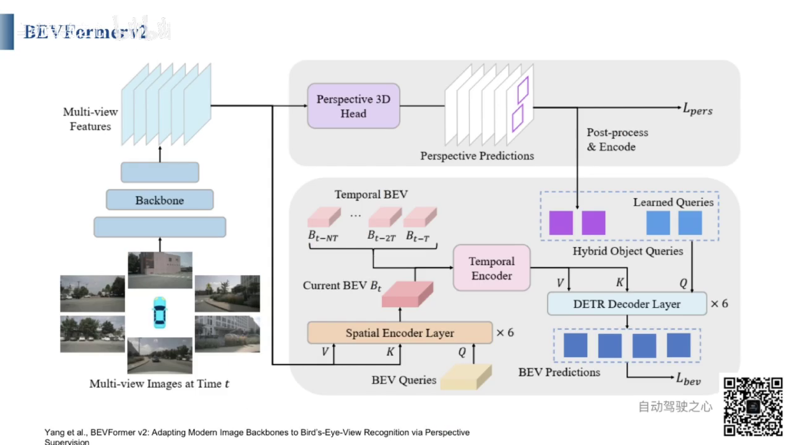{width="5.972222222222222in"
height="3.388888888888889in"}

我们还是按照输入输出的流程来看，输入是什么呢？是一个多视角图像，一个mute
view
images。输出是什么呢？是predictions。也就是说我们3D检测结果输入的多视角图像，通过backbone网络可以得到mute
view futures，也就是我们说的图像特征。我们在课程前面提到我们说的BV
former是利用这个multiple futures，通过special attention，通过temporal
attention、空间注意力、持续注意力可以得到BV特征。

私たちはやはり入出力の流れに沿って、入力とは何でしょうかは多視点画像で、mute
view
imagesです。出力は何ですかPredictionsです。つまり、私たちの3D検査結果に入力された多視点画像は、バックボーンネットワークを通じてmute
view
futures、つまり私たちが言っている画像の特徴を得ることができる。私たちは授業の前で、私たちが言ったBV
formerはこのmulti
futuresを利用して、speci通すことで、エボリューション、空間注意力、持続的な注意力でBVの特徴を得ることができる。

BV former v2当中除了BV former原本框架当中的special encoder、temporary
encoder, 还有一个额外的支路。我们能看到perspective Sandy
had，并且是有额外的监督信息的。上面这个支路其实是BV former
v2的核心内容。

BV former v 2には、BV
formerの元のフレームワークの中にあるスペシャリティ・エンコーダー、コンベヤー・エンコーダーのほかに、もう一つの分岐点があります。Perspective
Sandy
hadを見ることができ、追加の監督情報がある。上のこのバイパスは実はBV
former v2の核心内容です。

那为什么需要这个支路呢？我们可以这样想，如果把这个支路去掉，图像backbone网络当中参数的监督信息来自于哪里呢？是来自于我们最后的一个检测结果，最后检测结果的损失用梯度回传来更新图像backbone的参数。

なぜこのバイパスが必要なのでしょうか?このバイパスを削除すると、画像バックボーンネットワークのパラメータの監視情報はどこから来ているのかと考えることができます私たちの最後の検査結果から来て、最後の検査結果の損失はグラジエントで画像のバックボーンを更新するパラメータを返します。

BV former
v2的作者认为像这一种监督，其实不是一种明显的监督。梯度回传是一步一步最终才能到达到图像backbone的参数上的那我们怎么把这种远端的监督来变成一种近端的监督呢？我们怎么把这种很不直接很不明显的监督变成又直接又明显的呢？Be
form
view作者的想法也很直接，我们直接利用棒输出的图像特征，可以得到一个初步的预测结果。初步预测结果如果有监督信息的话，可以直接用来更新backbone网络参数。通过这样的方式，它这个head设计也很简单。

BV former
v2の作者は、このような監督は、実は明らかな監督ではないと考えている。勾配の回復は一歩一歩で、最終的には画像のバックボーンのパラメータに到達することができます。どうやってこのような遠端の監督を近端の監督に変えますか?どうやってこのような非常に直接的で明らかでない監督を直接的で明らかな監督にしたのでしょうか?Be
form
viewの作者の考え方も直接的で、私たちは棒で出力された画像の特徴を直接利用して、初歩的な予測結果を得ることができる。初歩的な予測結果に監視情報があれば、直接バックボーンネットワークのパラメータを更新することができる。このようにして、このheadデザインも簡単です。

我们前面是有了一个multiple
future，也就是多视角的图像特征。我们可以利用一些单目的3D检测框架的head，可以在图像上预测3d
box。虽然这个box可能是不太准的，可能是比较粗糙的那没有关系，它的perspective
head的预测结果是不会作为我们最终的检测结果的。它的一个更主要的作用其实是图像网络的参数更新的作用。

私たちの前には、多視点の画像の特徴であるmulti-futureがあります。私たちはいくつかの単目的3D検出フレームワークのheadを利用して、画像上で3d
boxを予測することができる。このboxはあまり正確ではないかもしれないが、粗雑なのは関係ないかもしれない。そのperspective
headの予測結果は我々の最終的な検査結果とはならない。その一つのより主要な役割は、実際には画像ネットワークのパラメータ更新の役割である。

BA former
v2它其实也是属于一种tuesday这个框架我们叫两阶段检测器。两阶段检测器哪里是第一阶段呢？前面这里是第一阶段。我们说第一阶段检测结果一般是不太好的，很粗糙的结果。那后续通过我们说第二阶段去对第一阶段的结果做更新，做refine，可以得到一个更好的一个更准确的结果。

BA former
v2は、実はTuesdayという枠組みに属しています。二段階検出器はどこが第一段階ですか前の段階は第一段階です。第一段階の検査結果は一般的にあまり良くない、粗雑な結果だと言っています。その後、第二段階は第一段階の結果を更新し、refineを行うことで、より良いより正確な結果を得ることができる。

我们把第一阶段得到的初步的检测结果送入到第二阶段当中，它怎么送呢？我们第一阶段它不是有一个proposal，proposal可以和我们原本初始的BV
form当中随机初始化的一些object quality做混合，一个混合的object
quality。这个query其实是有两个方面的，有一方面是我们第一阶段的检测结果，另外一方面其实是我们初始化的一些随机的可更新的一些quality。以上两个quality混合来做我们最后的BV
predictions。以上其实就是b reform
v2的1主要内容改进了，详细的内容我们这里就不再赘述了。OK我们本小节内容就到此为止。

第一段階で得られた初歩的な検査結果を第二段階に送りますが、どうやって送りますか?私たちの第一段階ではプロポーザルがあるわけではありません。プロポーザルは、私たちが最初に初期化したBV
formの中でランダムに初期化したobject qualityと混合して、混合したobject
qualityを作ることができます。このqueryには二つの側面があります。一つは私たちの第一段階の検査結果で、もう一つは私たちが初期化したいくつかのランダムで更新可能な品質です。以上の2つのqualityを組み合わせて、私たちの最後のBV
predictionsを作ります。以上がb reform
v2の主な内容である。詳細はここでは説明しない。OK私たちのこのセクションの内容はこれで終わりです。

002_原文和译文

2025年01月31日 11:17

Hello,
大家好，我是七七。本次的课程来给大家讲解一篇非常经典的融合工作，叫bb
fun。还是从以下四个方面展开，一个是算法动机，一个是网络的主体结构，另一个是损失函数和性能比较。

こんにちは、こんにちは、私は七七です。今回のコースでは、bb
funという非常に古典的な融合作業を説明します。やはり次の4つの方面から展開します。一つはアルゴリズムの動機で、一つはネットワークの主体構造で、もう一つは損失関数と性能の比較です。

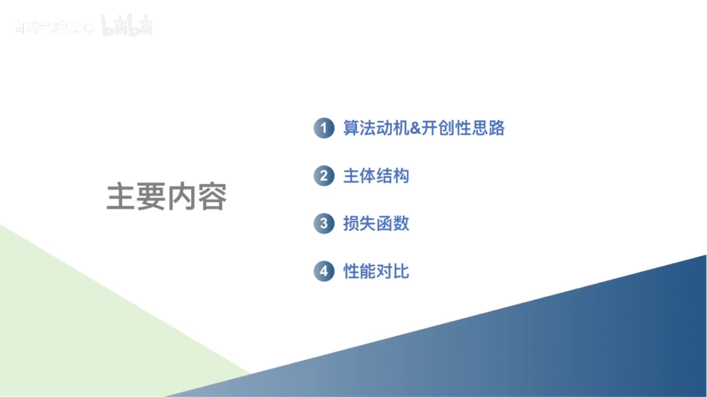{width="5.972222222222222in"
height="3.388888888888889in"}

我们先看B这个名字能想到什么呢？显然拆开来看，一个是BV一个是fusion。那BV是什么呢？是一个俯视空间，我们叫上帝视角。什么叫fusion呢？Fusion翻译过来叫融合。

Bという名前で何が考えられるか見てみましょう明らかに分解してみると、一つはBVで、もう一つはfusionです。BVは何ですか見下ろす空間で、私たちは神の視点と呼ばれています。フュージョンとは何ですか?フュージョン翻訳は融合と呼ばれています。

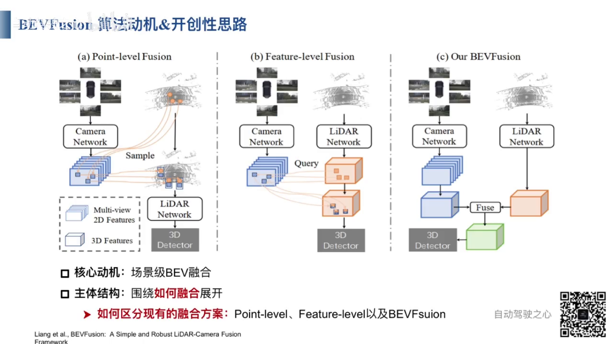{width="5.972222222222222in"
height="3.388888888888889in"}

既然是融合，什么和什么的融合？通常情况下我们讲的融合是跨模态的融合。比如图像和语音信号的融合，图像和毫米波雷达的融合，图像和激光雷达点云的融合。BBF属于哪种融合呢？从下面的图上我们也能看出来，它属于图像和点云的融合的输入。知道了那是怎么做融合的呢？也就是说我们怎么样把图像和点云柔在一起。所以作者从这里他就开始分析了。

融合している以上、何と何が融合しているのか?通常、私たちが言う融合はクロスモダリティの融合である。例えば、画像と音声信号の融合、画像とミリ波レーダーの融合、画像とレーザーレーダーの点群の融合。BBFはどの融合ですか?下の図からもわかるように、それは画像と点群の融合の入力である。それがどうやって融合したのかわかりましたか?つまり、私たちはどうやって画像と点雲を柔らかくしますか?だから作者はここから分析を始めた。

作者认为融合方法可以分为三种，前面第一种叫point lab
fusion，也就是点击的融合。Level的point是指什么呢？是点云中的点。也就是说point
level的策略是从点出发，我们这里有一条链路叫采样，从点云中采样出一些点，然后我们根据相机的内参和外参矩阵可以投影到图像上，采样出图像特征，然后再拼接到点云上。我们这里能看到橙色部分，蓝色部分是对应的点特征和图像特征，我们利用这个融合后的特征去做3D检测。

著者は融合方法は3つに分けられると考えています。最初はpoint lab
fusion、つまりクリックの融合です。Levelのpointとは何ですか点群の中の点です。つまり、point
levelの戦略は点から出発します。ここにはサンプリングというリンクがあります。点雲からいくつかの点をサンプリングします。そして、カメラの内参と外参行列に基づいて画像に投影し、画像の特徴をサンプリングして、点雲につなぎ合わせることができる。オレンジ色の部分が見えます。青い部分は対応する点の特徴と画像の特徴です。この融合した特徴を利用して3D検査を行います。

第二种方式，因为future的作者把这个归纳为叫future
level的方式。同样我们这里future
level是指什么？我们这个future是说的什么意思？是特征。那什么特征呢？Future
level的方法是将两种模态，我们或者说多模态的中间特征，通过内外参矩阵拼接投影融合出完整的特征来去做的。传递的是什么呢？是quality。

第二の方式は、未来の作者がこれを未来レベルという方式にまとめたからです。また、こちらではfuturelevelとは何を指していますか?私たちの未来はどういう意味ですか特徴です。どんな特徴がありますか?Futurelevelの方法は、2つのモデル、あるいは多モードの中間的な特徴を、内外参行列結合投影によって完全な特徴を融合して行う。何を伝えているのでしょうか品質です。

按照quality的方式，比如我们输入点云，通过一个点云网络我们得到初始的位置。初始位置去图像上采样特征是一个从点云去到图像的过程。采样完特征之后，我们再拿回到初始的点云空间当中中拼接到原始的特征之上。蓝色这个部分是我们从图像当中采样过来的特征，橙色这块是我们原始的初始的点云特征，两种类型的特征拼接在一起，我们去进行这个3D检测的任务。

Qualityの方式では、例えば、私たちは点群を入力し、点群ネットワークを通じて最初の位置を得る。初期位置で画像をサンプリングする特徴は、点群から画像に行く過程である。特徴をサンプリングした後、私たちは最初の点群空間に戻って元の特徴につなぎ合わせた。青い部分は私たちが画像からサンプリングした特徴で、オレンジ色は私たちのオリジナルの点群特徴で、二つのタイプの特徴がつなぎ合わさっている私たちはこの3D検査の任務を行います。

我们看到这里，我们就想point level和future
level的方法有没有什么问题？我们从网络流程上来看，两种方案其实全都离不开一个映射的过程。也就是说我们利用内参和外参矩阵，需要将3D的点换算到2D空间上。我们讲过内参，我们一般认为相机出厂之后就恒定了，是一个比较稳定的量。相机外侧是衡量相机和激光雷达间相对位置关系的，它可能由于初始的校准，然后或者车辆运行过程中的一颠簸抖动，可能会造成我们的外参它会有个偏差。外参如果产生偏差，从点云去往图像投影很直接的会产生一个投影偏差。

ここを見て、point
levelとfuturelevelの方法に問題はありますか?私たちはインターネットの流れから見ると、二つの案は実は一つのマッピングの過程から離れられない。つまり、内参と外参行列を利用して、3Dの点を2D空間に換算する必要がある。私たちは内参について話したが、カメラが出荷された後は一定で、比較的安定した量だと考えられている。カメラの外側はカメラとレーザーレーダーの相対的な位置関係を測定するもので、初期のキャリブレーションや車両の運転中の揺れによって私たちの外参にはばらつきがあるかもしれません。外参がずれていると、点群から画像への投影が直接的にずれてしまう。

我们上面讲的是第一点，投影过程中可能会产生一定的偏差。后面第二点，我们即使很准确的能够看到投影点，我们发现相机它在这个点的成像效果可能并不好。比如说我们点云投影到图像上之后，采样出的这个位置可能没有图像特征。比如像镜头脏引起的遮挡，还有比如像某些相机损坏可能导致的卡针等等，我们的点云投影它在图像上很难找到一个对应的特征，或者说我们找到了错误的或者不太好的特征，是我们的第二点原因，也就是说我们采样的图像特征可能它的一个质量不是特别高。

私たちが先に述べたのは、投影中に一定のずれが生じる可能性があることです。次の2つ目は、投影点が正確に見えても、カメラのこの点での撮影効果が悪い可能性があることです。例えば、私たちの点群が画像に投影された後、サンプリングされたこの位置には画像の特徴がない可能性があります。例えば、レンズの汚れによる遮蔽や、カメラの破損によるカードの針など、私たちの点群投影は画像上で対応する特徴を見つけるのが難しいあるいは、間違った特徴やあまり良くない特徴を見つけたのは、私たちの第二の原因、つまり、私たちがサンプリングした画像の特徴は、その品質が特に高くない可能性がある。

另外我们我们再看还有一个什么原因呢？从源头上来看，point level还有future
level的方法是从哪出发的？它的流程是什么？全都是从点云出发的，点云投影到图像上。如果我们初始位置就已经丢失了，我们点云信息已经没有了，那我们很难找到它在图像上所能对应的投影位置。

もう一つ理由があるのでしょうか?ソースから見ると、point
levelとfuturelevelの方法はどこから出発したのか?その流れは何ですかすべて点群から出発し、点群は画像に投影される。もし私たちの初期位置が失われ、私たちの点群情報がなくなったら、それが画像上で対応できる投影位置を見つけるのは難しい。

所以像BBF的作者认为，以前的方式无论是point level也好，还是future
level的方法也好，它们之间存在一个主次依赖的关系。从点云出发是以点云为基准。点云如果不准外参，如果不准后续的检测，那后续自然也就不准了。所以BV
fusion它其实是想能够尽可能的降低这种组织依赖关系，对点云和图像去进行一个分别处理，它再在这个BV空间做融合。

だからBBFの作者は、以前の方式はpoint
levelでも、futurelevelの方法でも、それらの間には主な依存関係があると考えている。点群から出発するのは点群を基準とする。点雲が外参を許さなければ、後続の検査が許されなければ、後続は当然許されない。そのため、BV
fusionはこのような組織の依存関係をできるだけ低減し、点群と画像を別々に処理して、このBV空間で融合させたいと考えています。

所以我们能看到输入是图像，还有点云。它是通过两条并行的网络去做处理的。完事儿之后，通过一个融合模块去做融合的。它们之间是没有什么主次依赖关系的，哪个好我用哪个。比如我这个点位，可能是点云信息比较好，那我们就用点云信息。比如我那个点位可能是图像信息比较好，那我们就用图像信息。

だから私達は入力が画像であることを見ることができて、まだ少し雲があります。2つの並列ネットワークを介して処理されます。終わったら、一つの融合モジュールを通して融合します。彼らの間には何の主な依存関係もなく、どちらがいいかは私がどちらを使うか。例えば、私のこのポイントは、点群情報がいいかもしれないので、点群情報を使います。例えば、私のポイントは画像情報がいいかもしれないので、私たちは画像情報を使います。

另外我们今天介绍的这篇BV
power还有一个特点，除了我们一个融合特征的检测头之外，他在每一个模态信息下面都额外接了一个检测头。像作者的意思是说我们可能融合之后，可能效果也不是很好啊，或者说我单一的依靠图像，或者单一的依靠点云也不好。但他们俩是可以融合工作，也可以分开独立工作的那所以尽可能的避免在一些偏极端情况下产生的一些影响。

また、私たちが今日紹介したこのBV
powerにはもう一つの特徴があります。私たちの融合特徴の検査ヘッドのほかに、彼は各モード情報の下に検査ヘッドを追加しました。作者のように、私たちが融合した後、効果があまり良くないかもしれない、あるいは私が単一の画像に依存している、あるいは単一の点雲に依存しているのも悪いという意味です。しかし、彼ら二人は仕事を融合することができ、独立して仕事をすることもできるので、極端な状況での影響をできるだけ避けることができる。

OK所以我们这里总结一下，像BV
fearing这篇文章，它的动机还是回到了标题，它叫BV
fusion。它是一种融合的思路，融合的是什么呢？是点云和图像。那怎么做融合呢？是在BV空间做的融合，它们的融合有主次依赖关系吗？很弱的一种依赖关系。OK我们接下来看一看be
fusion的主体结构是什么样的，他们是具体怎么样设计这个网络的，我们还是老套路。

OKですから、ここでまとめてみましょう。BV
fearingという記事のように、その動機はやはりタイトルに戻っています。BV
fusionと呼ばれています。これは融合の考え方で、融合したのは何でしょうか点雲と画像です。どうやって融合するのでしょうか?BV空間での融合ですが、それらの融合には主な依存関係がありますか?弱い依存関係です。OK次に、be
fusionの主体構造がどのようなものか、彼らが具体的にどのようにこのネットワークを設計したのか、私たちは古い道を見てみましょう。

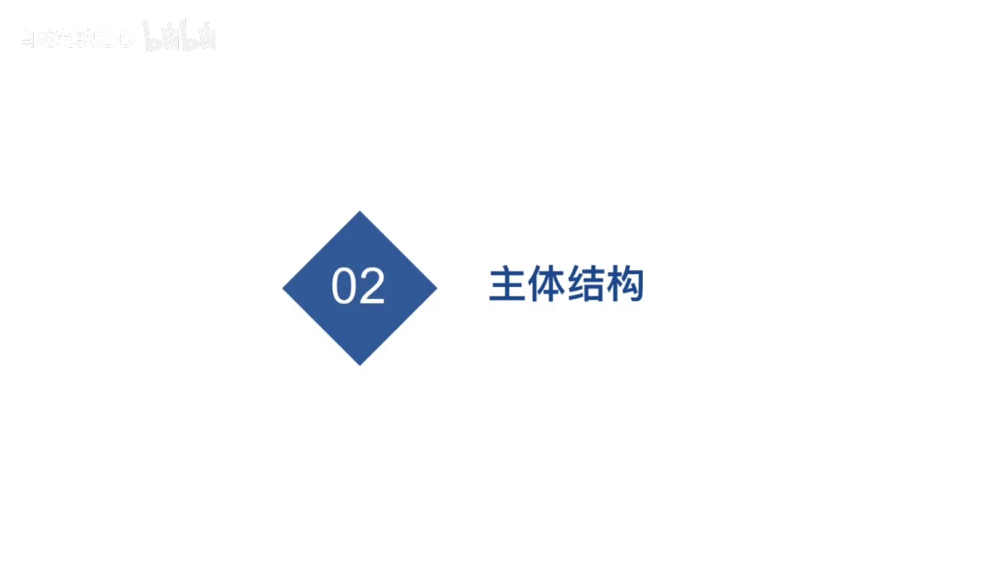{width="5.972222222222222in"
height="3.388888888888889in"}

{width="5.972222222222222in"
height="3.388888888888889in"}

看网络先看什么呢？先看输入输出。这里的输入输出是什么？输入其实包含两个方面，我们讲像多模态方法，输入是包含多个模态的，一个是多视角的图像输入，还有一个是point
cross，是点云输入。输出是对于3D检测任务而言，它自然就是3D检测结果。一个final
detection result是一个最终的检测结果。

ネットを見て何を見ますか?まず入出力を見ます。ここの入出力は何ですか入力には二つの側面があります。マルチモーダルメソッドのように、入力には複数のモードが含まれています。一つは多視点の画像入力で、もう一つはpointクロスで、点群入力です。出力は3D検査タスクにとって、当然3D検査結果である。最終的な検出結果です。

那输入图像怎么处理？通过chemistry图像流是专门用来处理图像的。通过图像编码器encoder它可以得到图像特征一个matter
future图像特征怎么转换到BV空间当中呢？这一块我们其实我们在第二章也讲过，是一个2D到3D的转换器。图像特征从2D映射到3D再从3D投影到BV，我们可以得到所谓的camera
BV future图像特征在BV空间的一种表征。

では、入力画像はどのように処理されますか?Chemistry画像ストリームは、画像を処理するために使用されます。画像エンコーダでは、イメージの特徴を得ることができます。matter
future画像の特徴は、どのようにしてBV空間に変換されますか?これは実は第二章でも話しました。2Dから3Dへの変換器です。画像の特徴は2dから3dにマッピングされ、3dからBVに投影され、いわゆるcamera
BV future画像の特徴はBV空間での特徴を得ることができる。

那输入点云怎么处理呢？通过leader
stream，也就是我们的点云流，是专门用来处理点云数据的。通过3d
backbone我们可以得到点云的BV特征。这里的3d
backbone其实可以有很多，包括point
level的，对吧？我们基于点的方式的，我们基于提速的方式等等。它这里是并不局限的。我们得到点云特征之后，拍扁到BV上，我们自然就得到了点云的BV特征。那OK我们到这里有了什么呢？有了图像的BV特征，有了点云的BV特征，那我们接下来做什么？

では、入力点群はどうすればいいですかLeader
stream、つまり私たちの点雲流は、点雲データを処理するために使われています。3dバックボーンで点群のBVの特徴を得ることができる。ここの3dバックボーンには、point
levelを含むものがたくさんありますよね?私たちはポイントベースの方式、スピードベースの方式などに基づいています。ここは限られていません。私たちは点群の特徴を得た後、BVに平らになると、私たちは当然点群のBVの特徴を得た。では、ここに何があったのでしょうか画像のBVの特徴があり、点群のBVの特徴がありますが、これから何をしますか?

做融合所以引入了额外的叫fewer
mode，是这个融合模块。融合模块的输入有两个，一个是图像的BV
future，另一个是纯点云的BV
future。通过这个融合模块我们可以得到点云和图像的混合特征，利用混合特征去做预测。此外作者为了实现我们单一模态也可以做检测的一个能力，额外加了两个detection
head。我们可以看到图上其实也列出来了，是有camera detection
result，是利用图像BV future可以得到图像的检测结果。利用点云的BV
future也可以得到点云的检测结果，所以这里其实就是BV future的完整流程了。

融合してfewer
modeという追加の融合モジュールを導入しました。融合モジュールの入力は2つあり、1つは画像のBV
future、もう1つは純粋な点群のBV
futureである。この融合モジュールを通して、点群と画像の混合特徴を得て、混合特徴を利用して予測することができる。また、著者は私たちの単一モードでも検査できる能力を実現するために、2つの検出ヘッドを追加した。実際には、カメラの検出結果があり、画像futurebvを利用して画像の検出結果が得られることがわかります。点群を利用したボリュームフューチャーも点群の検査結果を得ることができるので、ここはボリュームフューチャーの完全な流れである。

其实比较简单，两个支路然后融合，然后再检测。我们我们接下来具体看一下，我们分开看一下每个支路是怎么做的，融合检测又是怎么做的那首先我们从图像之路开启，图像的encoder是怎么做的呢？我们上1PPT讲过，图像之路的输入是多视角图像，输出的是图像的BV特征。我们中间会经过很多的模块，包括encoder视角转换。所以我们现在看encoder部分，encode是包含两个的。一个是backbone，也就是骨干网络。我们说的骨干网络可以像这种west
net，通过f
pn去做一个多尺度融合。这个多尺度融合无论是2D还是3D它其实都是一种通用套路。

実は比較的簡単で、二つの分岐路が融合してから検査する。次に具体的に見てみましょう。各バイパス路がどのように行われているか、融合検査がどのように行われているかを別々に見てみましょう。まず画像の道から始めましょうイメージのencoderはどのようにして作られていますか?前の1PPTでは、画像の道の入力は多視点画像で、出力は画像のBVの特徴であると述べた。私たちの間には多くのモジュールがあります。そこで今は、encodeには2つの部分が含まれています。一つはバックボーン、つまりバックボーンネットワークです。私たちが言っている中堅ネットワークはこのウェストネットのように、f
pnを通じてマルチスケール融合を行うことができる。このマルチスケール融合は2Dでも3Dでも共通の方法である。

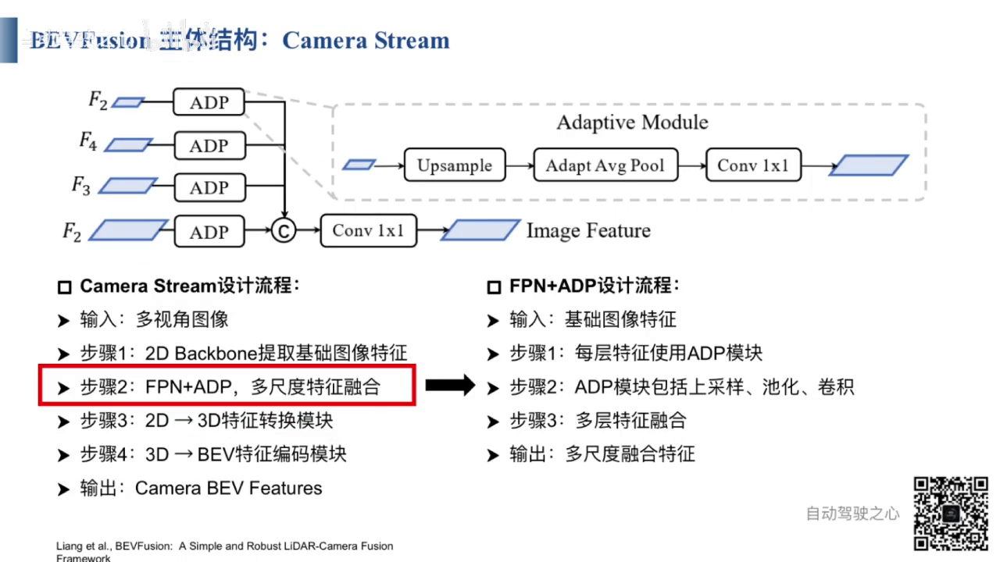{width="5.972222222222222in"
height="3.388888888888889in"}

我们这个IPN全称其实叫future
parameter，它是一个特征金字塔。我们大家可以看一下这个结构。它是不是很形象，是下面大上面小，很像一个金字塔的结构。其实这个所谓的大小，它表示的是特征的尺度，那不同尺度的特征通过ADP模块去做融合。

私たちのIPNのフルネームはfutureparameterと呼ばれ、それは特徴的なピラミッドである。この構造を見てみましょう。それはイメージ的なのか、下の大きな上の上の上の上の上の上の上で小さくて、とても1つのピラミッドの構造に似ています。実はこのいわゆる大きさは特徴的な尺度を表しています。その異なる尺度の特徴はADPモジュールを通じて融合します。

那为什么要ADP模块呢？其实主要原因还是因为我们这个多尺度特征尺寸是不一致的，他没有办法通过级联或者商家的操作可以直接合在一起。所以ADP首先实现一个最重要的功能，通过这个上采样的操作，特增尺度它们的尺寸是变得一致了。也就是说我的F2、F3、F4、F5，他们现在看着是有大有小的。通过ADP之后，它们是一样大的特征。一样大之后我们后续无论是吉林也好，还是相加也好，那那这个操作我们都是可选的了。所以图像编码部分输入的多视角图像，输出的这个多尺度的融合特征。

ではなぜ、それはもしかしたら三〇一モジュールが必要なのでしょうか?実は主な原因はやはり私たちのこのマルチスケールの特徴寸法が一致していないため、彼はカスケードや業者の操作で直接合わせることができない。だから、ADPはまず最も重要な機能を実現し、このアップサンプリングの操作によって、特増スケールのサイズが一致した。つまり、私のF2、F3、F4、F5は、彼らが今見ているのは大きさが小さい。ADPを通過した後、それらは同じような特徴である。同じ大きさの後、私たちは吉林でも加算でも、この操作はオプションです。画像符号化部分に入力された多視野角画像は、この多尺度の融合特徴を出力する。

所以图像编码这块我们输入的是一个backbone网络出来的图像特征，通过ADP模块。这个ADP其中包括一些上采样，还有平均池化，还有卷积。通过ADP模块之后，我们做多尺度的特征融合，我们最后可以得到一个融合后的图像特征。这个融合后的图像特征其实是包含了多尺度信息的那有了图像特征，我们怎么通过图像特征能得到我们想要的camera
future呢？这里我们又得搬出来，我们在第二章这个基础模块中提到的从2D到3D的特征转换。忘记的同学可以去复习一下。

だから、画像コードというのは、私たちが入力したのはバックボーンネットワークからの画像の特徴で、ADPモジュールを介している。このADPには、いくつかのアップサンプリング、平均プール化、畳み込みが含まれています。ADPモジュールを通過した後、我々は複数スケールの特徴融合を行い、最後に融合した画像特徴を得ることができる。この融合した画像の特徴は、実はマルチスケール情報を含んでいる画像の特徴で、私たちはどのようにして画像の特徴から私たちが欲しいcamera
futureを得ることができるのでしょうか?ここで私たちはまた移動しなければならない、私たちは第2章この基礎モジュールで言及している2Dから3Dへの特徴変換。忘れたクラスメートは復習してもいいです。

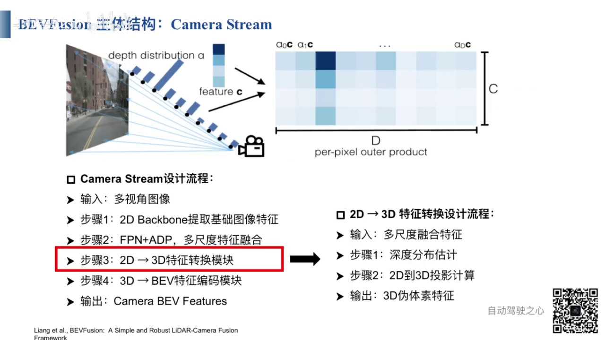{width="5.972222222222222in"
height="3.388888888888889in"}

转换的过程其实是对每一个像素位置去进行一个深度分布的预测，会预测一系列的离散的深度概率。这个概率它比如阿尔法0，阿尔法一等等到FD这个概率是作为一个权重乘上像素的图像特征。比如前面这个future
c是我们原本那个像素位置的图像特征。乘上对应权重之后，从2D空间按照这个深度分布去做的特征转换映射。每一个像素点按射线去进行特征投影，把所有像素点都投影完，它其实就组成了我们所谓的3D空间。所以我们去得到一个叫3D伪体素的一个特征。

変換の過程は、画素位置ごとに深さ分布の予測を行い、一連の離散的な深さ確率を予測する。この確率はアルファ0、アルファなどFDまで待つ確率は、重みとして画素に乗る画像の特徴である。例えば、前のfuturecは、私たちの本来の画素位置の画像の特徴である。対応する重みに乗った後、2D空間からこの深さ分布に沿った特徴変換マッピング。各画素点は放射線によって特徴的な投影を行い、すべての画素点を投影します。実は私達のいわゆる3D空間を構成しています。3D擬似体と呼ばれる特徴を得ることができます。

那什么叫伪体素呢？这个网格它其实不是按照我们原本输入点0的位置去划分网格的。我们这个网格是一个我们按照我们深度的这个网格去评判的一个网格，它是一个我们人为定义的一个提速，所以我们把这种叫做伪体数，通过这样子一个特征转换的方式，我们可以把我们得到的2D的图像特征，通过离散深度分布可以得到3D的为体素特征。我们有了3D微体塑之后，按照高度维度我们拍扁也好，或者利用卷积也好，磁化也好，投影到BV空间，我们就可以得到相机之路输出的核心内容了。也就是我们所谓的相机的BV
future，也就是相机俯视视角的特征。

それは何ですか?このメッシュは、本来の入力点0の位置に基づいてメッシュを分割するものではありません。私たちのこのグリッドは私たちが深いこのグリッドに基づいて評価するグリッドで、それは私たちが人為的に定義したスピードであるので、私たちはこれをダミー数と呼んでいますこのような特徴変換方式によって、我々が得た2Dの画像特徴を、離散深さ分布によって3Dのボクセル特徴を得ることができる。私たちは3Dマイクロボディシェイプを持った後、高度な次元で私たちが撮っても、畳み込みでも、磁化でも、BV空間に投影しても私たちはカメラの道の出力の核心内容を得ることができます。つまり、私たちのいわゆるカメラのBV
future、つまりカメラが視野角を見下ろす特徴です。

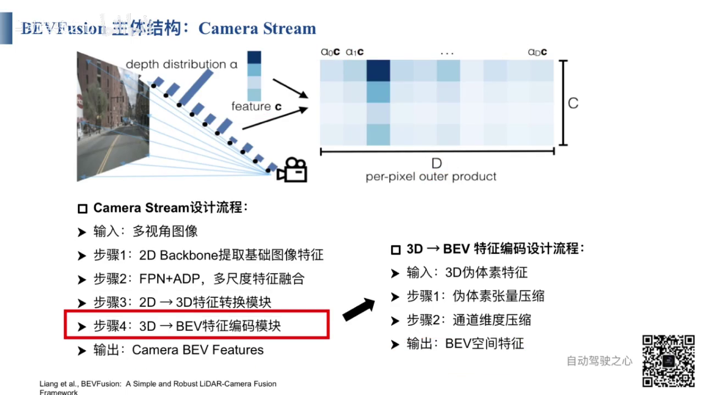{width="5.972222222222222in"
height="3.388888888888889in"}

我们刚才描述的流程在框图上哪一块呢？是camera
stream，是前面这一整个流程输入是一个muti
view图像，一个多视角图像，通过图像的encoder我们叫图像编码器。里面是主要包含两个模块，一个模块是2t
backside，也就是2D的主干网络。另一个是FPN，也就是一个多尺度融合的方式。通过图像的编码器，我们可以得到一个多视角的特征图像特征。我们把图像特征通过我们之前讲的一个2D到3D的转换模块，可以映射到BEV上。最终我们就能得到我们需要的图像特征构建出来的BEV空间OK。

私たちが先ほど説明した流れはブロック図のどの部分にあるのでしょうかCamera
streamで、前のプロセス全体の入力はmuti
view画像で、多視点画像で、画像のencoderを介して画像エンコーダと呼ばれています。中には主に2つのモジュールが含まれています。1つのモジュールは2t
backside、つまり2dのトランクネットワークです。もう一つはFPN、つまりマルチスケール融合方式である。画像のエンコーダによって、多視野角の特徴画像の特徴を得ることができる。私たちは画像の特徴を、私たちが先に述べた2dから3dへの変換モジュールを通して、BEVにマッピングすることができる。最終的には、私たちが必要としている画像特徴が構築されたBEV空間OKを得ることができる。

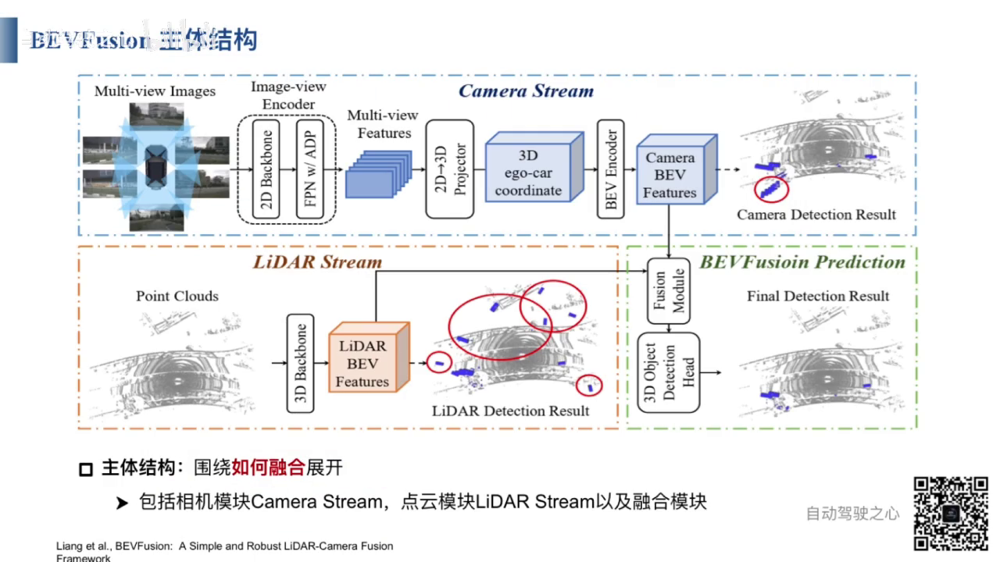{width="5.972222222222222in"
height="3.388888888888889in"}

我们再来看一看后续的点云之路是怎么做的。其实相比于图像之路而言，我们这里说的点云之路要容易的多，因为点云本身就是3D的，我们只要通过我们前面得到的点名特征，直接拍扁到BV，就可以得到BV空间的点名特征。那拍扁这个过程我们就不用再提了，用卷积池化等等都可以，我们这里主要说一下前面这个3d
backbone是什么点，云特征是怎么提取的。我们在第二章中其实已经给大家科普过很多种，有基于点的方式，也有基于提速的方式，很多。那be
reference这篇文章中本身作者其实也提供了很多可选择的方案，包括point
pillar point pillar。

次の点雲の道がどうなっているか見てみましょう。実は、画像の道に比べて、私たちがここで言っている点群の道は簡単で、点群自体は3Dで、私たちが先に得た点呼の特徴を通過すればBVに直接叩くと、BV空間の点呼の特徴が得られる。それをフラットにする過程はもう言及しなくてもいいです。畳み込み池化などでいいです。ここでは主に前の3dバックボーンが何なのか、雲の特徴がどのように抽出されたのかを説明します。私たちは第二章ですでに多くの種類を普及させました。点に基づく方式があります。スピードを上げる方式もあります。この記事では、自分の作者も実際には、pointピラー・ポイント・ピラーを含む多くの選択肢を提供しています。

还有send
point。还有全人。这里会展开讲一个比较经典的3D点云特征提取网络，paint
pillar。这里其实就是paint pillar的原理框图。Pointer
pillar是怎么做的呢？我们先理解pillar是什么，批了翻译过来其实叫柱子，这个词其实也是非常形象的。

そして、センドポイント。まだ全員です。ここでは、比較的古典的な3d点群特徴抽出ネットワークが展示されています。ここは実はペイントの原理ブロック図です。ポインターピラーはどうやって作ったのでしょうか?私たちはまずピラーとは何かを理解して、翻訳を批判して、実は柱と呼ばれています。この言葉も実は非常にイメージがあります。

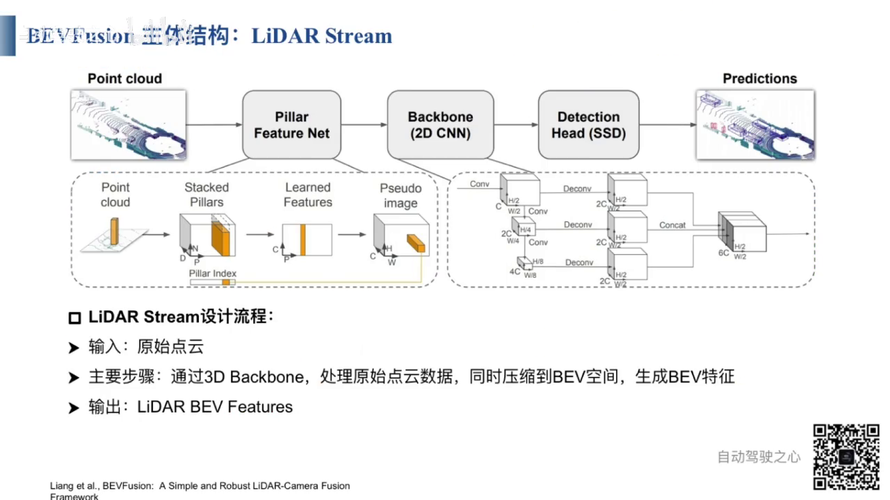{width="5.972222222222222in"
height="3.388888888888889in"}

披露其实就是一个柱状空间，也就是图中黄色这个区域，那这个柱状空间干嘛用的呢？其实是聚合特征用的。我们讲过特征聚合，比如点的方式，它是聚合我们关键点周围一定的这个球体空间，比如有很多点。批了也是这个道理。它在这个柱状空间当中囊括的点的特征是作为这个柱子的特征的那比如我们这个柱子中可能包含有N个点，每一个点的特征是多少维呢？我们假设是D维那，所以一个柱子特征表达是什么呢？是D乘以多少乘以N每个柱子中有N个点，每一个点是地位。

公開は実は柱状空間、つまり図の黄色の領域で、この柱状空間は何に使われているのでしょうか実は特徴を集約するためのものです。私たちは特徴的な集約について話したが、例えば点の方式は、私たちの重要なポイントの周りにあるこの球体空間を集約することで、例えば多くの点がある。批判したのもこの道理だ。この柱状空間に含まれる点の特徴は、この柱の特徴である。例えば、私たちの柱にはN個の点が含まれている可能性があり、それぞれの点の特徴はどのくらいの次元であるのか私たちはDウィーンと仮定して、柱の特徴表現とは何でしょうかDに何を掛けますか?Nを掛けます。各柱にはN個の点があります。各点は地位です。

那一个柱子中应该有D乘N那一个3D场景中有多少个柱子呢？我们假设有P个柱子，所以如果整个3D场景用柱子特征来表示是D乘以P乘以NP是我们一个3D场景中有P的柱子，所以用D乘P乘N这样的方式，我们就把完整的3D场景就给表示完了。用披露的方式去进行表示欢迎的披露的方法，它默认这个D是一个九维量。那这九位包含什么呢？一个是XYZ，是我们这个点的坐标，一个是XAYC，AZC是我们这个点所在披露的中心点坐标。还有什么呢？还有XP，YP是偏移量，是我这个点离我这个柱子中心点有多远，是一个偏移量。还有一个反射值，123456后面789，每一个点是用这个九维亮表示的。

その柱の中にD ×
Nの3Dシーンの中に何本の柱があるはずですか私たちはP個の柱があると仮定しているので、3Dシーン全体がD
× P × NPであることを柱の特徴で表すと、私たちの3DシーンにPがある柱であるD
× P ×
Nという方式で、完全な3Dシーンを表示しました。公開方式で歓迎を示す公開方法は、このDが9次元であることをデフォルトにしている。では、この9人には何が含まれているのでしょうか一つはXYZで、私達のこの点の座標です。一つはXAYCで、AZCは私達のこの点が公開されている中心点の座標です。他に何がありますかまた、XP、hisはオフセット量で、私のこの点が私の柱の中心点からどのくらい離れているか、オフセット量です。もう一つの反射値は、123456の後ろの789で、それぞれの点はこの九次元で示されています。

P是场景中的纰漏的个数，那一般是12000，那也就是说一个3D场景用12000个柱子囊括了，那还有N批量内的点，它最多是N个N一般是100。所以通过这样的表示，我们其实得到了后面这一块dnp我们把DN这个维度压缩，按照这个平面去做一个压缩。我们压缩到C位，我们就可以得到P乘C的图表中。

Pはシーン中のミスの数で、それは一般的に12000で、つまり1つの3dシーンが12000個の柱で囲まれている、それにはNロット内の点がある最大N個のNは通常100です。だから、このような表現を通して、私たちは実際に後のdnpを得て、私たちはDNという次元を圧縮して、この平面に沿って圧縮します。Cビットに圧縮すると、P
× Cのグラフが得られます。

P乘C什么意思呢？我们刚其实讲过，P是什么呢？一个场景中有多少个柱子？C是什么呢？C其实是每一个柱子用C维向量去表示，所以用P乘C的方式，我们其实表征了一个3D场景，一个场景有P个柱子，每个柱子是C维向量。

P乗Cとはどういう意味ですかPとは何でしょうか?シーンにはいくつの柱がありますか?Cは何ですかCは実は各柱がC次元ベクトルで表されているので、P乗C方式では、実は3dシーンを表しています。一つのシーンにはP個の柱があります各柱はC次元ベクトルである。

我们再按照P2的位置恢复到初始的空间当中。比如我们批了原本的采样空间，它的BV平面其实是一个H乘以W的图，按照这个位置我们给它放回去。比如我这个位置的pillar原本采用的是这里的，我们再给它放回去，得到最后的叫速度页面，就是一个尾图，尾图的向量维度是多少呢？是H乘以W乘以C的那这个特征我们可太熟悉了，图像特征是不是都是这么表示的那当然这里的图像并不是我们真实意义上的图像，而是我们转换出来的，所以叫伪图，也就是速度。

P2の位置で初期の空間に戻します。例えば、私たちは元のサンプリング空間を批判したが、そのBV平面は実はH
×
Wの図で、この位置で戻した。例えば、私のこの場所のピラーはもともとここを採用していたのですが、私たちはそれを戻して、最後のスピードページ、つまり尾図、尾図のベクトル次元はどれくらいですかHにWを掛けてCをかけるという特徴はよく知っています。画像の特徴はすべてこのように表していますか?もちろんここの画像は私たちの本当の意味での画像ではありません。私たちが変換したのだから、擬似図、つまりスピードと呼ばれています。

Image pillow feature
net的输入输出是什么什么呢？输入是点云，输出通过一系列柱子特征提取变换，最终我们得到一种形式图像特征的输出H乘以W乘以C那这个输出有什么好处呢？当然我们后续可以用图像特征处理的方法来做，所以这里的backbone我们叫2DCN网络，是一种图像处理的方式，提取的特征，然后去做检测。

Image pillow feature
netの入出力とは何でしょうか入力は点群で、出力は一連の柱の特徴で変換を抽出し、最終的に形式的な画像特徴の出力HにWにCを掛けるという出力を得るメリットは何でしょうかもちろん、私たちはその後、画像の特徴処理の方法で行うことができるので、ここでのバックボーンは2dcnネットワークと呼ばれ、画像処理の方式で、特徴を抽出して検査する。

我们再看另外一个问题，这里的尾图还能叫什么呢？它其实是我们所谓的BV空间特征了。这个H乘W是我们BV空间的尺寸。C其实BV空间每个位置上C维的特征向量。所以说BV
fusion它在这里引入的leadership
refuse，也就是我们讲的纬图特征，OK。看完了这两个，我们再来梳理一下，图像之路得到的是camera
future，点云之路我们得到的是leader be the future。

もう一つの問題を見てみましょう。ここの最後の図は何と言えますかこれは実は私達のいわゆるBV空間の特徴です。このH
×
Wは私たちのBVスペースのサイズです。Cは実はBV空間の各位置におけるC次元の特徴ベクトルである。だから、BV
fusionがここで導入したleader
shipせせらぎ、つまり私たちが話した緯図の特徴、OK。この2つを見て、もう一度整理してみましょう。画像の道はcamera
future、点群の道はleader be the futureです。

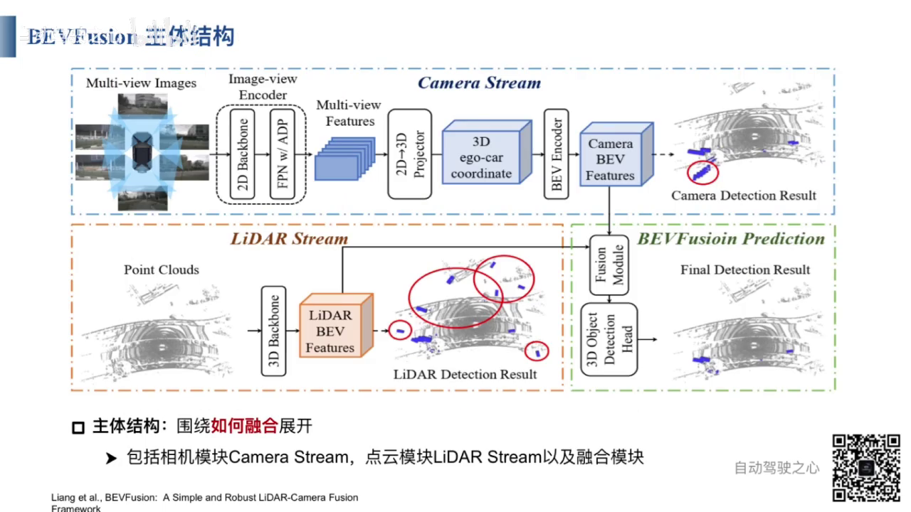{width="5.972222222222222in"
height="3.388888888888889in"}

除了这两个额外的检测植入之外，下一步咱们要做什么呢？那就是融合，是这个future模块。你就是图像中的这个fewer
module，fewer模块的输入输出是什么？我们一直在强调是包含两个的，一个是图像输入。一个是点云输入，那怎么融合呢？一个是级联，一个是卷积，那就完事儿了。

この2つの追加的な検査移植以外に、次のステップは何をするのでしょうか?それが融合で、この未来モジュールです。あなたは画像の中のこのfewer
module、fewerモジュールの入出力は何ですか私たちは2つを含むことを強調しています。1つは画像入力です。一つは点群入力ですが、どうやって融合しますか?一つはカスケードで、一つは畳み込みで、それで終わりです。

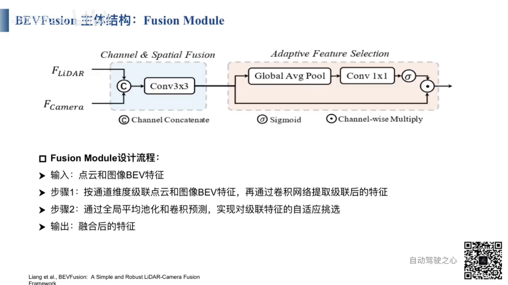{width="5.972222222222222in"
height="3.388888888888889in"}

完事之后引入了一个叫adaptive future
selection，它其实是什么呢？其实就是一个attention，翻译过来叫特征的自信选择。那什么意思？那也就是注意力机制。我们在第二章的基础模块也讲过，所谓的注意力机制，它包括空间注意力、通道注意力、混合注意力，还有self
attention等等。

終わった後、アダプタ・フューチャー・セレクションが導入されましたが、それは何なのでしょうか?実は一つのattentionで、翻訳して特徴的な自信選択と呼ばれています。それはどういう意味ですかそれが注意力の仕組みです。私たちは第二章の基礎モジュールでも、注意力のメカニズムとは、空間注意力、通路注意力、混合注意力、そしてセルフアテンションなどを含む。

Be fusion中引入的这个future
selection属于什么注意力呢？偏向于什么层面的呢？它其实偏向的是通道层面的，去对通道维度去进行的加权。考虑的是哪个通道更重要，是点云上的通道，还是图像上的通道呢？通过这样一个权重的预测，对通道特征去进行重新的加权。我们可以看到它是一个channel
size的，是一个通道的相乘，会关注一个重要的通道而忽略不重要的通道。所以到这里，我觉得融合模块可以一定程度上体现这个BV
fewer的作者他在motivation中阐述的一个思路，一个想法。

Beフュージョンで導入されたこのフューチャーセレクションはどのような注意力ですか?どんなレベルに偏っていますか実際には、チャネルレベルに偏っており、チャネル次元を重み付けしている。どのチャンネルがより重要なのか、点雲上のチャンネルか、それとも画像上のチャンネルかを考えてみましょうこのような重みの予測によって、チャネルの特徴を新たに重み付けする。これはchannel
sizeで、チャンネルの掛け算で、重要なチャンネルに注目し、重要でないチャンネルを無視していることがわかります。だから、ここに来て、融合モジュールはこのBV
fewerの作者がmoキャプションで述べた一つの考え方、一つの考え方をある程度体現できると思います。

点云和图像是没有主次之分的，可能对于这个场景而言，我们可能点云更重要，我们喜欢点云。可能对于下一个场景而言，图像更重要，我们喜欢图像，那我们就多关注一点图像。无论怎么做，它是一种网络自适应的过程，而不是说我们人为定义好了。比如我们就用点云，或者就用图像，或者从点云到图像，或者从图像到点云，它不是这么搞的那它是一种自适应挑选的过程。融合完事儿之后，我们可以得到融合特征，自然就可以用来做预测。

点雲と画像には主次の区別がありません。このシーンにとって、私たちは点雲がもっと重要かもしれません。私たちは点雲が好きです。次のシーンでは、画像がもっと重要かもしれません。私たちは画像が好きなので、もっと画像に注目してみましょう。どうやってやっても、それはネットワークの適応的なプロセスであり、私たちが人為的に定義したとは言えない。例えば、私たちは点群を使ったり、画像を使ったり、点群から画像に行ったり、画像から点群に行ったりします。融合が終わったら、私たちは融合の特徴を得ることができ、自然に予測に使うことができる。

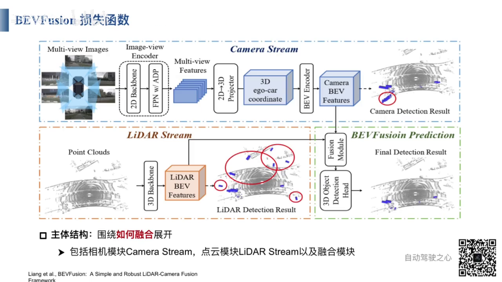{width="5.972222222222222in"
height="3.388888888888889in"}

OK我们再梳理一下be with fusion。Be be
fusion的输入包含两个方面，一个是多视角图像的输入，还有一个是点云输入。那输出对于3D检测任务而言是3D检测结果。

じゃあ、be with fusionを整理しましょう。Be be
fusionの入力には、多視野角画像の入力と点群入力の2つの側面があります。その出力は3D検査タスクにとって3D検査結果である。

输入图像怎么处理呢？Camera
stream用来处理图像的，通过图像编码器encoder我们可以得到图像特征。通过2D到3D的转换，图像特征可以映射到BV空间，能得到所谓的camera
BV future，利用图像特征对BV空间去进行重构，点云是怎么处理呢？叫leader
stream用来处理点云数据，通过3d
backbone网络可以得到点云的BV特征。那到这里有了什么呢？有了BV特征，有了图像的BEV特征，有了点云的BV特征，通过融合模块我们得到最终的特征，去做检测。这里作者引入了两个额外的detection
head，每一个像相机模态有一个相机的预测结果，DV模态有一个点云的预测结果合在一起，融合模态有一个融合的预测结果，三个模态其实是有对应的loss的。另外先给大家说另外一点，我们在开课前，很多同学也在问另外一篇叫BV
fusion，是MIT做的，所以我们一般叫MIT be
fusion，他们俩名字其实很类似，叫MIT be refused。

入力画像はどのように処理されますか?Camera
streamが画像を処理するために使用しているのは、画像エンコーダで画像の特徴を得ることができる。2dから3dへの変換によって、画像の特徴をBV空間にマッピングすることができ、いわゆるcamera
BV
futureが得られ、画像の特徴を利用してBV空間を再構成することができ、点群はどのように処理されるのか?Leader
streamと呼ばれて点群データを処理し、3dバックボーンネットワークを通じて点群のBVの特徴を得ることができる。ここに何があったのでしょうかBVの特徴があり、画像のBEVの特徴があり、点群のBVの特徴があり、融合モジュールを通じて最終的な特徴を得て、検査を行う。ここで著者は2つの追加的な検出ヘッドを導入し、それぞれのカメラモードにはカメラの予測結果があり、DVモードには点群の予測結果がある融合モードには融合の予測結果があります。また、別の点をお話ししましょう。私たちは開講前に、多くのクラスメートがもう一つのBV
fusionと呼ばれ、MITが作ったので、私たちはたいていMIT be
fusionと呼ばれています彼ら二人の名前は実は似ています。

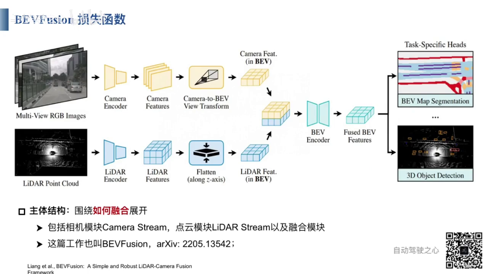{width="5.972222222222222in"
height="3.388888888888889in"}

这两篇工作属于同时期的工作，我们来看看这两篇文章的思路有什么异同点。首先输入输出有区别吗？输入我们看这一篇文章的输入是什么呢？输入同样是多视角图像，还有点云数据，输出有一点点区别，除了3D检测任务之外，这篇工作中还引入了分割任务。任务其实无关紧要，它只是一个额外连接的一个检测头罢了。任务预测它基于的特征是一致的，叫fuse的BV
future融合的BV特征。其实这两篇工作思路是一致的，它都是通过分开提取特征再融合的方式得到融合后的BV特征。

この二つの仕事は同時期の仕事で、この二つの文章の考え方にどんな違いがあるか見てみましょう。まず入出力に違いはありますか?この文章の入力は何でしょうか入力も同じ多視点画像で、クラウドデータもあり、出力には少し違いがあり、3D検査タスクのほか、この仕事には分割タスクも導入されている。任務は実際には重要ではなく、追加的に接続された検査ヘッドにすぎない。タスクの予測は、fuseと呼ばれるボリュームフューチャー融合のBVの特徴に基づいている。実はこの二つの仕事の考え方は一致しており、それはすべて分離して特徴を抽出して再融合することで融合したBVの特徴を得た。

当然像这篇工作当中，其实be refusing所谓的camera stream图像的encode
2D到3D的视角转换。其实就是上面的这个模块和我们刚刚讲的BV
fewer里面的camera stream是一致的，下面是这个leader
stream，其实也是一致的那是不是从思路上，从框图上讲，是完全一样的，有一点点区别的地方在于这个融合任务的MIT这个任务的不同任务的不同，额外引入了一个分割任务。另外一个希望大家能注意到这个BV
fusion，MIT这边的BV
fusion是对单一模态，没有特定的检测之路的那需不需要这个额外的模块，我觉得这个是一个见仁见智的事情。如果感兴趣的同学也可以在MIP这个工作基础上，可以添加额外检测头，看看结果会不会有什么变化。

もちろん、このような仕事では、実はbe refusingのいわゆるcamera
stream画像のencode
2dから3dへの視野角変換。実は、上のこのモジュールは、私たちが話したBV
fewerのcamera streamと一致しています。次はleader
streamで、実は一致しているのは考え方からではありませんかブロック図から言えば、全く同じで、少し違いがあるのは、この融合タスクのMITというタスクの異なるタスクの違いで、さらに分割タスクを導入したことである。もう一つは、このボリュームフュージングに注目してほしいです。MIT側のボリュームフュージングは単一モードで、特定の検出の道がない場合、この追加のモジュールは必要ありません。これは見識のあることだと思います。興味のあるクラスメートもMIPという仕事に加えて、追加の検査ヘッドを追加して、結果に変化がないかどうかを見ることができる。

另外想说的是MIT这个工作其实可以其实更偏工程性一点，一些优化的讨论是更丰富的。OK那我们看一下这个性能对比，性能对比还是围绕我们本章的重点be
refuel展开的，而不是我们上1PPT提到的MITBBQ那篇。性能方面我们首先看总体结果，上面是验证集。下面是测试集和同时期的算法相比，性能还是不错的，是有明显提升前面只是一个总体性能，我们可以先不关注，我们还是重点我们还是重点看ability，也就是双龙实验部分。

また、MITという仕事は実際にはもっと工程的に偏っていて、いくつかの最適化の議論はもっと豊富であると言いたい。OKでは、この性能の比較を見てみましょう。性能の比較は、私たちが1pptで言及したMITBBQの編ではなく、私たちの本章の重点be
refuelを中心に展開されています。性能面ではまず全体的な結果を見てみましょう。上は検証セットです。次はテストセットと同時期のアルゴリズムを比べて、性能はまだいいです。明らかに向上した前は全体的な性能だけです。つまり双龍実験の部分です。

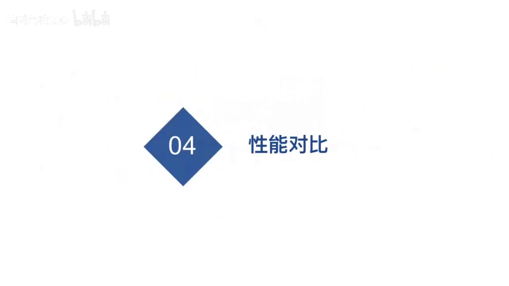{width="5.972222222222222in"
height="3.388888888888889in"}

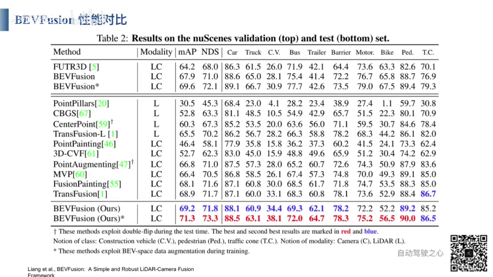{width="5.972222222222222in"
height="3.388888888888889in"}

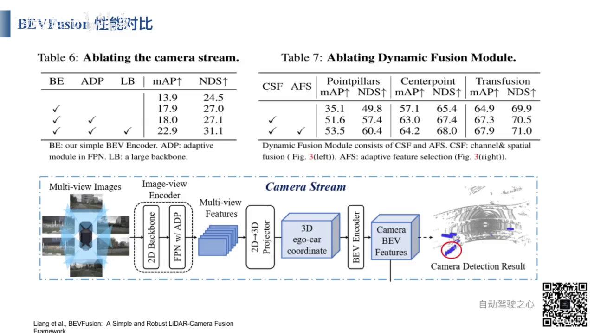{width="5.972222222222222in"
height="3.388888888888889in"}

我们先看这个表6，前面第一个叫BEBV
encoder，也就是BV编码。也就是说作者不仅将其拍扁了，还用了额外的特征提取，无非就是一些偏卷积的操作，它叫be
in
coder。这个编码器其实提升非常大，MAP是直接提高了四个点左右，足以说明BV
encode还是有必要的。ADP模块是我们刚刚讲的特征金字塔部分中的一个上采样的操作。那多尺度融合中的赛场和卷积模块提升比较小，它只有0.1。

まずこの表を見てみましょうつまり、作者はそれを平らにしただけでなく、追加の特徴を使って抽出したのは、いくつかの偏畳み込みの操作にすぎない。それはbe
in
coderと呼ばれている。このエンコーダは実際には非常に大きく上昇しており、MAPは直接4点程度上昇しており、BV
encodeが必要であることを示している。ADPモジュールは、先ほど述べた特徴的なピラミッド部分の一つのアップサンプリングの操作である。その多尺度融合における競技場と畳み込みモジュールの上昇は比較的小さく、それはわずか0.1である。

LP是一个叫large
backbone，就是一个更大的一个backroom网络。这个backbone也将近有4到5个点的提升。所以说明什么呢？所以说明这个暴力手法还是有用的，网络越深提升还是非常明显的那表七中的blasting是对于融合模块做的那CSF叫channel
special fusion，channel special
form就是通道和空间的融合。它其实就是把点和图像特征合在一起之后去做一个卷积融合。这个操作提升还是挺多的。后面这个AFS是后面那块儿，是我们刚刚讲的偏向通道tension的那一块，也是有一定提升。

LPはブラスターバックボーンと呼ばれ、より大きなバックルームネットワークです。このバックボーンも4
\~
5点近く向上しています。だから何を説明しますか?だから、この暴力的な手法が有用であることを説明して、ネットが深く向上しているのは明らかな表7の中のブレスティングは融合モジュールに対して作られたCSFはchannel
special、fusionと呼ばれているchannel special
formはチャンネルと空間の融合です。実際には、点と画像の特徴を合わせて畳み込み融合を行う。この操作はまだ向上している。後ろのAFSは後ろの方で、私たちが話した偏向通路tensionの方で、ある程度向上しています。

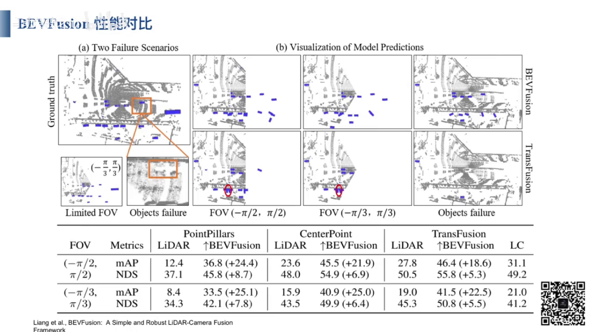{width="5.972222222222222in"
height="3.388888888888889in"}

这里作者为了去验证BV
view的一个性能，还提供了一些困难场景。这个困难场景一个是市场限制，一个是点名丢失。市场限制是说比如我们只能获取到-60度到正60度，那这个市场的数据后面都是没有的，是第一种情况。第二种情况是说的数据丢失，物体的点云数据丢失。比如这个橘色框内是存在物体的那不过由于工由于各种原因，没有点云的反射值回传，也就是没有点云数据。在这两种情况下，BV
fun其实都可以检测，很好理解，点云丢失图像还在，他们之间是没有主次关系的，哪个好用哪个。所以说在be
reference当中，我们即使点名丢失了，be
reference也是可以去做检测的。因为我图像的内容还在。

ここで著者はBV
viewの性能を検証するために、いくつかの困難な場面を提供した。この困難な場面の一つは市場の制限で、一つは点呼が失われたことである。市場制限とは、例えば、私たちは-60度から正60度しか入手できないということで、この市場のデータの後ろにはないのが第一の状況である。2つ目のケースは、データが失われ、物体の点群データが失われることです。例えば、このオレンジ色の枠には物体が存在しているが、仕事は様々な理由で、点群の反射値がない、つまり点群データがない。どちらの場合も、BV
funは実際には検出でき、理解しやすい。点群が画像を失っている。彼らの間には主次関係がない。どちらが使いやすいか。だからbe
referenceでは、点呼が失われたとしても、be
referenceは検査を行うことができる。私の画像の内容はまだあるからです。

像transformer这种更偏向于以点云为基准的映射方案，在点云数据有着明显缺失或者不准的情况下，它的性能是自然有下降的。后面这个表其实就是我们刚刚提到的一种困难场景限制更明确的这个指标评价。比如说是在-90度到90度这个市场范围内，本身paint
pillar是一种纯点云的方案。纯点云的方案它的MAP和NDS2个指标是12.4和37.1。通过BV
fewer这种方式，它分别提高了24.4和8.7个点，能达到36.8和45.8。后续也是一样，这个send
point和这个transfusion是一样的这个比对思路。

Transformerのように、点群を基準としたマッピング案に偏っており、点群データが明らかに欠落しているか、不正確である場合、その性能は自然に低下している。次の表は、先ほど述べた困難な場面の制限がより明確であるという指標の評価である。例えば、-90度から90度という市場の範囲内で、自分のペイントピラーは純粋な点群の案である。純点雲の案はMAPとnd
2の指標が12.4と37.1である。BV
fewerという方式では、それぞれ24.4点と8.7点を上げ、36.8点と45.8点に達した。次も同じです。このsend
pointはこのtransfusionと同じです。

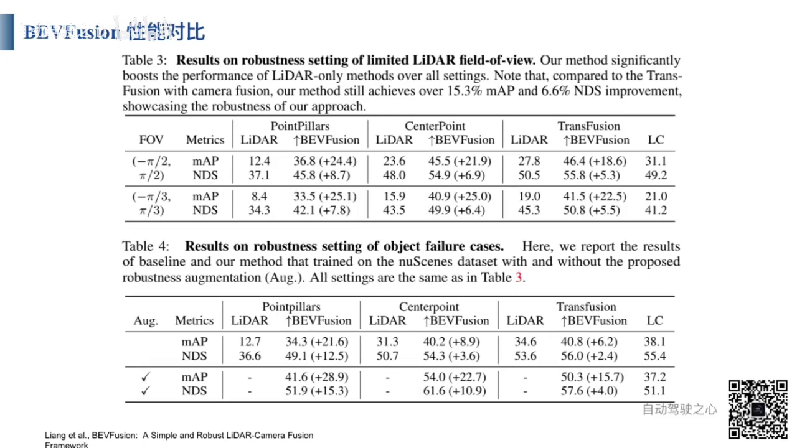{width="5.972222222222222in"
height="3.388888888888889in"}

这篇文章BV
fu其实是一个非常好的一个多模态融合的范式，它涉及到的内容也非常全面，包括图像特征是怎么提取的，是怎么转换到图像是怎么转换到BV上的那点云特征怎么提取的？点云特征怎么转换到BV上的，以及图像特征和点云特征通过什么样的方式去做融合。他们之间的注意力是怎么设计的那我们怎么挑选合适的图像特征和点云特征，那都是非常基础，也是非常好的范例，是非常值得大家学习的。

この文章BV
fuは実は非常に良い多モード融合のパラダイムで、それに関わる内容も非常に全面的で、画像の特徴がどのように抽出されたかを含んでいるどのように画像を変換したのか、どのようにしてBV上の点の雲の特徴をどのように抽出したのか?点群特徴がBVにどのように変換されたか、画像特徴と点群特徴がどのような方法で融合するか。彼らの間の注意力はどのように設計されているのか、私たちはどのように適切な画像特徴と点群特徴を選ぶのか、それは非常に基礎的で、非常に良い例で、非常に学ぶ価値がある。

003_原文和译文

2025年01月31日 11:17

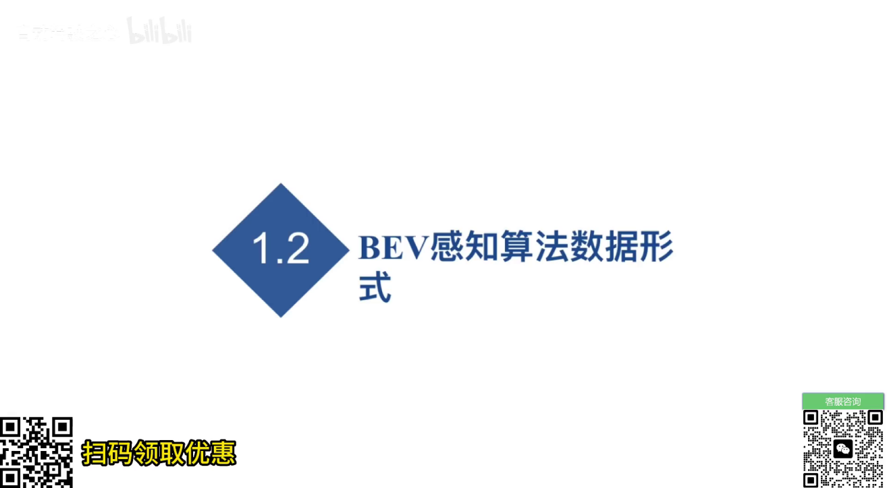{width="5.972222222222222in"
height="3.2916666666666665in"}

我们进入这一节内容，有关BV感知算法的数据形式。我们在上一节课中提到过，我们所说的这个BV感知算法，它主要包括两种输入，可以分为三种形式。其中的两种输入是指相机图像输入和激光雷达点云输入。三种形式是包括纯图像形式、纯点云形式以及图像点云多模态融合的形式。无论是哪种形式，均是以单独或者融合的图像或者点云作为输入的。所以我们在这一节内容会分别介绍BV感知算法当中对图像和点云进行处理的方式。

このセクションに入って、BV知覚アルゴリズムのデータ形式について説明します。前の授業で述べたように、私たちが言ったBV知覚アルゴリズムは、主に2つの入力を含んでおり、3つの形式に分けられる。そのうちの2つの入力はカメラ画像入力とレーザーレーダー点群入力である。3つの形式は、純粋な画像形式、純粋な点群形式、画像点群の多モード融合を含む形式である。どちらの形式でも、単独または融合した画像または点群を入力とする。そこで、このセクションでは、BV知覚アルゴリズムの中で画像と点群を処理する方法をそれぞれ紹介します。

我们看一下什么是图像。图像从原理上来讲是由相机生成的，是将三维世界中的坐标点。我们通常是以米为单位能映射到这二维图像平面的。二维图像平面它其实是一个像素表示图像生成的原理，它也就决定了图像本身是损失掉这个三维空间信息的。他因为从深度上讲，把深度维度去进行了一个压缩，从原本的三维世界坐标我们去投影到二维平面上了。

画像とは何か見てみましょう。画像は原理的にカメラで生成され、三次元世界の座標点である。私たちは通常、この二次元画像平面にメートル単位でマッピングできる。2次元画像平面は、実は1つの画素が画像生成の原理を表しており、画像自体がこの3次元空間情報を失うことを決定している。彼は深さから言えば、深さの次元を圧縮して、元の三次元世界座標から二次元平面に投影しました。

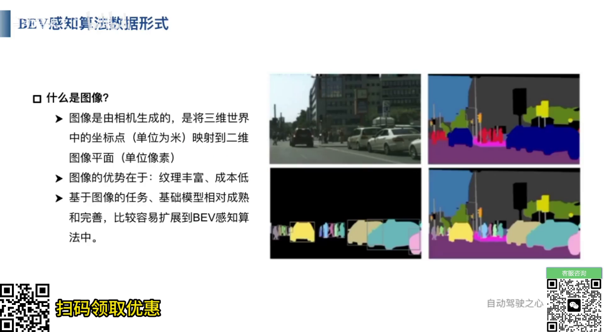{width="5.972222222222222in"
height="3.2916666666666665in"}

很多同学可能会问，图像既然有损失了，那我们为什么还要用图像？图像虽然在深度维度上是有明显的信息损失的，它也有很明显的优势。它是一种密集型的表达纹理信息非常常丰富。比如我们看这辆车，它能很清晰的看到车窗、车轮等等。而且现在通用的项目机也很便宜，成本非常低。这也就是为什么现在很多自动驾驶公司去大力推行纯视觉感知的原因之一。

多くのクラスメートは、画像が失われた以上、なぜ画像を使うのかと尋ねるかもしれない画像は深度次元的に明らかな情報損失があるが、それにも明らかなメリットがある。これは密集型の表現である。例えば、この車を見ると、窓や車輪などがはっきり見える。しかも今通用するプロジェクト機も安くて、コストがとても安いです。だから、現在多くの自動運転会社が純粋な視覚感覚を推進している理由の一つです。

除此之外，我们基于图像的任务，通用的一些基础模型，是相对而言比较成熟的。基于2D这个计算机视觉已经发展的非常之久。他的一些任务比如图中的这个语义分割也好，实例分割也好，全景分割也好等等，它的性能都已经非常好了。所以我们可以有效借鉴这个2D图像算法中的一些基础的框架，或者一些很基础的特提取模块，去完成我们所谓的3D检测任务。最典型的3D检测算法，比如我们通用的这些3D检测算法，像f
cos 3D，像DTR3D，它们其实都是源于2D算法。比如f
cos然后DETR这些将其扩展到3D领域而已。

加えて、私たちの画像に基づくタスク、共通の基礎モデルは、比較的成熟している。2Dというコンピュータビジョンに基づいて非常に長い間発展してきた。彼のいくつかの任務、例えば図中のこの意味分割も、実例分割も、パノラマ分割も、その性能はすでに非常によくなっている。だから、私たちはこの2D画像アルゴリズムのいくつかの基礎的な枠組み、あるいはいくつかの基礎的な特抽出モジュールを効果的に参考にして、私たちのいわゆる3D検査任務を完成することができる。最も典型的な3d検出アルゴリズム、例えば我々が共通している3d検出アルゴリズム、例えばf
cos 3d、dtr3 dは、実は2dアルゴリズムに由来している。例えばf
cosそしてDETRはこれを3d領域に拡張しただけです。

我们对于图像而言，看一张图像的话，首先是图像的整体尺寸，我们一般表示为H乘W乘以3，其中的H是高度，然后这个W是宽度，后续这个三是通道维度。通道是什么意思呢？通常我们处理的是以彩色图像，是包含RGB3个通道的，所以一般而言通道数都是3。那对于图像上的像素的每一个点，它应该怎么表示呢？它的位置坐标一般用XY表示，或者说有的它也会用那个UV表示，是一个二维平面坐标。图像上像素点坐标位置的表示与我们后续要讲的点云数据是有本质上的一个区别的那OK我们了解了什么是图像数据之后，我们自然会想通用的DV感知算法中一般会用什么样的网络去处理图像数据呢？我们这里以BV
former和BV
fusion这两个典型网络为例，我们来看一看他们是怎么处理图像数据的。

画像では、1枚の画像を見ると、まず画像の全体的なサイズで、一般的にはH ×
Wに3を掛けて、Hは高さで、そしてこのWは幅である次の3つはチャネル次元です。通路とはどういう意味ですか通常、私たちが扱うのはカラー画像で、RGB3チャンネルを含むので、一般的にチャンネル数は3です。画像上のピクセルの各点について、どのように表現すればいいのでしょうか?その位置座標は一般的にXYで表され、あるいはそのUVで表されるものもあり、二次元平面座標である。画像上の画素点座標位置の表現と、私たちがこれから話す点群データとは本質的な違いがあるOK私たちは画像データとは何かを理解した後私たちはもちろん、共通のDV知覚アルゴリズムでは、一般的にどのようなネットワークで画像データを処理するのでしょうか?ここでは、BV
formerとBV
fusionという2つの典型的なネットワークを例にして、彼らがどのように画像データを処理しているかを見てみましょう。

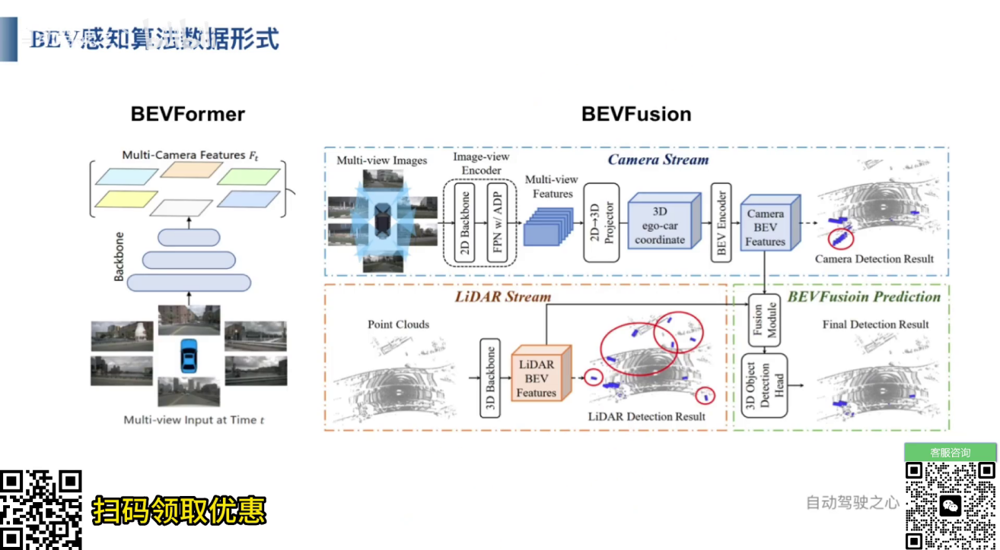{width="5.972222222222222in"
height="3.2916666666666665in"}

先看BV former，它是一个典型的BV
camera的方法，它也就是我们仅仅依赖于相机图像数据输入的。左图是这个BV
former的一个结构，从流程角度上来讲，我们看这个BV former的一个muti view
input作为输入，通过backbone之后可以得到muti camera
future。它的一个结构是从下到上的，以matter
view的这个input为输入，通过backbone网络之后，它会得到一个multi camera
future原始图像。通过backbone之后得到了一个future。这个backbone就是典型的一个图像处理网络。它是利用这个骨干网络，把原始的这个图像处理成一个多视角的一相机图像数据，后续可以用它来生成BV或者用它来做检测等等，都是可以的那OK我们看一下另外一种方案叫BV
future。

まず、BV formerを見てみましょう。これは典型的なBV
cameraの方法で、カメラの画像データ入力だけに依存しています。左図はこのBV
formerの構造で、流れの観点からは、このBV formerのmuti view
inputを入力として見てみましょう。その構造の一つは下から上までで、matterviewのこのinputを入力とし、バックボーンネットワークを通過すると、マルチカメラの未来のオリジナル画像が得られます。バックボーンを通って未来を得た。このバックボーンは典型的な画像処理ネットワークです。これはこの中堅ネットワークを利用して、原始的なこの画像を多視点のカメラ画像データに処理し、それを使ってBVを生成したり、それを使って検査したりすることができるいいですよ。もう一つの案を見てみましょう。

BV
fewer是一种典型的基于融合的一种方法，它是依赖于相机和点云图像同时输入的那上面这里是这个meti
view图像，下面这里是一个雷达点云，它以图像作为输入，但它其中必然包含了图像处理的模块。它是怎么处理图像的呢？从流程的角度来讲，图像方面仅muti
view的图像是作为输入的，通过这个encoder图像视角的encoder去生成这个mutio
future它的一个多视角的图像特征。显然在BV
fusion当中，图像处理模块是图像是叫encoder，无论是BV方面中的将网络也好，还是BV
fusion中的图像编码器也好，它们只是图像处理网络模块的不同命名而已。使用的网络其实都是比较一致的，是2D图像处理框架中对图像特征的一些通用网络。比如说像net还有renee
TFPN等等。

BV
fewerは典型的な融合ベースの方法で、カメラと点群画像が同時に入力されることに依存して、ここはこのmeti
view画像であるここはレーダーの点群で、画像を入力としているが、その中には必ず画像処理のモジュールが含まれている。どうやって画像を処理したのでしょうか?流れの観点から言えば、画像ではmuti
viewだけの画像が入力され、このencoder画像の視野角のencoderによって、このmutio
futureの多視野角の画像特徴が生成されます。わかりあいの中では、イメージ処理モジュールはイメージであることがインコードderと呼ばれています。BV側のネットワークであろうと、BV
fusionの画像エンコーダであろうと、これらは画像処理ネットワークモジュールの異なる名前にすぎない。使用するネットワークは実際には比較的一致しており、2D画像処理フレームワークにおける画像特徴の共通ネットワークである。例えば、netやrenee
tf pnなどです。

所以说对于图像处理模块，我们只要明白一点，无论是基于相机图像的，还是基于多模态融合的方法的，它对于图像特征的提取是大同小异的。他们均是使用已有的二级图像处理网络去做的那我们上面说完了图像输入，那BV感知算法其实还有一种很常见的数据形式，是点云输入。我们先分析第一件事情，什么是点云？点云这个概念就我们一听可能很晦涩，我们通俗的讲，那什么是点云呢？其实就是很多点的一个集合。

だから、画像処理モジュールについては、カメラ画像に基づいていても、マルチモード融合の方法に基づいていても、画像特徴の抽出には同じであることが分かっている。彼らは既存の二次画像処理ネットワークを使ってやっています。私たちは画像入力を完成しました。BV知覚アルゴリズムは実はよく見られるデータ形式があります。点群入力です。まず最初のことを分析してみましょう点雲という概念は私たちが聞くと不運かもしれないが、私たちは一般的に言って、点雲とは何か?実は多くの点の集合です。

比如右图这个场景，我们发现它这个场景是不同于我们常见的图像。视频也好的。这个场景其实是由一个点组成的，黄色的、绿色的、粉红色的。我们所展示的这个右图场景其实就是一个很典型的点名场景。

例えば右図のシーンでは、このシーンは私たちがよく見ている画像とは違うことがわかりました。動画もいいです。このシーンは実は一つの点で構成されています。黄色、緑、ピンクです。私たちが展示している右図のシーンは実は典型的な点呼シーンです。

那这个点云场景有什么特点呢？它与图像有什么区别呢？我们首先从第一点看，它是一个稀疏性场景。稀疏性我们怎么理解呢？从右图能看到除了一些颜色分明的前景区域外，还有一些黑色区域。黑色区域我们需要注意的是，黑色区域是没有点名信息的那意味着我们在特征提取的时候，黑色区域是没有区域特征的。产生这些黑色区域的原因是什么呢？通常原因其实还是由于我们的采集设备的限制。

この点群シーンにはどんな特徴があるのでしょうか画像とどのような違いがあるのでしょうか?まず第一に、これはまばらなシーンです。まばらさはどうやって理解するのでしょうか右図から、色のはっきりした見通し領域のほか、黒い領域があることがわかります。黒の領域に注意が必要なのは、黒の領域に点呼情報がないことは、特徴抽出時に黒の領域に領域の特徴がないことを意味する。これらの黒い領域が発生する原因は何でしょうか通常の原因はやはり私達の収集設備の制限によるものです。

采集点名的时候，通常是采用激光雷达去进行采集的那激光雷达采集的原理？比如这里是一个激光雷达。这里是一个目标物体，从激光雷达发射三条射线。如果发射出的射线碰到物体，它会产生一个反射。通过激光雷达采集这个反射信息，我们就会知道，原来这里是有物体的那如果没有这个反射信息，像旁边这两条射线一样，它是没有反射信息的。激光雷达是很自然的就采集不到信息的。

点呼を収集するとき、通常はレーザーレーダーを用いて収集するレーザーレーダーの収集原理は?例えばここはレーザーレーダーです。ここは目的物体で、レーザーレーダーから3本の放射線を発射する。発射された放射線が物体に当たると、反射が発生します。レーザーレーダーでこの反射情報を収集すると、ここに物体があったのは、この反射情報がなければ、隣の2本の放射線のように反射情報がないことがわかる。レーザーレーダーは自然に情報を収集できない。

我们按照这个思路去推导，现在如果还有一个物体，它恰好出现在了我们前面这个物体的正后方，那像这种会导致什么情况呢？后面的物体会被前面的挡住，采集到的是前面这个物体的信息。所以说我们在右图中也能看到两辆车呈现明显的由于遮挡所导致的点云缺失情况。可能这个有点挡住了。由于遮挡所产生的数据缺失，其实也是导致稀疏性的一个原因。

私たちはこの考え方で導出したが、今、もう一つの物体が、ちょうど私たちの前の物体の真後ろに現れているとしたら、このようにして何を引き起こすのだろうか後ろの物体は前の物体に遮られ、前の物体の情報が収集されます。そのため、右図でも2台の車が明らかに遮蔽による点群の欠落を示している。これはちょっとブロックされているかもしれません。遮蔽によるデータ不足は、実はスパース性を招く原因の一つでもある。

另外还有一种什么情况呢？我们还是看右图，点云数据分布呈现一种明显的远少近多的情况。远处我画红线这些地方，相对而言它的点云数据是比较少的。而离我们激光雷达近的地方，相对而言点名数据是很多的那这又是由于什么原因呢？我们还是以这个射线发射图为例，这是由于射线的一个发散性导致的远距离采样间隔大，远距离这个采样间隔是很大的。相对而言近距离采样间隔是很小的。同样的目标远距离可能会漏财，在近距离可以很好的被捕捉到。

もう一つどんな状況がありますか右図を見てみましょう。点群データの分布は明らかに少ない状況を示しています。遠くで赤い線を描いているところは、相対的にその点群データが少ない。私たちのレーザーレーダーに近いところには、相対的に点呼データが多いのはなぜでしょうか我々はやはりこの放射線発射図を例にとると、これは放射線の発散性による遠距離サンプリング間隔が大きく、遠距離というサンプリング間隔が大きい。相対的に近距離サンプリング間隔は小さい。同じ目標は遠距離ではお金が漏れてしまう可能性があり、近距離ではうまく逮捕される。

OK我们说完了稀疏性，另外点云还有个什么特点呢？还有一个无序性，那这个无序性应该怎么去理解呢？我们按照上面提到的，我们说点云其实是很多点的一个集合。那什么叫集合呢？它的概念很简单，比如说我们常说的12345，它是一个集合。那现在如果我们把集合中元素的顺序换一下。那我们随便换1532
4元素的顺序，换了它对本身这个集合有影响吗？那显然是没有影响的，它里面还是1到5这五个数还是五个元素。

OK私たちはまばらさを話しました。また、雲にはどんな特徴があるのでしょうかもう一つの無秩序性がありますが、この無秩序性はどう理解すればいいのでしょうか?私たちは前述のように、点雲は実は多くの点の集合であると言っています。それは集合とは何ですかその概念は簡単で、例えば私たちがよく言っている12345は集合である。では、集合中の要素の順序を変えてみましょう。では、私たちは1532
4要素の順序を勝手に変えて、それが自分の集合に影響を与えるのでしょうか?それは明らかに影響がない、その中にはまだ1から5の5つの個数か5つの元素がある。

所以说我们通常讲的一个点云的无序性。它是意味着无论我们点云集合中的点是以何种顺序排列的，它并不会对本身点云集合产生一些比较严重的影响。我们说完这两点，可能大家觉得点云它又稀疏又无序，我们为什么还要用点云？那我们用点云的原因，是因为我们的激光点云数据是对常见的3D场景一种非常好的表现形式，它是包含深度维度这个信息的。通过深度这一维度的表达，人不会是一个纸片人车，也不是纸片车，它是一种很立体很显性的一种表达方式。

だから、私たちが通常話している点群の無秩序性。これは、私たちの点群集合の点群がどのような順序で並んでいても、自分の点群集合に大きな影響を与えないことを意味します。私たちはこの2つの点を言い終わると、点雲はまばらで無秩序だと思うかもしれませんが、なぜ点雲を使う必要があるのでしょうか私たちが点群を使っている理由は、私たちのレーザー点群データはよく見られる3Dシーンに対して非常に良い表現形式で、深さ次元という情報を含んでいるからです。深さという次元の表現を通して、人は紙切れの人車でもなく、紙切れの車でもなく、立体的で優性のある表現である。

我们刚刚讲图像数据也好，还有点云数据也好，它们都是有一些缺点的。任何数据其实都不会完美的。我们需要考虑的是我们怎么样扬长避短，去发挥这个不同模态数据的优势。重要的点名是什么，它有哪些特点？下面讲解。

画像データについて話したばかりでも、クラウドデータについても、いくつかの欠点があります。どんなデータも完璧ではない。私たちが考慮しなければならないのは、私たちがどのように長所を伸ばして短所を避けて、この異なるモーダルデータの優位性を発揮するかである。重要な点呼は何ですか。それにはどんな特徴がありますか以下に説明します。

一般而言我们怎么去表示一个点位数据。我们反复的提，我们所说的点云其实是点的集合。对于一个点的集合，我们一般写成P等于一个集合的表示，P1P2等等，我们到PN我们现在写的这个点云集合里面其实是包含了N个点，里面每一个点怎么表示呢？由于点云是3D场景，所以说其中的每一个点可以用3D坐标进行表示。那就是XYZ它前面这个点它可能是X1Y1Z1，后面这个点它是X2Y2Z2。它有了这样的表示方法，我们就可以把点云场景去转换为完整的数学表达。从而可以通过我们所说的数学模型，也就是网络去进行后续3D点云特征的提取。

一般的に、私たちはどのようにしてポイントデータを表示しますか。私たちは繰り返し言いますが、私たちの言う点群は実は点の集合です。一つの点の集合については、私たちは一般的にPが一つの集合の表現に等しい、p1
p2などと書いているが、私たちが現在書いている点群集合には実際にはN点が含まれている中のすべての点はどのように表示されますか?点群は3Dシーンなので、それぞれの点を3D座標で表すことができる。XYZの前の点はx1
y1z 1で、後ろの点はx2y2z
2です。このような表現方法があれば、点群シーンを完全な数学表現に変換することができる。数学モデル、つまりネットワークを通じて、後続の3D点群特徴の抽出を行うことができる。

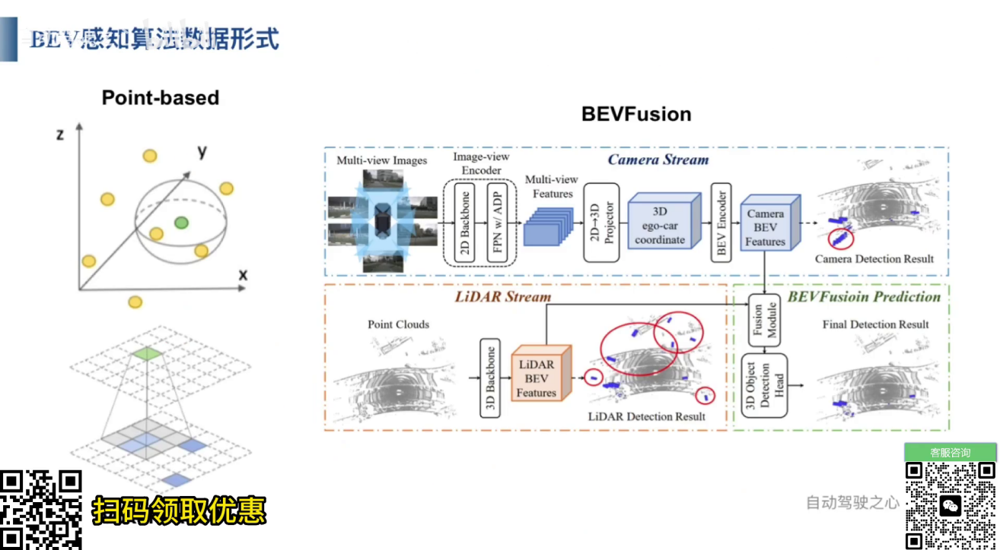{width="5.972222222222222in"
height="3.2916666666666665in"}

我们在上一页中讲过，通常点云特征是怎么表征的那我们会思考下一个问题，我们应该怎么提取点云特征呢？现在通用的3D等于特征提取的方法是基于点这个point
best，或者基于提速的worker。通过这两种方式去在一个庞大的点云数据当中去提取出我们这个场景的3D的点名标准。

前のページで述べましたが、通常の点群の特徴はどのように表現されていますか?現在共通の3dは特徴抽出の方法に基づいています。この2つの方法で、巨大な点群データの中で、私たちのシーンの3Dの点呼基準を抽出します。

一般而言，基于点的方式会在庞大的这个点云数据当中选取一些关键点。比如这个绿色的它是一个关键点，黄色的部分，这个黄色的点是我们的点云场景。以这个关键点为中心，提取关键点及其附近周围一些点的特征，我们称之为基于点的方法。附近周围怎么去界定呢？通常point
base的方法是以一个球面空间作为界定的，以关键点为中心的这个球体所包含的所有点，我们认为是会对关键点起特征加强作用的一些点，它的特征是全部会聚合到我们所选取的这个关键点上的那上面这种方法，我们称之为point
base，也就是基于点的方法。那另外一种，是基于提速，那当然也有一些我称之为网格。

一般的に、ポイントベースの方法は、膨大な点群データの中からいくつかの重要なポイントを選択します。例えば、この緑は重要なポイントで、黄色の部分で、この黄色のポイントは私たちの点群シーンです。このポイントを中心に、ポイントとその近くのいくつかのポイントの特徴を抽出し、ポイントベースの方法と呼ぶ。近くの周りはどうやって決めますか?通常、point
baseの方法は一つの球面空間を定義し、ポイントを中心としたこの球体に含まれるすべての点は、ポイントに特徴的な役割を果たすいくつかの点であると考えられるその特徴は、私たちが選んだこの重要なポイントにすべて集約されるという方法で、私たちはpoint
base、つまりポイントベースの方法と呼ばれています。もう一つは、スピードに基づいています。もちろん、私がグリッドと呼んでいるものもあります。

上面讲的传统的基于点的方法，是从以优点云出发，从已知的点云中挑出一些关键点。起诉的方式是从场景出发的，是将场景划分为很多个小块。比如下图，它其实是一个很完整的一个场景，这个场景它被划分成了5乘5的块，蓝色的部分是这个场景中的一些点云数据，通过对一定区域内，比如这个3乘3网格区域的点云进行一个聚合，我们就会得到提取后的点云特征，也就是这个绿色的部分。

上で述べた伝統的な点ベースの方法は、長所雲から、既知の点雲からいくつかの重要な点を選ぶことである。起訴の方式は場面から出発し、場面を多くの小さな塊に分けた。次の図に示すように、これは完全なシーンで、このシーンは5
×
5のブロックに分けられ、青い部分はこのシーンのいくつかの点群データである一定の領域内、例えばこの3
×
3メッシュ領域の点群を一つに集約することで、抽出された点群の特徴、つまりこの緑の部分が得られる。

可以看到，无论是基于点的方式也好，还是基于提速的方式也好，讨论一个独立点是没有意义的。我们都需要采用一定的聚合方法。对于point的背诵方法而言，我们考虑的是关键点和它附近点的一个特征。对于基于提的方法而言，我们是聚合一定立体空间范围内的点。那他们为什么要这样做呢？他们也是符合我们一个常规的认知的那比如我们回到上一页PPT，通常而言，我们在一个点名场景下讨论一个点是没有意义的。我们从这个点云场景中随机采样一个点，我们很难区分出我们采样出的这个点属于人，还是属于车，还是属于其他的背景物体呢？是很难界定这一点的那所以说去单独的讨论一个点意义不大，需要结合其局部的空间信息进行一个探讨。

点に基づく方式でも、スピードに基づく方式でも、独立点を議論することは意味がないことがわかる。我々は一定の重合方法を採用する必要がある。Pointの暗唱方法については、重要なポイントとその近くのポイントの特徴を考える。提案に基づく方法では、我々は一定の立体空間範囲内の点を集約する。なぜそうするのでしょうか?彼らも私たちの通常の認知に合っている。例えば、私たちは前のページのPPTに戻って、通常、私たちは点呼の場面で一つの点を討論するのは意味がない。私たちはこの点群シーンから点をランダムにサンプリングして、私たちがサンプリングした点が人に属しているのか、車に属しているのか、それとも他の背景物体に属しているのかを区別するのは難しいですねこの点を定義するのは難しいので、単独で議論することはあまり意味がなく、その局所的な空間情報を結合して検討する必要がある。

那明白了点云特征怎么提取，我们再来看一下，一般而言点云特征是怎么用在BV感知中的。我们还是以典型的这个BV
fusion的方法为例。上面这个流程是我们刚刚提到的图像特征提取模块。

点群の特徴がどのように抽出されたかがわかりました。もう一度見てみましょう。一般的に点群の特徴がBV感覚にどのように使われているかを見てみましょう。私たちは典型的なこのボリュームフュージョンの方法を例にしています。以上の流れは、先ほど述べた画像特徴抽出モジュールである。

下面这个流程是我们当前讲的如何处理点云特征。从流程上看，我们这里提到这个点云处理模块是以点云数据为输入的。通过这个3D的骨干网络我们得到点云特征。一般而言，我们如果得到点云特征之后，是可以直接处理得到这个3D检测结果的。可以先不关注后面是怎么处理的，其实主要是关注的是通常框架中点云网络是怎么提取点云特征的。OK.

次の流れは、私たちが現在話している点群の特徴をどのように処理するかです。プロセスから見ると、ここではこの点群処理モジュールは点群データを入力としている。この3Dの中堅ネットワークを通じて、私たちは点群の特徴を得た。一般的に、点群特徴を得たら、この3D検査結果を直接処理することができる。後にどのように処理されるかは気にしなくてもいいが、実は主に通常の枠組みの中でクラウドネットワークがどのように点群の特徴を抽出するかに注目している。OK.

至此我们其实对BV感知算法中常见的这个数据形式和数据处理方法去做一个基本讲解。更为详细的这个框架讲解，我们会在后续如果涉及到相应模块的时候，会再给大家做说明的。以上就是这个小节的主要内容。我们说了这么多数据，有没有一些实际的数据呢？所以这就进入到我们下一节课的内容。

ここまで、私たちはBV知覚アルゴリズムでよく見られるこのデータ形式とデータ処理方法について基本的な説明をした。より詳細なこの枠組みの説明は、今後、適切なモジュールに触れたときに、皆さんに説明します。以上がこの小節の主な内容である。私たちはこんなに多くのデータを話しましたが、実際のデータはありますか?次の授業の内容に入ります。

004_原文和译文

2025年01月31日 11:17

{width="5.972222222222222in"
height="3.388888888888889in"}

OK上一节内容我们对BV感知算法进行了一个分类，对典型的算法进行了一些概念性的讲解。有忘记的同学可以复习一下。这节内容我们主要分析BV感知算法的一个优劣。讨论BV算法优劣前，我们先看一下BV视角和传统的前视相机，它到底有什么框架上的区别，我们一再的说从入门而言，看一个框架先看什么呢？

OK前節では、BV知覚アルゴリズムを分類し、典型的なアルゴリズムについて概念的に説明した。忘れた方は復習してください。今回の内容は主にBV感知アルゴリズムの優劣を分析します。BVアルゴリズムの優劣を議論する前に、BVの視野角と伝統的な前視カメラを見てみましょう。それにはどんな枠組み上の違いがあるのか、私たちは何度も入門から一つの枠組みを見て、まず何を見ますか?

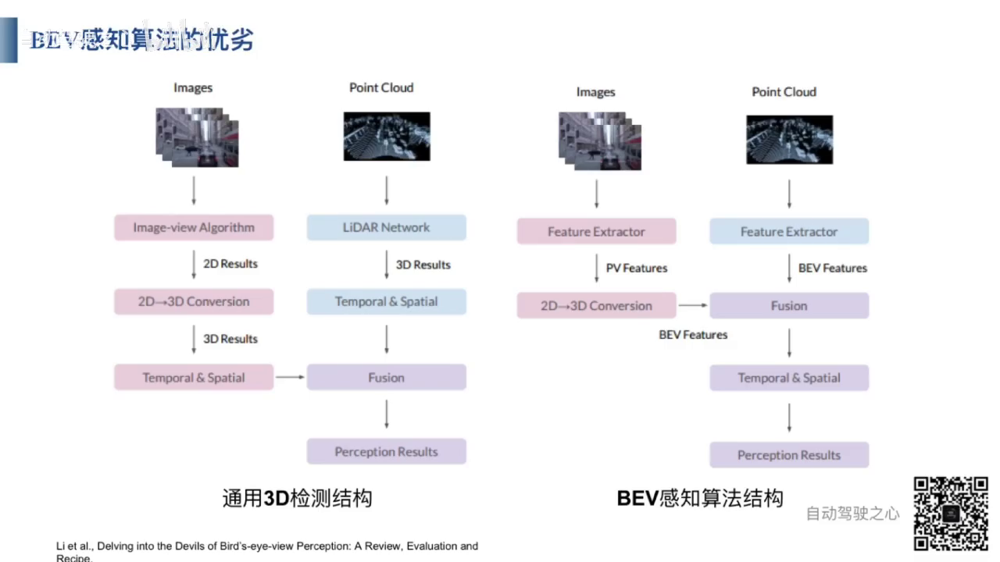{width="5.972222222222222in"
height="3.388888888888889in"}

先看输入输出。这里左图是通用的，也就是我们常见的3D检测结构，右图是基于BV感知算法的一个结构。那左图的输入输出是什么呢？图像和点云或者两个的融合输出是什么呢？是它的一个感知结果。

まず入出力を見ます。ここで左図は共通、つまり私たちがよく見ている3D検出構造で、右図はBV知覚アルゴリズムに基づく構造である。その左図の入出力は何でしょうか画像と点群または2つの融合出力とは何でしょうか?その知覚結果です。

我们再看右图所讲的BAV感知算法的结构应该是什么样的？它的输入输出是什么呢？同样也是图像或者点云，或者两个融合，输出还是一个BV感知的结果，我们课程中是以检测任务为例，那3D其他的还有很多任务，包括3D分割，车道线检测等等。这些任务的核心输入模块依然是图像和底蕴，它只不过会针对这样不同的任务去设计不同的这样一个感知头，去做后续任务的处理。

右図で述べたBAV知覚アルゴリズムの構造を見てみましょうか?その入出力は何ですか同じように画像や点群、あるいは二つの融合、出力は一つのBV感覚の結果で、私たちの授業では検査タスクを例にして、その3Dの他にも多くのタスクがあり、3D分割を含む車線検出など。これらのタスクの中核的な入力モジュールは依然として画像と基礎であり、このような異なるタスクに対して異なるという知覚ヘッドを設計し、後続のタスクの処理を行うだけである。

OK我们回到这个3D检测任务当中，我们看一下两种框架的功能是一样的，那它们两种方法的主要区别在哪儿呢？我们还是从流程上看，通用的3D检测可以以图像为输入，以点云为输入或者融合输入。以图像为输入通过的是图像特征提取网络，以点云输入通过的是点云的提取网络。通常点云提取框架我们讲过，一般通过以提出的方式，就是吸收卷积，或者以点特征提取的方式得到一个特征。如果是融合的框架，两类特征它都是提取的，会得到一个多模态的特征。那这些特征要么是单一的可以得到3D检测结果，我们看到图像这个支路，它是可以单一得到3D结果的。包括点云之路也是可以单一得到3D结果的。或者说两种方法去做一个融合，我们可以得到最终的一个感知结果。

OKこの3D検査タスクに戻って、二つの枠組みの機能が同じであることを見てみましょう。二つの方法の主な違いはどこにあるのでしょうか私たちはやはりプロセス的に、共通の3D検査は画像を入力とし、点群を入力としたり、融合したりすることができる。画像を入力として通過するのは画像特徴抽出ネットワークであり、点群入力で通過するのは点群の抽出ネットワークである。通常、点群抽出フレームワークは、一般的に提案された方法で畳み込みを吸収したり、点特徴抽出の方法で特徴を得たりする。融合した枠組みであれば、2種類の特徴が抽出され、多モードの特徴が得られる。これらの特徴は単一のものであれば、3D検査結果が得られます。画像というバイパスは、単一のものであれば、3D結果が得られます。点群を含む道も単一で3D結果を得ることができる。あるいは、二つの方法で一つの融合を行うことで、最終的な知覚結果を得ることができる。

从上而下的流程是我们通用3D检测结构的一个完整流程图。像输入图像特征提取，我们可以得到结果，也可以将图像特征的这个特征或者结果与点云特征和结果去做一个融合。会采用一些后续的后处理的手段或者融合手段会得到最终的输出。所以我们能看到，无论是图像输入还是点云输入也好，通用的3D检测结构，它都是可以直接得到3D检测结果的那另外还有一点，我们所提到的特征，就是2D特征也好，2D图像特征也好，还是3D点云特征也好，一般是不太会经过一些复杂处理的，它是可以用来直接去做这个3D检测任务的那我们接下来再看看BV感知算法是怎么做的？

上から下への流れは我々の共通の3D検査構造の完全なフローチャートである。入力画像の特徴抽出のように、結果を得ることができ、画像の特徴または結果を点雲特徴と結果と融合することもできる。いくつかの後続の後処理手段や融合手段を採用すると最終的な出力が得られる。だから、画像入力でも点群入力でも、共通の3D検出構造は、3D検出結果を直接得ることができるもう一つの特徴があります2D特徴でも、2D画像特徴でも、3D点群特徴でも、一般的にはあまり複雑に処理されていないこの3D検査タスクを直接行うために使用できるのですが、次にBV感知アルゴリズムを見てみましょうか?

同样它也是一个从上往下的一个结构。对于图像之路而言，通过图像特征提取，对于点云之路而言，通过点云之路提取图像特征。通过视角转换模块，我们可以将2D图像转换到3D下，与点云图像去做一个融合，这个融合一般是BV
future
level的一个融合。我们这里也标示的很清楚了，是BEV特征的一个融合，去做一个fusion。后续可能会加上一些额外的时间空间上的处理，然后得到最后的一个检测结果。所以我们能看到的是，通用的3D检测结构和BAV感知算法的结构有着的明显区别是什么呢？其实就是这个BEV特征的一个生成部分，这是一系列BEV感知算法的核心内容。

同じように上から下への構造です。画像の道は、画像特徴抽出によって、点群の道は、点群の道によって画像特徴を抽出する。視野角変換モジュールを通して、私たちは2d画像を3dに変換して、点群画像と融合することができます。この融合は一般的にBV
futurelevelの融合です。ここにもはっきりと表示されているのは、BEVの特徴の融合であり、フュージョンを作る。その後、いくつかの時間空間的な処理を加えて、最後の検査結果を得ることができる。だから、共通の3D検出構造とBAV知覚アルゴリズムの構造に明らかな違いは何でしょうか?実はこのBEV特徴の生成部分で、これは一連のBEV知覚アルゴリズムの核心内容である。

那为什么要做BV视角下的感知呢？这就又回到了我们在BEV感知算法概念中介绍过的内容，我们再复习一遍，为什么说BV空间是有优势的？我们在讲概念的时候讲过，我们在讨论什么是BAV感知算法之前，是可以对BEV这个词做一个拆解的那什么是BEV呢？BV空间其实是我们现在想要特别强调的一个空间，它翻译过来是叫birth
I
view鸟瞰图。我们再通俗的表达一下，其实就是俯视图是一种从上往下的一样一个拍摄视角。很多算法当中会把它称之为上帝视角。上帝给我们带来什么好处？所以其中就涉及到这个BV视角空间能有什么样的一个优势。

なぜBVの視点での感覚を作るのでしょうか?これはまたBEV知覚アルゴリズムの概念で紹介した内容に戻って、もう一度復習してみましょう。なぜBV空間が優位なのでしょうか私たちは概念を語るときに、BAV知覚アルゴリズムとは何かを議論する前に、BEVという言葉を分解できるのはBEVとは何でしょうか?BV空間は実は私達が今特に強調したい空間です。これは翻訳してきたのはbirth
I
view鳥塚図です。私たちはもっと一般的に表現してみましょう。実は平面図は上から下への撮影視点です。多くのアルゴリズムは神の視点と呼ばれています。神はわたしたちにどんな利益をもたらしてくださるのでしょうか。その中には、このBVの視野角空間がどのようなメリットがあるかが含まれています。

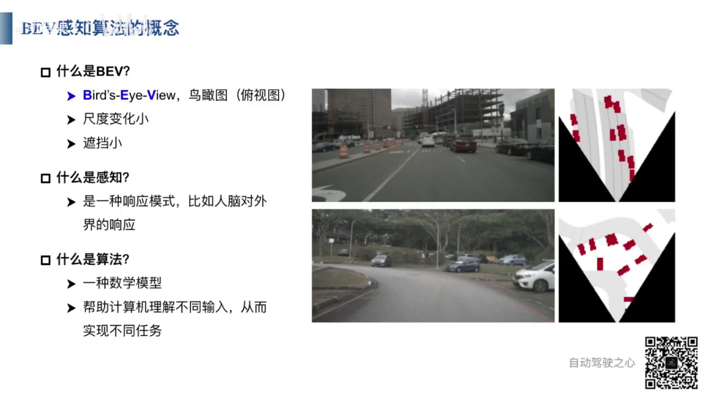{width="5.972222222222222in"
height="3.388888888888889in"}

首先BV视角下尺度差异小。我们为什么说尺度差异小？以这张图片为例，以我们右图为例，我们左边这张图是一个正视图视角，右边这张图是一个俯视图视角。在正视图视角下我们能发现目标呈现远小近大的特点，离相机近的目标大，离相机远的目标小。那BV视角我们大家长宽都差不多，所以尺度变化小，网络对于特征一致的目标，它的表达能力会是更好的。所以说BV视角尺寸相对一致，具有明显的一个优势的。

まずBVの視点ではスケールの違いが小さい。なぜ尺度の違いが小さいと言うのでしょうか?この写真を例にとると、右図を例にとると、左の図は正面図の視野角で、右の図は平面図の視野角である。正面図の視点では、目標が大きく、カメラに近い目標が大きく、カメラから遠い目標が小さいことがわかります。そのBVの視点は私たちは皆縦横が同じなので、尺度の変化は小さく、ネットは特徴が一致した目標に対して、その表現能力はもっと良い。だから、BVの視野角サイズは相対的に一致しており、明らかなメリットがある。

我们讲的第二点，不知道大家还能不能有印象，是BV视角有一个比较小的一个遮挡。这其实是一个很直观的理解，两辆车前后出现的时候，后面的车会被前面的车给挡住。所以说这些其实BV感知算法一些显著的视觉上的优势。

私たちが話した第二のポイントは、皆さんがまだ印象を持っているかどうかわからないが、BVの視点には比較的小さな隠れがある。これは実は直感的な理解で、2台の車が前後に現れたとき、後ろの車は前の車に遮られる。だから、これらは実はBV知覚アルゴリズムの顕著な視覚的優位性である。

对于自动驾驶而言，这个BV感知算法它到底有什么意义呢？首先从学术角度来讲，我们在讨论BAA感知算法流程的时候，我们不止一次的提到过BAV感知算法的核心是这个多视角转换模块。也就是说如何利用多视角相机输入的2D图像生成对应的BEV视角结果，它这个视角转换的过程非常重要。好的视角转换结果我们直接就可以带来后续检测任务性能上的一个提升。所以说BV感知算法对学术研究比较有意义的是，它可以帮助我们理解2D外观输入如何到3D几何输入它这样一个视图转换的过程。

自動運転にとって、このBV知覚アルゴリズムはどのような意味があるのでしょうか?まず学術的な観点から、私たちはBAA知覚アルゴリズムの流れを議論するとき、私たちは何度もBAV知覚アルゴリズムの核心はこの多視点変換モジュールであると述べた。つまり、多視野角カメラから入力された2D画像を利用して、対応するBEV視野角結果をどのように生成するかという視野角変換の過程は非常に重要である。良い視点転換結果は、我々は直接後続の検査タスクの性能の向上をもたらすことができる。だから、BV知覚アルゴリズムは学術研究に意味があるのは、2Dの外観入力がどのように3Dジオメトリに入力されるかというビュー変換のプロセスを理解するのに役立つ。

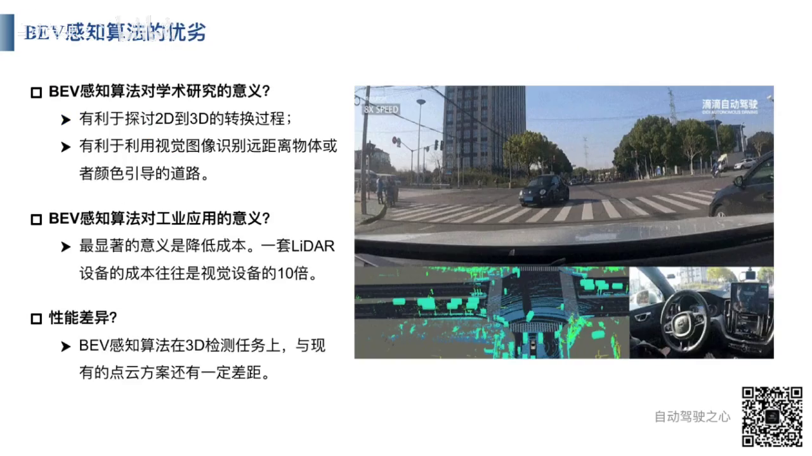{width="5.972222222222222in"
height="3.388888888888889in"}

此外图像输入其实比点云输入具有一个明显的优势，在于什么呢？目前非常流行的这个必备感知方案，还是以纯视觉为主纯视觉方案。也就是说我们采用图像输入为主，点名为辅的这样一个手段。显著的优势其实是在于它有一个RGB的信息，有一个色彩信息。比如在做这个车道线检测的时候，有黄色的，有白色的那那点云是没有办法分辨颜色信息的那他这就是纯视觉感知的一个绝对性的优势。

また、画像入力は実際には点群入力よりも明らかなメリットがあるのは何でしょうか?現在非常に流行しているこの必須知覚方案は、やはり純粋な視覚を主とする純粋な視覚方案である。つまり、私たちは画像入力を主とし、点呼を補助とするという手段を採用している。明らかな利点は、RGBの情報と色の情報があることです。例えば、この車線線の検査をしているとき、黄色があり、白色がある雲は色情報を見分けることができない彼は純粋な視覚感覚の絶対的な優位性である。

讨论完学术研究的意义之外，我们还想探讨一下目前的BV感知算法对工业应用的一个意义。我们知道在常见的工业化生产环境中，成本是第一考量的要素，那一套点云设备成本是非常高的那它几乎是一个多视角相机的十倍左右。十倍的成本的下降，这无疑对工业界诱惑是非常大的那我们也不能忽略现在BV感知算法会具有一个什么明显的问题呢？那一个最明显的问题就是性能差距还是比较大的。纯视觉的BV感知算法性能是在60左右，以纯电源的3D检测器的性能会低于十个点这样，当然这是以当前的这个new
thing的结果来看的，所以说从性能角度来讲，这个BV算法还是有着非常大的一个提升空间的。也是后续我们无论是学术研究也好，还是工业界的应用也好，是可以持续挖掘的一个方向。

学術研究の意義を討論したほか、現在のBV知覚アルゴリズムが工業に応用する意義を検討したい。私たちはよく見られる工業化生産環境の中で、コストは第一の考慮の要素であり、そのセットの点群設備のコストは非常に高いです。それはほぼ多視点カメラの十倍ぐらいです。10倍のコストの低下は、工業界の誘惑が非常に大きいに違いないその最も明らかな問題は、性能の差が大きいことである。純粋な視覚のBV知覚アルゴリズムの性能は60前後で、純粋な電源の3d検出器の性能は10点を下回る。もちろん、これは現在のnew
thingの結果で見られるだから、性能の観点から言えば、このBVアルゴリズムは非常に大きな向上空間を持っています。その後、私たちは学術研究でも工業界の応用でも、継続的に発掘できる方向である。

我们这里总结一下，我们本节内容主要是从功能对比、流程对比比较的BV感知算法和通用的3D算法的一个区别。其次分析BV空间具有的显著的一个视觉优势，它包括尺度变化小，它包括遮挡小，另外纯视觉设备它还具有一个明显的颜色优势和成本的优势。无论是从学术研究角度、工业研究角度来讲的话，BV感知算法还是具有比较大的一个吸引力的那尽管说纯视觉方案在性能上与纯点云的方案或者说融合的方案相比还有一定的差距。

ここでまとめてみましょう。この節の内容は主に機能比較、プロセス比較のBV知覚アルゴリズムと共通の3Dアルゴリズムの違いです。次に、BV空間が持つ顕著な視覚的優位性を分析し、スケールの変化が小さく、遮蔽が小さい、また純粋な視覚的設備は明らかな色的優位性とコスト的優位性を持っている。学術研究の観点、工業研究の観点から言えばBV知覚アルゴリズムはまだ大きな魅力を持っている。純粋な視覚案は性能的には純粋な点群の案や融合の案とはまだ差がある。

我们也相信在后续的发展过程中，纯视觉的BV感知算法可以越做越好。我们刚刚提到，既然工业界对这种成本较低的纯视觉BV感知的方案是非常感兴趣的那他们有哪些具体的应用呢？这里就进入到我们下一个小节，BV感知算法的应用介绍。

私たちも、その後の発展の過程で、純粋な視覚的BV知覚アルゴリズムができるほど良いと信じている。先ほど述べたように、工業界はこのような低コストの純粋な視覚BV感知の方案に対して非常に興味を持っていますので、彼らはどのような具体的な応用がありますか?ここでは次の節に進みます。BV感知アルゴリズムの応用について紹介します。

005_原文和译文

2025年01月31日 11:17

我们进入这一节内容，有关BV感知算法的数据形式。我们在上一节课中提到过，我们所说的这个BV感知算法，它主要包括两种输入，可以分为三种形式。其中的两种输入是指相机图像输入和激光雷达点云输入。三种形式是包括纯图像形式、纯点云形式以及图像点云多模态融合的形式。无论是哪种形式，均是以单独或者融合的图像或者点云作为输入的。所以我们在这一节内容会分别介绍BV感知算法当中对图像和点云进行处理的方式。

このセクションに入って、BV知覚アルゴリズムのデータ形式について説明します。前の授業で述べたように、私たちが言ったBV知覚アルゴリズムは、主に2つの入力を含んでおり、3つの形式に分けられる。そのうちの2つの入力はカメラ画像入力とレーザーレーダー点群入力である。3つの形式は、純粋な画像形式、純粋な点群形式、画像点群の多モード融合を含む形式である。どちらの形式でも、単独または融合した画像または点群を入力とする。そこで、このセクションでは、BV知覚アルゴリズムの中で画像と点群を処理する方法をそれぞれ紹介します。

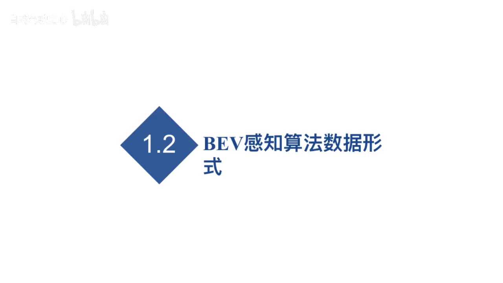{width="5.972222222222222in"
height="3.388888888888889in"}

我们看一下什么是图像。图像从原理上来讲是由相机生成的，是将三维世界中的坐标点。我们通常是以米为单位能映射到这二维图像平面的。二维图像平面它其实是一个像素表示图像生成的原理，它也就决定了图像本身是损失掉这个三维空间信息的。他因为从深度上讲，把深度维度去进行了一个压缩，从原本的三维世界坐标我们去投影到二维平面上了。

画像とは何か見てみましょう。画像は原理的にカメラで生成され、三次元世界の座標点である。私たちは通常、この二次元画像平面にメートル単位でマッピングできる。2次元画像平面は、実は1つの画素が画像生成の原理を表しており、画像自体がこの3次元空間情報を失うことを決定している。彼は深さから言えば、深さの次元を圧縮して、元の三次元世界座標から二次元平面に投影しました。

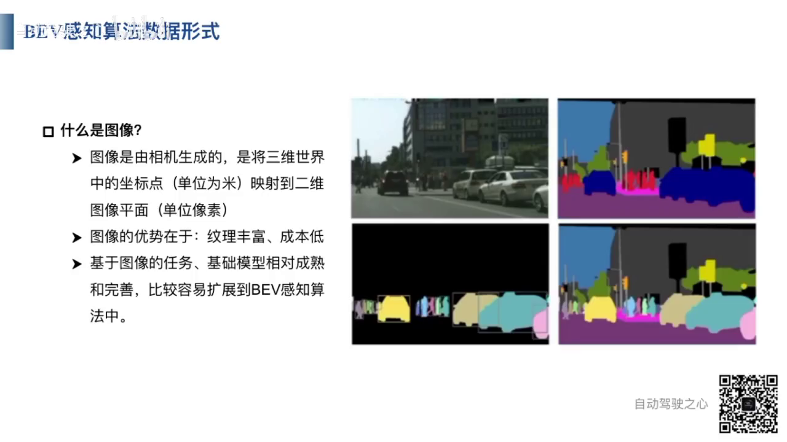{width="5.972222222222222in"
height="3.388888888888889in"}

很多同学可能会问，图像既然有损失了，那我们为什么还要用图像？图像虽然在深度维度上是有明显的信息损失的，它也有很明显的优势。它是一种密集型的表达纹理信息非常常丰富。比如我们看这辆车，它能很清晰的看到车窗、车轮等等。而且现在通用的项目机也很便宜，成本非常低。这也就是为什么现在很多自动驾驶公司去大力推行纯视觉感知的原因之一。

多くのクラスメートは、画像が失われた以上、なぜ画像を使うのかと尋ねるかもしれない画像は深度次元的に明らかな情報損失があるが、それにも明らかなメリットがある。これは密集型の表現である。例えば、この車を見ると、窓や車輪などがはっきり見える。しかも今通用するプロジェクト機も安くて、コストがとても安いです。だから、現在多くの自動運転会社が純粋な視覚感覚を推進している理由の一つです。

除此之外，我们基于图像的任务，通用的一些基础模型，是相对而言比较成熟的。基于2D这个计算机视觉已经发展的非常之久。他的一些任务比如图中的这个语义分割也好，实例分割也好，全景分割也好等等，它的性能都已经非常好了。所以我们可以有效借鉴这个2D图像算法中的一些基础的框架，或者一些很基础的特提取模块，去完成我们所谓的3D检测任务。最典型的3D检测算法，比如我们通用的这些3D检测算法，像f
cos 3D，像DTR3D，它们其实都是源于2D算法。比如f
cos然后DETR这些将其扩展到3D领域而已。

加えて、私たちの画像に基づくタスク、共通の基礎モデルは、比較的成熟している。2Dというコンピュータビジョンに基づいて非常に長い間発展してきた。彼のいくつかの任務、例えば図中のこの意味分割も、実例分割も、パノラマ分割も、その性能はすでに非常によくなっている。だから、私たちはこの2D画像アルゴリズムのいくつかの基礎的な枠組み、あるいはいくつかの基礎的な特抽出モジュールを効果的に参考にして、私たちのいわゆる3D検査任務を完成することができる。最も典型的な3d検出アルゴリズム、例えば我々が共通している3d検出アルゴリズム、例えばf
cos 3d、dtr3 dは、実は2dアルゴリズムに由来している。例えばf
cosそしてDETRはこれを3d領域に拡張しただけです。

我们对于图像而言，看一张图像的话，首先是图像的整体尺寸，我们一般表示为H乘W乘以3，其中的H是高度，然后这个W是宽度，后续这个三是通道维度。通道是什么意思呢？通常我们处理的是以彩色图像，是包含RGB3个通道的，所以一般而言通道数都是3。那对于图像上的像素的每一个点，它应该怎么表示呢？它的位置坐标一般用XY表示，或者说有的它也会用那个UV表示。这个二维平面坐标图像上像素点坐标位置的表示与我们后续要讲的点云数据是有本质上的一个区别的那OK我们了解了什么是图像数据之后，我们自然会想通用的DV感知算法中一般会用什么样的网络去处理图像数据呢？我们这里以BV
former和BV
fusion这两个典型网络为例，我们来看一看他们是怎么处理图像数据的。

画像では、1枚の画像を見ると、まず画像の全体的なサイズで、一般的にはH ×
Wに3を掛けて、Hは高さで、そしてこのWは幅である次の3つはチャネル次元です。通路とはどういう意味ですか通常、私たちが扱うのはカラー画像で、RGB3チャンネルを含むので、一般的にチャンネル数は3です。画像上のピクセルの各点について、どのように表現すればいいのでしょうか?その位置座標は一般的にXYで表され、あるいはそのUVで表されるものもある。この二次元平面座標画像上の画素点座標位置の表現は、私たちがこれから話す点群データと本質的に異なるOK私たちは画像データとは何かを理解した後私たちはもちろん、共通のDV知覚アルゴリズムでは、一般的にどのようなネットワークで画像データを処理するのでしょうか?ここでは、BV
formerとBV
fusionという2つの典型的なネットワークを例にして、彼らがどのように画像データを処理しているかを見てみましょう。

{width="5.972222222222222in"
height="3.388888888888889in"}

先看BV former，它是一个典型的BV
camera的方法，它也就是我们仅仅依赖于相机图像数据输入的。左图是这个BV
former的一个结构，从流程角度上来讲，我们看这个BV former的一个muti view
input作为输入，通过backbone之后可以得到muti camera
future的。它的一个结构是从下到上的，以matter
view的这个input为输入，通过backbone网络之后，它会得到一个muti camera
future原始图像。通过backbone之后得到了一个future。这个backbone就是典型的一个图像处理网络。它是利用这个骨干网络，把原始的这个图像处理成一个多视角的一个相机图像数据，后续可以用它来生成BV或者用它来做检测等等，都是可以的那OK我们看一下另外一种方案叫BV
future。

まず、BV formerを見てみましょう。これは典型的なBV
cameraの方法で、カメラの画像データ入力だけに依存しています。左図はこのBV
formerの構造で、流れの観点からは、このBV formerのmuti view
inputを入力として見てみましょう。その構造の一つは下から上までで、matterviewのこのinputを入力とし、バックボーンネットワークを通過すると、muti
camera
futureのオリジナル画像が得られます。バックボーンを通って未来を得た。このバックボーンは典型的な画像処理ネットワークです。これはこの中堅ネットワークを利用して、原始的なこの画像を多視点のカメラ画像データに処理し、それを使ってBVを生成したり、それを使って検査したりすることができるいいですよ。もう一つの案を見てみましょう。

BV
future是一种典型的基于融合的一种方法，它是依赖于相机和点云图像同时输入的那上面这里是这个meti
view图像，下面这里是一个雷达点云，它以图像作为输入，但它其中必然包含了图像处理的模块。它是怎么处理图像的呢？从流程的角度来讲，图像方面，即muti
view的图像是作为输入的。通过这个encoder图像视角的encoder去生成这个muti
view future它的一个多视角的图像特征。显然在BV
fusion当中，图像处理模块是不像是叫encoder。

BV
futureは典型的な融合ベースの方法で、カメラと点群画像が同時に入力されることに依存して、ここではこのmeti
view画像であるここはレーダーの点群で、画像を入力としているが、その中には必ず画像処理のモジュールが含まれている。どうやって画像を処理したのでしょうか?フローの観点からは、画像、すなわちmuti
viewの画像は入力となる。このencoder画像の視野角のencoderによって、このmuti
view
futureの多視野角の画像特徴を生成する。ボリュームフュージョンでは、画像処理モジュールはインコードと呼ばれていないことが明らかになった。

无论是BV form中的将网络也好，还是BV
fusion中的图像编码器也好，它们只是图像处理网络模块的不同命名而已。使用的网络其实都是比较一致的，是2D图像处理框架中对图像特征的一些通用网络。比如说像rest
net还有rest net
FPN等等。所以说对于图像处理模块，我们只要明白一点，无论是基于相机图像的，还是基于多模态融合的方法的，它对于图像特征的提取是大同小异的。他们均是使用已有的2D图像处理网络去做的那我们上面说完了图像输入，那BV感知算法其实还有一种很常见的数据形式，是点名输入。

BV formの中でネットワークを使うにしても、BV
fusionの中で画像エンコーダを使うにしても、それらは画像処理ネットワークモジュールの異なる命名にすぎない。使用するネットワークは実際には比較的一致しており、2D画像処理フレームワークにおける画像特徴の共通ネットワークである。例えばrest
netやrest net
FPNなどです。だから、画像処理モジュールについては、カメラ画像に基づいていても、マルチモード融合の方法に基づいていても、画像特徴の抽出には同じであることが分かっている。彼らは既存の2D画像処理ネットワークを使ってやっているので、私たちは画像入力を完成した。BV知覚アルゴリズムは実はよく見られるデータ形式で、点呼入力である。

我们先分析第一件事情，什么是点云？点云这个概念就我们一听可能很晦涩，我们通俗的讲，那什么是点云呢？其实就是很多点的一个集合。

まず最初のことを分析してみましょう点雲という概念は私たちが聞くと不運かもしれないが、私たちは一般的に言って、点雲とは何か?実は多くの点の集合です。

比如右图这个场景，我们发现它这个场景是不同于我们常见的图像。视频也好的，这个场景其实是由一个点组成的，黄色的、绿色的、粉红色的。我们所展示的这个右图场景其实就是一个很典型的点名场景。那这个点名场景有什么特点呢？它与图像有什么区别呢？我们首先从第一点看，它是一个稀疏性场景。稀疏性我们怎么理解呢？从右图能看到除了一些颜色鲜明的前景区域外，还有一些黑色区域。黑色区域我们需要注意的是，黑色区域是没有点名信息的那意味着我们在特征提取的时候，黑色区域是没有区域特征的。

例えば右図のシーンでは、このシーンは私たちがよく見ている画像とは違うことがわかりました。ビデオもいいです。このシーンは実は一つの点で構成されています。黄色、緑、ピンクです。私たちが展示している右図のシーンは実は典型的な点呼シーンです。では、この点呼シーンにはどんな特徴があるのでしょうか画像とどのような違いがあるのでしょうか?まず第一に、これはまばらなシーンです。まばらさはどうやって理解するのでしょうか右の図から、いくつかの色の鮮やかな見通しエリア以外に、黒いエリアがあります。黒の領域に注意が必要なのは、黒の領域に点呼情報がないことは、特徴抽出時に黒の領域に領域の特徴がないことを意味する。

产生这些黑色区域的原因是什么呢？通常原因其实还是由于我们的采集设备限制，采集点名的时候，通常是采用激光雷达去进行采集的那激光雷达采集的原理，比如这里是一个激光雷达。这里是一个目标物体，从激光雷达发射三条射线。如果发射出的射线碰到物体，它会产生一个反射。通过激光雷达采集这个反射信息，我们就会知道，原来这里是有物体的那如果没有这个反射信息，像旁边这两条射线一样，它是没有反射信息的。激光雷达是很自然的就采集不到信息的。

これらの黒い領域が発生する原因は何でしょうか通常の原因は、実は私たちの収集設備の制限のため、点呼を収集するとき、通常はレーザーレーダーを用いて収集するレーザーレーダーの収集原理、例えばここはレーザーレーダーである。ここは目的物体で、レーザーレーダーから3本の放射線を発射する。発射された放射線が物体に当たると、反射が発生します。レーザーレーダーでこの反射情報を収集すると、ここに物体があったのは、この反射情報がなければ、隣の2本の放射線のように反射情報がないことがわかる。レーザーレーダーは自然に情報を収集できない。

我们按照这个思路去推导，现在如果还有一个物体，它恰好出现在了我们前面这个物体的正后方，那像这种会导致什么情况呢？后面的物体会被前面的挡住，采集到的是前面这个物体的信息。所以说我们在右图中也能看到两辆车呈现明显的由于遮挡所导致的点云缺失情况。可能这个有点挡住了。由于遮挡所产生的数据缺失，其实也是导致稀疏性的一个原因。

私たちはこの考え方で導出したが、今、もう一つの物体が、ちょうど私たちの前の物体の真後ろに現れているとしたら、このようにして何を引き起こすのだろうか後ろの物体は前の物体に遮られ、前の物体の情報が収集されます。そのため、右図でも2台の車が明らかに遮蔽による点群の欠落を示している。これはちょっとブロックされているかもしれません。遮蔽によるデータ不足は、実はスパース性を招く原因の一つでもある。

另外还有一种什么情况呢？我们还是看右图，点云数据分布呈现一种明显的远少近多的情况。远处我画红线这些地方，相对而言它的点云数据是比较少的。而离我们激光雷达近的地方，相对而言点名数据是很多的那这又是由于什么原因呢？我们还是以这个射线发射图为例，这就是由于射线的一个发散性导致的远距离采样间隔大。远距离这个采样间隔是很大的，相对而言近距离采样间隔是很小的。同样的目标远距离可能会漏财，在近距离可以很好的被捕捉到。

もう一つどんな状況がありますか右図を見てみましょう。点群データの分布は明らかに少ない状況を示しています。遠くで赤い線を描いているところは、相対的にその点群データが少ない。私たちのレーザーレーダーに近いところには、相対的に点呼データが多いのはなぜでしょうか我々はやはりこの放射線発射図を例にとると、放射線の発散性による遠距離サンプリング間隔が大きい。遠距離というサンプリング間隔は大きく、相対的に近距離サンプリング間隔は小さい。同じ目標は遠距離ではお金が漏れてしまう可能性があり、近距離ではうまく逮捕される。

OK我们说完了稀疏性，另外点云还有个什么特点呢？还有一个无序性，那这个无序性应该怎么去理解呢？我们按照上面提到的，我们说点云其实是很多点的一个集合。那什么叫集合呢？它的概念很简单，比如说我们常说的12345，它是一个集合。那现在如果我们把集合中元素的顺序换一下。那我们随便换1532
4元素的顺序，换了它对本身这个集合有影响吗？那显然是没有影响的，它里面还是1到5这五个数还是五个元素。所以说我们通常讲的一个点云的无序性。它是意味着无论我们点云集合中的点是以何种顺序排列的，它并不会对本身点云集合产生一些比较严重的影响。

OK私たちはまばらさを話しました。また、雲にはどんな特徴があるのでしょうかもう一つの無秩序性がありますが、この無秩序性はどう理解すればいいのでしょうか?私たちは前述のように、点雲は実は多くの点の集合であると言っています。それは集合とは何ですかその概念は簡単で、例えば私たちがよく言っている12345は集合である。では、集合中の要素の順序を変えてみましょう。では、私たちは1532
4要素の順序を勝手に変えて、それが自分の集合に影響を与えるのでしょうか?それは明らかに影響がない、その中にはまだ1から5の5つの個数か5つの元素がある。だから、私たちが通常話している点群の無秩序性。これは、私たちの点群集合の点群がどのような順序で並んでいても、自分の点群集合に大きな影響を与えないことを意味します。

我们说完这两点，可能大家觉得点云它又稀疏又无序，我们为什么还要用点云？那我们用点云的原因，是因为我们的激光点云数据是对常见的3D场景一种非常好的表现形式，它是包含深度维度这个信息的。通过深度这一维度的表达，人不会是一个纸片人车，也不是纸片车，它是一种很立体很显性的一种表达方式。我们刚刚讲图像数据也好，还有点云数据也好，它们都是有一些缺点的。任何数据其实都不会完美的。我们需要考虑的是我们怎么样扬长避短，去发挥这个不同模态数据的优势，重要的点位是什么，它有哪些特点？下面讲解一般而言我们怎么去表示一个点位数据。

私たちはこの2つの点を言い終わると、点雲はまばらで無秩序だと思うかもしれませんが、なぜ点雲を使う必要があるのでしょうか私たちが点群を使っている理由は、私たちのレーザー点群データはよく見られる3Dシーンに対して非常に良い表現形式で、深さ次元という情報を含んでいるからです。深さという次元の表現を通して、人は紙切れの人車でもなく、紙切れの車でもなく、立体的で優性のある表現である。画像データについて話したばかりでも、クラウドデータについても、いくつかの欠点があります。どんなデータも完璧ではない。私たちが考慮しなければならないのは、私たちがどのように長所を持って短所を避けて、この異なるモーダルデータの優位性を発揮するか、重要なポイントは何か、それにはどんな特徴があるのか?一般的に、ポイントデータをどのように表示するかを説明します。

我们反复的提，我们所说的点云其实是点的集合。对于一个点的集合，我们一般写成P等于一个集合的表示，P1P2等等，我们到PN我们现在写的这个点云集合里面其实是包含了N个点的里面每一个点怎么表示呢？由于点云是3D场景，所以说其中的每一个点可以用3D坐标进行表示。那就是XYZ它前面这个点它可能是X1Y1Z1，后面这个点它是X2Y2Z2。它有了这样的表示方法，我们就可以把点云场景去转换为完整的数学表达。从而可以通过我们所说的数学模型，也就是网络去进行后续三地点特征的提取。

私たちは繰り返し言いますが、私たちの言う点群は実は点の集合です。1つの点の集合については、一般的にPは1つの集合の表現、p1
p2などと書かれている私たちがPNに行って今書いているこの点群集合の中には、実はN個の点が含まれているそれぞれの点がどのように表示されているのでしょうか点群は3Dシーンなので、それぞれの点を3D座標で表すことができる。XYZの前の点はx1
y1z 1で、後ろの点はx2y2z
2です。このような表現方法があれば、点群シーンを完全な数学表現に変換することができる。数学モデル、つまりネットを通じて、次の三地点の特徴の抽出を行うことができます。

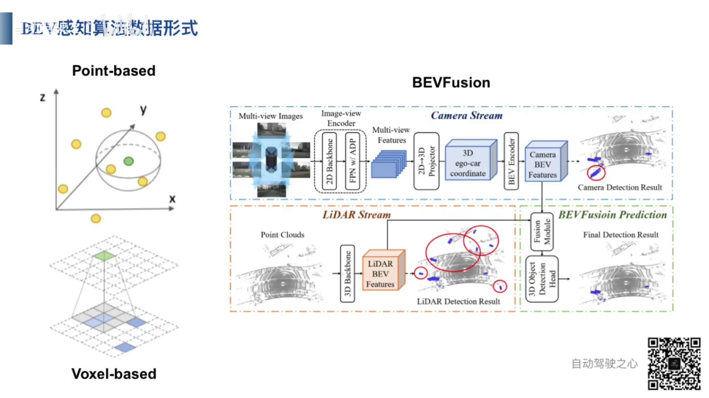{width="5.972222222222222in"
height="3.388888888888889in"}

我们在上一页中讲过，通常点云特征是怎么表征的那我们会思考下一个问题，我们应该怎么提取点云特征呢？现在通用的3D等于特征提取的方法是基于点这个point
best，或者基于提速的worker。通过这两种方式去在一个庞大的点云数据当中中去提取出我们这个场景的3D的点名标准。

前のページで述べましたが、通常の点群の特徴はどのように表現されていますか?現在共通の3dは特徴抽出の方法に基づいています。この2つの方法で、巨大な点群データの中で、私たちのシーンの3Dの点呼基準を抽出する。

一般而言，基于点的方式会在庞大的这个点云数据当中选取一些关键点。比如这个绿色的它是一个关键点，黄色的部分，这个黄色的点是我们的点云场景。以这个关键点为中心，提取关键点及其附近周围一些点的特征，我们称之为基于点的方法。那附近周围怎么去界定呢？通常point
base的方法是以一个球面空间作为界定的，以关键点为中心的这个球体所包含的所有点，我们认为是会对关键点起特征加强作用的一些点，它的特征是全部会聚合到我们所选取的这个关键点上的那上面这种方法，我们称之为point
base，也就是基于点的方法。那另外一种，是基于提速，那当然也有一些我称之为网格。

一般的に、ポイントベースの方法は、膨大な点群データの中からいくつかの重要なポイントを選択します。例えば、この緑は重要なポイントで、黄色の部分で、この黄色のポイントは私たちの点群シーンです。このポイントを中心に、ポイントとその近くのいくつかのポイントの特徴を抽出し、ポイントベースの方法と呼ぶ。その近くの周りはどうやって決めますか?通常、point
baseの方法は一つの球面空間を定義し、ポイントを中心としたこの球体に含まれるすべての点は、ポイントに特徴的な役割を果たすいくつかの点であると考えられるその特徴は、私たちが選んだこの重要なポイントにすべて集約されるという方法で、私たちはpoint
base、つまりポイントベースの方法と呼ばれています。もう一つは、スピードに基づいています。もちろん、私がグリッドと呼んでいるものもあります。

上面讲的传统的基于点的方法，是从以优点云出发，从已知的点云中挑出一些关键点。起诉的方式是从场景出发的，是将场景划分为很多个小块。比如下图，它其实是一个很完整的一个场景，这个场景它被划分成了5乘5的块，蓝色的部分是这个场景中的一些点云数据，通过对一定区域内，比如这个3乘3网格区域的点云进行一个聚合，我们就会得到提取后的点云特征，也就是这个绿色的部分。

上で述べた伝統的な点ベースの方法は、長所雲から、既知の点雲からいくつかの重要な点を選ぶことである。起訴の方式は場面から出発し、場面を多くの小さな塊に分けた。次の図に示すように、これは完全なシーンで、このシーンは5
×
5のブロックに分けられ、青い部分はこのシーンのいくつかの点群データである一定の領域内、例えばこの3
×
3メッシュ領域の点群を一つに集約することで、抽出された点群の特徴、つまりこの緑の部分が得られる。

可以看到，无论是基于点的方式也好，还是基于提速的方式也好，讨论一个独立点是没有意义的。我们都需要采用一定的聚合方法。对于point
base方法而言，我们考虑的是关键点和它附近点的一个特征。对于基于体方法而言，我们是聚合一定立体空间范围内的点。他们为什么要这样做呢？他们也是符合我们一个常规的认知的那比如我们回到上一页PPT，通常而言，我们在一个点名场景下讨论一个点是没有意义的。我们从这个点位场景中随机采样一个点，我们很难区分出我们采样出的这个点属于人，还是属于车，还是属于其他的背景物体呢？是很难界定这一点的那所以说去单独的讨论一个点意义不大，需要结合其局部的空间信息进行一个探讨。

点に基づく方式でも、スピードに基づく方式でも、独立点を議論することは意味がないことがわかる。我々は一定の重合方法を採用する必要がある。Point
baseメソッドでは、重要なポイントとその近くのポイントの特徴を考慮しています。体に基づく方法では、我々は一定の立体空間範囲内の点を集約する。なぜ彼らはこんなことをしたのでしょうか彼らも私たちの通常の認知に合っている。例えば、私たちは前のページのPPTに戻って、通常、私たちは点呼の場面で一つの点を討論するのは意味がない。私たちはこのポイントシーンからランダムにポイントをサンプリングして、私たちがサンプリングしたポイントが人に属しているのか、車に属しているのか、それとも他の背景物体に属しているのかを区別するのは難しいですねこの点を定義するのは難しいので、単独で議論することはあまり意味がなく、その局所的な空間情報を結合して検討する必要がある。

明白了点云特征怎么提取，我们再来看一下，一般而言点云特征是怎么用在bv感这种的。我们还是以典型的BV
fusion的方法为例。上面这个流程是我们刚刚提到的图像特征提取模块。下面这个流程是我们当前讲的如何处理点云特征。从流程上看，我们这里提到这个点云处理模块是以点云数据为输入的。通过这个3D的骨干网络我们得到点云特征。一般而言，我们如果得到点云特征之后，是可以直接处理得到这个3D检测结果的。可以先不关注后面是怎么处理的，其实主要是关注的是通常框架中点云网络是怎么提取点云特征的。OK.

点群の特徴がどのように抽出されたかがわかりました。もう一度見てみましょう。一般的に点群の特徴はbv感のように使われています。典型的なBV
fusionの方法を例にしてみましょう。以上の流れは、先ほど述べた画像特徴抽出モジュールである。次の流れは、私たちが現在話している点群の特徴をどのように処理するかです。プロセスから見ると、ここではこの点群処理モジュールは点群データを入力としている。この3Dの中堅ネットワークを通じて、私たちは点群の特徴を得た。一般的に、点群特徴を得たら、この3D検査結果を直接処理することができる。後にどのように処理されるかは気にしなくてもいいが、実は主に通常の枠組みの中でクラウドネットワークがどのように点群の特徴を抽出するかに注目している。OK.

至此，我们其实对BV感知算法中常见的这个数据形式和数据处理方法去做一个基本讲解。更为详细的这个框架讲解，我们会在后续如果涉及到相应模块的时候，会再给大家做说明的。以上就是这个小节的主要内容。我们说了这么多数据，有没有一些实际的数据呢？所以这就进入到我们下一节课的内容。

ここまで、私たちは実はBV知覚アルゴリズムでよく見られるこのデータ形式とデータ処理方法について基本的に説明した。より詳細なこの枠組みの説明は、今後、適切なモジュールに触れたときに、皆さんに説明します。以上がこの小節の主な内容である。私たちはこんなに多くのデータを話しましたが、実際のデータはありますか?次の授業の内容に入ります。

{width="5.972222222222222in"
height="3.388888888888889in"}

006_原文和译文

2025年01月31日 11:17

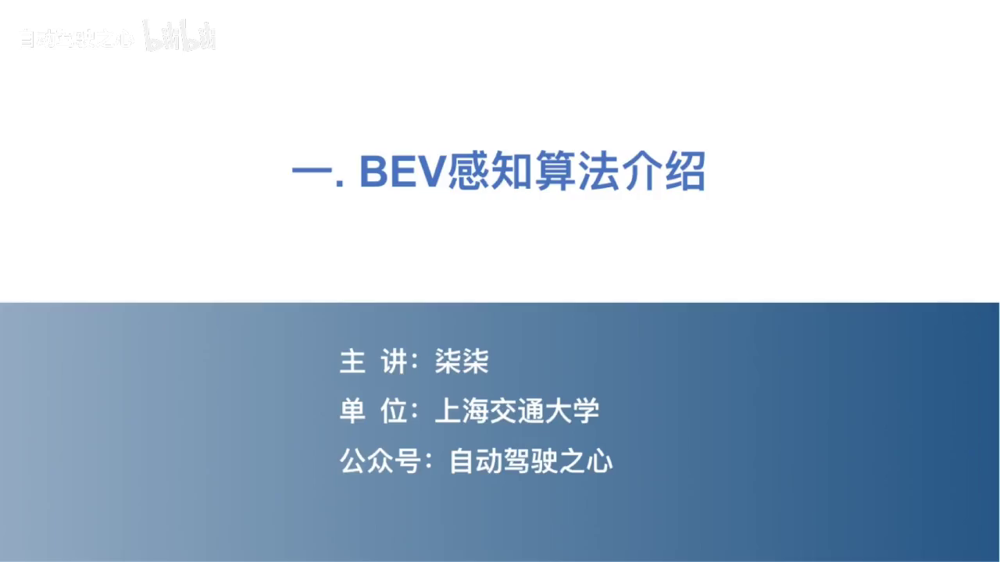{width="5.972222222222222in"
height="3.388888888888889in"}

Hello,
大家好，我是七七，是上海交通大学的一名在读博士，主要研究方向是3D目标检测。接下来由我和大家一起学习有关因为感知算法的相关内容。我们的课程是主要包括一个是基本概念，还有一个基础模块，还有经典算法和实战代码的一些讲解。我们先进入第一章有关BV感知算法的介绍。什么是BV感知算法呢？

こんにちは、こんにちは、私は七七です。上海交通大学の博士です。主な研究方向は三次元目標検査です。次に、私は皆さんと一緒に知覚アルゴリズムに関する内容を学びます。私たちの授業は主に基本概念で、基礎モジュールもあり、古典的なアルゴリズムと実戦コードの説明もある。私たちはまず第1章に入ってBV感知アルゴリズムについて紹介します。BV感知アルゴリズムとは?

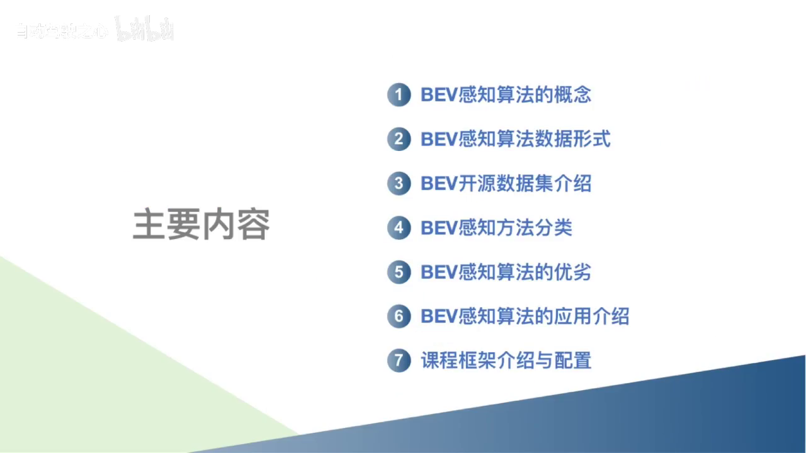{width="5.972222222222222in"
height="3.388888888888889in"}

从第一章开始，我们希望大家可以对当前BV感知算法有一个很基础的了解。我们主要介绍通用的BV感知算法概念、数据形式，还有包括数据集，通用算法的分类，通用算法的优势和劣势，通用算法它有哪些具体的一个应用。我们此外还会对我们完整课程的框架进行一个介绍，对相关我们需要运行的实战代码配置环境去进行一个说明。

第一章から、現在のBV知覚アルゴリズムについて基礎的な理解ができることを望んでいます。私達は主に共通のBV感知アルゴリズムの概念、データ形式を紹介します。また、データセット、共通アルゴリズムの分類、共通アルゴリズムの長所と短所、共通アルゴリズムはどのような具体的な応用がありますか?私たちはまた、私たちの完全なコースの枠組みを紹介して、私たちが実行する必要がある実戦コードの配置環境について説明します。

我们先进入第一节有关BV感知算法的基本概念的介绍，在讨论什么是BV感知算法之前，我们可以对这个词去做一个拆解。这个BV感知算法它是分为三个部分的，一个是BV一个是感知，一个是算法。那什么是BV什么是感知？什么是算法呢？我们可以进行一个分开讨论。

私たちはまず第1節のBV感知アルゴリズムの基本概念の紹介に入り、BV感知アルゴリズムとは何かを議論する前に、この言葉を分解することができる。このBV感知アルゴリズムは三つの部分に分けられています。一つはBVで、一つは感知で、もう一つはアルゴリズムです。BVとは何ですか?アルゴリズムとは私たちは別々に討論することができる。

{width="5.972222222222222in"
height="3.388888888888889in"}

{width="5.972222222222222in"
height="3.388888888888889in"}

首先我们先讨论第一点，什么是BV呢？BEV的全称是best side
view，翻译过来其实是一个鸟瞰图。鸟瞰图也就是俯视图，用一种通俗的表达方式的话，它是一种从上往下的这样一个拍摄视角。现在很多讲解的表述中，习惯于把BV称作上帝视角。既然把BEV称作上帝视角，那上帝能给我们带来什么好处呢？

まず第一に、BVとは何でしょうか?BEVのフルネームはbest side
viewで、翻訳されたのは鳥塚図である。鳥塚図は平面図で、一般的な表現では、上から下へという撮影視点である。現在、多くの説明の表現では、BVを神の視点と呼ぶことに慣れている。BEVを神の視点と呼ぶ以上、神は私たちにどんなメリットをもたらしてくれるのでしょうか

后续就涉及到为什么现在3D检测中，我们基于BV感知算法的一个概念是如此火爆的。主要是源于这个BV视角空间所带来的一个优势。到底有什么样的优势呢？我们这里其实是举了两种很典型的一个优势的。

その後、なぜ現在の3D検査で、われわれのBV知覚アルゴリズムに基づく概念が爆発的であるのかが関係している。主にこのBV視野角空間がもたらすメリットに由来しています。いったいどのような强みがあるのでしょうか。私達はここで実は2種類のとても典型的な優位を挙げました。

首先第一个优势是尺度变化小，尺度变化小这个词应该怎么去理解？我们以右边这个图片为例，它在一个正视图的视角下存在远小近大的一个特点。离相机比较近的目标尺度往比较大，离相机比较远的目标尺度往往比较小。比如说我们看这个白色的车，它是离相机比较近的一个目标，它的尺度其实是比较大的。后面这里是有一个黑色的车辆的，黑色的车辆是离相机比较远的目标，它的尺度其实相对而言就比较小了。

まず第一の強みは、スケールの変化が小さく、スケールの変化が小さいという言葉はどう理解すべきかということです右側のこの写真を例にとると、正面図の視点では、はるかに小さいという特徴がある。カメラに近い目標スケールは大きく、カメラから遠い目標スケールは小さいことが多い。例えば、この白い車を見てみましょう。カメラに近い目標で、その尺度は実は大きいです。後ろに黒い車があります。黒い車はカメラから遠い目標です。その尺度は相対的に小さいです。

相反我们在BV空间去看这个尺度它有没有变化呢？从长从宽的比例，它这个尺度差异变化其实是非常小的。所以尺度变化小，网络对特征一致的这个目标表达能力是更好的。所以说BV视角尺寸是相对一致的，是具有一个明显的尺寸上的一个优势。

逆にBV空間でこのスケールに変化があるかどうか見てみましょう長さの幅の比率から、このスケールの違いは実際には非常に小さい。そのため、スケールの変化が小さく、ネットワークは特徴が一致するという目標表現能力がより良い。だから、BVの視野角寸法は相対的に一致しており、明らかな寸法上のメリットがある。

OK我们再说第二点优势，我们基于BV感知算法，它的视角遮挡是比较小的。它其实也是一个很直观的一个理解。我们当前后两辆车同时出现的时候，后面的车会很自然的被前面的车挡住。比如它这里一块的很多车，后面的车是很明显的会被离相机更近的这个车辆挡住的那如果我们在视觉特征丢失的情况下，通过这样一个前视图的方法，是很难把后面的车给预测到的那相反我们在BV视图下，我们可以很清晰的把这个车完整的去进行一个区分。所以这是BEV图视图下两个很明显的一个优势，一个是尺度变化，下一个是目标间的遮挡比较小。

OK私たちは第二の利点を言います。私たちはBV知覚アルゴリズムに基づいて、その視野角遮蔽は比較的小さいです。これも直感的な理解です。私たちの現在の2台の車が同時に現れたとき、後ろの車は自然に前の車に遮られます。例えば、ここにある多くの車は、後ろの車が明らかにカメラに近いこの車に遮られている。もし私たちが視覚的特徴を失った場合このような正面図の方法では、後ろの車を予測するのが難しいです。逆に私たちはBVビューの下で私たちはこの車をはっきりと区別することができる。だから、これはBEV図の下の二つの明らかな利点で、一つはスケールの変化で、次は目標間の遮蔽が小さい。

我们在了解了什么是BV之后，我们讨论第二个问题，什么是感知？通常而言我们感知是指从人类的角度来讲，是外界事物能在人脑中的一个响应。我们举个最简单的例子，比如告诉你有一个香蕉，那你在脑海中你会构造出一个香蕉，黄色的，然后弯弯的是一个香蕉的样子。同样我们说的BV感知是什么呢？是客观世界图像却在BV视角下的一个响应。同样我们这里举个例子，比如我们在前视图上是有一个车的那在对应的BV视图上也应该有一个车的样子。我们刚刚说的这个过程，他其实就是一个BV感知的一个过程，这个过程用学术的话去给他表达一下，就是说利用感知模型，我们将多传感输入统一到EV表中。我们刚刚提到多传感输入主要是包括图像也好，还有激光雷达、毫米波雷达等等等等，它均属于一个多传感器的一个输入。

BVとは何かを理解した後、2つ目の問題、感覚とは何かを検討します通常、私たちの知覚とは、人間の視点から見ると、外界の物事が人間の脳の中で反応できることである。一番簡単な例を挙げてみましょう。例えばバナナがあると、頭の中でバナナ、黄色、そしてバナナのように曲がりくねっています。同じように私たちが言っているBV感覚とは何でしょうか?客観的な世界画像がBVの視点での応答である。同じように例を挙げましょう。例えば、私たちは前のビューに車があるのですが、対応するBVビューにも車があるはずです。私たちが先ほど言ったこの過程は、彼は実はBV感知の過程であり、この過程は学術的な言葉で彼に表現してみます。つまり、感知モデルを利用して、私たちはマルチセンシング入力をEV表に統一した。先ほど述べたように、マルチセンシングの入力は主に画像やレーザーレーダー、ミリ波レーダーなどがあります。

我们说完了感知这个问题，我们进入下一个方面，什么是算法？算法通俗意义上来讲是一种数学模型，它是试图去帮助计算机理解不同的输入，从而可以实现我们所定义的不同任务。我们举个例子，你比如说你想检测一个2D目标，那我们设计的2D目标检测算法。我们想检测3D目标，我们设计3D目标检测算法。同样我们如果想生成BV视角的图像，那我们设计的是什么呢？是BV感知算法。

私たちはこの問題を感知して、次の方面に入って、アルゴリズムとは何か?アルゴリズムは一般的な意味で数学モデルで、コンピュータが異なる入力を理解するのを助けることで、我々が定義した異なるタスクを実現することができる。例を挙げてみましょう。例えば、2Dターゲットを検出したいなら、私たちが設計した2Dターゲット検出アルゴリズムです。私たちは3D目標を検出したい、私たちは3D目標検出アルゴリズムを設計した。また、BVの視野角の画像を生成したいなら、私たちが設計したのは何でしょうか?BV感知アルゴリズムです。

通过对BV感知算法这个词的拆解，我们讲解了BV视角空间是什么？另外一个什么是感知？另外一个什么是算法？

BV知覚アルゴリズムという言葉を分解することで、BV視野角空間とは何かを説明したもう一つは何ですか?もう一つはアルゴリズムとは何ですか?

接下来我们考虑另外一个问题，我们说的bv和感知哪个更重要呢？明显是感知更重要。本身而言其实BV空间是一个已经提出很多年的一个概念了。而且我们提的这个BV本身，它只是一个俯视视角空间的概念，通俗的讲它也就是一个壳子。那我们怎么样把不同的输入数据套到这个壳子里面，那才是问题的关键。所以说我们现在很多算法的设计是围绕我们所提到的这个感知模块去做的。我们如何设计一个比较好的感知模块，是BV感知算法的一个核心点。

次にもう一つの問題を考えてみましょう。私たちが言っているbvと知覚のどちらがより重要なのでしょうか?明らかに知覚がより重要である。それ自体では、BV空間はすでに何年も提案されてきた概念である。そして、私たちが言及したこのBV自体は、視野角空間を見下ろす概念にすぎず、一般的にはシェルである。では、このシェルに異なる入力データをどのように適用するかが問題の鍵です。だから、私たちの現在の多くのアルゴリズムの設計は、私たちが言及しているこの知覚モジュールを中心に行われています。私たちはどのようにして比較的良い感知モジュールを設計するかは、BV感知アルゴリズムの核心点である。

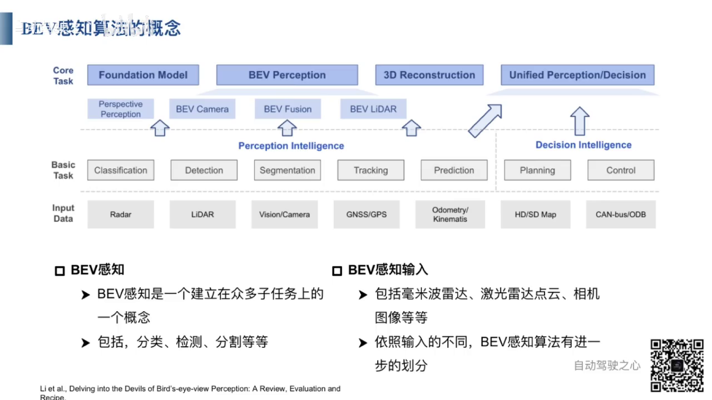{width="5.972222222222222in"
height="3.388888888888889in"}

OK我们在了解了基本概念之后，我们这里给大家补充一下一个基本的BV感知算法。它是利用哪些数据实现了哪些任务，后续可以有哪些扩展。这个图上我们也给大家做了一些标记和说明。

OK基本的な概念を理解した後、基本的なBV知覚アルゴリズムを追加します。どのデータを利用してどのようなタスクを実現し、その後どのような拡張ができるか。この図では、私たちもいくつかのマークと説明をしています。

首先我们常提的BV感知任务是一个建立在很多子任务基础上的一个概念。他这些子任务包括哪些呢？有分类、还有检测、还有分割、有跟踪、有预测，包括后面的一些控制规划等等。所以说是一种比较综合性的一个概念。我们课程中还是以自动驾驶中非常常见的一个检测任务为主来去做介绍。如果后续会涉及到一些多任务的框架的话，我们也会做额外的一个讲解。

まず、私たちがよく言及しているBV感知タスクは多くのサブタスクに基づいた概念である。彼のこれらのサブタスクには何が含まれていますか?分類、検査、分割、追跡、予測があり、後の制御計画などがある。だから、比較的総合的な概念です。私たちの授業では、自動運転でよく見られる検査任務を中心に紹介しています。その後、マルチタスクの枠組みが関係している場合は、追加の説明もします。

其次我们所说的这个BV感知，它的输入其实也是比较宽泛的。我们这里也列举了很多，包括像毫米波雷达，还有一个点云数据，还有相机图像，还有GPS轨迹，我们得到的这些结果可以为后续的这个决策去提供一个支撑。本次课程中我们还是围绕最常见的输入展开，我们主要涉及的是雷达点云，另外一个是图像数据，纯视觉的数据。按照这个不同的输入，我们常见的这个BV感知算法的分类其实也比较清晰了。以相机图像为输入的这个算法，我们称之为叫BV
camera，是一种纯视觉的方案。比较具有代表性的其实像BV former，还有BV
data等等，我们后续会详细的介绍。如果以单点云作为输入的方法，我们称之为BV
leader。像这一部分与传统的这个纯点云做法其实是类似的，比如像PVSN系列，包括PVSN加加等等，他们一般是将处理后的点云特征映射到投影到我们提到的BV平面上去生成这个BV特征。

次に私たちが言っているこのBV感覚は、その入力も実は広いです。ここでも、ミリ波レーダーや点群データ、カメラ画像、GPS軌跡など、多くの例を挙げています私たちが得たこれらの結果は、次のこの意思決定をサポートすることができる。今回のコースでは、私たちは最も一般的な入力を中心に展開しています。私たちは主にレーダーの点群、もう一つは画像データ、純粋な視覚のデータに関係しています。この異なる入力によると、我々がよく見ているこのBV知覚アルゴリズムの分類も実ははっきりしている。カメラ画像を入力とするこのアルゴリズムは、BV
cameraと呼ばれ、純粋な視覚的な方案である。代表的なのは、BV formerやBV
dataなどです。後で詳しく紹介します。単点雲を入力の方法とすると、BV
leaderと呼ばれます。この部分は、PVSNシリーズ、PVSNプラスなど、従来の純粋な点と似ています彼らは一般的に、処理された点群特徴を我々が言及したBV平面にマッピングしてこのBV特徴を生成する。

另外一种方案是什么呢？以图像和点云混合输入的方法，我们称之为融合感知的方法，是叫BV
future。像这类方法同时处理图像和点云特征，去生成这个BV感知的一个多模态融合起来的特征表达。此类方法中很具有代表性的就是BV
fusion。后续课程我们也会有相关框架的一个详细的讲解。

もう一つの案は何でしょうか画像と点群を混合して入力する方法で、私たちは融合知覚の方法と呼ばれ、BV
futureと呼ばれています。このような方法で画像と点群の特徴を同時に処理して、このBVが感知する一つの多モードが融合した特徴表現を生成する。このような方法の中で代表的なのはBV
fusionです。次のコースには、関連するフレームワークの詳細な説明もあります。

明白了这个基本概念之后，我们自然会想，我们所说的这个BV感知算法，它到底是怎么做的？它是如何处理这种多种数据的？如何去生成这个BV表征，他如何去做这样不同的一个任务的呢？这些内容我们会在余下的课程中去做一一的讲解。

この基本概念を理解すると、私たちが言っているBV知覚アルゴリズムは、いったいどうやってやったのかと考えるのは当然ですどのようにしてこのようなデータを処理しているのでしょうか?どのようにしてこのBVの特徴を生成し、彼はどのようにしてこのような異なるタスクを実行するのでしょうか?これらの内容は残りの授業で一つ一つ説明します。

007_原文和译文

2025年01月31日 11:17

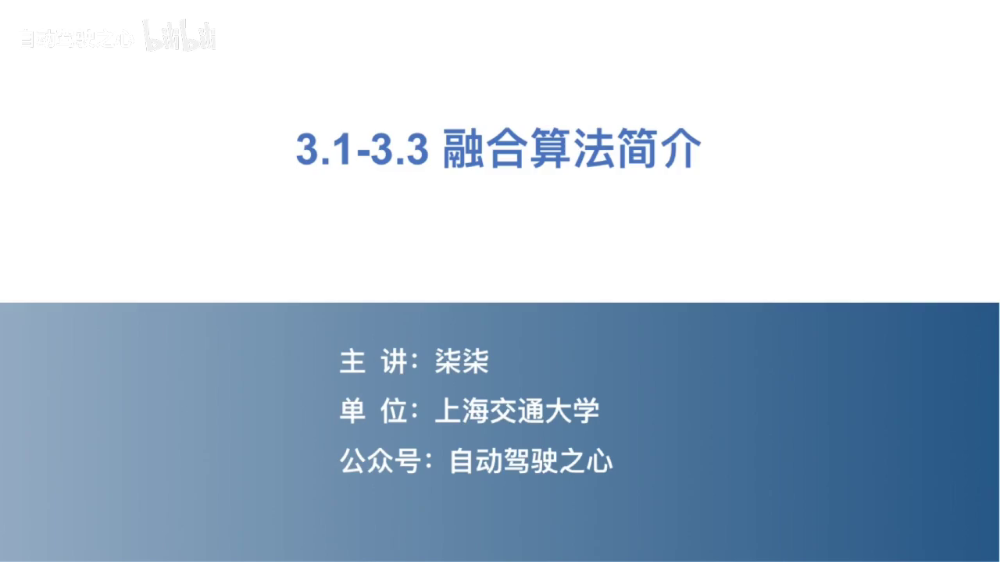{width="5.972222222222222in"
height="3.388888888888889in"}

Hello,
大家好，我是七七。从第三章开始，我们会针对详细的算法来给大家进行一个讲解。我们在第三章当中是主要针对融合算法，也就是leader和camera融合感知的方案。我们在第四章当中是主要针对纯视觉的方案。也就是我们仅仅依赖单一的多视角图像输入的方法做BV感知。我们开始第三章融合算法的基本介绍。我们主要分为三块内容，融合背景介绍、融合思路介绍以及融合的性能评价。

こんにちは、こんにちは、私は七七です。3章から、詳細なアルゴリズムについて説明します。第3章では、主に融合アルゴリズム、つまりleaderとcameraの融合感覚を対象とした案である。私たちは第4章では主に純粋な視覚に対する案である。つまり、私たちは単一の多視野角画像入力の方法だけに依存してBV感覚を行う。我々は第3章融合アルゴリズムの基本的な紹介を始めた。私たちは主に三つの内容に分けて、背景紹介、融合構想紹介、融合の性能評価を融合する。

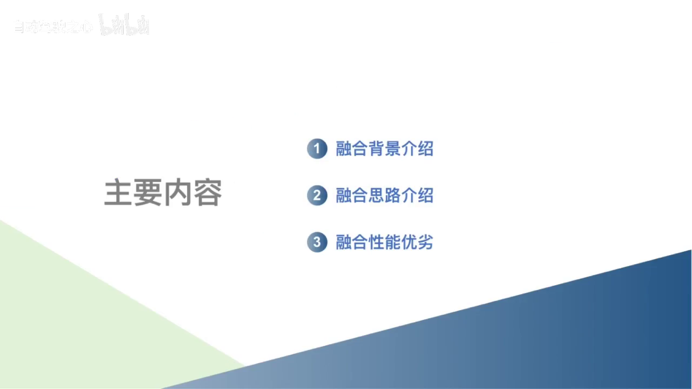{width="5.972222222222222in"
height="3.388888888888889in"}

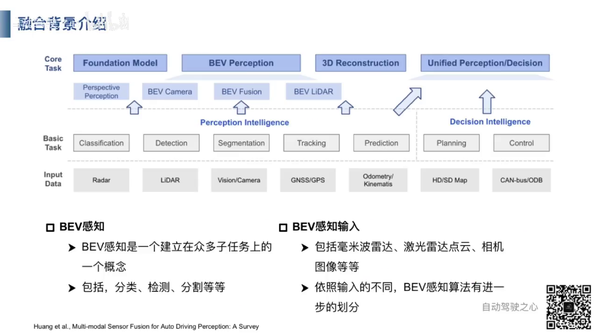{width="5.972222222222222in"
height="3.388888888888889in"}

我们先简单介绍一下融合的背景。第一章中提到过BV感知是建立在很多子任务上的一个概念。子任务可能包括像分类，也好像检测，也好像分割，还有跟踪等等。所以说我们的BV是一个比较综合性的一个概念，它的输入也是比较宽泛的，包括毫米波雷达的输入，还有激光点源雷达的输入，还有视觉系统的一个输入，还有一些比如像GPS，轨迹等等。那我们得到的结果是可以为后续的角色规划提供一个比较好的支撑的。

まず融合の背景を簡単に紹介します。第1章では、BV感覚は多くのサブタスクに確立された概念であると述べた。サブタスクには、分類、検出、分割、追跡などが含まれる可能性があります。だから、私たちのBVは比較的総合的な概念で、その入力も比較的広い、ミリ波レーダーの入力とレーザー点源レーダーの入力を含む視覚システムの入力もあります。GPSや軌跡などもあります。私たちが得た結果は、後続の役割計画に良いサポートを提供することができる。

输入的不同，我们把BV感知算法可以进行一个分类，这个分类是比较清晰的。以相机图像为输入的算法我们叫BV
camera。很具有代表性的是BV former BV
dead系列，以单点云作为输入的方法我们称之为BV
leader。这一部分其实是与传统的纯点云的方法一样，比如PVRCN系列，包括后续的PVICN加加等等。

入力の違いは、BV知覚アルゴリズムを分類することができ、この分類は比較的はっきりしている。カメラ画像を入力するアルゴリズムはBV
cameraと呼ばれています。代表的なのはBV former
BVデッドシリーズで、単点雲を入力とする方法はBV
leaderと呼ばれています。この部分は実は従来の純点雲の方法と同じです。例えば、PVRCNシリーズ、後続のPVICNプラスなどがあります。

以图像和点云混合输入的方法，我们称之为融合感知的方法。像BV
fusion，像这类方法是同时处理图像和点云特征的，会生成一个BV的多模态的表征。像这类方法中很具有代表性的是BV
fusion。

画像と点群を混合して入力する方法を、融合知覚の方法と呼ぶ。BV
fusionのように、このような方法は画像と点群の特徴を同時に処理し、BVのマルチモードの特徴を生成する。このような方法の中で代表的なのはBV
fusionです。

以上其实是一个融合背景的一个简介。我们知道要做融合之后，我们想第一个问题，为什么要融合？我们希望融合可以达成什么样的一个目的？实际上我们希望融合是可以实现一个模态信息的互补性。那什么叫互补呢？你没有的我有，或者你有的我没有，我们俩能够实现一加一能够大于2，我们称这叫互补。我们希望实现多模态信息的互补，那也就意味着单模态是有无法避免的一个劣势的。

以上は実は融合背景の紹介である。融合することを知った後、最初の問題はなぜ融合するのか?私たちは融合がどのような目的を達成できることを望んでいますか?実際、私たちは融合がモデル情報の相補性を実現できることを望んでいる。それは相補とは何ですかあなたがいないのは私がいるか、あなたがいるのは私がいないのか、私たち二人は一足一が2を超えることを実現できて、私たちはこれを相補と呼んでいます。私たちは多モード情報の相補を実現したいです。つまり、単モードは避けられない欠点があるということです。

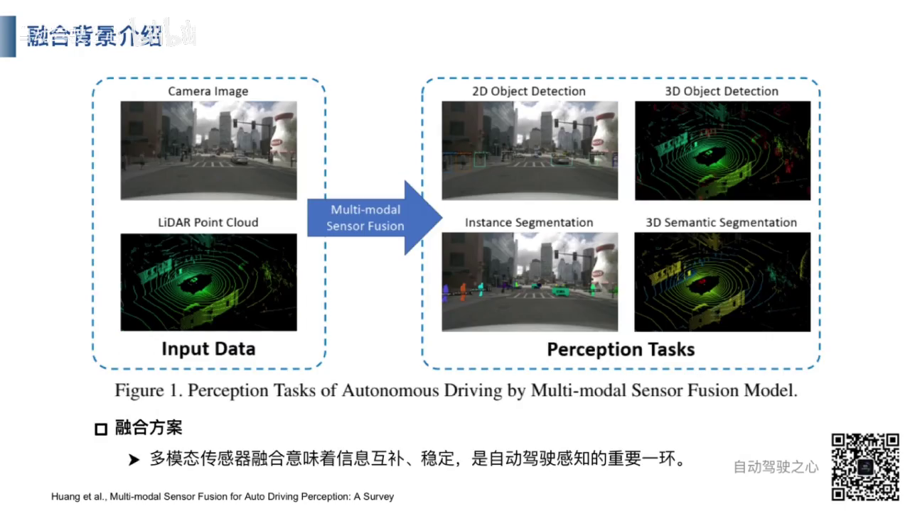{width="5.972222222222222in"
height="3.388888888888889in"}

单模态数据的感知是存在一个固有的缺陷。我们先说这个相机数据，相机数据主要是在前视图一个比较低的位置捕获的。大家在图中也能看到，其实是一个偏平视一个结果。相机模态存在的一个问题是复杂场景修问题，造成这个视觉表征的一个丢失。

シングルモーダルデータの感覚には固有の欠陥がある。まず、このカメラデータは、カメラデータは主に前のビューの低い位置でキャプチャされます。皆さんも図で見ることができますが、実は偏平視の結果です。カメラのモダリティに存在する問題の一つは複雑なシーンの修正問題で、この視覚的特徴の一つが失われた。

激光雷达有没有问题呢？它也是有固有缺陷的，它会受限于机械结构，它在不同的距离是具有不同的分辨率的那也就意味着我们采样点的数目是随着距离而变化的。而且激光雷达也很容易受到雾、雨等极端天气的影响。所以说目前的单一模态它有着固有的缺陷。我们当然希望可以通过这样一个多模态融合的方式，能够实现跨模态信息的一个互补。从未来的角度出发，相机信息和点云信息的互补可以使得自动驾驶在感知层面上变得更加安全。

レーザーレーダーに問題はありますかそれにも固有の欠陥があり、機械構造に制限され、距離によって解像度が異なるということは、私たちのサンプリングポイントの数が距離によって変化することを意味します。また、レーザーレーダーも霧や雨などの極端な天気の影響を受けやすい。だから、現在の単一モードには固有の欠陥がある。私たちはもちろん、このようなマルチモード融合方式で、クロスモード情報の補完を実現できることを望んでいます。未来の視点から、カメラ情報と点群情報の相補は自動運転を知覚レベルでより安全にすることができる。

我们这里讨论的主要任务还是3D检测任务，3D分割任务。我们讲的多模态融合的输入输出是什么输入呢？那自然是跨模态。比如这里是点云加图像，输出是感知结果。感知结果是与任务相关的，它可以做一系列的任务，比如2D检测、3D检测、2D分和3D分割等等。

ここで議論する主な任務はやはり3D検査任務、3D分割任務である。私たちが話している多モード融合の入出力とは何でしょうか?それは自然にクロスモダリティです。例えば、ここは点群加画像で、出力は知覚結果である。知覚結果はタスクに関連しており、2D検出、3D検出、2D分割、3D分割などの一連のタスクを行うことができる。

那融合在哪做呢？怎么样把输入数据进行融合，能够得到我们最终的结果呢？我们还是拿这个图举例，输入是多模态数据，输出是检测结果。那融合在哪做呢？一般而言，我们其实是有三种划分方式的。

融合はどこでできますか?どのようにして入力データを融合し、最終的な結果を得ることができるのでしょうか?この図を例に挙げてみましょう。入力はマルチモーダルデータで、出力は検査結果です。融合はどこでできますか?一般的に、私たちには3つの方法があります。

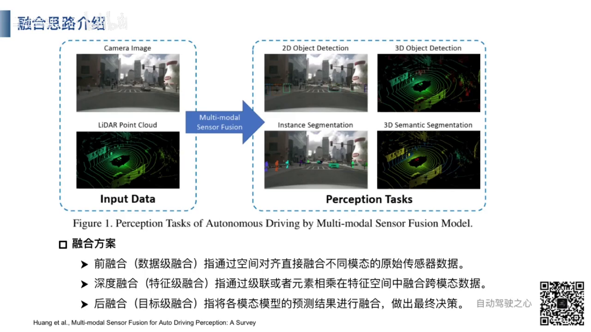{width="5.972222222222222in"
height="3.388888888888889in"}

前融合，我们叫数据集的融合，它也叫perfusion。通过一种空间对齐的方式直接融合不同模态的原始数据。比如说点云是可以投影到2D空间当中的，会生成一个伪2D图。那是不是一种数据融合的方式？或者说我们如果有图像的深度数据，图像的像素数据，按照深度值可以投影到三维空间，可以生成一系列的微点云从图像能到点云。后续我们可以把图像数据按照为点云的方式处理，那也是一种数据集的融合方式。

前融合はデータセットの融合といいます。異なるモダリティの生データを空間的に整列する方法で直接融合する。例えば、点群は2D空間に投影でき、擬似2D図を生成する。それはデータ融合の方法ですか?あるいは、画像の深さデータ、画像の画素データがあれば、深さの値によって三次元空間に投影でき、一連の微点雲を生成して画像から点雲に至ることができる。その後、画像データを点群として処理することができます。それもデータセットの融合方式です。

第二种方法我们叫深度融合，或者说特征级的融合，是一个future
level的融合，特征的融合。输入图像通过图像处理网络，比如这里有一个CNN可以得到图像特征。那输入点云，我们通过点云处理网络，它有一个点云特征。我们在特征层面把多模态数据进行一个融合，也是一种可行的方案。

2つ目の方法は深さ融合、あるいは特徴レベルの融合と呼ばれ、未来レベルの融合、特徴の融合である。入力画像は画像処理ネットワークを介して、例えばここにはCNNが画像の特徴を得ることができる。それは点群を入力して、私達は点群を通してネットワークを処理して、それは1つの点群の特徴があります。我々は特徴的なレベルで多モードデータを融合することも可能な方案である。

第三种融合是叫后融合，它也叫目标级的融合。它其实是偏向一种后处理的方法。图像我们得到了2D图像的预测结果，点云得到了点云的预测结果。那两种结果是不是可以进行一种融合？比如类似于非极大线性抑制的方法，比如AMS等方法，是不是能得到一个最终的检测结果？它属于一种决策级的融合。

第三の融合は後融合と呼ばれ、目標レベルの融合とも呼ばれます。後処理の方法に偏っています。画像は2D画像の予測結果を得て、点群は点群の予測結果を得た。その2つの結果は融合できるのでしょうか?例えば、非極大線形抑制の方法、例えばAMSなどの方法は、最終的な検査結果が得られるのではないかこれは意思決定レベルの融合である。

从这个融合方法的划分，我们也能看到我们现在这种划分方法偏向于一种流程性的划分。从数据到中间过程，然后我们到最后的结果，在不同阶段全都是可以做多模态融合方法的那上述的流程我们其实可以划分的更详细一点。那融合有什么思路呢？我们这里是给了一个更详细的划分示例。

この融合方法の区分から、私たちは今この区分方法がプロセス的な区分に偏っていることもわかる。データから中間過程まで、そして最後の結果まで、様々な段階で多モード融合方法ができるという上記の流れは、実はもっと詳しく分けられます。融合にはどんな考えがありますか?ここでは、より詳細な分割例を示します。

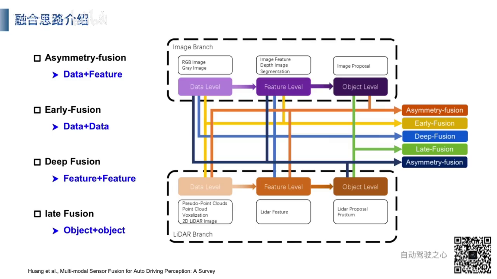{width="5.972222222222222in"
height="3.388888888888889in"}

上面是图像分支。图像分支它包含的数据也就是输入图像，可以输入RGB图像，也可以输入灰度图。还包含什么呢？还包含特征，特征其实涵盖的范围很广了，也有图像特征，可以有深度特征，包括分割也是属于一种特征。我们的分割结果，我们的分割特征图。另外还有个什么呢？还有我们的检测结果属于object
level，是一个物体层面的，我们是得到对应物体的检测结果的那上面是图像植入所包含的三块主要内容，分别对应数据层面、特征层面和我们的结果层面。

上は画像の分岐です。画像分岐に含まれるデータは入力画像で、RGB画像を入力することも、グレースケール画像を入力することもできます。他に何が含まれていますか?特徴も含まれていますが、特徴の範囲が広く、画像の特徴もあります。深度の特徴もあります。分割も一つの特徴です。私たちの分割結果、私たちの分割特徴図。他に何がありますかまた、私たちの検査結果はobject
levelに属し、物体レベルであり、私たちは対応する物体の検査結果を得た上に画像移植に含まれる三つの主要な内容であるデータレベル、特徴レベル、結果レベルにそれぞれ対応しています。

那我们再来看，下面这一块是点云之路。我们划分点云之路的方法，还是按照一个数据，一个特征，一个是结果。那数据包含什么呢？数据其实包含很多方面，可以采用为点云的数据，也可以采用点云数据提速化数据。

では、もう一度見てみましょう。次は点雲の道です。私たちが点群の道を分ける方法は、やはり一つのデータ、一つの特徴、一つは結果である。そのデータには何が含まれているのでしょうか?データには多くの方面が含まれています。点群のデータとしてもいいし、点群のデータを使ってデータを高速化してもいいです。

包括2D的点云图像，我们怎么理解2D点云图像呢？我们可以理解成它是点云信息在2D空间的一个投影，像BV空间可以理解成一个2D平面。我们把点云投影到这个BV空间当中，属于一种2D点图像的处理方式。另外一个，我们有了点名输入之后，我们通过网络可以提取到一个leader
future是点云特征。利用点云特征我们可以得到最终的一个预测结果。

2Dの点群画像を含めて、どのようにして2D点群画像を理解するのでしょうか?点群情報の2d空間での投影であり、BV空間のように2d平面と理解できると理解できる。我々は点群をこのBV空間に投影し、2D点画像の処理方式である。もう一つ、私たちは点呼入力をした後、私たちはインターネットを通じてleader
futureを抽出することができるのは点群の特徴である。点群の特徴を利用して、最終的な予測結果を得ることができる。

图像之路和点云之路我们讲要做融合。图像之路是包含三个子模块的，数据模块、特征模块，还有一个结果模块。同样我们点云数据也包含三个模块。一个是数据模块，一个是特征模块，一个是结果模块。我们图像中的三个模块和点云中的三个模块，两两之间都是可以做融合的。比如图像的data和一个点云的data，图像的data我们叫一后续点云的data我们也叫一两个1之间是可以做融合的。

画像の道と点群の道は融合しなければならないと言っています。画像の道は三つのサブモジュール、データモジュール、特徴モジュール、そして一つの結果モジュールを含んでいる。また、点群データにも3つのモジュールが含まれています。一つはデータモジュールで、一つは特徴モジュールで、一つは結果モジュールです。私たちの画像の中の3つのモジュールと点群の中の3つのモジュールは、2つの間で融合できる。例えば、画像のdataと点群のdata、画像のdataは次の点群のdataと呼ばれ、私たちも1、2、1の間で融合できる。

它是什么呢？是这个黄色的这条线是叫early
fusion，是一个早期融合的方法。它叫early
fusion，其实这个词很明白对吧？是在我们在一开始做的融合，所以叫早期融合，是数据层面的融合，是我们网络开始时候已经做的融合，是数据和数据之间的一种融合方式，所以我们叫early
view。

それは何ですかこの黄色のこの線はせん妄と呼ばれ、初期融合の方法である。マーベリックスと呼ばれていますが、実はこの言葉はわかりますよね?私たちが最初に行った融合なので、早期融合と呼ばれ、データレベルの融合であり、私たちのネットワークの最初に行った融合であるデータとデータの融合方法であるため、私たちはせん妄viewと呼ばれています。

另外一个我们看数据和数据之间可以做融合，我们可不可以做特征和特征之间的融合呢？是future和future的一种融合，我们把它叫做，比如叫2，两个二之间能不能做融合呢？也可以做融合，是这条蓝色的线，我们可以对应到深度的融合。深度融合其实是一个相比较的概念和数据层面的融合。它的early
fusion相比深度融合，它做的是更深层次的。但是到了特征层面的那我们把这种方式叫深度融合，也叫deep
fusion的方法。

もう一つはデータとデータの融合を見ますが、特徴と特徴の融合はできますか?未来と未来の融合です。私たちはそれを「2」と呼んでいます。二つの二つの間で融合できますか?融合することもできます。この青い線で、深さの融合に対応できます。深い融合は実は比較的な概念とデータレベルの融合である。早期フュージョンは深く融合しています。しかし、特徴的なレベルになったら、私たちはこの方式を深さ融合と呼びます。deep
fusionの方法とも言います。

另外一个后融合。按照这个流程性我们也能明白后融合是在后面做的那在什么后面呢？后面是什么呢？流程的后面。所以这种结果层面的融合，它也是一个相比较的概念，相比于阿里而言的是在网络流程之后处理的那我们可以看到，我们刚讲的无论是fury也好，还是deep
fury也好，还是late fury也好，它是一个什么同层级的融合。

もう一つの後融合。このプロセス性によると、融合が後に行われたのは何の後ろにあるのかがわかります後ろは何ですか流れの後ろ。だから、この結果レベルの融合は、それも比較的な概念であり、アリと比べてネットワークプロセスの後に処理されていることがわかります。私たちが話したのはfuryでもdeep
furyでも、late furyでも、どのようなレベルの融合なのか。

我们数据和数据，future和future，它是一种同level的一个融合。那我们不同level能不能做融合呢？能不能做future和data的融合呢？或者说future和object的融合呢？跨级的融合可不可以做呢？也是可以做的。我们把这种方式只能称为叫非对称的融合方法。

私たちのデータとデータ、未来と未来は、同じレベルの融合である。レベルによって融合できるのでしょうか?Futureとdataの融合はできないでしょうか?未来とobjectの融合か?クロスクラスの融合はできますか?できることです。我々はこの方式を非対称的な融合方法としか呼ぶことができない。

比如我们点云会得到一个3D检测proposal一个题框，我们以这个题目框为基准，为初始量去图像采样特征。所以我们就得到了一个以点云object
level和图像的future level，哪怕和图像的一个data
level合在一起的融合方法。我们把这种方式是叫一种非对称的方式。

例えば、私たちの点群は3d検査プロポーザルの一つの問題枠を得ます。私たちはこの問題枠を基準にして、初期量として画像サンプリングの特徴を行います。そこで、私たちは点群object
levelと画像のfuturelevelを、画像のdata
levelと一緒に融合する方法を得た。私たちはこの方式を非対称方式と呼んでいます。

我们前面表述了这么多，图例上可能更清晰一点。我这里先不提供注释，大家可以先想一下，我们这几个图例分别对应我们刚刚提到的哪种融合方式？我们上1PPT是主要分为四种融合方式，非对称的融合、偏早期的融合，还有叫深度融合、偏后期的融合。

私たちは前にこんなに多くのことを述べたが、凡例はもっとはっきりしているかもしれない。ここではまずコメントを提供しませんが、まず考えてみてください。私たちのいくつかの凡例は、私たちが先に述べたどの融合方式に対応していますか?我々の上1PPTは主に四つの融合方式に分けられ、非対称的な融合、偏早期の融合、そして深さ融合、偏後期の融合と呼ばれている。

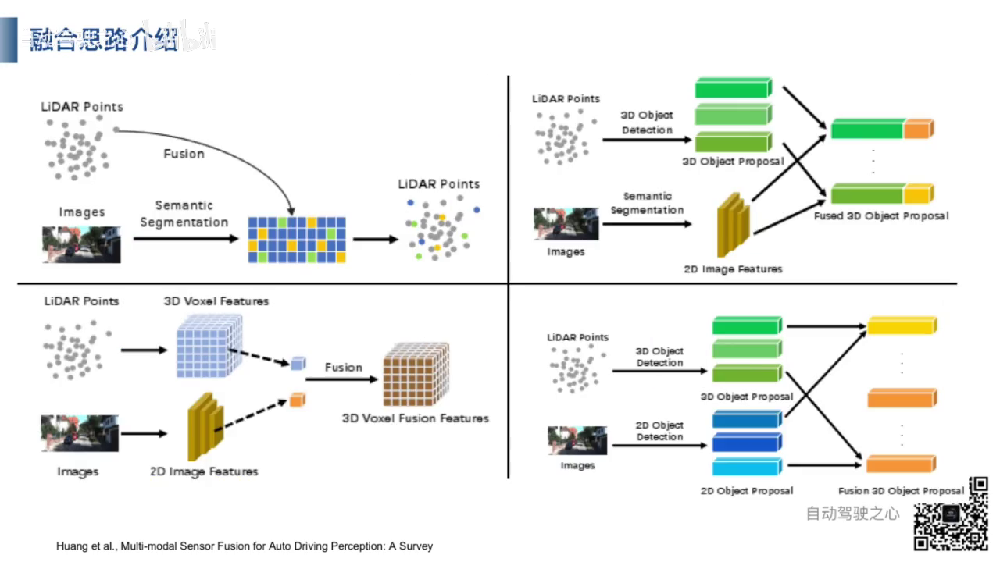{width="5.972222222222222in"
height="3.388888888888889in"}

我们先看第一个，它是属于什么样的融合方法呢？上面是点云的points输入，下面是图像输入。图像会经过分割处理，我们会得到一些偏向前景点的像素。把这些像素映射到点云空间和原始点云去进行一个合并。我们能看到融合后的输出点云是包含这些花花绿绿的点的。这些花花绿绿的点是图像像素的映射点，像这种方式属于什么呢？

まず最初に見てみましょう。それはどのような融合方法なのでしょうか?上は点群のpoints入力、下は画像入力です。画像は分割処理され、前のスポットに偏った画素が得られます。これらの画素を点群空間と原始点群にマッピングして一つの結合を行う。融合した出力点群は、これらの花と緑の点を含んでいることがわかります。これらの花の緑の点は画像画素のマッピング点で、このような方式は何でしょうか

像一是属于一种偏早期的融合，也就是我们提到这个early
fusion。他虽然经过了一个分割网络的处理，我们看到的输出是什么层面的呢？是对原始点云数据的一个融合，所以它更偏向于偏早期的数据融合阶段。

一つは初期の融合に属しています。彼はネットワークを分割した処理を経たが、私たちが見た出力はどのようなレベルなのか?原始点のクラウドデータの融合であるため、より初期のデータ融合段階に偏っている。

我们右图是属于什么样的融合方式呢？输入点云通过3D目标检测算法可以得到物体的proposal。输入图像通过分割网络可以提取图像特征，图像特征和3弟检测结果做融合。

右図はどのような融合方式ですか?入力点群は3D目標検出アルゴリズムで物体のありがたみを得ることができる。入力画像はネットワークを分割することで画像の特徴を抽出し、画像の特徴と3弟の検出結果を融合する。

属于什么样的融合方法？我们上面属于一个object
level的检测结果，下面图像这个之路属于future level的特征。上面是object
level的，下面是future
level的那利用这种结果去找特征是怎么融合呢？是非对称的融合。它不是data to
data的，图像之间是没有做的，图像和点云之间是没有做的那也不是future to
future的。我们没有拿3D的点云特征去和2D的图像特征做融合，我们而是用一个3D的检测结果去和2D的图像做融合。所以它属于一种非对称的融合方式。

どのような融合方法ですか?私たちの上にはobject
levelの検査結果があり、下の画像という道はfuturelevelの特徴である。上はobject
levelで、下はfuturelevelで、この結果を利用して特徴を見つけるのはどのように融合しているのでしょうか?非対称な融合。これはdata
to
dataではなく、画像間は作られておらず、画像と点群の間は作られていないのも未来ではない。私たちは3Dの点群特徴を2Dの画像特徴と融合するのではなく、3Dの検査結果を用いて2Dの画像と融合する。非対称な融合方式です。

我们再来看第三个，它是属于什么方法呢？输入点云通过提速化的处理可以得到3D的提速特征。得到点云数据是一个future
level的数据。图像通过图像处理网络我们可以得到图像特征，图像也是一个future
level的特征。后续做融合属于什么层面呢？属于future对future层面的有一个deep
fusion的方法OK。

3つ目を見てみましょう。それはどのような方法なのでしょうか入力点群は高速化の処理で3Dの高速化の特徴を得ることができる。点群データを得ることは未来レベルのデータである。画像は画像処理ネットワークを通じて画像の特徴を得ることができ、画像も未来レベルの特徴である。その後の融合はどのようなレベルになるのでしょうか?未来の未来レベルに属するdeep
fusionの方法OK。

我们再看最后一个，只剩这个后处理的方式了。也就是我们说的late
fusion后续处理阶段的一个融合。我们可以也可以叫决策级的融合，它是一个结果对结果的融合。

最後を見てみましょう。この後処理の方法しか残っていません。つまり、late
fusionの次の処理段階の融合です。私たちは意思決定レベルの融合と呼ぶこともできます。それは結果の融合です。

我们点云通过3D的目标检测网络可以得到一系列的proposal。图像通过图像检测网络，2D目标检测网络可以得到一系列的2D目标的proposal。我们把2D目标检测框和3D目标检测框去进行一个融合，它叫let
fusion的方法。所以我们这里讲了这么多，主要是想给大家去对融合思路进行一个基本的了解。

我々の点群は3Dの目標検査ネットワークを通じて一連のありがたみを得ることができる。画像は画像検出ネットワークを通じて、2Dターゲット検出ネットワークは一連の2Dターゲットのありがたみを得ることができる。2dターゲット検出ボックスと3dターゲット検出ボックスを融合しました。だから、私たちはここでこんなに多くのことを話して、主に融合の考え方を基本的に理解したいと思っています。

无论是通用的自动驾驶算法，还是BV感知算法，总的来说全都是离不开这些融合思路的那本章我们其实挑选了两种比较具有代表性的方法。一种我们叫数据集的支撑，通过点云数据为图像数据可以提供一个鲜艳，是我们3.4节当中的BV三这个文章，我们叫BVSN也可以。另外一种是我们叫特征级的融合，也就是我们deep
fusion的一个方式。通过图像之路提取图像特征，通过点云之路提取点云特征，把图像特征和点云特征合在一起，通过融合网络可以得到一个融合后的检测结果。这一块其实是我们的3.5当中的这个fusion。

共通の自動運転アルゴリズムでも、BV感知アルゴリズムでも、全体的にはこれらの融合構想が欠かせない本章では、実際には2つの代表的な方法を選んだ。私たちはデータセットと呼ばれるサポートで、点群データを通じて画像データに鮮やかなものを提供することができ、私たちの3.4節の中のBV三という文章で、私たちはBVSNと呼ばれてもいい。もう一つは特徴レベルの融合と呼ばれています。つまりdeep
fusionの一つの方法です。画像の道から画像の特徴を抽出し、点群の道から点群の特徴を抽出し、画像の特徴と点群の特徴を結合し、融合ネットワークを通じて融合した検出結果を得ることができる。この部分は実は私たちの3.5の中のフュージョンです。

{width="5.972222222222222in"
height="3.388888888888889in"}

除此之外我们再看一下这个融合性能要怎么比较，怎么讨论一个融合性能的一个优劣。我们看一下融合性能的比较。这是我录课当天新截图的这个new
sing的lead
board的榜单，这个榜单我是按照MAP去进行一个排名的那上面的是MAP比较高的，MAP这个指标我们后续也会讲，它是一个越高越好的一个指标。

そのほか、この融合性能をどのように比較し、融合性能の優劣をどのように検討するかを見てみましょう。融合性能の比較を見てみましょう。これは私が記録した当日の新しいスクリーンショットのこのnew
singのリードボードのランキングで、このランキングはMAPに基づいてランク付けしたのはMAPが高いですMAPという指標は、高ければ高いほど良い指標である。

{width="5.972222222222222in"
height="3.388888888888889in"}

那这个榜单怎么看呢？我们按顺序走，前面第一个是date，是结果上传的一个时间。比如按照我录课当天排名第一的，这个是3月25号上传的是BVF4D后续第二个是这个名称，我们这个算法名字叫什么？这个算法为什么能排第一？是哪个算法排在第一？

このランキングはどう思いますか?私たちは順番に歩いて、最初はdateで、結果がアップロードされた時間です。例えば、私が授業を受けた日に1位になったのは、3月25日にアップロードされたのはbvf4
dに続いて2番目にこの名前で、私たちのアルゴリズム名は何ですかこのアルゴリズムはなぜ第一位になるのか?どのアルゴリズムが一番ですか

我们这个算法有一个名字，另外一个是模态，我模态我这里选的是any，这个any就是我们所有模态，包括图像的camera模态，包括点云的这个leader模态，或者说融合的方式。包括毫米波雷达，我们可以看到其中有一些reader的算法也是可以包含在内的。我这里选的是安妮。所以就是我们所有模态的所有方法全都是拉出来一起比1比。

私達のこのアルゴリズムには一つの名前があります。もう一つはモードです。私がここで選んだのはanyです。このanyは私達のすべてのモードです。画像のcameraモードを含みます。点群を含むこのleaderモード、あるいは融合の方式。ミリ波レーダーを含めて、readerのアルゴリズムも含まれていることがわかります。私がここで選んだのはアンです。だから、私たちのすべてのモデルのすべての方法は、すべて1対1である。

后面两个一个是地图数据，一个是有没有额外数据。比如有没有使用额外的标注，或者有没有使用额外的数据集去做print
train等等。我们再往后是一些评价指标，我们这一块儿可以稍后讲，从MAP开始去到NDS，它都是一个评价指标。我们稍后会讲，我们来说一个PKL。

次の2つは地図データで、もう1つは追加データがあるかどうかです。例えば、追加のマークアップを使用しているかどうか、または追加のデータセットを使用して印刷トレインを作成しているかどうかなどです。私たちはあとはいくつかの評価指標です。私たちのところでは後で話しますが、MAPからNDSに行くのは評価指標です。後ほど、PKLについてお話しします。

PKL其实是一个比较新的一个指标，它是叫planning care
divergence，其实是一个KL散度。它是一个什么意思呢？我们从这个词上也能了解，是一个叫规划的KL散度。也就是说我们基于这个检测结果后需要怎么做规划？这个规划决策的差异有多大？如果衡量的是决策差异，我们当然希望这个差异是越小越好的。也就是说如果对于一个确定的检测结果，我们要么走要么停。我们不能说这个决策是一个模棱两可的一个决策，可走可停的一个结果，那这不就乱套了。

PKLは実際には比較的新しい指標です。これはプランニングケアディヴァンスと呼ばれています。実はKLの分散度です。どういう意味ですか私たちはこの言葉からも、計画と呼ばれるKL分散度であることがわかる。つまり、この検査結果に基づいて、どのように計画する必要がありますか?この計画決定の違いはどれぐらいですか?意思決定の違いを測るなら、この違いは小さいほどいいと思います。つまり、確定的な検査結果に対して、私たちは歩くか止めるか。私たちはこの意思決定が曖昧な意思決定であるとは言えません。

所以说PKL结果是越低越好的，是越小越好，零那就是完美的，我们这个决策不存在差异，我要么走要么停那当然这个指标其实对于我们要讲的这个检测任务而言，不是特别重要。我们也可以看到，我们这个榜单上面的结果，其实大家在PKL上差距不是特别大。后面这个指标是FPS，也就是我们常说的效率问题。效率问题这里大家都没有上传，属于NA是没有的，是没有这个检测效率方面的报告的那OK我们说完上面的东西，我们再看看这个榜单，现在最好的算法是什么呢？是leader和camera融合的方法。前面这个榜单的第一页差不多都是一些融合的方式。另外大家也能看到什么呢？我们融合的方法离不开什么？离不开BV
fusion。

だからPKLの結果は低いほど良い、小さいほど良い、ゼロは完璧で、私たちの意思決定には違いはない私が行くか止めるかという指標は、実は私たちが話すこの検査任務にとって、特に重要ではない。私たちのランキングの結果は、実はPKLではあまり差がないこともわかります。次の指標はFPS、つまり私たちがよく言っている効率的な問題です。効率の問題はここでは誰もアップロードしていない、NAに属していない、この検査効率の報告がないOK、私たちは上のものを話して、このランキングを見てみましょう今一番いいアルゴリズムは何ですかLeaderとcameraを融合させる方法です。前のランキングの最初のページはほとんど融合の方法です。また、皆さんも何を見ることができますか?私たちが融合する方法は何が欠かせないのでしょうか?離れられない。

所以BV
fewer也是作为我们第三章的一个重点内容来去看的。OK我们说完了这个榜单，我们详细看一下我们刚提到这个榜单上面的指标，每一个指标具体是什么意思？是不是说这个指标越高越好呢？

だから、BV
fewerも私たちの第3章の重要な内容として見に来ました。OK私たちはこのランキングを終えました。私たちはこのランキングの上の指標を詳しく見てみましょう。それぞれの指標は具体的にどういう意味ですかこの指標は高いほどいいということですか?

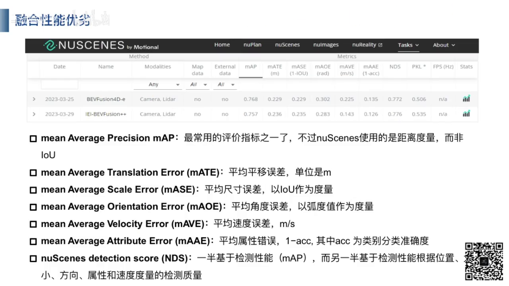{width="5.972222222222222in"
height="3.388888888888889in"}

我们从MAP开始看啊，我们第一个就是MAP。这个其实是我们在目标检测当中属于非常常用的一个指标了。但它和通用的目标检测指标有什么区别呢？它这里的AP的阈值匹配，它不是使用IOU去做匹配的，而是使用我们地坪上的2D中心距离的D来计算的。我们知道ROU是怎么算两个框，我们算它的交还有一个并的比对。如果算交并比的话，物体的尺寸，物体的方向会对IOU产生比较明确的影响。所以using数据集在评价MAP这个指标的时候，考虑的不是使用IOU这个阈值评价标准，而是使用一个距离度量。我们算两个点，我预测的中心点和实际的中心点两个之间的位置偏差，用2D中心距离这个D去进行一个评判。

MAPから見てみましょう。私たちの最初はMAPです。これは実は私達が目標検査の中で非常によく使う指標です。しかし、共通の目標測定指標とどのような違いがあるのでしょうか?ここでのAPのしきい値マッチングは、IOUを使ってマッチングするのではなく、私たちの地坪上の2D中心距離のDを使って計算した。ROUがどのように二つの枠を計算しているか知っています。計算して比べれば、物体のサイズ、物体の方向はIOUに対して比較的明確な影響を与えます。UsingデータセットはMAPという指標を評価する際に、IOUというしきい値評価基準を使うのではなく、距離測定を使うことを考えている。私たちは二つの点を計算して、私が予測した中心点と実際の中心点の二つの間の位置偏差は、2D中心距離というDで一つの評価を行う。

同样我们在IOU当中，我们以IOU作为一个阈值标准的MAP的评价指标当中，我们IOU会设成多少？IOU可能等于0.55或者等于0.7。那我们在new
sing当中MAP我们是采用一个距离度量的方法，范围也自然是有一个阈值设置的。我们的D会设成0.5124，它的单位是米。那MAP这个值是越高越好，还是越低越好呢？显然是越高越好啊，它是一个越高越好的量，因为我们叫一个准确率。既然是准确率，它是一个越高越好的。

また、IOUの中で、IOUをしきい値基準とするMAPの評価指標の中で、IOUはどのくらいに設定されますか?IOUは0.55または0.7に等しい可能性があります。私たちはnew
singの中でMAPは距離測定の方法を採用しています。範囲ももちろんしきい値が設定されています。私たちのDは0.5124に設定され、その単位はメートルです。MAPという値は高いほどいいのか、低いほどいいのか明らかに高いほどいいですね。高いほどいい量です。私たちは精度と呼ばれているからです。精度が高い以上、高いほどいい。

那OK我们再看接下来几个，从MEMATE开始后面一直到AMA后面这几个有什么共性的特点呢？它们都有一个词，它们是叫error
ever是什么意思呢？误差他们既然是误差，它们是越高越好还是越低越好？那是越低越好。前面MATE是叫平均平移误差，是2D空间的一个欧式距离。平移误差它的一个度量单位，因为是欧式距离，所以度量单位其实是米。

では、次のいくつかを見てみましょう。MEMATEからAMAの後ろまで、どんな共通性があるのでしょうかError
verとは何を意味するのでしょうか?誤差彼らは誤差である以上、高いほど良いのか低いほどいいのか?それは低いほどいいです。前のMATEは平均直線移動誤差と呼ばれ、2D空間のヨーロッパ式距離である。平行誤差の一つの測定単位はヨーロッパ式の距離なので、測定単位はメートルです。

MASE叫scale
l是一个尺寸的误差。那我们如果想度量尺寸，以什么评价最好呢？当然以IOU评价最好的，所以这里我们在计算平均尺寸误差的时候，是以IOU作为度量的，我们一般讲ROU其实是一个越高越好的量，这里我们计算的是误差，所以最后结果其实是以一减ROU来评价的那所以一减ROU这个值是什么？越低越好的一个量。

MASEはscale
lと呼ばれ、寸法の誤差である。サイズを測るにはどうすればいいですか?もちろんIOUで評価するのが一番いいので、ここでは平均寸法誤差を計算するとき、IOUを測定しています。ROUは実は高いほど良い量ですここで私たちが計算したのは誤差なので、最後の結果は実は一減ROUで評価されているので、一減ROUという値は何ですか?低いほどいい量です。

MLE是叫orientation，是一个角度，那我们度量角度我们一般采用什么？采用弧度为单位。与GT的偏差越小，弧度值越小，误差越小，所以这个值是越低越好的。

MLEはオリエントと呼ばれ、角度で、私たちの測定角度は一般的に何を採用しているのでしょうか?ラジアンを単位とする。GTとの偏差が小さいほど、ラジアン値は小さく、誤差は小さいので、この値は低いほど良い。

MAVE叫平均速度误差，是一个速度量。因为我们知道new
sing的车是在动的，所以它会有个速度值。它既然是误差，它也是越低越好的了。MAAE是一个平均属性的误差属性其实是一个类别的概念，我们分的越准，那那属性误差越小，所以我们也能看到，我们如果ACC越大的话，我们分的越准的话，那一减ACC这个值就越小的。所以从MATE到MAAE那都是area就是误差的概念。误差是越小越好的。

MAVEは平均速度誤差と呼ばれ、速度量である。New
singの車が動いていることを知っているので、速度値があります。誤差である以上、低いほどいい。MAAEは平均属性の誤差属性であるが、実はカテゴリの概念であり、私たちが正確になればなるほど、その属性の誤差は小さくなるので、ACCが大きいほど私たちの得点が正確になればなるほど、それはACCを減らす値が小さくなる。MATEからMAAEまではareaが誤差の概念である。誤差は小さいほどいい。

我们这个指标在很多论文中也能看到，他们一般是通过这个上下箭头来表示的，和我这里画的一样。比如MAP是越高越好的，用一个song箭头表示。从MATE后续一直到MAE是越低越好的，会用一个下箭头表示。

私たちのこの指標は多くの論文でも見られます。彼らは普通この上下の矢印で表しています。私がここで描いたのと同じです。例えばMAPは高ければ高いほどいいです。MATEからMAEまでは低いほど良いので、下矢印で表示されます。

我们再继续看这个NDS是什么？这个NDS的全称是叫using detection
score，从名字也能看出来，它是一个new
sing专属的一个概念，是叫检测得分。这个得分我们一般是来源于有一半是来源于性能的MAP，是我们前面提到的这个值，另一半是基于位置、大小、方向、属性、速度来评价的一个检测质量。那我们刚刚提到的位置、方向、大小、属性、速度是怎么来衡量的呢？其实是我们上面这些MATE，然后一直到MAE误差这种衡量方式。所以NDS其实可以看作我们上面这些量的一个加权融合。OK从3.1节到3.3节，我们给大家简单介绍了一下这个融合算法的基本概念是什么。后续我们继续会挑出一些详细的算法来具体分析融合他们的融合到底是怎么实现的。

このNDSは何ですかこのNDSのフルネームはusingそうですね。名前からもわかるように、それはnew
sing専用の概念で、検査得点と呼ばれています。この得点は一般的に半分が性能に由来するMAPに由来し、前述の値である残りの半分は位置、大きさ、方向、属性、速度に基づいて評価する検査品質である。先ほど述べた位置、方向、大きさ、属性、速度はどうやって測定しますか?実は私たちの上のMATEは、MAEの誤差まで測定しています。だから、NDSは実は私達の上のこれらの量の重み付けの融合と見なすことができます。OK
3.1節から3.3節まで、この融合アルゴリズムの基本概念を簡単に紹介した。その後、我々は引き続き詳細なアルゴリズムを選んで、彼らの融合がどのように実現したのかを具体的に分析する。

{width="5.972222222222222in"
height="3.388888888888889in"}

008_原文和译文

2025年01月31日 11:17

OK我们进入下一节内容，从1.1到1.3节，我们对BV感知算法基本概念、数据形式、数据集去做了一个详细的介绍。接下来我们在这个部分会对BV感知算法做一个总数，会简单介绍一下不同的BV感知方法区别和联系。我们在1.1节对BV感知算法的基本概念中提到，我们已知的这个BV感知算法可以按照输入数据的不同，可以被划分为BV
leader、BV camera, 还有BV fusion的方法。BV
leader的方法是以点云作为输入的，BV camera是以纯视觉的模态作为输入的那BV
future是多模态融合的框架，它主要是融合图像模态和点云模态。我们这里按照这三种分类方式，会在这一节中选择一些比较具有代表性的算法去给大家一一做一个介绍。

OK次のセクションに進み、1.1から1.3まで、BV知覚アルゴリズムの基本概念、データ形式、データセットについて詳しく紹介した。次に、このセクションでは、BV知覚アルゴリズムの総数について、さまざまなBV知覚方法の違いとつながりを簡単に紹介します。1.1節のBV感知アルゴリズムの基本概念では、我々が知っているこのBV感知アルゴリズムは、入力データによって、BV
leader、BV
cameraに分けることができると述べているまた、ボリュームフュージングの方法もあります。BV
leaderの方法は点群を入力とし、BV
cameraは純粋な視覚的なモードを入力としたBV
futureは多モード融合の枠組みで、主に画像モードと点群モードを融合する。ここでは、この3つの分類方式に基づいて、このセクションで代表的なアルゴリズムを選んで紹介します。

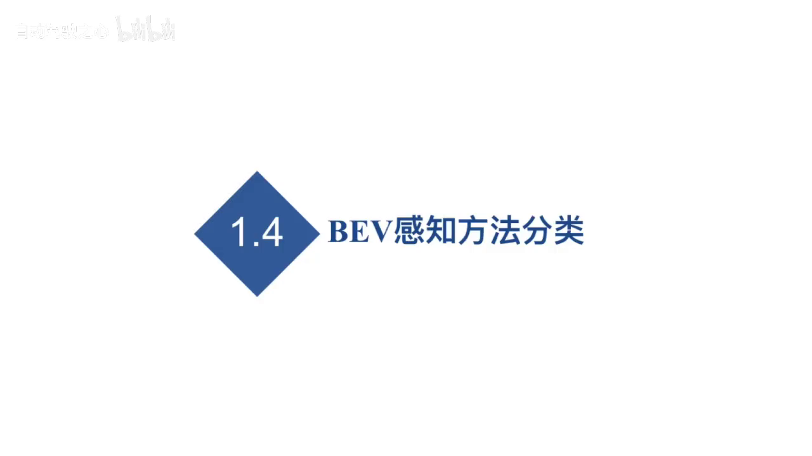{width="5.972222222222222in"
height="3.388888888888889in"}

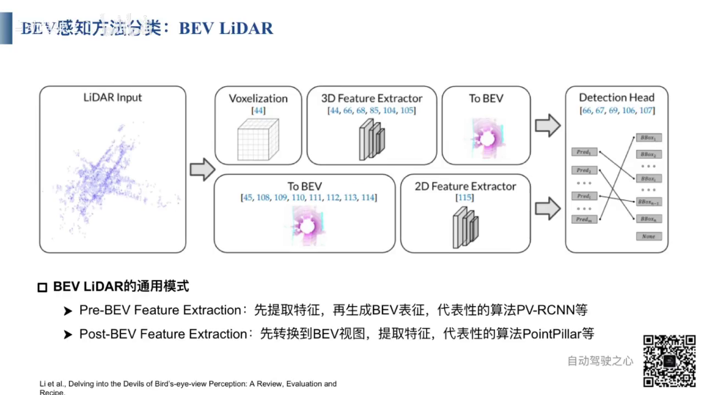{width="5.972222222222222in"
height="3.388888888888889in"}

首先是这个BV leader的方法，像这一类方法，我们其实主要包括prb v和一个post
BV的方式，主要两种类型。我们这个框下图其实给大家已经展示了两种方法的不同流程。首先我们还是从输入输出看起。对于BV
leader的这种方法而言，输入是单点云的，它也就是这里的这个leader
input。输出是以检测人为例，后面连的是一个检测头。那pre BEV和POS
BEV它的一个主要区别在哪呢？其实是在里面这个主体模块上，对于pre
BEV的意思，特征提取是在BEV之前做的，利用提取好的特征拍扁到BV上去生成对应的BV特征图。接下来可以在这些BEV特征图上做一些后续的检测。

まず、このBV leaderの方法です。このような方法は、主にprb vとpost
BVの方式、主に2つのタイプがあります。この枠の下の図は、2つの方法の異なる流れを示しています。まず、入出力から見てみましょう。BV
leaderのこの方法では、入力は単点雲で、ここのleader
inputである。出力は検出者を例にして、後ろには検出ヘッドが接続されている。プレBEVとPOS
BEVの主な違いはどこでしょうか?実は、この本体モジュールでは、prebevの意味について、特徴抽出はBEVの前に行われ、抽出した特徴を利用してBVにフラットにして対応するBV特徴図を生成する。次に、これらのBEV特徴図で次の検査を行うことができる。

属于PBV这一类别的一些典型的算法，有PVSN还有works
SN、SASSD等等等等。那post BV是什么意思呢？我们说的post
BV的意思是指特征提取在BV转换之后做的。从图上的流程我们能看到，通过输入的点云数据先进行BEV的处理，后进行特征提取。特征提取是在BV模块之后的那所以这就叫post
BEV的模式。我们可以利用这个卷积网络提取已经拍扁的BV图，得到最后的BV特征。

Pb vというカテゴリーに属する典型的なアルゴリズムは、PVSNやworks
SN、SASSDなどがある。Post BVとはどういう意味ですかPost
BVとは、特徴抽出がBV変換後に行われることを意味します。図の流れから、入力された点群データでBEVの処理を行い、特徴抽出を行うことがわかる。特徴抽出はBVモジュールの後にあるので、post
BEVのパターンと呼ばれています。私たちはこの畳み込みネットワークを利用して、すでに平らになったBV図を抽出し、最後のBVの特徴を得ることができる。

除了BV位置不同，我们还能看出什么区别呢？很明显两个特征提取器有着明显的不同。那对于prb
v的方法，首先要处理的是点云特征，所以说它一般都会先进入一个叫3D点云处理的一个网络。而对于post
BV的方法，由于它已经转换到这个BV视图了，所以可以通过2D网络去进行特征的提取。这类方法很典型的一个网络就是point
1。那为什么我们一直说这个point披露速度很快？它其实很快的很大一部分原因是由于它的基础网络是处理二级任务的那它自然速度上会有成倍的一个优势。

BVの位置が違うだけでなく、どのような違いが見られるのでしょうか?明らかに二つの特徴抽出器は明らかに異なる。Prb
vの方法では、まず点群特徴を処理するので、一般的にはまず3D点群処理というネットワークに入る。Post
BVの方法は、このBVビューに変換されているため、2dネットワークを介して特徴の抽出を行うことができる。このような方法の典型的なネットワークはpoint
1である。なぜ私たちはこのpointの公開速度が速いと言っていたのでしょうか?その原因の大部分は、基本的なネットワークが二次的な任務を処理するものであるため、自然なスピードで倍のメリットがあるからである。

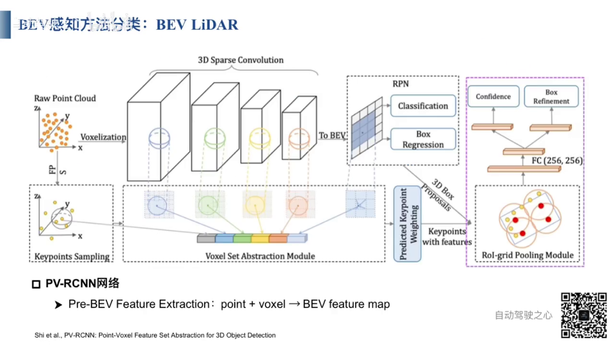{width="5.972222222222222in"
height="3.388888888888889in"}

我们这里以PVSN的网络为例，简单介绍一下PBV的这个特征提取框架是怎么做的那本身PVSN网络是属于基础的3D检测框架了，所以课程里面我们只是做一个简单的流程性质的一个介绍。接下来我们看一下这个网络，看一个网络我们从输入输出看起，PVRCN的输入在哪呢？它的输入其实这一小块原始点云是PVRCN的输入输出是最终的3D检测结果。那输出在哪呢？它输出在这里，它的输出是包含检测框和其对应的执行度的。所以从功能角度概括，PVSN网络是以点云为输入输出3D检测结果的。

ここではPVSNのネットワークを例に、PBVのこの特徴抽出フレームワークがどのようにして作られたのかを簡単に紹介しますだから、コースの中で私たちは簡単なプロセスの性質を紹介しただけです。次に、このネットワークを見てみましょう。ネットワークを見てみましょう。入出力から見ると、PVRCNの入力はどこにあるのでしょうかその入力は実はこの小さな原始点雲はPVRCNの入出力が最終的な3D検査結果である。出力はどこですか?これはここに出力され、その出力は検出ボックスとそれに対応する実行度を含む。そのため、機能の観点から、PVSNネットワークは点群を入出力とする3D検出結果である。

明白了这个功能之后，我们再来看一下PVRN是怎么做的？它的流程是什么？首先从原始点云出发，我们可以看到两个箭头，一个箭头向这里的，一个箭头向下的。他们这两个箭头分别指向的其实是不同的模块，那这两个箭头有什么区别呢？两个箭头其实表征了PVSN的核心内容，是point和vox
el融合的特征提取网络。它意味着PVICN不仅使用了点特征，还使用了提速特征。

この機能がわかったら、PVRNがどうやってやったのか見てみましょうその流れは何ですかまず、原始点雲から出発すると、二つの矢印が見えます。一つはここに向かって、一つは下に向かっています。彼らの2つの矢印はそれぞれ異なるモジュールを指しているが、この2つの矢印にはどんな違いがあるのだろうか二つの矢印はPVSNの核心的な内容を表しており、pointとvox
elが融合した特徴抽出ネットワークである。それはPVICNがポイント特徴だけでなく、スピードアップ特徴を使用していることを意味します。

那OK我们复习一下，我们在介绍点云特征提取方法的时候讲过，一般而言3D点云有两种特征提取方式。一种是基于点特征的，通常提取关键点和其附近点的特征。另一种是基于体素或者说网格的，通常是对场景进行一个立体性质的划分，然后针对网格化的场景去提取特征。这两种方法是各有优劣的那PPIN怎么办呢？他们既然是各有优劣的，很简单两种我都使用，于是从原始点云出发，我们能看到PPSN通过了两种处理，通过提速化的点云利用3D稀疏卷积网络提取提速特征。下面这个植物通过关键点采样提取到了点特征，同时将体素特征和点特征去进行一个融合，它就得到了最终的特征表达。融合的方面会涉及到一些多尺度处理。它的多尺度其实是在不同的blog上做的，它因为本身3D这个吸水卷积网络，每一个block都提供了一些不同分辨率的特征。

じゃあ、復習してみましょう。私たちは点群特徴抽出方法を紹介するときに話しましたが、一般的に3D点群には2つの特徴抽出方式があります。一つは点の特徴に基づいており、通常は重要な点とその近くの点の特徴を抽出する。もう一つはボクセルやメッシュに基づいており、通常はシーンを立体的に区分し、メッシュされたシーンに対して特徴を抽出する。この2つの方法はそれぞれ優劣があるPPINはどうしたらいいのでしょうか彼らはそれぞれ優劣がある以上、簡単な2種類の私が使っているので、最初の点雲からPPSNが2種類の処理を通過したことがわかります高速化された点群を通じて、3Dスパースな畳み込みネットワークを利用して高速化の特徴を抽出する。次の植物はポイントサンプリングによってポイントの特徴を抽出し、同時にボクセルの特徴とポイントの特徴を融合して、最終的な特徴表現を得た。融合の面ではいくつかのマルチスケール処理が関係している。そのマルチスケールは実は異なるblogで作られたもので、それ自体の3dという吸水畳み込みネットワークのため、ブロックごとに異なる解像度の特徴を提供している。

这个蓝色、绿色、黄色还有橘色这个特征是原本体素的一个多尺度的体素特征。灰色的这个路，灰色特征其实来源于这个原始点的是key
point提供的这个原始点的特征是灰色的那后面这个蓝色的，这个浅蓝色的是什么特征？这个浅蓝色的特征其实是我们本次课程中是最关心的这个BV特征。

この青、緑、黄色、オレンジ色という特徴は、もともとボクセルのマルチスケールのボクセルの特徴である。灰色のこの道、灰色の特徴は実はこの原始点に由来しているのはkey
pointが提供したこの原始点の特徴は灰色の後ろの青い、この水色の特徴は何ですかこの水色の特徴は、実は私たちが今回のコースで最も関心を持っているBVの特徴である。

当然PVSN中的BV特征很简单，它是将3D提速按照高度维度自上而下的拍扁，它自然就得到了这个BV特征。我们举个例子，比如这里是一个3D长方体。我们画一个3D长方体，它按照从上往下的这样一个压下来，它是不是就得到了对应的2D俯视特征，会得到一个2D矩形。所以说从3D场景生成2DBEV特征的一个很简单的方法，沿着高度维度压缩，从上往下拍扁就可以了。当然这个拍扁后的特征能不能满足我们后续检测的需要，这就是现在很多BV改变算法中需要讨论的后续的问题了。也是我们课程后续章节需要详细讲解的一个地方。所以这里我们还是以PVSN为例，去给大家介绍的BV
leader中最具代表性的一个做法。

もちろんPVSNの中のBVの特徴は簡単で、それは3dのスピードを上げて高さの次元に沿って上から下へ打つので、それは自然にこのBVの特徴を得ました。例を挙げましょう。例えば、ここは3D直方体です。私たちは3dの長方形を描きます。上から下に押すと、対応する2dの平面視特徴が得られますか?だから、3dシーンから2dbevの特徴を生成する簡単な方法は、高さ次元に沿って圧縮し、上から下に叩くといいです。もちろん、このフラット化した後の特徴が私たちの後続検査のニーズを満たすことができるかどうかは、現在多くのBV変更アルゴリズムで議論すべき後続の問題である。私たちのコースの次の章で詳しく説明する必要がある場所です。だから、ここではPVSNを例にして、ご紹介するBV
leaderの中で最も代表的なアプローチを紹介します。

接下来我们看一看另外一种是基于单模态输入的纯视觉的图像方案的，他们的通用框架又是怎么做的呢？和BV
leader的算法一样，我们这里先对BV
camera的算法做一个总结性的一个介绍。首先我们还是从输入输出看起来，对于BV
camera的方法而言，输入的是什么相机图像？输出的还是以检测任务为例，连的是一个检测头，那网络流程是怎么运行的呢？首先输入是多相机图像，通过2D特征提取网络，然后再通过视角转换模块，我们最后得到的特征会进入这个3D检测头里面存在两个细节。首先第一，它为什么叫一个share
the
future？我们要怎么理解这个share的future？另外一点，他为什么要做这个view
transformation呢？也就是视角转换。

次に、シングルモード入力に基づく純粋な視覚的な画像スキームを見てみましょう。彼らの共通フレームワークはどうやって作られたのでしょうか?BV
leaderのアルゴリズムと同様に、ここではまずBV
cameraのアルゴリズムをまとめて紹介します。まず、入出力から見ると、BV
cameraの方法では、どのカメラ画像が入力されているのでしょうか?出力されたのか、それとも検査タスクを例にして、検査ヘッドがつながっているのか、ネットワークプロセスはどのように機能しているのか?まず、マルチカメラ画像を入力し、2D特徴抽出ネットワークを介して、視野角変換モジュールを介して、最後に得られた特徴はこの3D検査ヘッドの中に二つの細部がある。まず第一に、なぜシェアthe
futureと呼ばれているのでしょうか?このシェアの未来をどう理解するのか?もう一つ、彼はなぜこのview
transformationを行うのでしょうか?つまり視点転換です。

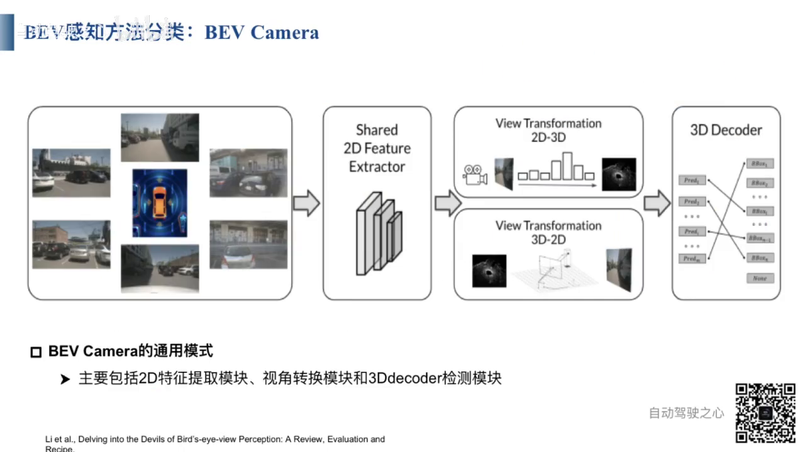{width="5.972222222222222in"
height="3.388888888888889in"}

OK我们先从第一个问题看起，它这个线表示什么？做到线呢？我们得联系这个输入，看输入其实是多张图像的那在特征提取的时候是不是一张图一个网络？显然不是。所以说我们这里的线呢，它其实就意味着它对于不同视角的图像采用的是相同的卷积网络。它是一个特征共享的一个模块。

OK最初の質問から見ると、この線は何を表していますか?線を作るのですか私たちはこの入力に連絡して、入力が実際に複数の画像であることを見なければならないのは特徴抽出時に一つの図が一つのネットワークであるのか?明らかに違います。だから、私たちの線は、実は異なる視点の画像に対して同じ畳み込みネットワークを採用していることを意味している。これは特徴共有のモジュールです。

OK.
我们再来看第二个问题，我们为什么要使用视角转换？我们聊到视角转换的时候，我们得先明白视角转换实现了什么功能。我们框图里面其实已经是做了标注的视角转换的功能，实现的是从2D到3D或者从3D到2D的转换。

OK.2つ目の質問を見てみましょう。なぜ視点転換を使うのでしょうか?私たちは視点転換について話すとき、まず視点転換がどのような機能を実現したかを理解しなければならない。私たちのブロック図の中には、実際にはすでに寸法の視野角変換機能があり、2dから3d、または3dから2dへの変換を実現している。

那为什么要做这个呢？还是得联系输入。看输入其实是一个2D的多视角图像。那我们输入的视角有俯视视角吗？我们可以看一下前视的、侧视的、后视的，那旁边这也是侧视的，它这些视角是不包含俯视视角的。所以说我们在纯视觉的方案中，如果想做BV的感知，首先我们需要利用这些多视角的2D图像，先转换到俯视视角上。

なぜこれをするのでしょうか?やはり連絡して入力しなければなりません。入力は実際には2Dの多視野角画像である。では、私たちが入力した視点には見下ろす視点がありますか?前から見たもの、横から見たもの、後ろから見たものを見てみましょう。その横から見たものも横から見たもので、これらの視点には下から見たものは含まれていません。だから、私たちは純粋な視覚のシナリオで、BVの感覚をしたいなら、まずこれらの多視野角の2D画像を利用して、まず平面視視野角に変換する必要がある。

转换的这个过程其实就是这个视角转换模块去做的一个核心的工作。因为这个BV
camera的方法是我们后续整体课程的一个重点，所以说我们这里再额外总结一下，再看一下这个流程。以多视角图像为输入，提取这个多视角图像特征，通过特征转换模块得到BV特，再送入检测网络。

転換のこの過程は実はこの視点転換モジュールが行う核心的な仕事です。このBV
cameraの方法は私たちの次の全体的な授業の重要なポイントなので、ここでさらにまとめて、この流れを見てみましょう。多視野角画像を入力とし、この多視野角画像の特徴を抽出し、特徴変換モジュールでBV特を得て、検出ネットワークに送る。

按照模块划分的话，BV
camera的方法有几个模块呢？首先第一个模块2D特征提取，后面第二个视角转换，还有第三个是一个检测模块。我们大家可以思考一下，里面这三个模块哪一个最重要？是这个2D特征提取网络，还是这个检测网络呢？其实都不是，是这个视角转换模块最重要。因为无论是2D提取网络还是检测网络，它其实都是基于已有的架构，已有的算法去做的那只有这个视角转换模块才是BV感知算法的核心内容。

モジュール別では、BV
cameraの方法にはいくつかのモジュールがありますか?まず、最初のモジュールの2D特徴抽出、次の2つ目の視野角変換、そして3つ目は検出モジュールである。この3つのモジュールのどれが一番重要なのか考えてみましょうこの2D特徴抽出ネットワークですか、それともこの検出ネットワークですか実はそうではありません。この視点変換モジュールが最も重要です。2D抽出ネットワークでも検出ネットワークでも、それは実際には既存の枠組みに基づいているので、既存のアルゴリズムが行っているのはこの視野角変換モジュールだけがBV知覚アルゴリズムの核心内容である。

我们带着这个理解看一下一个典型的BV
camera算法是怎么做的。这里选取的典型算法是BV former。像BV
former这个框架已经在各种各样的平台都听到过很多次了，是BV感知算法当中比较基础，也是比较通用的一个框架。

私たちはこの理解を持って、典型的なBV
cameraアルゴリズムがどのようにして行われたかを見てみましょう。ここで選ばれた典型的なアルゴリズムはBV
formerである。BV
formerのようなフレームワークは、様々なプラットフォームで何度も聞いたことがあり、BV知覚アルゴリズムの基礎であり、比較的共通のフレームワークでもある。

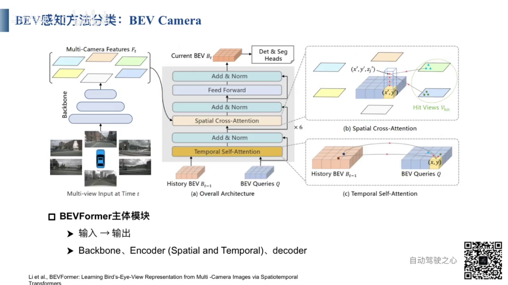{width="5.972222222222222in"
height="3.388888888888889in"}

我们带入刚才的VV camera算法检测流程看你看我们这里的BV
former是不是符合我们刚才的一个讲解。我们看一个网络，还是从输入输出看起。我们上页PPT讲过BV
camera算法以多视角相机图像作为输入输出3D检测结果。那be
reformer是怎么样的呢？我们大家从这里看啊，be
reformer的输入在哪呢？我们这里写出来了mart view
input，那输出在哪呢？是这个模块分割检测头。

先ほどのVV cameraアルゴリズムの検査プロセスを持ってきました。ここのBV
formerが先ほどの説明に合っているかどうか見てみましょう。インターネットを見てみましょうか、それとも入出力から見てみましょうか。前ページPPTでは、BV
cameraアルゴリズムが多視点カメラ画像を入出力3D検出結果としていると述べた。Be
reformerはどうなっているのでしょうか私たちはここから見てみましょう。be
reformerの入力はどこですか私たちはここにマートview
inputを書きましたが、出力はどこにありますか?このモジュール分割検出ヘッドです。

所以我们将BV
former从功能上概括就是以多视角图像为输入输出3D检测结果。我们这个概括是不是非常符合BV
camera方法的一个主体结构了。OK我们再来看看BV
former符不符合我们刚才说的模块化的流程。我们再复习一遍，BV
camera算法的主要模块是什么呢？2D特征提取模块、视角转换模块和检测头模块。

そこで、BV
formerを機能的に要約すると、多視点画像を入出力3D検出結果とする。私たちの要約はBV
cameraの方法の一つの主体構造に非常に合っているのではないか。OK BV
formerが先ほど言ったモジュール化の流れに合わないのを見てみましょう。もう一度復習してみましょう。BV
cameraアルゴリズムの主要なモジュールは何でしょうか2D特徴抽出モジュール、視野角変換モジュール、検出ヘッドモジュール。

我们看BB former的算法是怎么做的，通过multi view
input我们得到了future，通过什么网络呢？通过这个backbone网络去做的那这个backbone网络其实就是一个2D特征提取器。那哪里是检测头呢？我们刚刚提到的输出的这个分割检测网络，可能有同学会说，我好像没看见有视角转换的网络，那其实是BV方面没有点名而已。从多相机特征到BEV特征，我们这里看到是一个current
BEV的特征。是不是实现的？就是我们刚才提到的视角转换网络的功能。那也就是说是这个灰色区域的模块功能，灰色区域模块就是BV
former当中视角转换模块。

BB
formerのアルゴリズムがどのようにして行われているかを見てみましょうこのバックボーンネットワークを通じて行われたこのバックボーンネットワークは、実は2D特徴抽出器である。どこが検査ヘッドですか私たちが先ほど言った出力のこの分割検査ネットワークは、同窓会が言っているかもしれません。私は視野角転換のネットワークを見ていないようですが、実はBV側は点呼していません。マルチカメラの特徴からBEVの特徴まで、ここではcurrent
BEVの特徴を見てみましょう。実現したのか?先ほど述べた視点転換ネットワークの機能です。つまり、この灰色の領域のモジュール機能で、灰色の領域モジュールはBV
formerの視野角変換モジュールである。

我们再把整体流程看一遍，BV
formal中它有没有奥迪网络？有的，那是这个backbone络，它有没有视角转换网络呢？有的，它是这个灰色部分，它有没有检测头呢？那显然也是有的。这个流程模块化的流程是不是完美符合我们前面提到的这个BV
camera算法整体流程呢？

私たちは全体の流れをもう一度見てみましょう。BV form
lにアウディネットワークはありますか?あります。それはこのバックボーンネットワークです。視点転換ネットワークはありますか?あります。この灰色の部分です。ヘッドはありますかそれも明らかにあります。このプロセスのモジュール化のプロセスは、私たちが先に述べたBV
cameraアルゴリズムの全体的なプロセスに完璧に合っているのでしょうか?

OK我们再看我们刚提到的三个模块，哪个模块占比最大呢？显然是这个灰色区域？视角转换模块占比最大。所以我们刚才也提到三个模块当中，视角转换模块是BV感知算法研究的一个重点。不同的BV感知算法往往就是在视角转换上去进行了不同的创新研究。像BV
formal中，它引入了这个空间的也好，时序的也好，它的一个主要目的其实都是为了去通过视角转换功能实现更好的BV特征，从而有利于后续的检测。我们这里的BV
former也只是给大家做一个很通俗的介绍，后续课程中会针对BV
former中各个模块做更详细的讲解。

OK、私たちが先ほど言った3つのモジュールを見てみましょう。どのモジュールが一番多いのでしょうか明らかにこの灰色の領域ですか?視野角変換モジュールが最も多い。そこで先ほど述べた3つのモジュールのうち、視野角変換モジュールはBV知覚アルゴリズムの研究の重要なポイントである。異なるBV知覚アルゴリズムは、多くの場合、視野角転換に異なる革新的な研究を行った。この空間を導入したのも、時系列的なのも、実際には視野角変換機能によってより良いBVの特徴を実現するためです。その後の検査に有利です。ここのBV
formerも一般的な紹介をしているだけで、次のコースではBV
formerの各モジュールについて詳しく説明します。

OK我们以BV方的为例，去给大家介绍了这个BV
camera类别当中一个比较具有代表性的做法。接下来我们再来看看利用多模态融合的方法是怎么做的？我们前面对BV
camera和BV leader的方法分别做了分析。BV
future顾名思义是对图像和点云的一个融合。既然是融合，那自然离不开这个图像处理和点云处理的基本流程。所以说我们还是把BV
camera和BV leader的流程拿过来，我们看看BV
fewer是怎么做的那我们其实只要明白了基于单模态图像或者点云的BV改进算法之后，我们去理解这个BB
fewer的流程也会变得非常简单。

OK私たちはBV側を例にして、このBV
cameraカテゴリの中で代表的なやり方を紹介しました。次に、マルチモード融合を利用する方法を見てみましょう私たちは先にBV
cameraとBV leaderの方法をそれぞれ分析した。BV
futureは名前が示すように、画像と点群の融合である。融合している以上、この画像処理と点群処理の基本的な流れは自然に欠かせない。だから、私たちはBV
cameraとBV leaderのプロセスを持ってきて、BV
fewerがどのようにしているかを見てみましょう。私たちは実際にシングルモード画像や点群に基づくBV改善アルゴリズムを理解した後このBB
fewerを私たちが理解していくまでの流れも非常に简単になります。

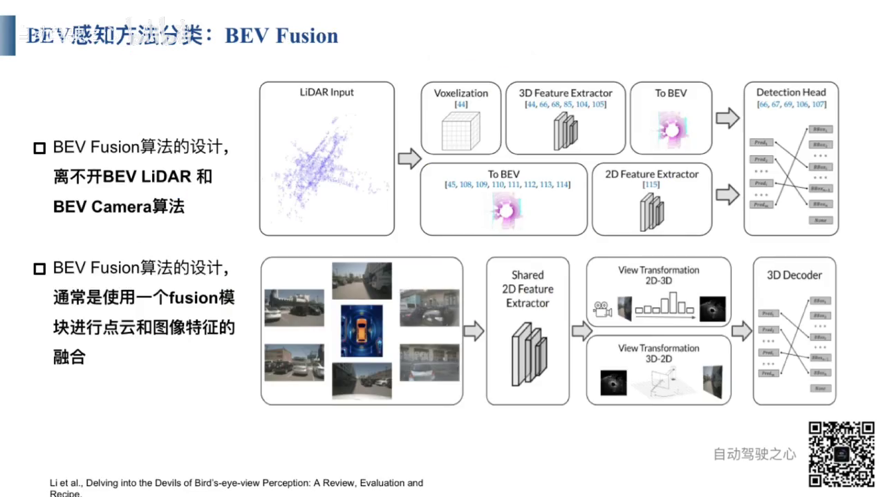{width="5.972222222222222in"
height="3.388888888888889in"}

首先我们看一下融合是什么层面的那一般而言，融合是特征层面的，是在我们得到的这个3D特征或者2D特征之后的，是对多模态特征的一个融合。从图上来看，我们提到3D特征在哪儿呢？我们在这个后面，那2D特征在哪呢？2D特征就是以图像为输入的，那是在这个share的2d
future后面，这两个输出其实就是3D点云特征和2D图像特征，如果设计合适的模块对这两个层面的特征进行一个融合，其实就是BV
future方法的主题思路了。所以如何融合特征才是这个问题的关键。他们俩做融合，我们接下来还是看一个经典案例。

まず、融合がどのレベルであるかを見てみましょう。一般的に、融合は特徴レベルで、私たちが得たこの3D特徴または2D特徴の後に多モード特徴の融合である。図から見ると、3Dの特徴はどこにあるのでしょうか私たちはこの後ろにいて、その2D特徴はどこにあるのでしょうか2d特徴は画像を入力とするもので、それはこのシェアの2d未来の後に、この2つの出力は実は3d点雲特徴と2d画像特徴である適切なモジュールを設計してこの二つのレベルの特徴を一つに融合すれば、実はBV
future法のテーマ構想である。特徴をどのように融合するかがこの問題の重要なポイントである。彼ら二人は融合しているので、私たちはこれからも典型的なケースを見てみましょう。

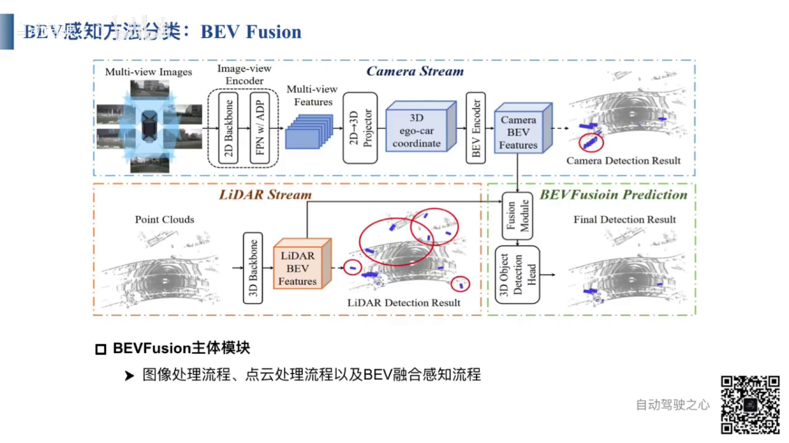{width="5.972222222222222in"
height="3.388888888888889in"}

我们接下来讲的这个框架叫BV
view，就一目了然。它是基于动模态BV感知的一个方法。我们带入刚才BV
fusion这个算法的检测流程，看一看我们称之为BV
view的框架是不是符合我们刚才的讲解。

私たちが次に話しているこの枠組みはBV
viewと呼ばれ、一目でわかります。これは動モードBVに基づいて知覚する方法である。先ほどのBV
fusionというアルゴリズムの検査の流れを持ってきました。私たちがBV
viewと呼ぶ枠組みが先ほどの説明に合っているかどうか見てみましょう。

我们首先看BV
fusion的框架输入输出是什么？看图输入在哪。一个多视角图像还有没有别的输入呢？有的，和他并行的一路一个point
class一个点云输入。也就是说be the
fusion，同时以图像和点云是作为输入的那输出什么呢？这里也写的很明确了，是一个最终的检测结果，输出3D检测结果。

まず、BV
fusionのフレームワーク入出力とは何かを見てみましょう図を見て入力します。多視点画像には他に入力があるのでしょうか?あります。彼と並行してpoint
classの点群入力です。つまりbe the
fusionは、画像と点群を同時に入力として出力していますか?ここにも書かれているのは明確で、最終的な検査結果で、3D検査結果を出力する。

那我们再看看流程上符融合BV感知的一个定义？我们刚才怎么归纳的对2D图像特征和3D点云特征，利用特定的融合模块进行处理，可以得到最终的BV标准。OK我们看看这个框架，2D图像特征在哪，2D图像编码器，3D点云特征在哪？3D主干网络。所以说我们这里输出的2D图像特征一后面这里输出的是3D点云特征2。后续一系列的处理其实只是为了对多模态特征进行融合，得到最终的BV表示。它这里叫be
refused的一个模块。

では、プロセス上の記号融合BV感覚の定義を見てみましょうか?私たちは先ほどどのようにして2D画像特徴と3D点群特徴をまとめ、特定の融合モジュールを利用して処理することで、最終的なBV規格を得ることができる。OKこのフレームワーク、2d画像特徴はどこ、2d画像エンコーダ、3d点群特徴はどこですか3Dトランクネットワーク。だから、私たちがここで出力した2D画像特徴の後にここで出力したのは3D点群特徴2である。次の一連の処理は、実際には多モード特徴を融合し、最終的なBV表示を得るためだけである。ここではbe
refusedのモジュールと呼ばれています。

这个流程大家应该比较清楚了，我们这个流程的详细模块还是在后续课程中去做详细的讲解。这里时间关系我们就不展开了。OK我们1.4级的BV感知方法的一个分类，就先给大家讲到这里。

この流れはみんなはっきりしているはずです。私たちの流れの詳細なモジュールは、次のコースで詳しく説明します。ここの時間関係は私たちは展開しない。OK私たちのレベル1.4のBV感知方法の分類は、まずここまでお話しします。

我们总结一下，我们主要介绍了三类的BV感知方法。以BV
leader纯点云作为输入的，以BV camera相机图像作为输入的，可以BV
fusion，它一个多模态信息融合作为输入的那分别给大家举了一些比较典型的案例，包括PVRC
nbv former BV
future这些耳熟能详的一些算法。我们这里还是主要帮助大家去构建起这个BV感知算法的一个基本理解，有助于我们后续课程的一个学习。我们这一节的内容就到此为止，我们接下来给大家分析一下BAV感知算法它到底有什么优劣呢？

私たちはまとめて、私たちは主に3種類のBV感知方法を紹介した。BV
leader純点雲を入力とし、BV cameraカメラ画像を入力とすると、BV
fusionが可能であるその多モード情報融合は入力として、それぞれ典型的なケースを挙げています。私たちは主にこのBV知覚アルゴリズムの基本的な理解を構築するのを助けて、私たちの次の授業の勉強に役立つ。私たちのこのセクションの内容はここまでです。次に、BAV感知アルゴリズムの優劣を分析してみましょうか
