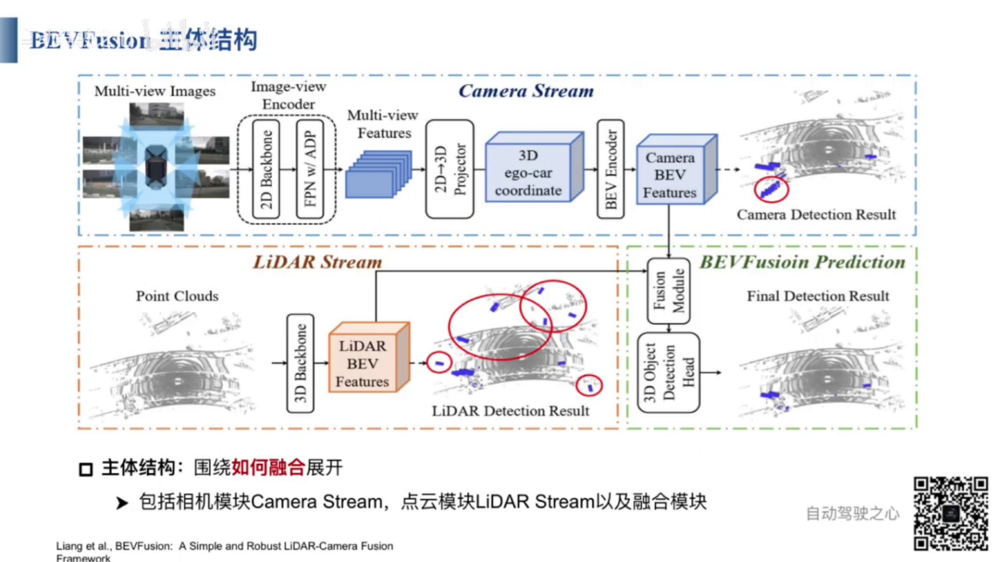
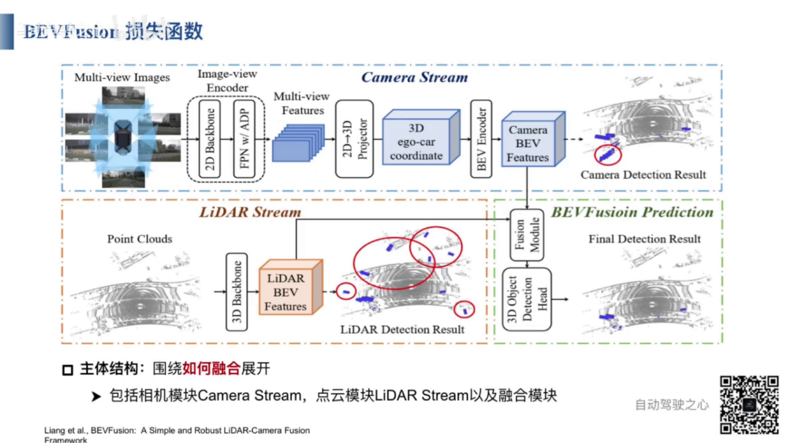
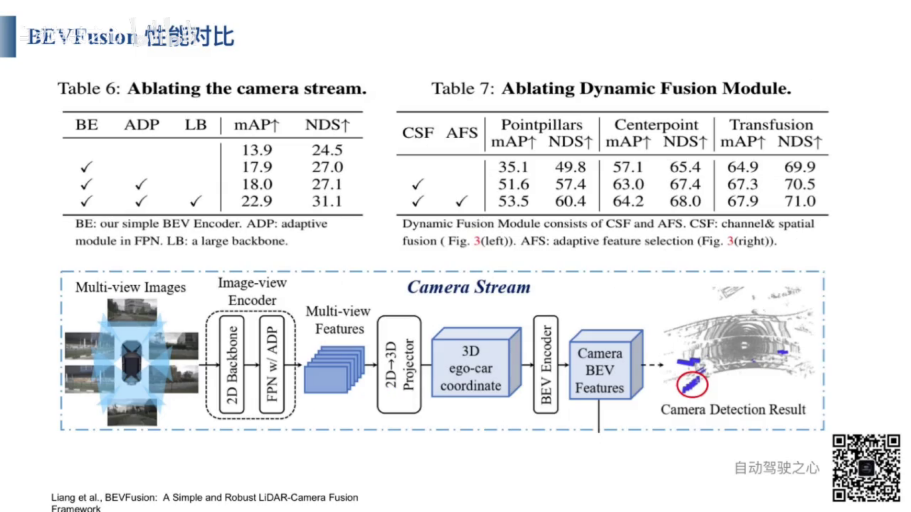

 
 
1. BevFusion 包含2个部分的内容，Bev 是一个鸟瞰空间， Fusion 是多模态数据融合，例如 Camera图像与LiDar点云的融合。
2. BevFusion中包含3种融合方法： 
3. 点级别的融合： 从点云数据中抽取采样点，根据相机的内参和外参，投影到图片上，提取图片特征，然后再和点云进行拼接。然后利用融合后的点云特征，进行3D检测。
4. 基于特征的融合：将多模态的特征数据，通过内外参数，投影拼接在一起，传递的Query
5. 点级别融合 和 特征级别融合的缺点
6. 都是将点云中的点，投影（通过相机的内参和外参）到图像平面上提取特征。
7. 相机内参是在出厂时就确定不变的， 相机外参，用来确定相机坐标系和 LIDar坐标系之间的映射关系。
8. 当图像不清晰或者点云坐标数据不准确时，例如：传感器校准不准确，外参存在有误差时，会出现映射失败的情况。
9. 点级别融合 和 特征级别融合 都是以点云数据为基准。当点云数据不准确时，3D检测的结果也不准确。以点云数据为主，以摄像头数据为次。
10. BevFusion 分别通过 CameraNetwork 和 LidarNetwork 进行特征提取，将提取后的特征进行融合，而不是进行映射，没有主次之分。
11. BevFusion 有 3个检测头， 有基于融合后特征的3D检测头，有基于图像特征的3D检测头，有基于点云特征的3D检测头，图像特征和点云特征，既可以分别工作，也可以联合工作。

 

 
1. 图像处理流程： 输入： 多视角图像， 输出： 图像BEV空间的特征
2. 首先，通过图像特征提取网络，对多视角图像进行处理； 然后：将多视角图像特征从2维转换为3维。 其次： 对三维图像特征进行BEV空间编码，得到图像的BEV空间特征。
3. 可以基于图像的BEV空间特征，进行3D物体检测。
4. 点云处理流程： 输入： 点云数据， 输出： 点云BEV空间的特征
5. 首先，通过点云特征提取网络，得到点云BEV空间特征。常见的点云特征提取网络有PointNet，PointNet++， VoxelNet， PointPillar等。
6. 可以基于点云BEV空间特征，进行3D目标检测。
7. BEVFusion 可以将图像BEV空间的特征和点云BEV空间的特征进行融合，基于融合后的BEV特征，进行3D目标检测。
8. BevFusion 除了支持多模态3D检测，也支持单模态的3D检测。基于图像BEV空间特征的3D检测，基于点云BEV空间特征的3D检测。
  
 
1. 通过2维图像特征提取网络，处理各个视角的图像数据。
2. 通过 FPN 和 ADP，进行多尺度融合。 FPN Feature Pyramid Network 特征金字塔。不同尺度的图像特征，通过ADP进行上采样，池化，卷积，可以得到相同大小的特征，从而实现多尺度特征融合。
3.  ADP（Adaptive Deformable Part） ADP 指的是一种自适应形变机制，用于处理不同形态和尺度的目标，以提高目标检测或分割的效果。
4. FPN + ADP 设计流程： 输入：基础图像特征； 输出： 多尺度融合特征。 处理流程： 1 对每层特征使用ADP模块；2 ADP 模块包括上采样，池化，卷积。 3 多层特征融合。
   

   
 
1. 从2D到3D的特征转换。对二维图像上的每个像素点，进行深度预测。会得到一个离散的深度预估概率。
2. 概率作为权重，与图像特征相乘，得到二维图像的3D空间。即是3D伪体素特征。
3. 3D伪体素特征的处理流程： 输入： 多尺度融合特征。 输出： 3D伪体素特征。 1 计算得到深度分布估计。 2 2D 到3D的投影换算。 3 输出3D伪体素特征。

 
- 将3D特征转换成BEV特征
- 通过俯视图，将3维特征压缩为2维Bev特征。

 
- 点云分支直接对3D点云特征进行压缩，得到2D的点云BEV特征。
- 常见的3D点云特征提取网络有：PointNet，PointNet++， VoxelNet，PointPillar，CenterPoint，Transfusion等

 
- 现在看到的是3D点云特征提取网络 PointPillar的结构图。
- 将点云空间分割为若干个柱子，每个柱子中所包含的点的特征，作为该柱子的特征。
- 将点云空间分割为 D*P*N 维的向量，其中， D表示单个三个点的特征， N表示一个柱子中三维点的个数。P表示整个空间中，柱子的个数。
- D 是一个9维向量，分别是 x, y, z 表示点的坐标， xc, yc,zc 表示柱子中线点坐标， xp， yp 表示三维点距离柱子中心的偏移量。 r 表示反射强度。 
- P 一般为 12000， 即一个三维场景通常用12000个柱子来表示。
- N 一般为 100， 即一个柱子中最多有100个三维点。
- 将D*N*P的向量压缩成 P*C维的向量。三维场景中有P个柱子，每个柱子用C维向量来表示。
- PointPillar 的输入是3D点云数据，输出是对应的H*W*C的伪图特征。

  

 
 
- Fusion 模块的输入 图像BEV特征 和 点云BEV特征。 输出： 融合后的特征。
- 按照通道维度级联点云BEV特征和图像BEV特征，然后通过卷积网络提取级联后的特征。
- 通过全局平均池化和卷积预测，实现对级联特征的自适应挑选。 通道注意力机制。
- 由网络自行分配点云BEV特征和图像BEV特征的权重。

 
 
- MIT BEVFusion
- 
 
 
 
 
 

https://www.bilibili.com/video/BV1ix4y1f7mX/?spm_id_from=333.337.search-card.all.click&vd_source=f806e1845ce32bd171eeadf5991dc371

