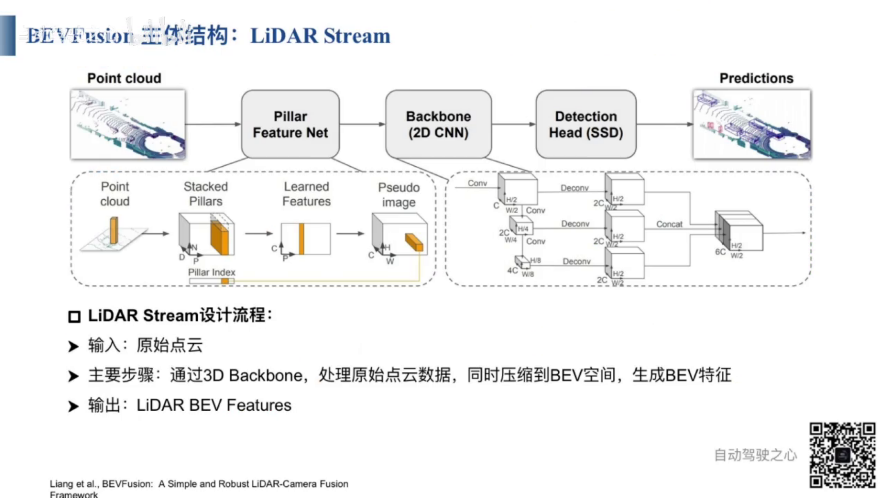
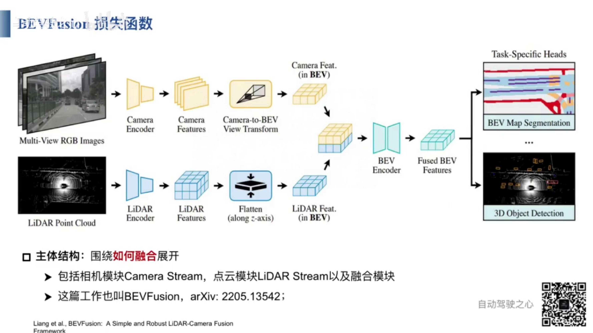
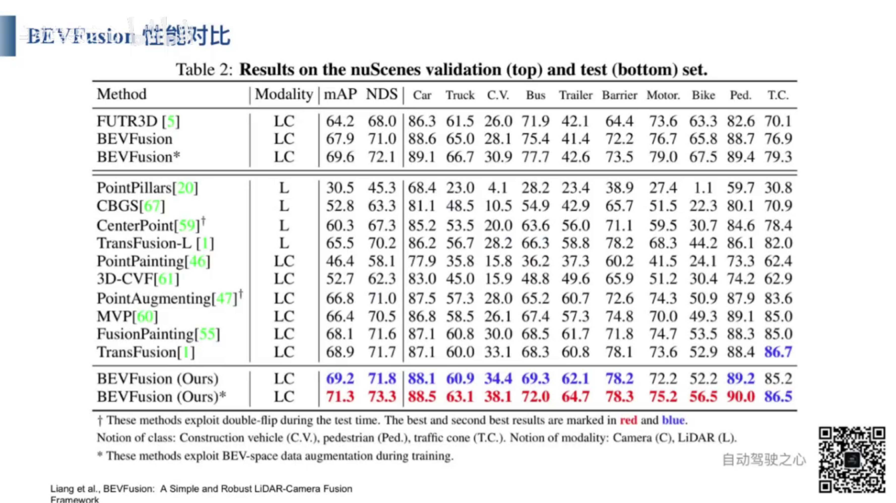

 

 
1.  BevFusion は2つの主要な部分で構成されています。Bevは鳥瞰視点の空間を表し、Fusionはカメラ画像とライダー点群の統合などのマルチモーダルデータ融合を指します。
2.  BevFusionには3つの融合方法が含まれています。
3.  点レベルの融合：LiDARの点群データからサンプリングポイントを抽出し、カメラの内部パラメータと外部パラメータを使用して、画像に投影します。その後、画像の特徴を抽出し、点群と結合します。融合後の点群特徴を用いて3D検出を行います。
4.  特徴レベルの融合：マルチモーダルの特徴データを内部パラメータと外部パラメータを用いて投影、結合し、Query　クエリを通じて情報を伝達します。
5.  点レベル融合と特徴レベル融合の欠点
6.  どちらの方法も、LiDar点群の点をカメラの内部パラメータと外部パラメータを使用して、画像平面に投影し、特徴を抽出します。
7.  カメラの内部パラメータは工場出荷時に固定され、変更されません。一方、カメラの外部パラメータは、カメラ座標系とLidar座標系間のマッピング関係を決定します。
8.  画像が不鮮明であたっり、点群の座標データが不正確な場合（例えば、センサーのカリブレーション誤差や外部パラメータの誤差がある場合）、マッピングが失敗する可能性があります。
9.  点レベル融合と特徴レベル融合どちらもLiDARの点群データを基準にしています。そのため、LiDARのデータが不正確だと3D検出の結果も不正確になります。この方法では、LiDARデータが主であり、カメラデータは補充的な役割を果たします。
10. BevFusionは、CameraNetoworkとLidarNetworkを通じてそれぞれ特徴を抽出し、その後、抽出した特徴を融合します。直接的なマッピングは行わず、主従関係がありません。
11. BevFusionには3つの３D検出ヘッドがあります。融合後の特徴に基づく３D検出ヘッド。LiDAR特徴に基づく３D検出ヘッド。画像特徴に基づく３D検出ヘッド。
12. 画像特徴とLiDar特徴は、それぞれ独立して動作することも、統合して動作することも可能です。
    
 

   
   
1. 画像処理フロー：　入力：マルチビュー画像。出力：画像のBEV空間の特徴。
2. まず、画像特徴抽出ネットワークを使用してマルチビュー画像を処理します。次に、抽出されたマルチビュー画像特徴を2dから３ｄに変換します。その後、3d画像特徴をBEV空間にエンコードし、マルチビュー画像のBEV空間の特徴を取得します。
3. 画像のBEV空間の特徴によって、３D物体検出を行うことができます。
4. 点群処理フロー：　入力：点群データ、出力：点群のBEV空間の特徴
5. まず、点群特徴抽出ネットワークを使用して、点群BEV空間特徴を取得します。一般的な点群特徴抽出ネットワークには、PointNet、PointNet＋＋、VoxelNet、PointPillarなどがあります。
6. 点群のBEV空間特徴によって、３D物体検出を行うことができます。
7. BEVFusionは画像のBEV空間特徴と点群のBEV空間特徴を融合し、融合したBEV空間特徴を基づいて、３D物体検出を行うことができます。
8. BEVFusionはマルチモーダル３D物体検出をサポートだけではなく、シングルモーダルの３D物体検出もサポートしています。例えば、画像のBEV空間特徴に基づく３D物体検出や点群のBEV空間特徴に基づく３D物体検出も可能です。

  
 
1. 2D画像特徴抽出ネットワークを使用して、各視点の画像を処理する。
2. FPNとADPを用いてマルチスケール特徴融合を実施する。FPNは異なるスケールの画像特徴を抽出する。
3. 異なるスケールの画像特徴をADPで処理し、アップサンプリング、プーリング、畳み込みを行うことで、同じスケールの特徴を取得し、マルチスケール特徴融合を実現する。
4. ADPは適応変形メカリズムであり、異なる形状やスケールの物体に対応し、物体検出やセグメンテーションの精度を向上させる。
5. FPN＋ADPの設計プロセス、入力：異なるスケール画像特徴　出力：同じスケール融合した画像特徴。処理フロー：1　各層の画像特徴にADPモジュールを適用し、異なるスケール画像特徴から同じスケール画像特徴に変換できます。　2　ADPモジュールには、アップサンプリング、プーリング、畳み込みが含まています。　3　複数の層の画像特徴を融合する。
   

 
- ２Dから３Dへの特徴変換：２D画像の各ピクセルに対して深度予測を行い、離散的な深度予測確率を得る。
- 確率を重みとして画像特徴と掛け合わせることで、２D画像の３D空間を取得し、３D疑似（ぎじ）ボクセル特徴を形成します。
- 3D疑似ボクセル特徴の処理フロー：　入力：マルチスケール融合特徴。　出力：３D疑似ボクセル特徴。手順：1　深度分布推定を計算。2　２Dから３Dへの投影変換を行う。　3　３D疑似ボクセルを出力する。

  
- 3D疑似特徴から２D BEV特徴への変換が行う。
- 俯瞰（ふかん）ビューを利用して、３D特徴から２D　BEV特徴に圧縮（あっしゅく）する

 
- 点群ブランチは３D点群特徴を直接圧縮して、２Dの点群BEV特徴を得る。
- 一般的な３D点群特徴抽出ネットワークには、PointNet、PointNet＋＋、　VoxelNet、PointPillar、CenterPoint,　Transfusionなどがある。

 
- 現在見ているのは３D点群特徴抽出ネットワーク　PointPillarの構造図。
- 点群空間を複数の柱（ピラー）に分割し、それぞれの柱に含まれる点の特徴をその柱の特徴として利用する。
- 点群空間をD＊P＊N次元のベクトルに分割する。ここで、Dは1つの点の特徴の次元数（9次元）。Nは1つの柱に含まれる点の最大数です（100）。　Pは空間全体の柱の総数（12000）
- Dは9次元のベクトルです、各成分は以下の通り：ｘ、ｙ、ｚ：点の座標。　ｘｃ、ｙｃ、ｚｃ　柱の中心点の座標。　ｘｐ　ｙｐ　点が柱中心点からの偏移。　ｒ　は反射強度
- Pは通常12000、1つの３D空間を12000の柱で表現する。
- Nは通常100、1つの柱には最大100点を含まれている。
- D＊N＊P次元のベクトルをP＊C次元のベクトルに圧縮する。つまり、３D空間をP個柱に分割して、各柱をC次元のベクトルで表現する。
- PointPillarの入力データは３D点群データ、出力はH＊W＊C次元の疑似画像特徴。
  

 

 
- Fusionモジュールの入力　画像ＢＥＶ特徴と点群ＢＥＶ特徴　出力　融合した特徴
- 点群BEV特徴と画像BEV特徴をチャネル次元で連結して、その後畳み込みネットワークにっよて連結後の特徴を抽出する。
- グローバル平均プーリングと畳み込みによる予測を用いて、連結特徴の適応的な選択を実現する（チャンネル注意機構）　
- ネットワークが自動的に画像BEV特徴と点群BEV特徴の重みを割り当てる。

 
 
- MIT BEVFusion
- 
 
 
 
 
 

https://www.bilibili.com/video/BV1ix4y1f7mX/?spm_id_from=333.337.search-card.all.click&vd_source=f806e1845ce32bd171eeadf5991dc371

