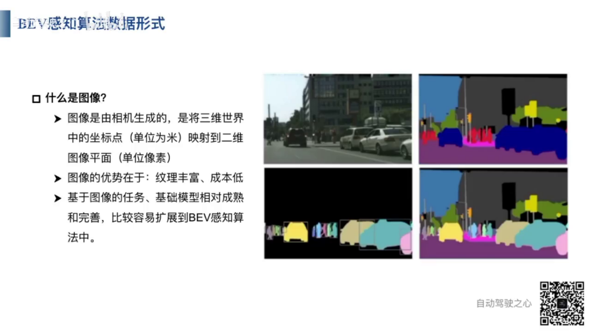

 

 

 
1 从MultiCamera图像去学习BEV 特征
2 通过SpatialTemporalTransformer（空间时序Transformer）来学习Bev特征

1 From the Image of MultiCamera, through learning, get the Bev Feature.
2 Base on SpatialTemporalTransformer, a kind of Spatial and Temporal Transformer, get the Bev Feature.

1 MultiCamera画像からBEV特徴を学習する
2 空間時系列Transformerを使ってBEV特徴を学習する。

 

什么是BEV特征空间
1 它是一个重构空间，是现实中不存在的空间，不能通过传感器直接获取，但是可以通过技术手段获得。
2 它是一个多传感器融合的空间，包括Camera，Lidar，Radar等。
3 它是一个固定视角的空间，通常是俯视视角，即所谓的鸟瞰图。

what is Bev Feature space
1 it is an reconstruction space, not exist in reality and can not be directly obtained by sensor, but can be acquired through technical method.
2 it is a multi sensor fusion space, include Camera, Lidar, Radar, Ultrasonic Wave etc
3 It is a fixed viewpoint space, typically a top-down viewpoint, also known as a bird's eye view.

BEV特徴空間とは
1　それは再構築空間であり、現実には存在しない空間で、センサーを通じて直接取得する事ができない、技術的な手段によって得る事ができます。
2　それはカメラ、ライダー、レーダー等を含む多種のセンサー融合空間です。
3　それは固定視点の空間で、通常は俯瞰視点、いわゆるバードアイビューです。

 
什么是Transformer
1. 其实就是视觉注意力，突出强调视觉中的重要部分。
2. 例如在一辆车的图片中，车辆的车标就是一个重要部分。可以通过车标判断车辆的品牌。

What is transformer
1. It is essentially virtual attension, which emphasize the important parts in the visual input.
2. for example, in an image of a car, the car's logo is an important part, which can be used to determine the brand of the car.

Transformerとは何か
1．實際は視覚的注意であり、視覚入力の中で重要な部分を強調するものです。
2　例えば、車の画像の中で、車のログは重要な部分です。ログを通じて車のブランドを判断することができます。

 

 

 

 
1. 输入是6个摄像头的图像数据，输出是目标检测头和目标分割头
2. 目标检测： 对图像中的对象进行分类，使用目标检测框对目标进行分类和定位。颜色表示分类，位置表示定位。
3. 目标分割： 对图像中的每个像素进行分类，相同类型的像素使用相同颜色来表示。
4. 图像特征提取BackBone采用常用的特征提取网络，例如 ResNet

1. In the model level, the input of the BEVFormer is the image of the six camera, the output is object detection head and object segmentation head.
2. Object detection: classify the object in the image, using the detection box to classify and locate the object. The color of the detection box represent the object class, and position represent the location.
3. Object Segmentation: classify each pixel in the image, with pixeles of the same object are represented by the same color
4. Image feature extraction BackBone use commonly used feature extraction neural network, for example ResNet.

1. 入力は6つのカメラの画像データ、出力は物体検出ヘッドと物体セグメンティションヘッドです。
2. 物体検出　画像内のオブジェクトを分類し、物体検出ボックスを使用してオブジェクトを分類及び位置決めします。色はオブジェクト分類を、位置はオブジェクト位置を決めします。
3. 

 
1. Transformer 的输入也包含3个来源： 1 图像提取网络得到的特征。 2 BEV空间上的历史BEV特征。 3  Bev query 
2. Tranformer 的输出是当前时刻的BEV特征
   

 
 
 
 
 
 
 
 
 
 
 
 
 
 
 
 
 
 
 
 
 
 
 
 
 
 
 
 
 
 
 
 
 
 
 
 
 
 
 
 
 
 
 
 
 
 
 
 
 
 
 
 
 
 
 
 
 
 
 
 
