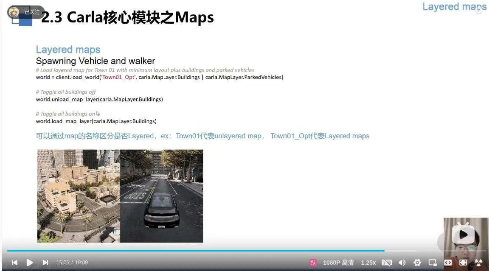
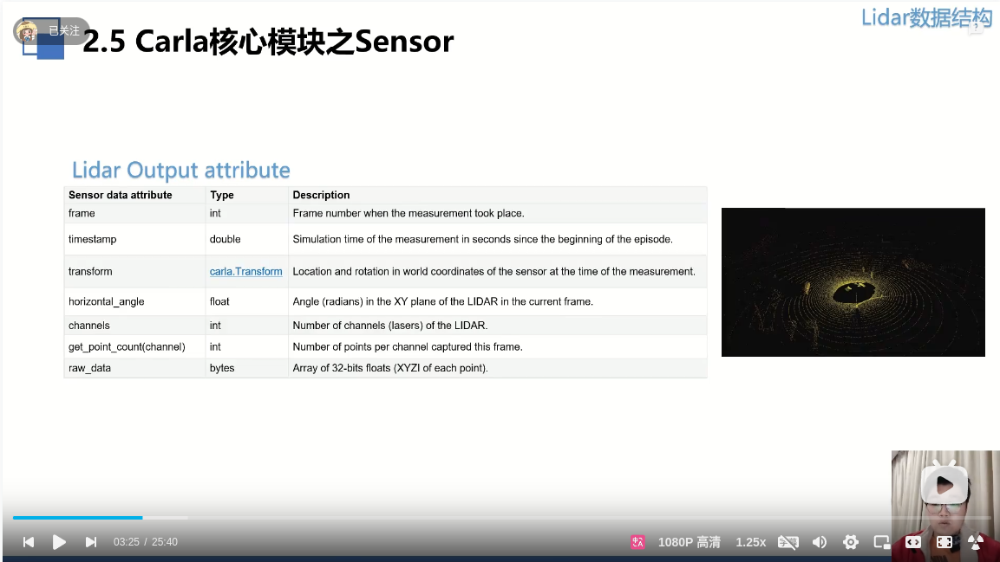
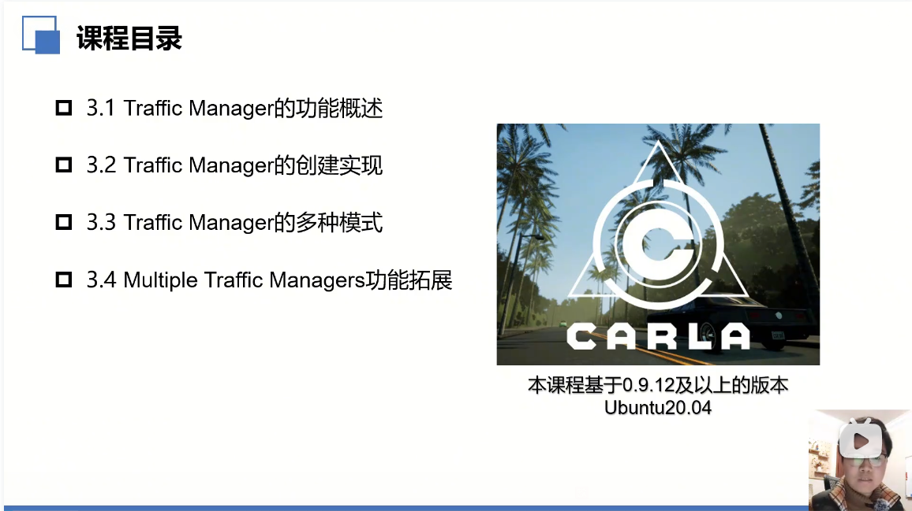

- one actor lifetime contains three parts, spawn, handle and destory.
- when spawn an actor, at least two parameters are needed, blueprint and location.
- when set the actor location, it should not be conflict with other actors in the word.
- when spawn an sensor actor, it should be attached to an vehicle actor.

- we can get the actor's attribute data by calling the actor's get_attribute() method.
- when the python script finish, the actor will not be destroyed automatically, you need to call the actor's destroy() method to destroy the actor.
  

- in the blueprint, all the attributes of actors are stored in the actor's properties.
- first, we get all the actors's blueprints, second, we get one of the buleprint filter by the actor's attribute. third, we get the actor's properties.
  

- detector is used to detect the event which is not happed in period of time.
- camera and other sensor is ouput the data in the period of time.

- this is the data specification of the lidar sensor ouput data.

- this is the configuration of the lidar sensor.

- there 22 kinds of semantic label in the camera semantic map.
- use different color to represent different semantic label.
- 

- scan the whole scene, trackint all the actors, including the car and pedestrains.
- delete the actors which is in invalid status
- Agent Lifecycle and State Management(ALSM) it the only component in traffic manager, which can subscribe data from the carla server
- vehicle registry: store the actor list, including vehicle and pedestrains.
- simulation state: store the state attribute data of the vehicle and pedestrains, including the vehicle's speed, position, rotation, etc.
- 

- traffic manager can be seemed as a simple autopilot.
- the movement of every vehicle's autopilot is calculated independently, including five stages.
- control loop: every control loop is used to garantee that all the vehicle's state is synchronized. 
- until the current stage of all the vehicles are calculated, control loop will enter the next stage.

- localization: the driving trajectory of each vehicle, the nearest waypoint selected from the map, if in the crosspoint, select one randomly
- Collision: along with the trajectory, construct the bounding box continuously, detect the collision between the vehicle and the other vehicle.
- Traffic Light: based on the state of the traffic light, stop sign, and the priority in the crosspoint, decide whether to stop or not.
- Motion Planner: based on the trajectory, construct the motion planner, and calculate the acceleration and velocity of the vehicle.
- PBVT: Path Buffers & Vehicle Tracking:save and maintain the trajectory of the vehicle, and calculate the distance between the vehicle and the other vehicle.

https://www.bilibili.com/video/BV1zmCTYKEgt/?spm_id_from=333.337.search-card.all.click&vd_source=f806e1845ce32bd171eeadf5991dc371

