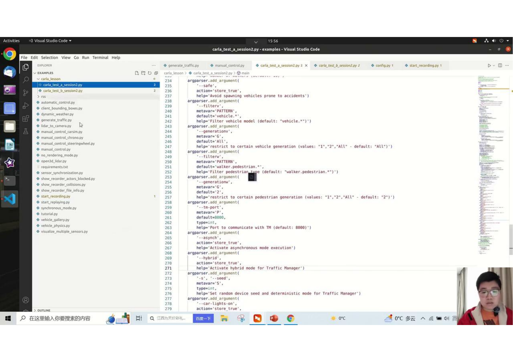

- Carla 核心模块主要包括以下4个部分。
- World and Client
- Maps and Navigation
- Actors and Blueprints
- Sensors and Data

 
- 课程首先回顾了上堂课介绍的CARLA 服务基本架构与机制，强调其基于新冠四引擎构建的仿真场景，可视为本地服务器。
- 前回、Carlaのサービスと基本アーキテクチャを紹介されました、UE4エンジンに基づいてシミュレーション環境を構築されました、ローカルサーバーとして機能する
  
- 通过脚本启动Color服务，可对仿真环境进行配置与功能开发，每个客户端（terminal）可独立控制天气、交通管理或车辆传感器等。
- スクリプトを使用してCarlaを起動することで、シミュレーション環境の設定や機能開発が可能になります。各クライアント（ターミナル）は天候、交通管理、車両センサーを個別に制御できます。
  
- Word模块从宏观角度讲解了对仿真环境进行配置操作的可能性，包括读取世界地图、获取地图层级数、天气状况配置等。
- Worldモジュールでは、シミュレーション環境の設定操作の可能性をマクロな視点で解説します。具体には、ワールドマップの読み込み、マップのレイヤー数を取得、天候設定などが含まれます。
  
- 客户端构造后，通过调用Word进行各种操作，如实现Blue Print，说明了客户端与Word之间的关系及其在脚本中的实现步骤。
- クライアントを構築した後、Worldを呼び出し様々な操作を実行できます。例えば、Map、天候、BluePrintなどのデータを取得する。

 
- 本次讨论将聚焦于两个典型的脚本：一个是menu control，另一个是generate traffic，我们将在这些脚本的基础上进行一些改动，以使大家更好地理解和使用。
- 今回の議論では、2つの典型的なスクリプトに商店を当てます。1つはManuControl。もう1つはGenerateTrafficです。

 

 

 

 

 

 

 

 
- 首先，客户端需要读取一些参数，用来是Client连接上Carla服务器。 包括Carla服务器的IP地址及对应的端口号
- まず、クライアントはCarlaサーバーに接続するために、いくつかのパラメータを読み取る必要があります。これには、CarlaサーバーのIPアドレスと対応するポート番号が含まれます。

- 客户端通过 world.LoadMap 来实现地图更换。
- クライアントはworld.LoadMapを使用してマップｄの切り替えを実行します。

 

 

 

 
1 通过Client 的 WeatherParameter 可以设置Carla的天气状况，主要包括以下参数：云量，降水量，风的强度，雾，大气散射度等。
1　ClientのWeatherParameterを使用すると、Carlaの天候を設定できます。主なパラメータには、雲量、降水量，風の強さ、霧、大気散乱度などがあります。

 

 
2 Carla预先定义了一些典型的天气，例如：晴的白天，多云的白天，大雨的白天，大雨的夜间等。
2　CARLAには、いくつかの典型的な天気が事前に定義されています。例えば、晴れの昼、雲の昼。大雨の昼、大雨の夜などがあります。

 
0 在Carla中，服务器和客户端的通信有2种模式，同步模式和非同步模式。
0　Carlaでは、サーバーとアイアンとの通信には2種類のモード、同期モードと非同期モードがあります。

1. 在模拟器中，通过一个小车沿轨迹行走并持续拍照的场景，解释了同步模式与非同步模式的概念。
1　シミュレーターでは、車両が軌跡に沿って走行しながら連続的に写真を撮影するシーンを通じて、同期モードと非同期モードの概念を説明します。

2　小车上的相机传感器持续拍摄并将图片存储至硬盘，这一过程由客户端脚本文件控制。
2　車両に搭載されたカメラセンサーは継続的に撮影を行い、画像はハードディスクに保存されます。このプロセスはクライアントのスクリプトによって制御されています。
　
3. 非同步模式下，服务端（service）不管理客户端（silent）的状态，即使客户端处理图片较慢，服务端仍会持续发送图片，可能导致图片处理的失真和丢帧现象。
3　非同期モードでは、サーバーはクライアントの状態を考慮しません。たとえクライアントが画像処理を遅く行っても、サーバーは画像の送信を続け、これが原因で画像処理の歪（ひずみ）やフレームの欠落（けつらく）が発生する可能性があります。

3. 同步模式通过设置固定的时间间隔（例如0.05秒），确保服务端在收到客户端处理完成的反馈后才发送下一张图片，避免了丢帧问题，提高了数据处理的准确性。
4　同期モードでは、一定の時間間隔（例えば0.005秒）を設定することで、サーバーはクライアントからの処理完了のフィードバックを受けてから次の画像を送信するようになり、フレームの欠落を防ぎ、データ処理の正確性が向上します。

4. 在word设置中，通过将同步模式设置为true，并配置fixed seconds参数为固定值，可以实现同步模式的运行。同步模式尤其适用于使用传感器的场景，以确保数据处理的连贯性和完整性。
4　Worldの設定では、同期モードをTrueに設定し、固定値の秒数パラメータを設定することで、同期モードを実行できます。同期モードは特にセンサーを使用するシーンに適しております、データ処理の一貫性と完全性を確保します。

5. 非同步模式下，虽然也可以设置更新频率，但其实际运行速度可能因系统性能波动而变化，不如同步模式稳定和可控。
5　非同期モードでは、更新頻度を設定することもできますが、システムの性能の変動により實際の動作速度が変わる可能性があり、同期モードほど安定しておらず、制御が難しいことがあります。

 
1. 引入了两个重要的Word功能：观察者功能和record replay功能。
1 2つの重要なWorld機能が導入されました。オブザーバ機能とレコード再生機能。

2. 观察者功能用于在仿真环境中，专注于跟踪实现自动驾驶的车辆（Egocar），通过更新观察者视角来实时追踪此车辆的位姿。
2　オブザーバ機能は、シミュレーション環境内で自動運転車を追跡することに焦点を当て、オブサーバ視点を更新することによって、この車両のポーズをリアルタイムで追跡します。

3. record replay功能允许记录和回放仿真过程，可以设定记录所有有用信息或仅记录关键信息，通过start和stop操作控制记录过程。
3　レコード再生機能は、シミュレーションのプロセスを記録及び再生することを可能にし、すべての有用（ゆうよう）な情報を記録するか、または重要な情報のみを記録する事ができます。記録波、startとstop操作によって制御されます。

4. 在仿真环境中生成异构car，这是实现自动驾驶车辆仿真跟踪和数据记录的基础步骤。
4　シミュレーション環境で車両を生成することは、自動運転車両のシミュレーショントラッキングとデータ記録の基本的なステップです。

5. 通过设定replay文件路径、开始时间、持续时间以及log ID，可以实现对之前记录的仿真过程的完全回放。
5　再生ファイルのパス、開始時間、継続時間、ログIDを設定する事により、依然記録されたシミレーションプロセスを完全に再生することができます。　

 

 

 

 

