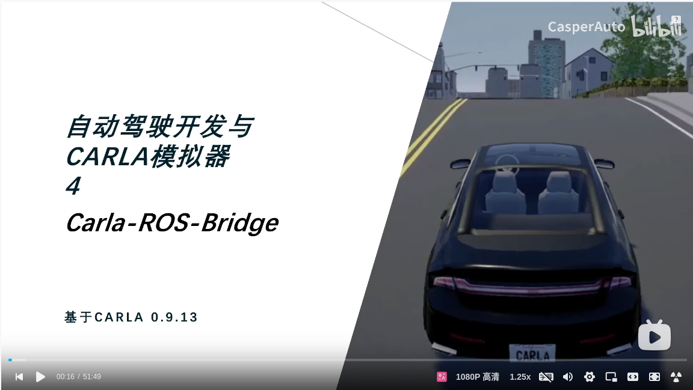

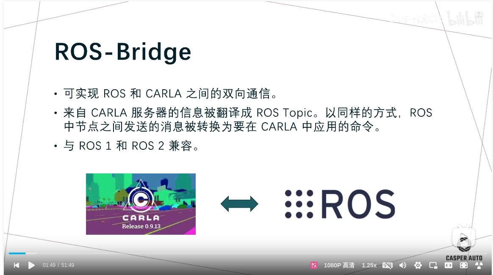

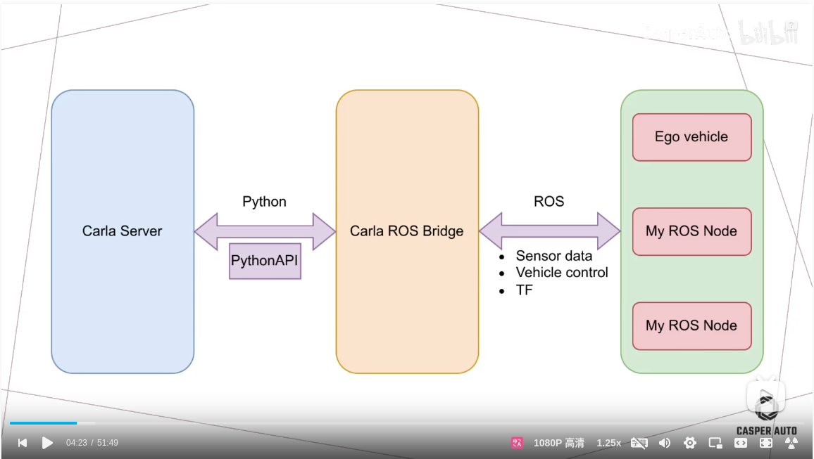

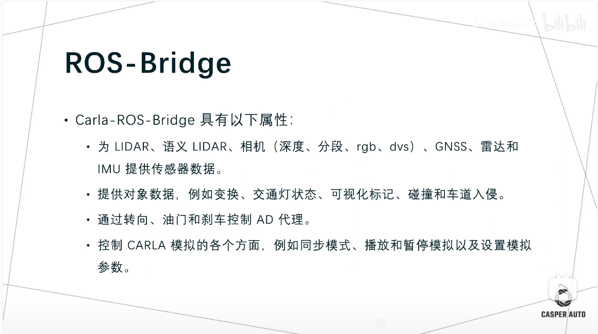

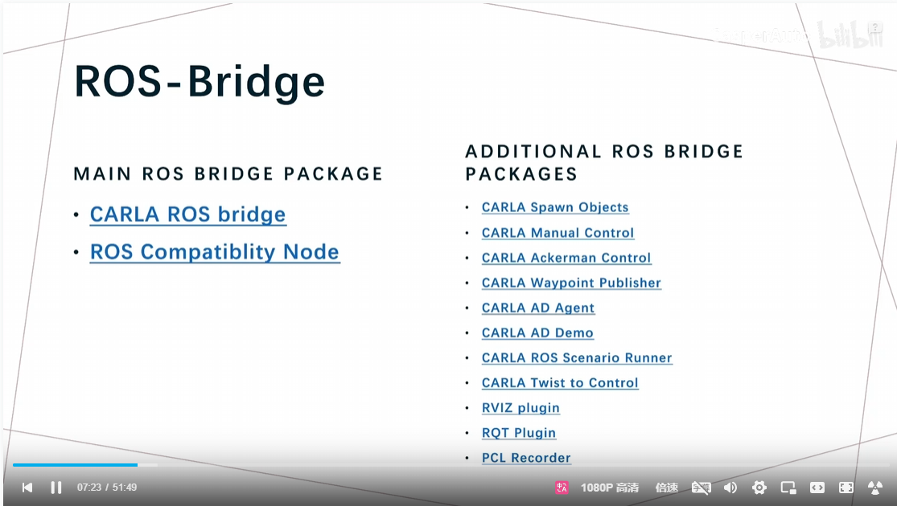

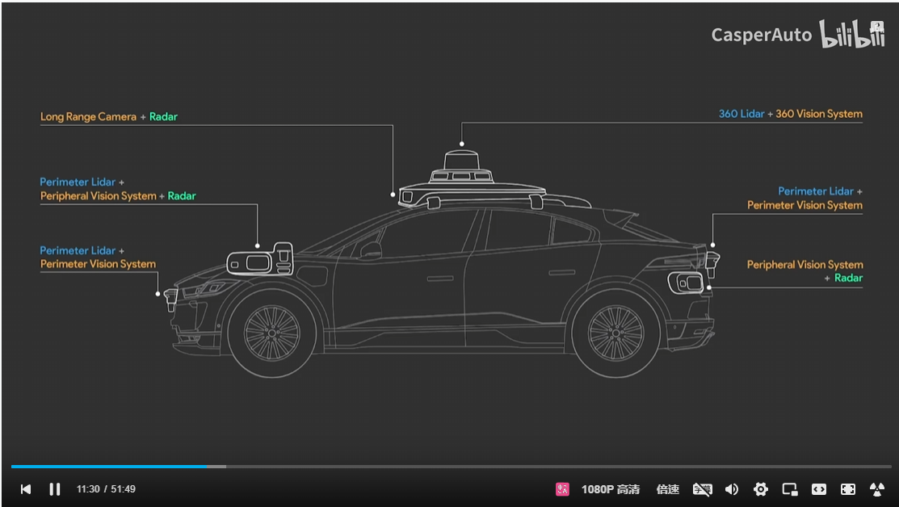

- pseudo sensor, not exist in the real world. for example, the collision sensor, the lane invaset sensor.
- 

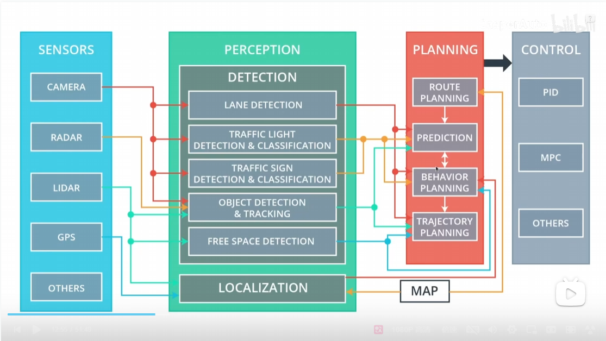

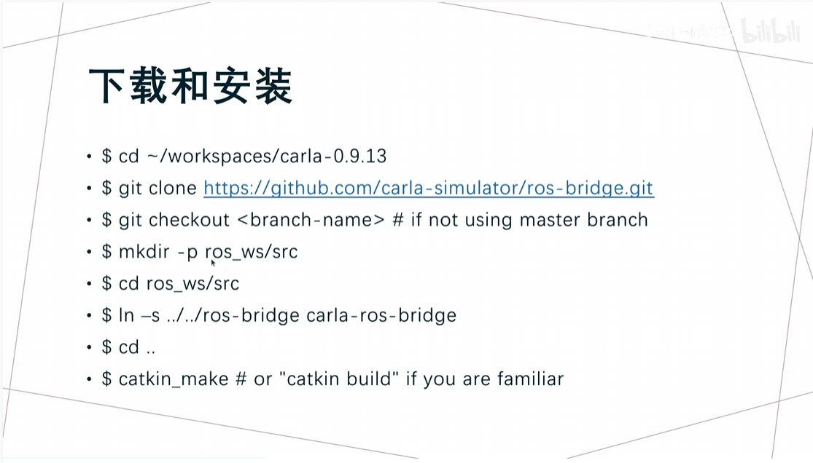

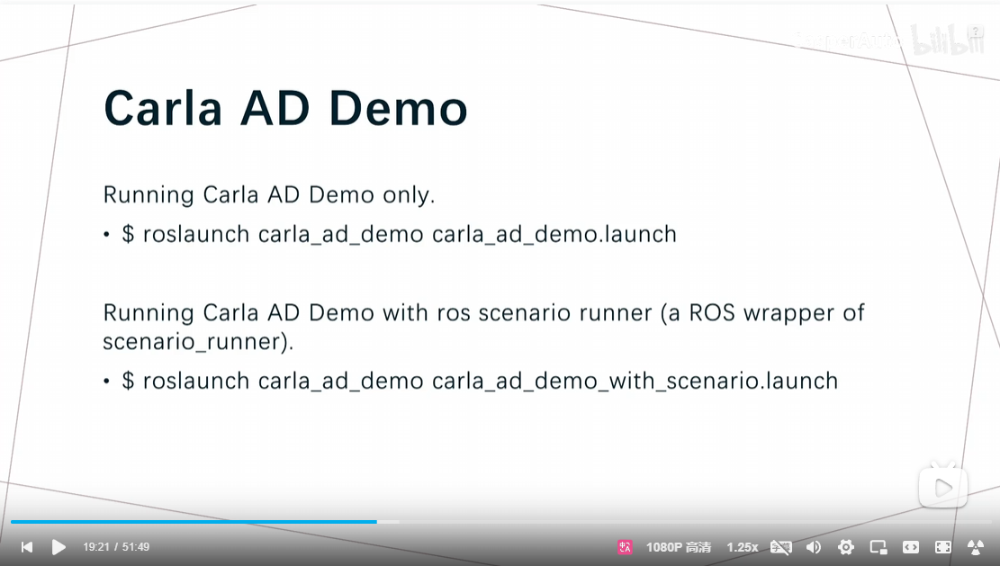

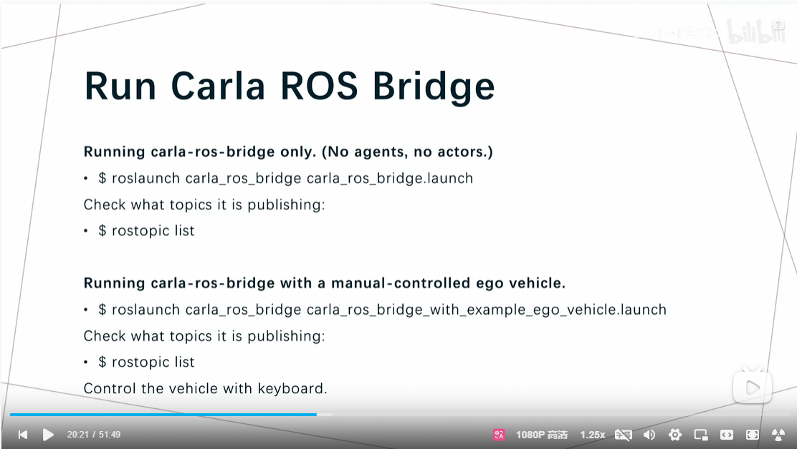

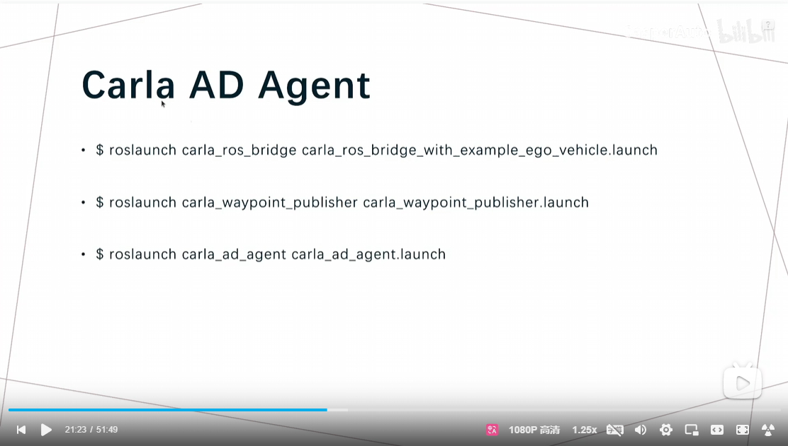

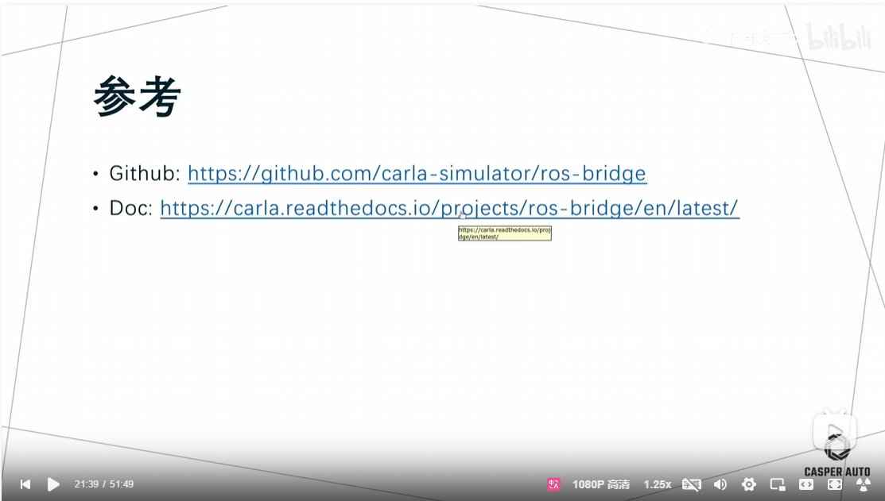
- https://github.com/carla-simulator/ros-bridge
- https://carla.readthedocs.io/en/0.9.13/ros_documentation/

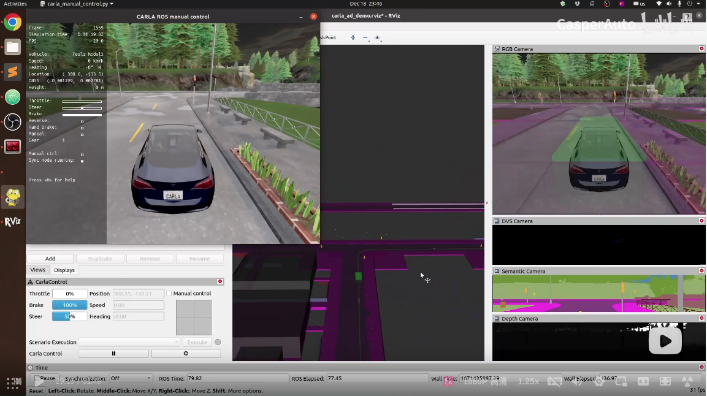

#carla
export CARLA_ROOT=/home/kotei/huqianqian/software/CARLA_0.9.13
export SCENARIO_RUNNER_PATH=/home/kotei/huqianqian/software/CARLA_0.9.13/scenario_runner-0.9.13
export PYTHONPATH=/home/kotei/huqianqian/software/CARLA_0.9.13/PythonAPI/carla/dist/carla-0.9.13-py3.7-linux-x86_64.egg:$PYTHONPATH
export PYTHONPATH=/home/kotei/huqianqian/software/CARLA_0.9.13/PythonAPI/carla/dist:$PYTHONPATH
export PYTHONPATH=/home/kotei/huqianqian/software/CARLA_0.9.13/PythonAPI/carla:$PYTHONPATH
source /home/kotei/huqianqian/software/CARLA_0.9.13/carla_ros_bridge/install/setup.bash
source /usr/share/colcon_cd/function/colcon_cd.sh
export _colcon_cd_root=/opt/ros/foxy/
source /usr/share/colcon_argcomplete/hook/colcon-argcomplete.bash

# 注意：以下操作都需要在 ~/carla-ros-bridge 中进行

# install ros_bridge on ros2
https://carla.readthedocs.io/projects/ros-bridge/en/latest/ros_installation_ros2/

0 启动Carla 服务器
  make launch

1 建立Carla 和 Ros 的关联

/home/kotei/huqianqian/software/CARLA_0.9.13/carla_ros_bridge

source ./install/setup.bash
ros2 launch carla_ros_bridge carla_ros_bridge.launch.py

2 在carla 中创建1辆车

# ROS 2
    ros2 launch carla_spawn_objects carla_spawn_objects.launch.py objects_definition_file:=path/to/objects.json
    
    ros2 launch carla_spawn_objects carla_spawn_objects.launch.py 
    
3 在Carla中控制生成的车

 # ROS 2
        ros2 launch carla_manual_control carla_manual_control.launch.py
	    
20240718_运行 scenario_runner

1 执行某个测试场景
FollowLeadingVehicle_1
	python3 scenario_runner.py --scenario FollowLeadingVehicle_1 --reloadWorld --output
	
VehicleTurningRight_1
	python3 scenario_runner.py --scenario VehicleTurningRight_1 --reloadWorld --output 

2 执行手动控制车辆
	python3 ./manual_control.py 
	
3 显示所有的场景

20240718_rosAgent

case1 
1 建立与carla 与 ros 的连接
	ros2 launch carla_ad_demo carla_ad_demo.launch.py 

2 读取rviz2 的配置文件
 	rviz2 -d /home/ubuntu/huqianqian/software/CARLA_0.9.13/carla_ros_bridge/src/ros-bridge/carla_ad_demo/config/carla_ad_demo_ros2.rviz

3 生成一条路径

case2
1 建立与carla 与 ros 的连接，并创建一条示例车辆
  ros2 launch carla_ad_demo carla_ad_demo_with_scenario.launch.py 	
2 发布一条全局路径
	
3 自动驾驶测试

   

https://www.bilibili.com/video/BV1m24y1D7wW/?spm_id_from=333.337.search-card.all.click&vd_source=f806e1845ce32bd171eeadf5991dc371