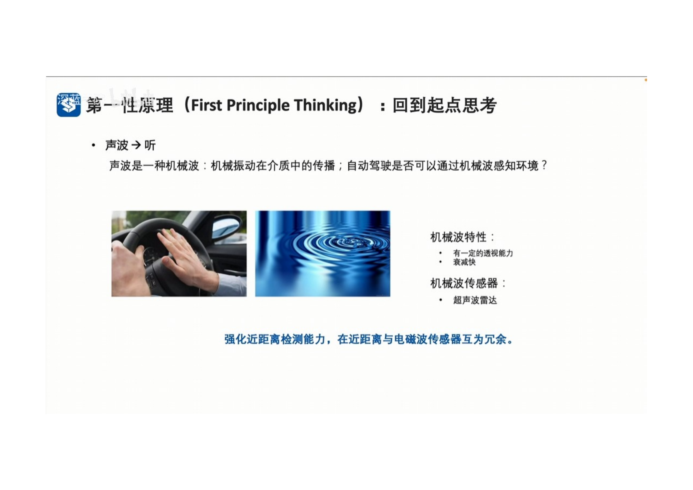
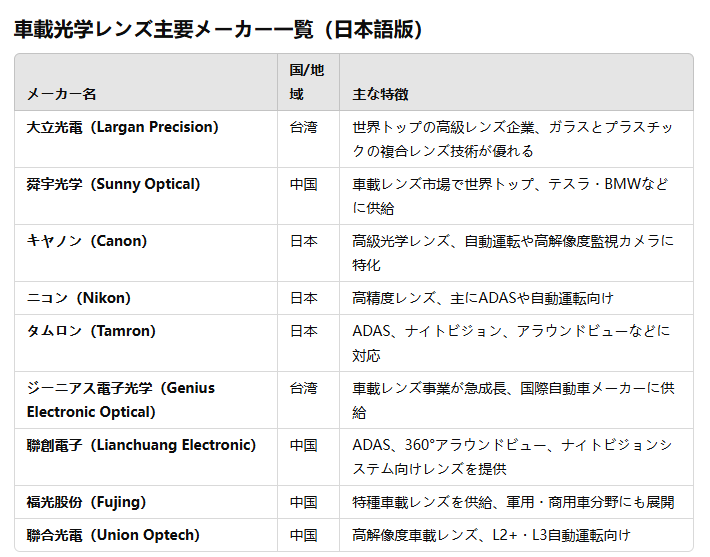
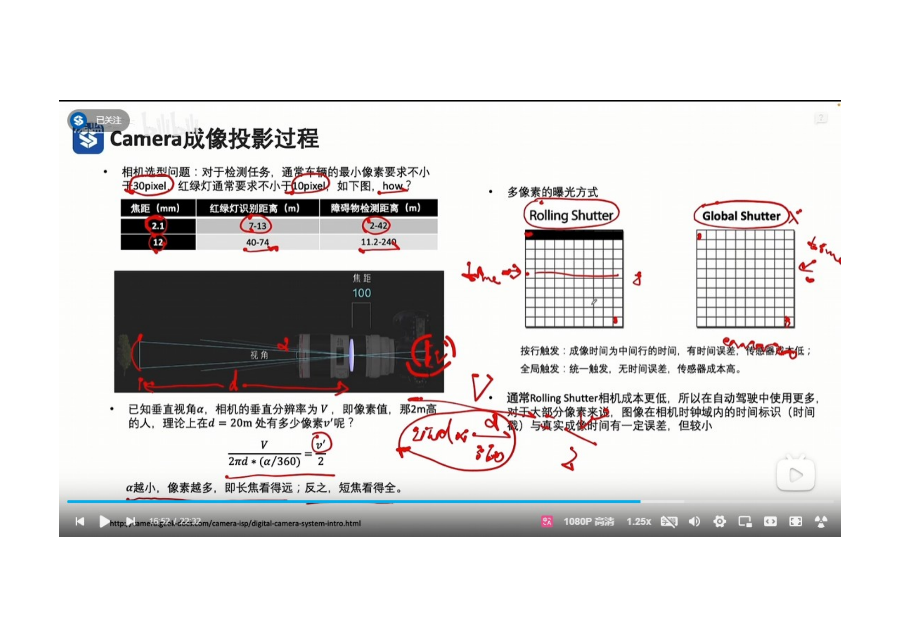
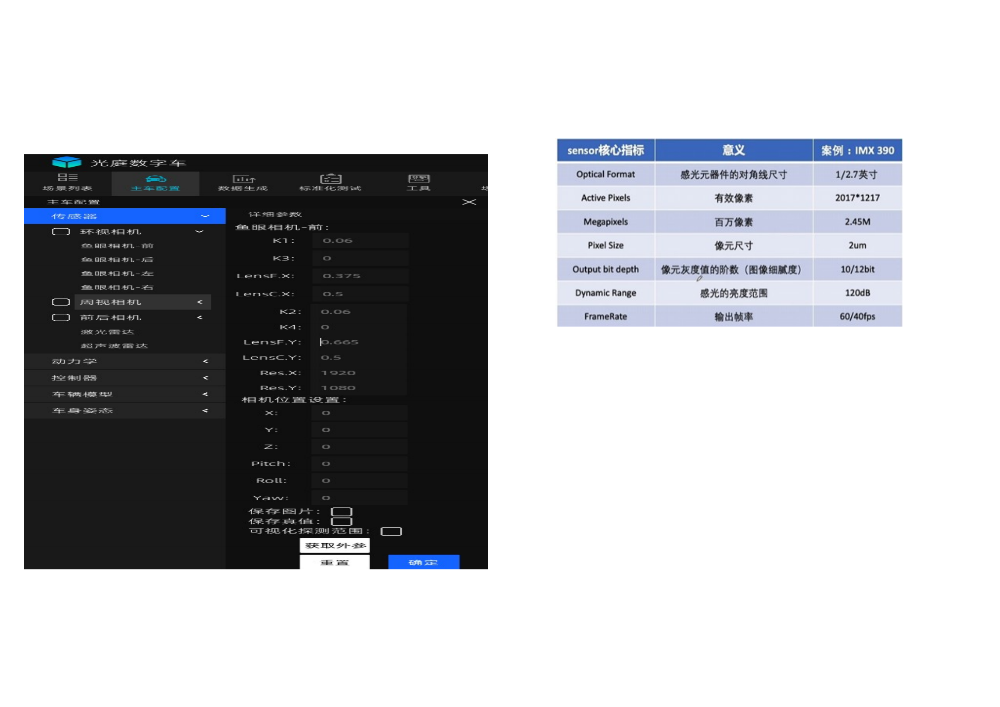

 
为什么环境感知需要不同类型的传感器
1. 不同类型的传感器具有不同的优点和缺点
    - Camera： 优点： 颜色细节丰富，适用于目标丰富。 缺点： 缺乏深度信息，依赖于光照条件。
    - LiDAR： 优点：完整的3D信息，都距离感知能力强。 缺点： 成本高，量产难度大，对雨水，灰尘敏感。
    - Radar： 优点：全天候工作，速度感知能力强，量产成熟。 缺点：高度和角度精度低，静止障碍物感知能力弱。
2. 一种传感器无法适配所有场景，需要出色的融合技术才能解决。

 
1 在自动驾驶中，常用的传感器有 Camera，Lidar， Camera 和 UltralSonic Radar
2 通常会配备多个不同类型的传感器融合使用。

 

 

 
1. 通过电磁波为介质，对环境进行观测。
2. 电磁波的特性。 短波：传播方向性好，检测精度高，但看不远。 长波：抗干扰能力强，看得远。
3. Lidar 激光，短波。 camera 可见光， 中波。 Radar 毫米波， 长波。
4. 多波段电磁波配合，互为冗余，可适配各种天气，光照条件，感知距离和精度的需要。

   
 

1. 机械波的特性， 有一定的透视能力。衰减速度比较块。
2. 超声波属于机械波。
3. 超声波雷达可以强化近距离检测能力，在近距离与电磁波传感器互为冗余。

 
1. 相机成像的特点： 1 光源来自于外部 2 3D的目标，成像在2D平面。
2. 清晰成像的约束： 相距大于1倍焦距，小于2倍焦距。
3. 视角由相距和传感器尺寸共同确定。 
4. 视角与焦距近似成反比关系。长焦镜头，视角小。 广角镜头，视角大。

 
1. 图像传感器，将光信号转换为电信号，通过ISP对电信号进行处理，然后输出得到数字图片。
2. 图像像素由图像传感器尺寸和像素尺寸直接确定。

- 在DigitalCar中，直接从三维场景获取照片，并没有对相机的CMOS和 ISP 进行模拟。
- 目前主流的CMOS系统提供商有

- 目前主流的光学镜头提供商有
  

 
1. 对于检测任务通常车辆的最小要求为不小于30像素，对于红绿灯的最小要求为不小10像素。
2. 像素的曝光方式由 Rolling Shutter 和 Global Shutter。自动驾驶的相机传感器一般采用的是 Rolling shutter曝光模式。

 
Camera Sensor 的核心指标： 
1 Optical Format: 感光元器件的对角线尺寸。 
2 Active Pixel 有效像素的个数。 
3 MegaPixels: 百万像素的大小。 
4 PixelSize 像素的实际尺寸。 
5 OutputBitDepth 像元灰度值的阶数 
6 DynamicRange 感光的亮度范围 
7 FrameRate 输出帧率

車載カメラの出力フレームレート（FPS）
車載カメラの出力フレームレート（FPS）は、用途や機能要件によって異なります。以下は主要な車載カメラの一般的なフレームレート範囲です。

   
 
1. Camera 是一个被动传感器，其光源来源于外部。
2. 将3D物体，映射到2D像平面上，丢失了深度信息。
3. Camera 采用 Rolling Shutter， 成像时间有误差。
   

 
- 鱼眼相机参数 LensF.x LensF.y 分别是水平方向焦距 和 垂直方向焦距
- 鱼眼相机参数 LensC.x LensC.y 分别是光心所在的 x， y 坐标。
- 鱼眼相机参数 ResX， ResY 是成像平面的大小，例如：1920*1080像素
- 鱼眼相机参数 K1,K2，K3，K4 是用于将UE输出的平面图像转换成鱼眼相机环视图像的畸变参数。

 
