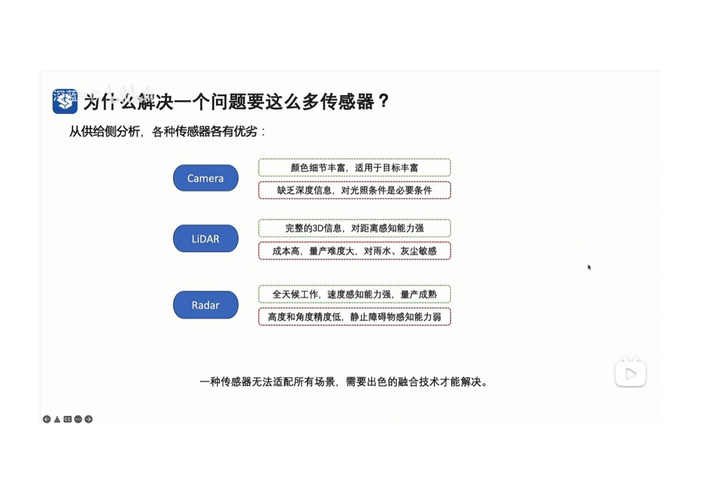 

1. 不同类型的传感器具有不同的优点和缺点
    - Camera： 优点： 颜色细节丰富，适用于目标丰富。 缺点： 缺乏深度信息，依赖于光照条件。
    - LiDAR： 优点：完整的3D信息，都距离感知能力强。 缺点： 成本高，量产难度大，对雨水，灰尘敏感。
    - Radar： 优点：全天候工作，速度感知能力强，量产成熟。 缺点：高度和角度精度低，静止障碍物感知能力弱。
2. 一种传感器无法适配所有场景，需要出色的融合技术才能解决。

English
1. different types of sensors have different advantages and disadvantages
   - Camera: Advantages: rich color details, suitable for diverse targets. Disadvantages: lack of depth information, dependent on lighting conditions.
   - Lidar: Advantages: Complete 3D information, strong distance perception capability. Disadvantages: High cost, difficulty in mass production, sensative to rain and dust.
   - Radar: Advantages: Works in all weather conditions, strong speed perception capability, mature mass production. Disadvantages: low height and angle accuracy, weak perception of stationary obstacles.
2. one sensor can not adpot to all scenarios, and excellent fusion technology is required to address this.

日本語
1. 異なるタイプのセンサーには、それぞれ利点と欠点があります
   - Camera 利点:　色彩（しきさい）の詳細が豊富で、多様な対象に適しています。欠点；深度情報が欠けており、光の条件に依存しています。
   - Lidar　利点；　完全な３D情報、距離の感知能力が強い。欠点；高コスト、量産が難しい、雨やホコリに敏感。
   - Rador　利点；　全天候で動作し、速度感知能力が強く、量産が成熟しています。欠点；高さや角度の精度が低く、静止物体の感知能力が弱い。
2. 1つのセンサーではすべてのシナリオに適応できないため、優れた融合技術が必要です。

 
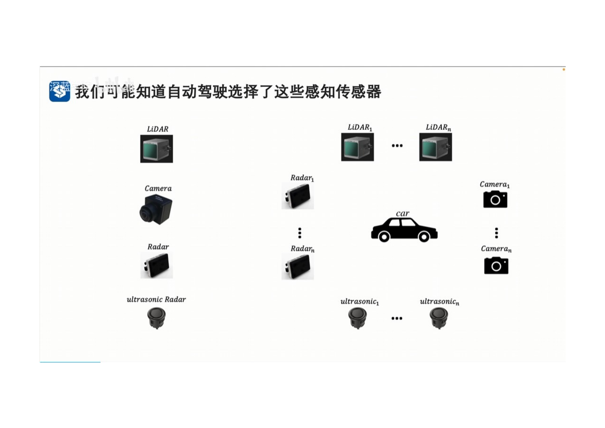 
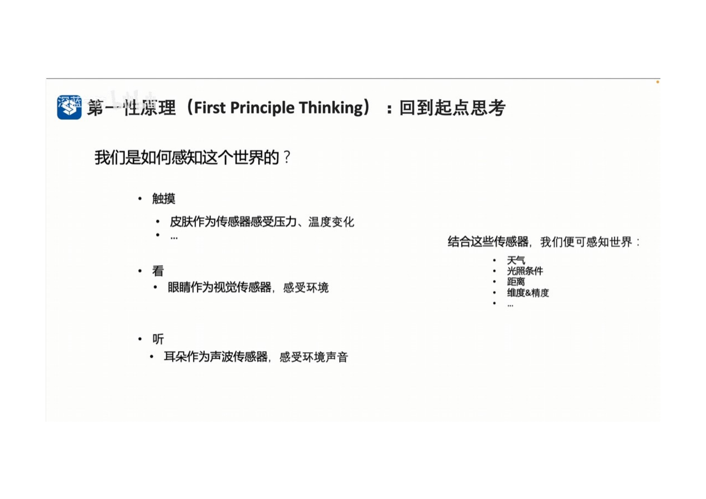 
 
1. 通过电磁波为介质，对环境进行观测。
2. 电磁波的特性。 短波：传播方向性好，检测精度高，但看不远。 长波：抗干扰能力强，看得远。
3. Lidar 激光，短波。 camera 可见光， 中波。 Radar 毫米波， 长波。
4. 多波段电磁波配合，互为冗余，可适配各种天气，光照条件，感知距离和精度的需要。
 
1. observe the environment using electromagnetic waves as a medium.
2. characteristics of electromagnetic waves:
   - short waves: good propogation directionality and high detection accuracy, but limited range.
   - long waves: strong anti-interference capability and long detection range.
3. Lidar laser, short waves. Camera: visible light, medium waves. Radar: milimeter waves, long waves.
4. multi-band electromagnetic waves complement each other, providing redundancy and adaptability to various weather conditions, lighting conditions, perception range and accuracy requirements.
 
1. 電磁波（でんじは）を媒体（ばいたい）として環境を観測する
2. 電磁波の特性
    - 短波　伝播方向性が良く、検出精度が高いが、遠くまで見えない。　
    - 長波　干渉に強く、遠くまで見えます。
3. Lidar　レーザー　短波；　カメラ　可視光　中波；　Radar　ミリ波　長波
4. 複数の帯域（たいいき）の電磁波を組み合わせて冗長性（じょうちょうせい）を確保し、天候や光の条件、検知距離や精度の要求に適応できる。
   
 

1. 机械波的特性， 有一定的透视能力。衰减速度比较块。
2. 超声波属于机械波。
3. 超声波雷达可以强化近距离检测能力，在近距离与电磁波传感器互为冗余。

 
1. characteristics of machanical waves: they have a certain level of penetration ability but attenuate quickly.
2. ultrasonic wave is a kind of machanical wave.
3. ultrasonic radar can enhance short-range detection capability and provide redundancy with electromagnetic wave sensor at short range detection.

  
1. 機械波の特性、ある程度の透過（とうか）能力が持つが、減衰が早い。
2. 超音波は機械波に属する。
3. 超音波レーダーは近距離検出能力を強化でき、近距離に置いて電磁波センサーと相互に冗長性を持つ。

 
1. 相机成像的特点： 1 光源来自于外部 2 3D的目标，成像在2D平面。
2. 清晰成像的约束： 相距大于1倍焦距，小于2倍焦距。
3. 视角由相距和传感器尺寸共同确定。 
4. 视角与焦距近似成反比关系。长焦镜头，视角小。 广角镜头，视角大。

 
1. characteristics of camera imaging: 1 the light source come from an external source. 2 3D objects are projected onto 2D plane.
2. constraints for clear imaging: the distance shoud be greater than 1x focus length and be smaller than 2x focus length.
3. the field of view is approximatelly inversely proportional to the focus length. Telephoto lens: small fov. wide-angle lens: large fov.

 
1. カメラのイメージング特性　１光源は外部からのもの　２３Dの対象は２Dの平面に投影される。
2. 鮮明（せんめい）なイメージングの制約　距離は焦点距離の１倍以上、２倍未満であること。
3. 視野角は焦点距離とおおよそ反比例（はんぴれい）の関係にある。望遠レンズ　視野角がちっさい。　広角レンズ　視野角が大きい。
 
1. 图像传感器，将光信号转换为电信号，通过ISP对电信号进行处理，然后输出得到数字图片。
2. 图像像素由图像传感器尺寸和像素尺寸直接确定。

1. An image sensor convert optical singals to electrical singals, which are then processed by the ISP to produce a digital image output.
2. The pixel count of image is determined by image sensor size and pixel size.
   
1. イメージセンサーは光信号を電気信号に変換し、ISPが電気信号を処理した後、デジタル画像として出力する。
2. 画素数はイメージセンサーのサイズと画素のサイズによって直接決まる。
   
 
1. 对于检测任务通常车辆的最小要求为不小于30像素，对于红绿灯的最小要求为不小10像素。
2. 像素的曝光方式由 Rolling Shutter 和 Global Shutter。自动驾驶的相机传感器一般采用的是 Rolling shutter曝光模式。

    
1. for detection task, the minimum requirement is typically at least 30 pixels for vehicles and at least 10 pixels for traffic lights.
2. pixel exposure methods include rolling shutter and global shutter. autonomous driving camera sensors generally use the rolling shutter exposure modle.

 
1. 検出タスクに置いて、通常、車両の最小要件は30ピクセル以上、交通信号の最小要件は10ピクセル以上である。
2.  画素の露光方式にはローリングシャターとグローバルシャッターがある。自動運転のカメラセンサーは一般的にローリングシャター露光モードを使用している。

 
Camera Sensor 的核心指标： 
1 Optical Format: 感光元器件的对角线尺寸。 
2 Active Pixel 有效像素的个数。 
3 MegaPixels: 百万像素的大小。 
4 PixelSize 像素的实际尺寸。 
5 OutputBitDepth 像元灰度值的阶数 
6 DynamicRange 感光的亮度范围 
7 FrameRate 输出帧率

    
core specfication of camera sensor:
1. Optical format: the diagonal size of the photosensitive element.
2. Active Pixel: the number of effective pixels.
3. MegaPixels: the size in million pixels
4. PixelSize: the acture size of a pixel
5. OutputBitDepth： the number of gray levels in a pixel
6. DynamicRange: the range of the brightness that the  sensor can capture
7. FrameRate: the output frame rate

    
カメラセンサーの主要な仕様
1. オプティカルフォマット　感光素子の対角線のサイズ
2. アクティブピクセル　有効な画素の数。
3. メガピクセル　百万画素のサイズ
4. ピクセルサイズ　ピクセルの實際のサイズ
5. 出力ビット深度　画素の階調数。
6. ダイナミックレンジ　センサーが捉え（とらえる）られる明るさの範囲。
7. フレームレート　出力フレームレート

   
 
1. Camera 是一个被动传感器，其光源来源于外部。
2. 将3D物体，映射到2D像平面上，丢失了深度信息。
3. Camera 采用 Rolling Shutter， 成像时间有误差。
   
1. A camera is a passive sensor, with the light source come from an external source.
2. 3D object are projected onto a 2d image plane, resulting in the loss of depth information. 
3. The camera use rolling shutter model, leading to errors in the imaging time.

1. カメラは受動的なセンサーで、光源は外部からのものです。
2. ３Dの物体を２Dの画像平面にマッピングすると、深度情報が失われます。
3. カメラはローリングシャターを使用して、イメージング時間に誤差が生じます。

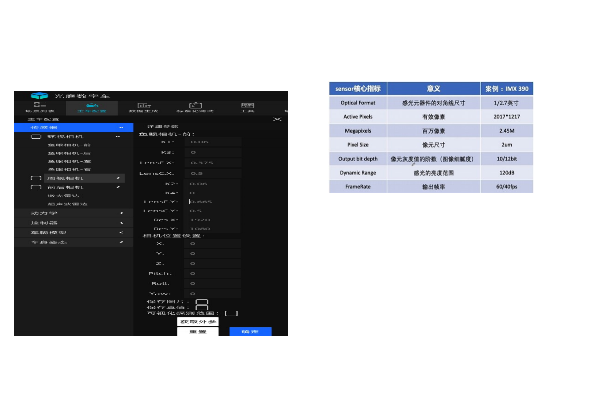 
 
 
 
 
 
 
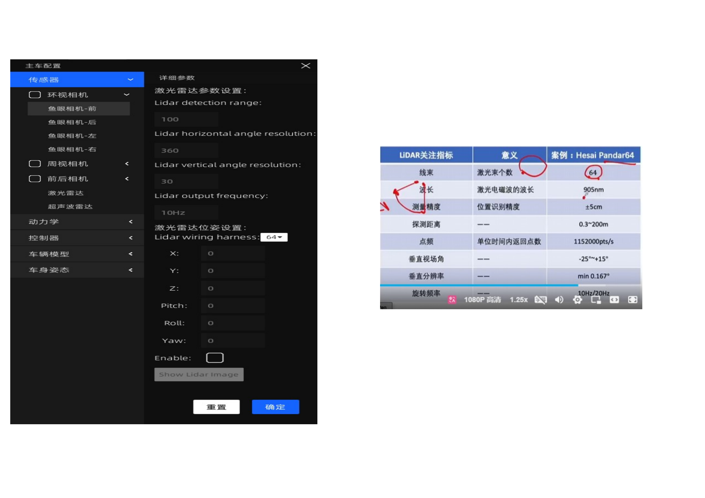 
 
 
 
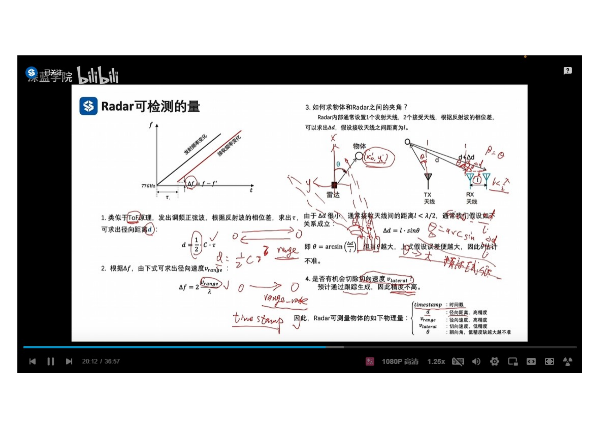 
 
 
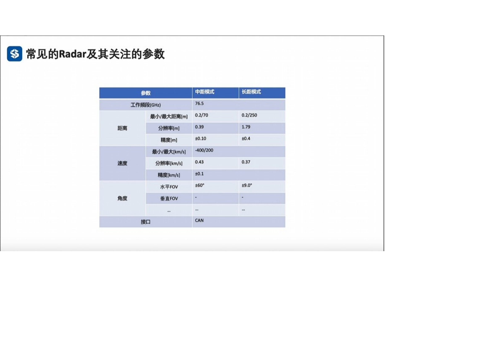 
 
 
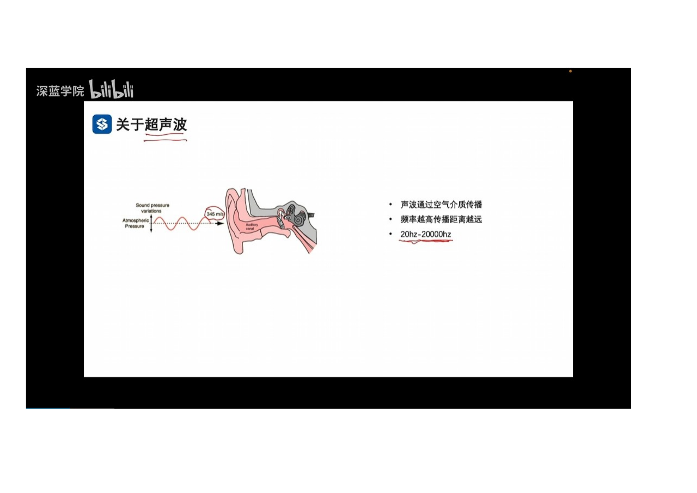 
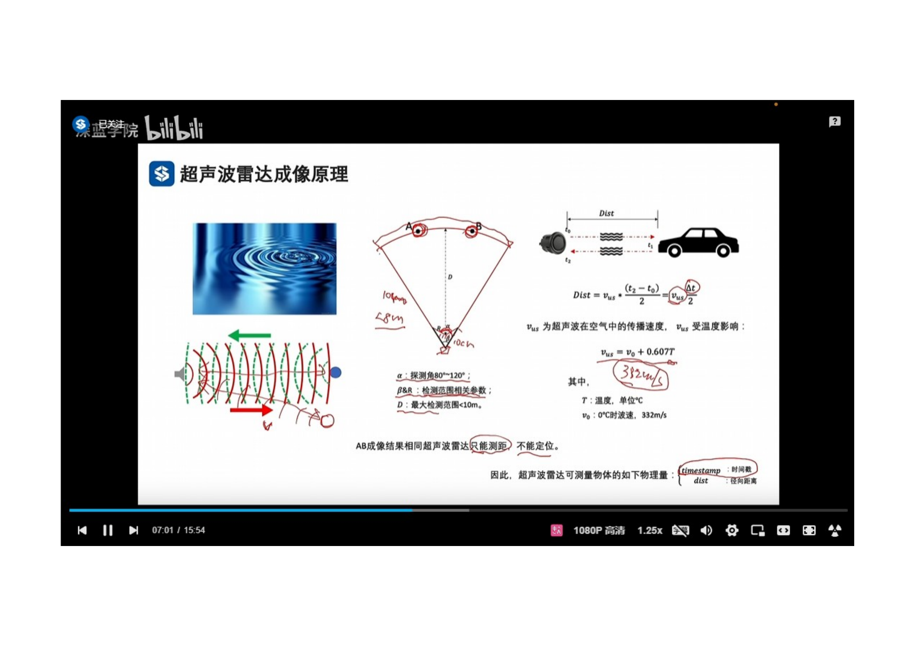 
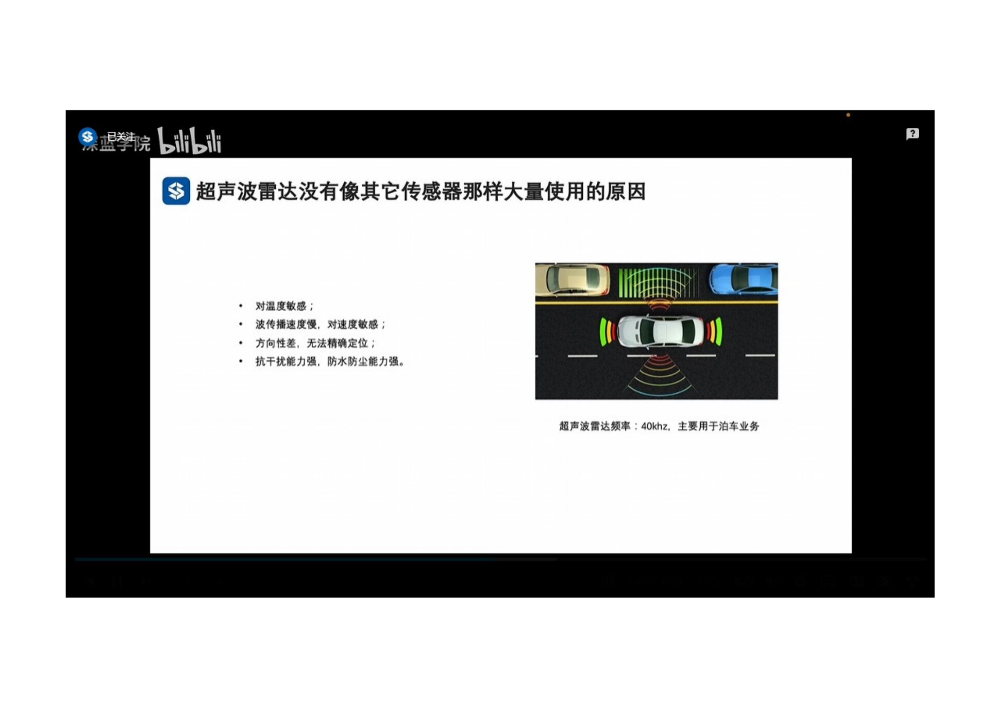 
 
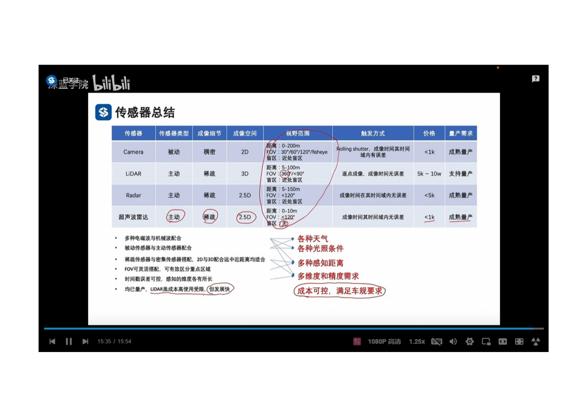 
 
 
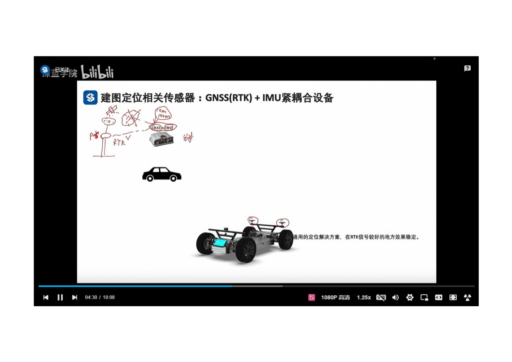 
 
 
 
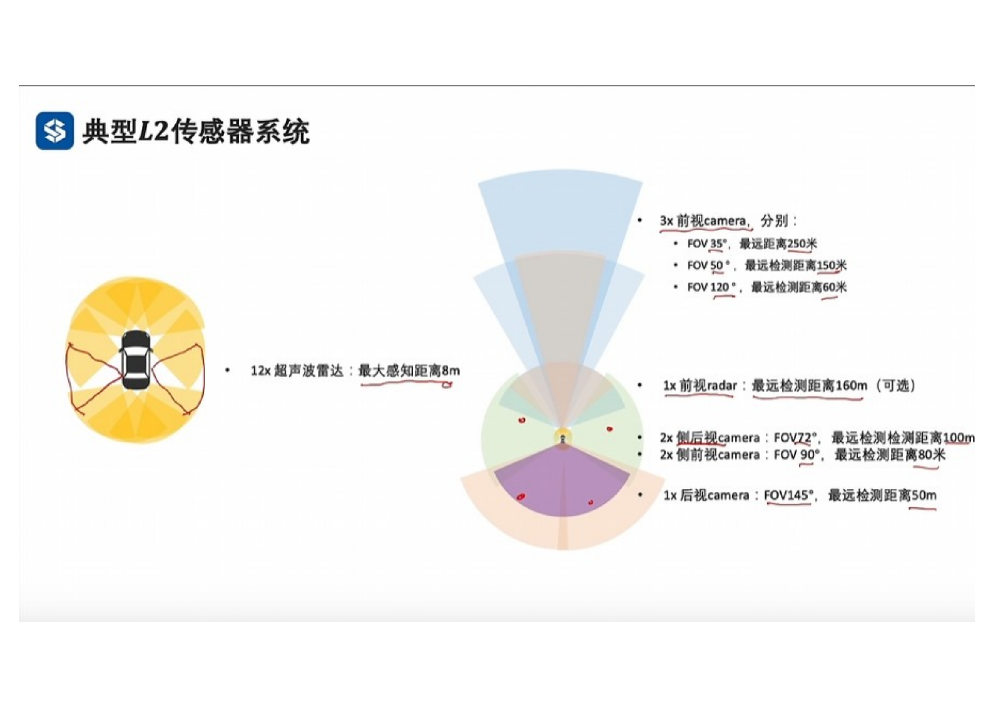
 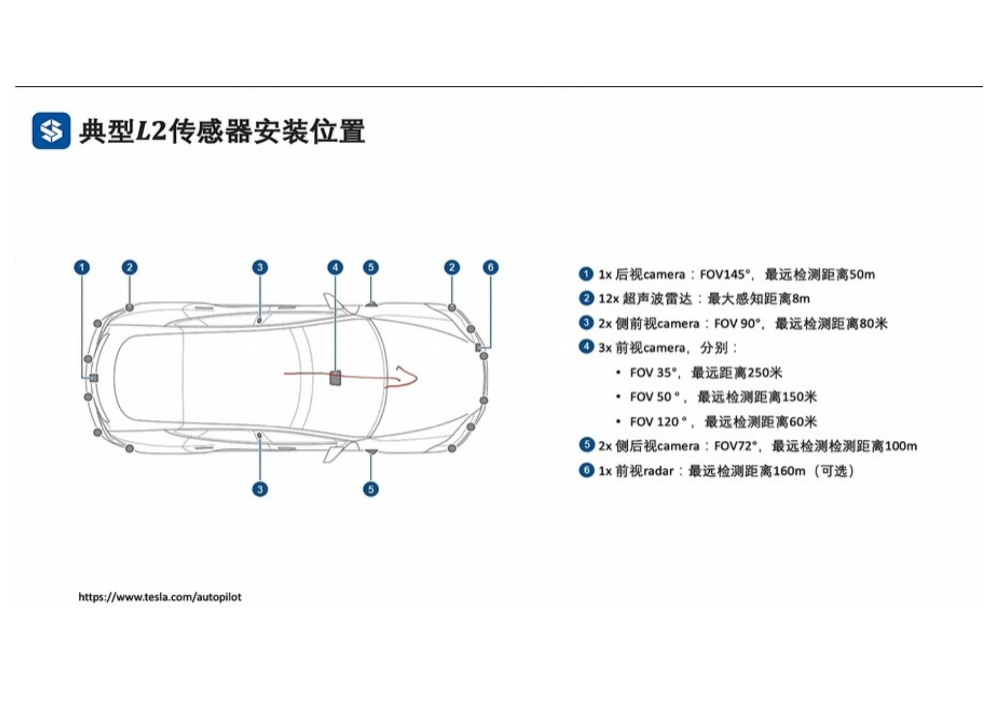 
 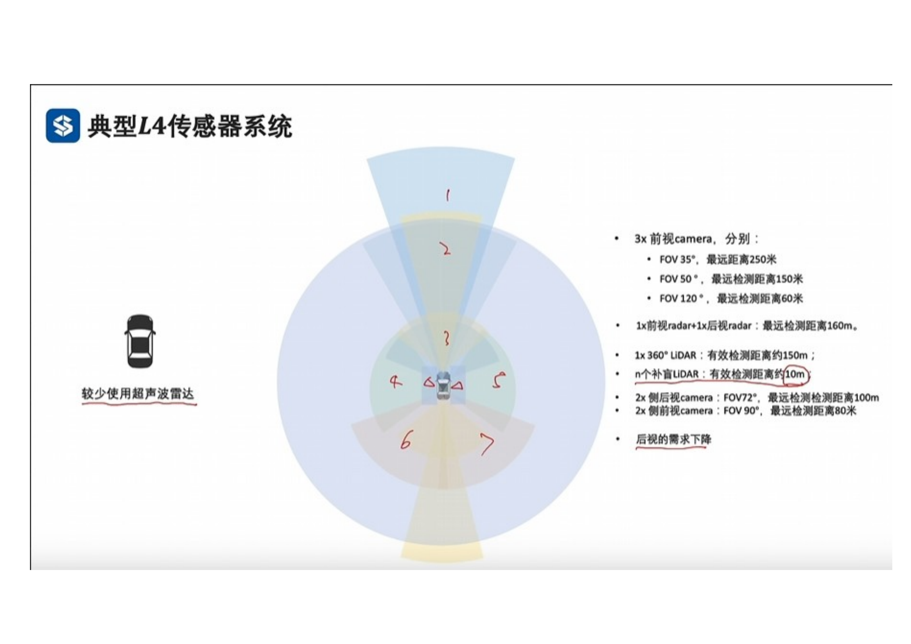 
  
  
 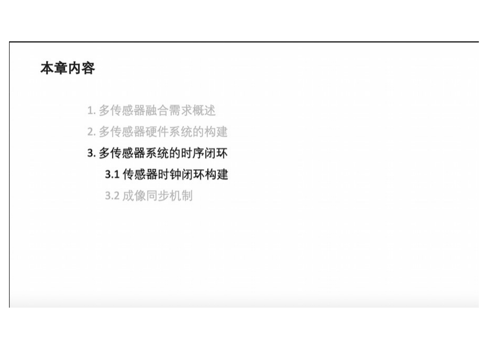 
 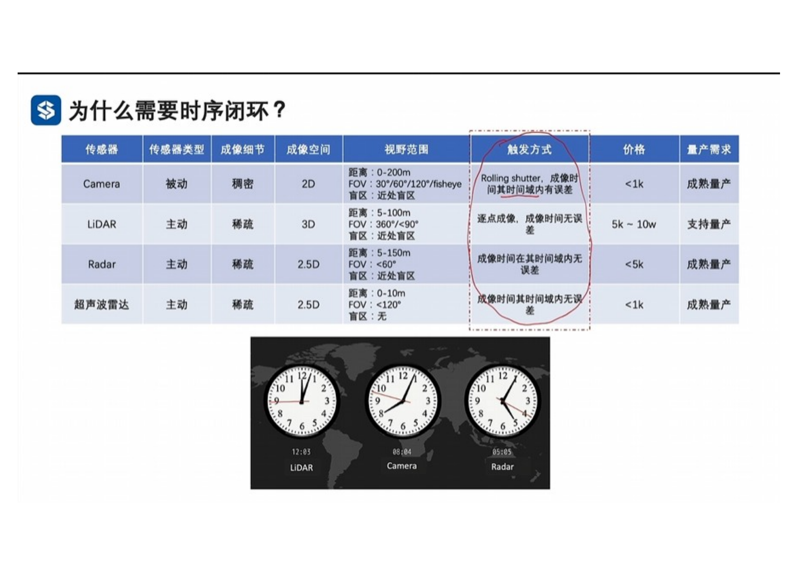 
  
  
  
 