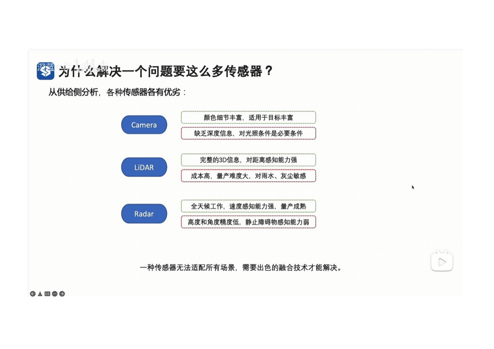
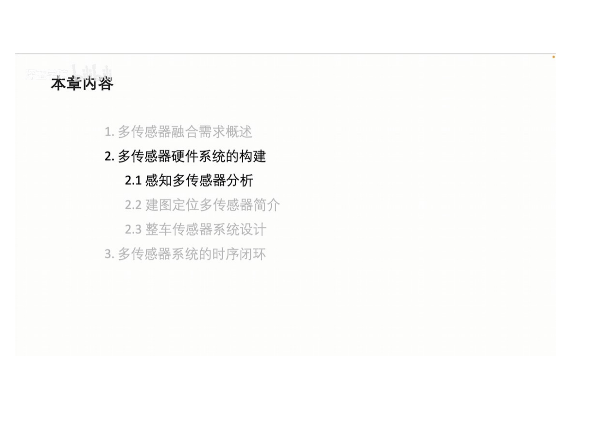
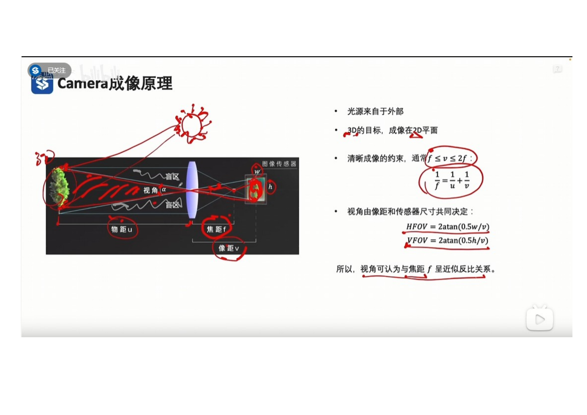
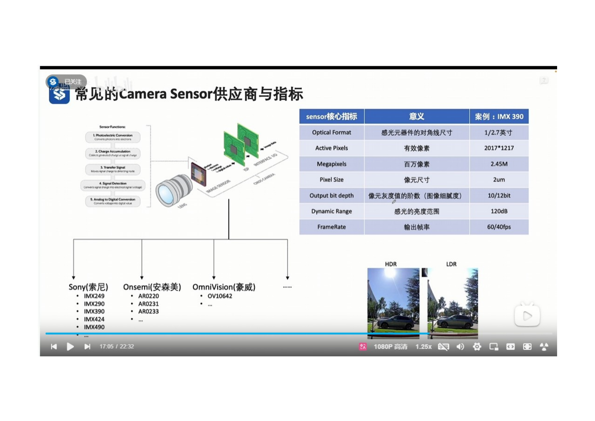

 
環境認識には異なるセンサーが必要な理由
- 異なるタイプのセンサーには、それぞれ利点と欠点があります
   - Camera 利点:　色彩（しきさい）の詳細が豊富で、多様な対象に適しています。欠点；深度情報が欠けており、光の条件に依存しています。
   - Lidar　利点；　完全な３D情報、距離の感知能力が強い。欠点；高コスト、量産が難しい、雨やホコリに敏感。
   - Rador　利点；　全天候で動作し、速度感知能力が強く、量産が成熟しています。欠点；高さや角度の精度が低く、静止物体の感知能力が弱い。
- 1つのセンサーではすべてのシナリオに適応できないため、優れた融合技術が必要です。

 

 

 

 
- 電磁波（でんじは）を媒体（ばいたい）として環境を観測する
- 電磁波の特性
    - 短波　伝播（でんぱ）方向性が良く、検出精度が高いが、遠くまで見えない。　
    - 長波　干渉（かんしょう）に強く、遠くまで見えます。
- Lidar　レーザー　短波；　カメラ　可視光　中波；　Radar　ミリ波　長波
- 複数の帯域（たいいき）の電磁波を組み合わせて冗長性（じょうちょうせい）を確保し、天候や光の条件、検知距離や精度の要求に適応できる。

  
- 機械波の特性、ある程度の透過（とうか）能力が持つが、減衰が早い。
- 超音波は機械波に属する。
- 超音波レーダーは近距離検出能力を強化でき、近距離に置いて電磁波センサーと相互に冗長性を持つ。

 
- カメラのイメージング特性　１光源は外部からのもの　２３Dの対象は２Dの平面に投影される。
- 鮮明（せんめい）なイメージングの制約　距離は焦点距離の１倍以上、２倍未満であること。
- 視野角は焦点距離とおおよそ反比例（はんぴれい）の関係にある。望遠レンズ　視野角がちっさい。　広角レンズ　視野角が大きい。
- 
 

- イメージセンサーは光信号を電気信号に変換し、ISPが電気信号を処理した後、デジタル画像として出力する。
- 画素数はイメージセンサーのサイズと画素のサイズによって直接決まる。

- DigitalCarでは、直接３Dシーンから画像を取得しており、カメラのCMOSとISPのシミュレーションは行っていません。
- 現在主流のCMOS供給メーカーは以下の通りです。

- 現在主流の光学レンズ供給（きょうきゅう）メーカーは以下の通りです
  

 
- 検出タスクに置いて、通常、車両の最小要件は30ピクセル以上、交通信号の最小要件は10ピクセル以上である。
- 画素の露光（ろこう）方式にはローリングシャターとグローバルシャッターがある。自動運転のカメラセンサーは一般的にローリングシャター露光モードを使用している。

    
カメラセンサーの主要な仕様
- オプティカルフォマット　感光素子（そし）の対角線（たいかくせん）のサイズ
- アクティブピクセル　有効な画素の数。
- メガピクセル　百万画素のサイズ
- ピクセルサイズ　ピクセルの實際のサイズ
- 出力ビット深度　画素の階調数。
- ダイナミックレンジ　センサーが捉え（とらえる）られる明るさの範囲。
- フレームレート　出力フレームレート、用途によって変わります。

   
 

- カメラは受動的なセンサーで、光源は外部からのものです。
- ３Dの物体を２Dの画像平面にマッピングすると、深度情報が失われます。
- カメラはローリングシャターを使用して、イメージング時間に誤差が生じます。

 

- 魚眼カメラのパラメータ **LensF.x** と **LensF.y** はそれぞれ水平方向の垂直（すいちょく）方向の焦点距離です。
- 魚眼カメラのパラメータ **LensC.x** と **LensC.y** は光軸の位置であるx、y座標です。
- 魚眼カメラのパラメータ **ResXすいちょ** と **ResY** はイメージプレーンのサイズを示します。例：1920×1080ピクセル。
- 魚眼カメラのパラメータ **K1、K2、K3、K4** は、UEが出力する平面画像を魚眼カメラの環視画像に変換するための歪みパラメータです。

 
