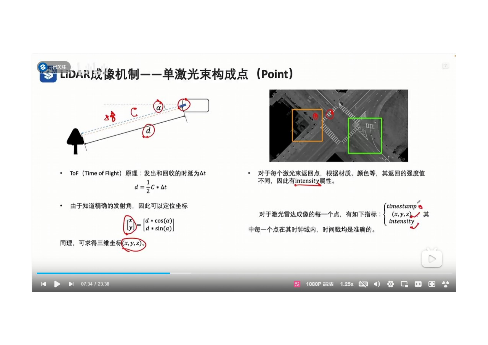
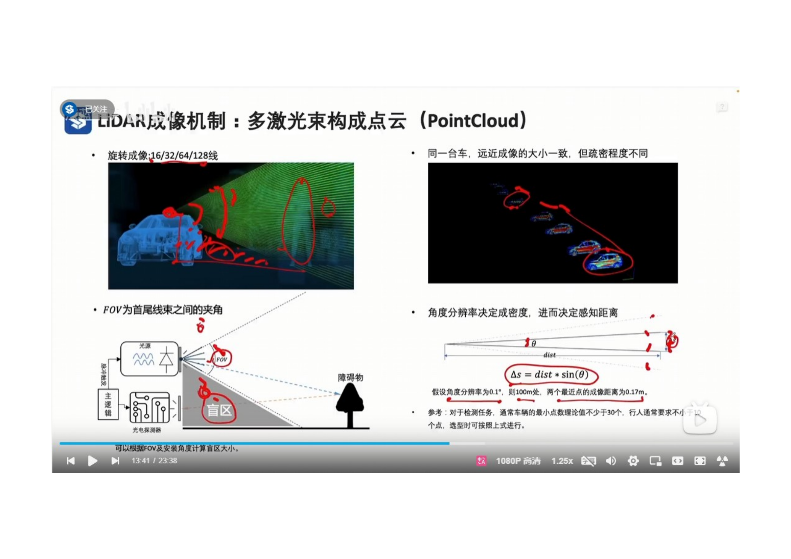
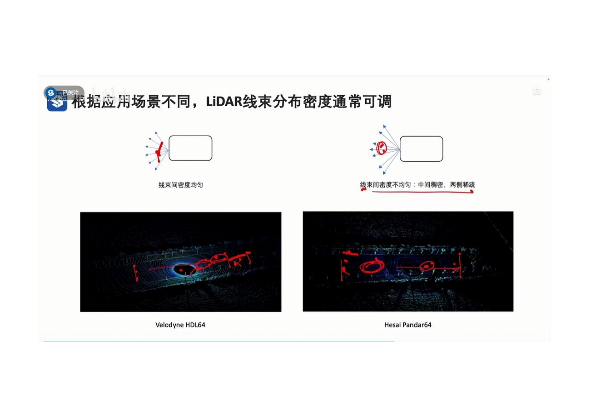
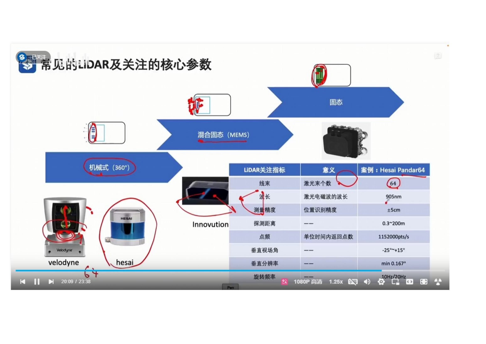
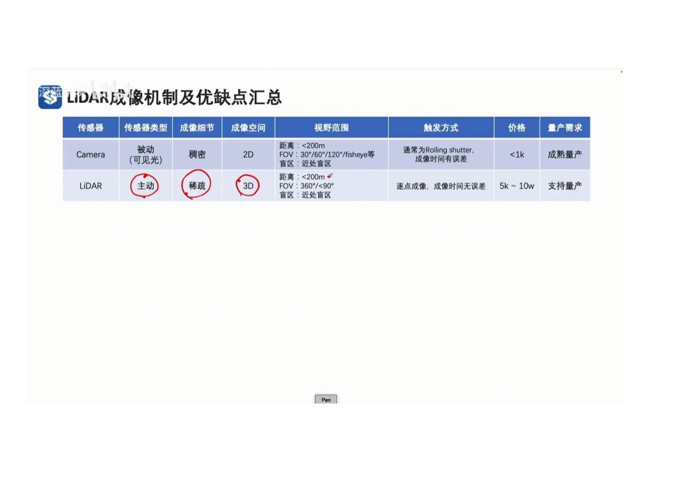
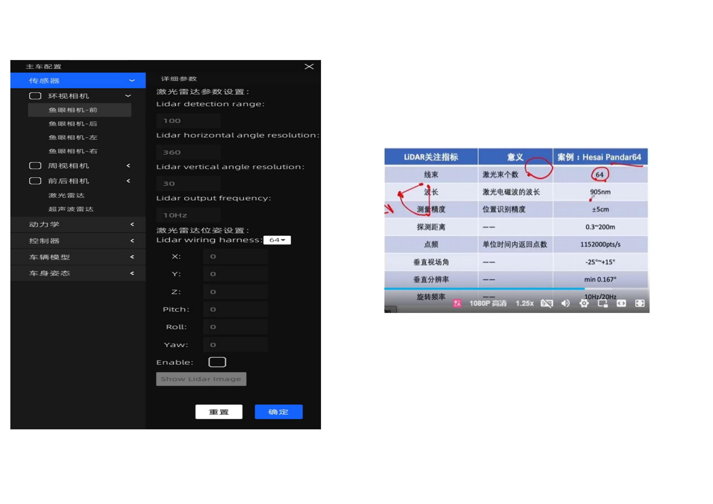
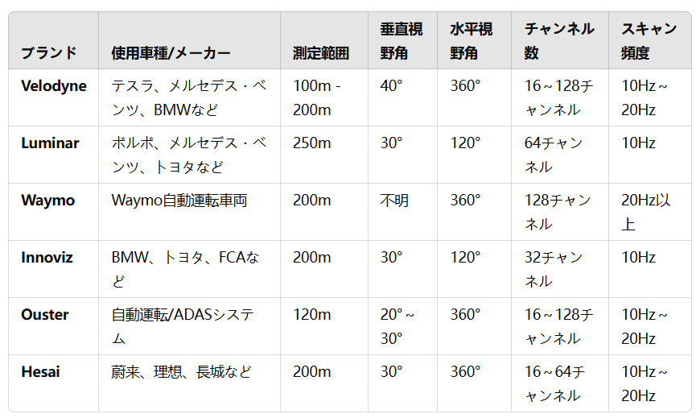

 
- 通过激光的FOT来计算距离，通过激光束的角度，来计算位置。
- 每个激光束的返回点，根据材质，颜色等，其返回的强度值不同，因此有Intensity属性。
- 点云中的每个点，一般具有以下属性， x,y,z 点的三维坐标，intensity 反射强度， timestamp 时间戳。
- 
 
- FOV 视场角， 表示Lidar 首激光束和尾激光束之间的夹角。

 
- 激光点云数据的特性，距离越远，点云数据越稀疏。
- 两个相邻激光线束之间的夹角，称之为角度分辨率。
- 驾驶角度分辨率为0.1°，在100米处，两个最近点的成像距离为0.17m。身高为1.7m的人，在点云数据中表现为10个点。
- 参考值： 对于检测任务，通常车辆的最小点数理论值不少与30个， 行人的最小点数理论值不少于10个。
- 
 
- 通过调整线束间的密度，可以调整激光雷达的探测距离。
- 传统激光雷达，线束间角度值相同，生成的点云数据，近处稠密，远处稀疏。
- 新型激光雷达，线束间角度值不同，中间稠密，两侧稀疏，从而让生成的点云数据，在远处变稠密，在近处稍微稀疏。
 
- 激光雷达有3种类型
- 机械式Lidar： 配备多个激光头，通过旋转，实现水平360度扫描。
- 混合固态Lidar： 去掉旋转设备，在水平方向上具有固定FOV，只配备一个激光头，通过偏振镜对激光进行折射，实现输出多束激光的效果。
- 固态Lidar： 去掉全部机械结构。
Lidar 的主要技术参数
线数： 激光束的个数
波长： 激光电磁波的波长
测量精度： 位置识别精度
探测距离：Lidar的探测距离
点频： 单位时间内返回点的个数
垂直视场角 在垂直方向上，激光束的观测范围
垂直分辨率 在垂直方向上，两个激光束之间的最小夹角
旋转频率：Lidar每秒旋转的次数。
 

目前，各大汽车品牌常用的Lidar及其对应的参数如下：

 

