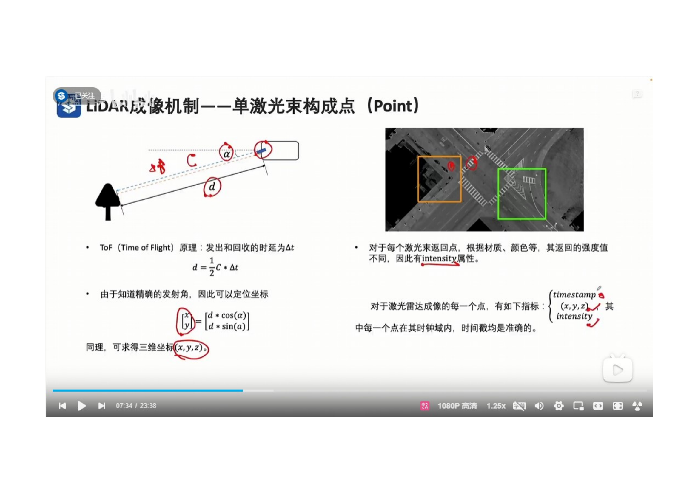
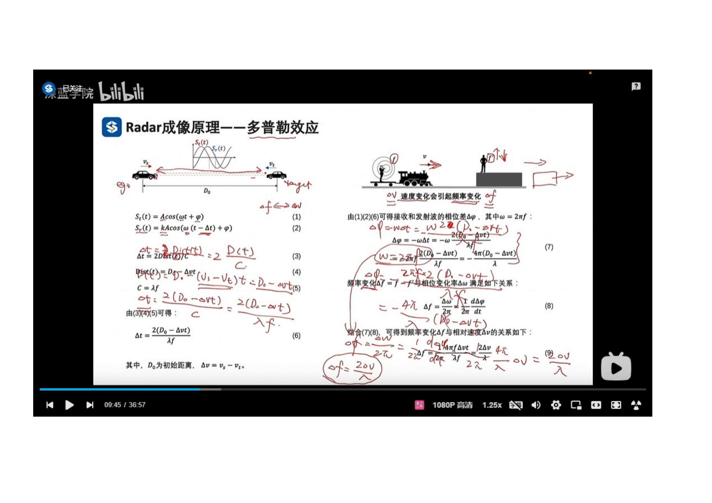

 
- レーザーのFOTを使用して距離を計算し、レーザービームの角度によって位置を計算します。
- 各レーザービームの戻り点は、材質（ざいしつ）や色等に応じて異なる反射強度値を持っているため、Intensity属性がある。
- 点群内の各点は、一般的に以下の属性を持っています。ｘ　ｙ　ｚ　は点の位置です。Intensity　は反射強度値です。TimeStampeは時間標識です。

 
- FOV（視野角）はLidarの最初（さいしょ）レーザービームと最後のレーザービームの間の角度を示します。

 
- Lidar点群データの特性として、距離が遠くなるほど、点群データは疎ら（まばら）になります。
- 隣接するレーザービームの間の角度は、角度解像度と呼ばれます。
- 例えば、角度解像度は0.1度と、100メートルの距離では、最も近い2点の間の画像距離は0.17ｍとなります。そうすると、身長1.7ｍの人は、点群データにおいて約10点として表現されます。
- 参考値　検出タスクにおける、通常、車両の最小点数の理論値は30点以上、歩行者の最小点数の理論値は10点以上とされています。
  
 
- 通过调整线束间的密度，可以调整激光雷达的探测距离。
- 传统激光雷达，线束间角度值相同，生成的点云数据，近处稠密，远处稀疏。
- 新型激光雷达，线束间角度值不同，中间稠密，两侧稀疏，从而让生成的点云数据，在远处变稠密，在近处稍微稀疏。
 
- 激光雷达有3种类型
- 机械式Lidar： 配备多个激光头，通过旋转，实现水平360度扫描。
- 混合固态Lidar： 去掉旋转设备，在水平方向上具有固定FOV，只配备一个激光头，通过偏振镜对激光进行折射，实现输出多束激光的效果。
- 固态Lidar： 去掉全部机械结构。
Lidar 的主要技术参数
线数： 激光束的个数
波长： 激光电磁波的波长
测量精度： 位置识别精度
探测距离：Lidar的探测距离
点频： 单位时间内返回点的个数
垂直视场角 在垂直方向上，激光束的观测范围
垂直分辨率 在垂直方向上，两个激光束之间的最小夹角
旋转频率：Lidar每秒旋转的次数。
 
 
 
