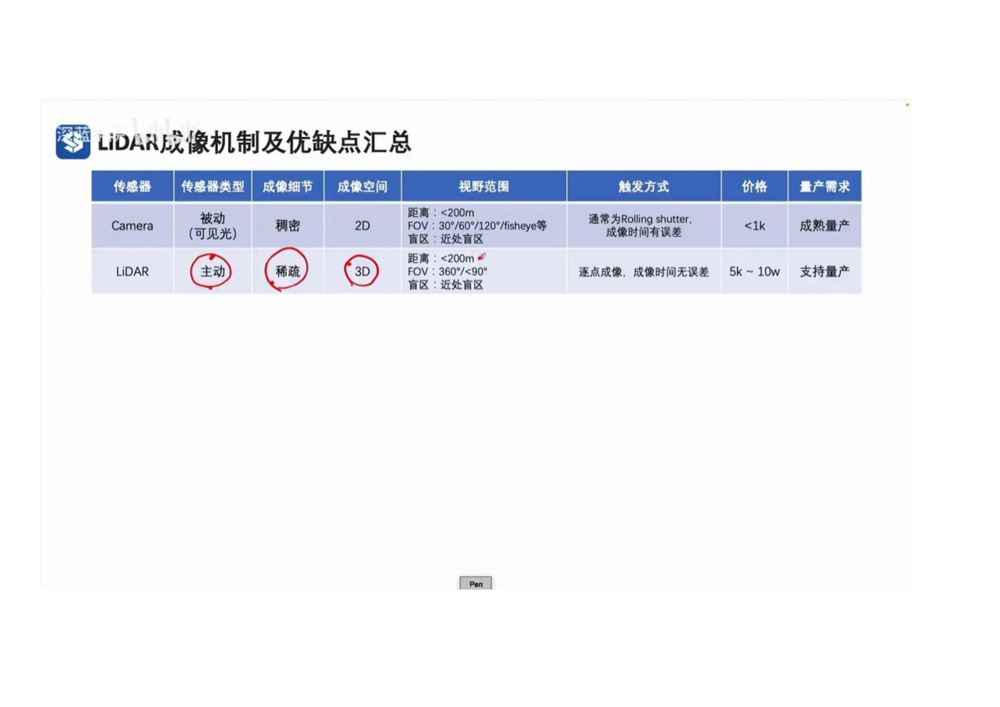
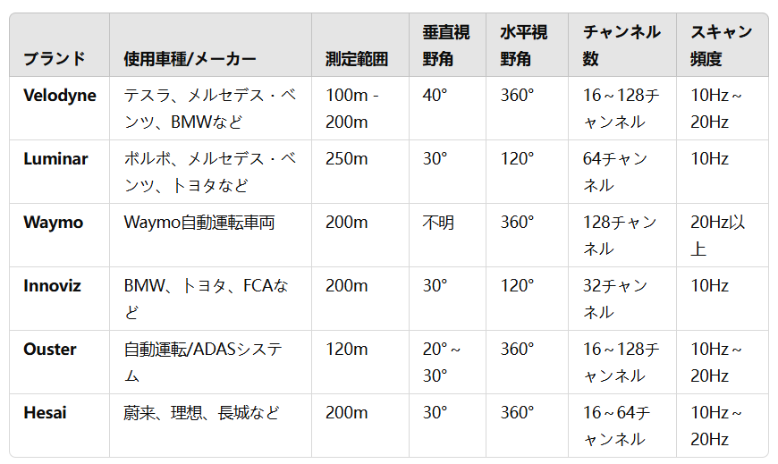

 
- レーザーのFOTを使用して距離を計算し、レーザービームの角度によって位置を計算します。
- 各レーザービームの戻り点は、材質（ざいしつ）や色等に応じて異なる反射強度値を持っているため、Intensity属性がある。
- 点群内の各点は、一般的に以下の属性を持っています。ｘ　ｙ　ｚ　は点の位置です。Intensity　は反射強度値です。TimeStampeは時間標識です。
 
- FOV（視野角）はLidarの最初（さいしょ）レーザービームと最後のレーザービームの間の角度を示します。
- Lidar点群データの特性として、距離が遠くなるほど、点群データは疎ら（まばら）になります。
- 隣接するレーザービームの間の角度は、角度解像度と呼ばれます。
- 例えば、角度解像度は0.1度と、100メートルの距離では、最も近い2点の間の画像距離は0.17ｍとなります。そうすると、身長1.7ｍの人は、点群データにおいて約10点として表現されます。
- 参考値　検出タスクにおける、通常、車両の最小点数の理論値は30点以上、歩行者の最小点数の理論値は10点以上とされています。
 
- レーザー間の密度を調整することで、Lidarの検出距離も調整することが出来ます。
- 従来のLidarは、レーザー間の角度が均一（きんいつ）であり、生成される点群データは近距離では密集し、遠距離では疎ら（まばら）になります。
- 新型的Lidarには、レーザー間の角度を変化させることで、中央部分を密に、両側を疎らにすることで、生成される点群データが遠距離ではより密になり、近距離ではやや疎らになるようにしています。
 
- Lidar には3種類のタイプがあります。
- 機械式Lidar　複数のレーザーヘッドを搭載し、回転によって水平360度のスキャンを実現する。
- ハイブリッド固体Lidar　回転装置を取り除き、水平方向に固定されたFOVを持ち、1つのレーザーヘッドを搭載。偏光ミラーを利用してレーザーを屈折させ、複数のレーザービームを出力します。
- 固体Lidar　全ての機械装置を排除します。
- Lidarの主要な技術パラメータ
- レーザー数　レーザービームの数
- 波長　レーザー電磁波の波長
- 探知距離　Lidarの探知可能の距離
- 点頻度　単位時間あたりに返される点の数。
- 垂直視野角　垂直方向におけるレーザービームの観測範囲
- 垂直分解能　垂直方向における隣接するレーザー間の最小角度
- 回転周波数　Lidarが1秒で回転する回数
 
 
 
DigitalCar中Lidar 的相关参数
- Lidar Detection Range Lidar 探测距离，默认为100米
- Lidar Horizon Angle Resolution  Lidar水平角分辨率，默认值为 360， 感觉此处应该是水平视场角的意思。
- Lidar Vertical Angle Resolution Lidar垂直角分辨率， 默认值为 30.  此处不知道单位，也不知道是否是垂直视场角的意思
- Lidar Output Freequency  雷达输出频率，可以理解为旋转频率
- Lidar Wiring harness Lidar的激光束数目。
現在、主要な自動車ブランドで使用されているLidarとその対応するパラメータは以下の通りです

