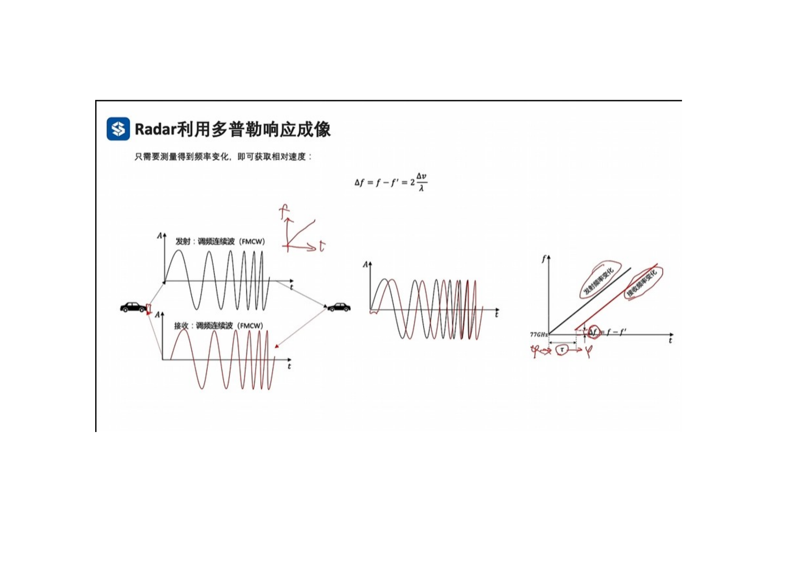
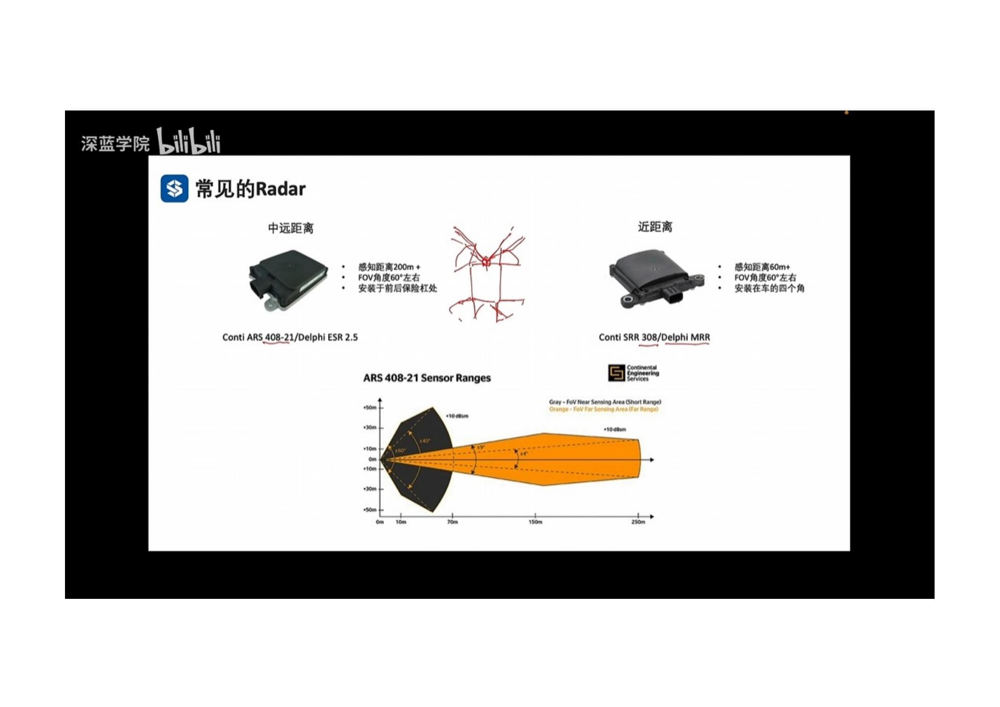
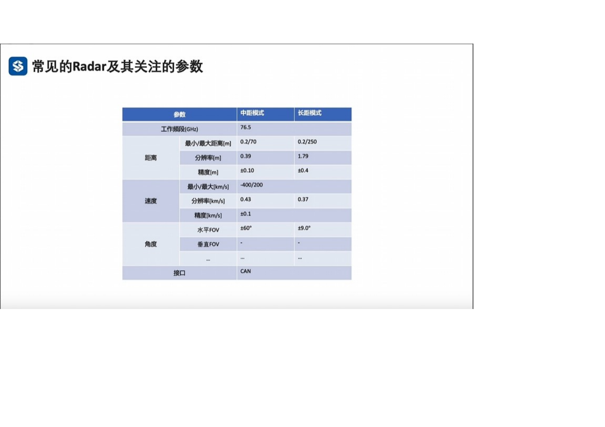

 
- Radar传感器原理，多普勒效应。在相对运动中，靠近接收者时，频率会上升，远离接收者时，频率会下降。速度变化会导致频率变化。
- 只需要测量到频率变化，就可以获取到相对速度。
  
 
- 类似于TOF原理，发出调频正弦波，根据反射波的相位差，求出时间chat，即可以求出径向距离d 和 径向速度v (极坐标系)
- 如何求物体和Radar之间的夹角： Radar内部通常设置1个发射天线，2个接受天线，角度估计不准。
- Radar 可以测量物体的以下物理量：d 径向距离， Vrange 径向速度， Vlateral 切向速度， Angle 朝向角，低精度。朝向角越大，精度越差。 timestamp 时间戳
- 
 
- Radar 通过频域对Rador 数据进行处理。 频域越高，过滤性越强，检测精度越高，但有可能丢失物体。 频域越低， 过滤性越差，检测精度越低，但保留了较多的物体。
- 毫米波雷达有高度信息吗，现在有4D毫米波雷达，可以测量高度信息。
- 毫米波雷达是否可以生成点云。 可以的， 但是毫米波雷达厂商不会轻易公开点云数据。
- 毫米波雷达与激光雷达相比有什么优势。 
- 毫米波雷达只有在存在相对运动的情况下，才能正常工作。
 

- 毫米波雷达按照探测距离分类，可以分为长距离Radar，中距离Radar，短距离Radar 和 超短距离Radar。
  

1 现有的自动驾驶车辆所使用的Radar，及其对应的类型与参数。

 
 
