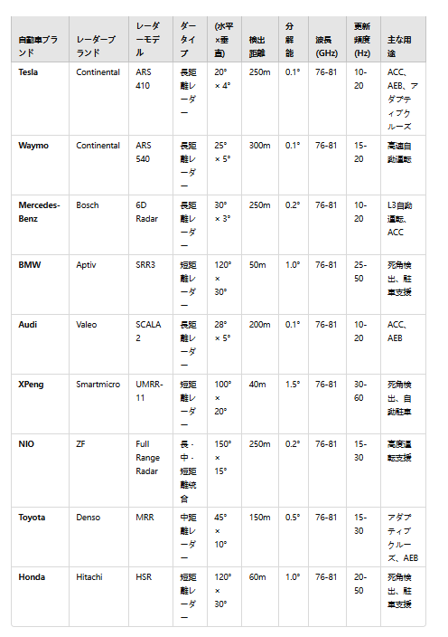

 
- Radarセンサーの原理はドップラー効果。相対運動がある場合、対象物が受信機に近づくと周波数が上昇し、遠ざかると周波数が低下する。速度の変化が周波数の変化を引き起こす。
- 相対速度の取得　周波数の変化を測定するだけで、対象物の相対速度を取得できる。
  
   
- TOFに類似した原理　周波数変調された正弦波（せいげんは）を送信し、反射波の位相差を測定することで、時間ｔを求める。これにより、極座標系における距離と速度を計算できる。
- 物体とRadar間の角度を求める方法　一般的に、Radar内部には1つの送信アンテナと2つの受信アンテナが設置されている。これにより、角度を推定できるが、精度は低い。
- Radarが測定可能な物理量　ｄ　距離　VRange　速度、　VLateral　横向き速度、方位角　精度が低く、方位角が大きくなるほど精度が低くなる。TimeStamp　時間標識
  
 
- Radarは周波数領域でレーダーデータを処理します。周波数が高いほどフィルターリング性が強くなり、検出精度が向上しますが、物体を見落とす可能性があります。周波数が低いとフィルターリング性が弱くなり、検出精度が低下しますが、より多くの物体を保持（ほじ）出来ます。
- ミリ波Radarには高さ情報がありますか？現在、４Dミリ波Radarがあり、高さ情報を測定できます。
- ミリ波Radarは点群を生成できますか？はい、可能ですが、ミリ波Radarメーカーは点群データを容易には公開しません。
- ミリ波RadarはLidarと比べると、どのような利点がありますか
- ミリ波Radarは相対的な動きが存在する場合にのみ正常に動作できます。
 

- ミリ波Radarは探知距離によって分類され、長距離Radar、中距離Radar、短距離Radar、超短距離Radarに分けられます。
  

- 現在の自動運転の車で使用されているミリ波Radar、それ対応する種類とパラメータは以下の通りです。

 
 
