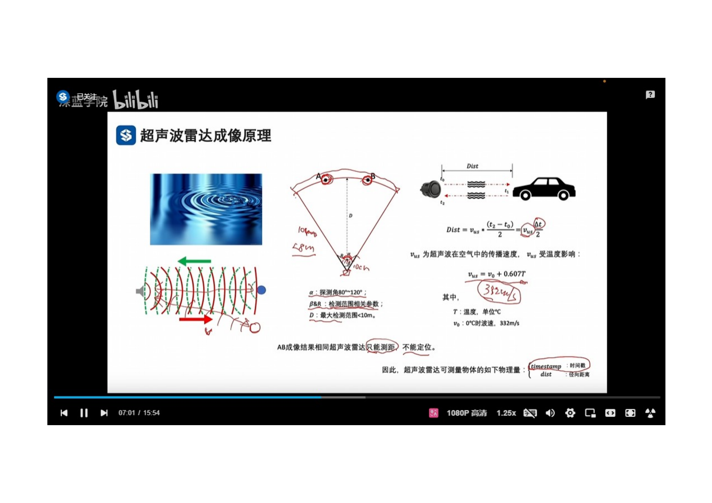 
- 超音波は機械波の一種であり、空気いを媒体として伝播し、減衰が早い。
- 超音波RadarのFOV（視野角）は一般的に80度から120度であり、探知距離は10メートル未満である。
- 超音波Radarは距離の測定が可能だが、位置の特定は出来ない。
- 空気中の超音波の伝播速度は温度の影響を受ける。V = V0 + 0.607*T（V0 = 332m/s）;V0は温度が0度の時の超音波の伝播速度。
- 超音波Radarが測定可能な

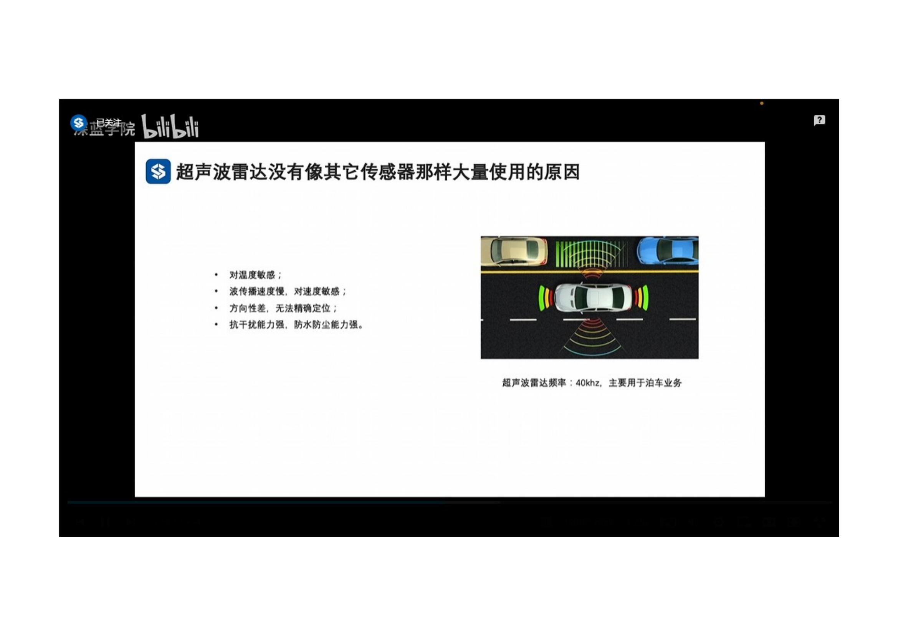 
- 超声波对温度敏感
- 超声波传播速度慢，对速度敏感
- 方向性差，无法精确定位。
- 抗干扰能力强，防水防尘能力强。
- 根据超声波Radar的特点，主要用于泊车业务。
- 
 
 
- 多种电磁波和机械波相结合
- 被动传感器与主动传感器相结合
- 稀疏传感器与密集传感器相互搭配，2D传感器与3D传感器配合，远中近距离均适合。
- FOV可灵活搭配，可有效区分重点区域。
- 时间戳误差可控，感知的维度各有所长。
- 均已量产，LiDar虽成本高，使用受限，但发展很快。
 
 
 
 
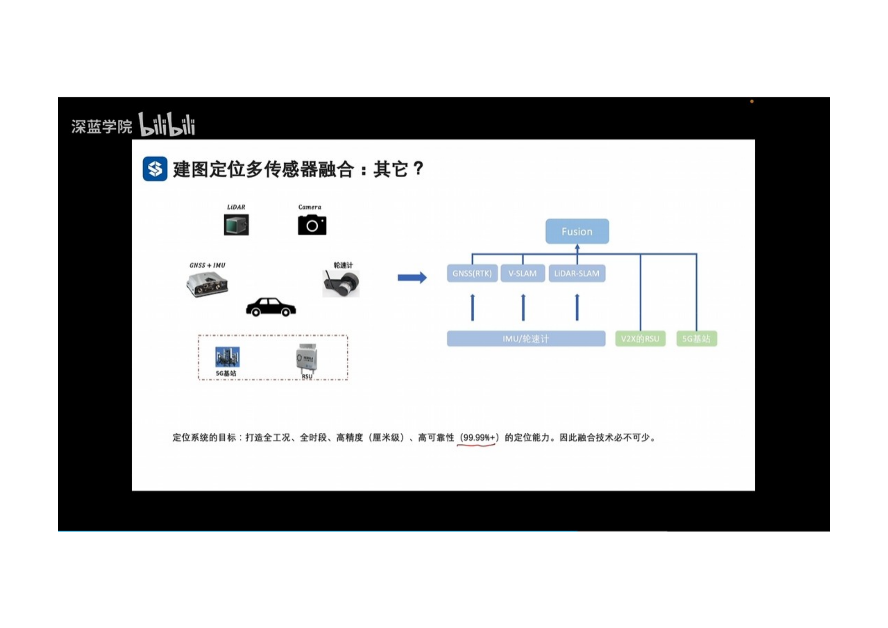 
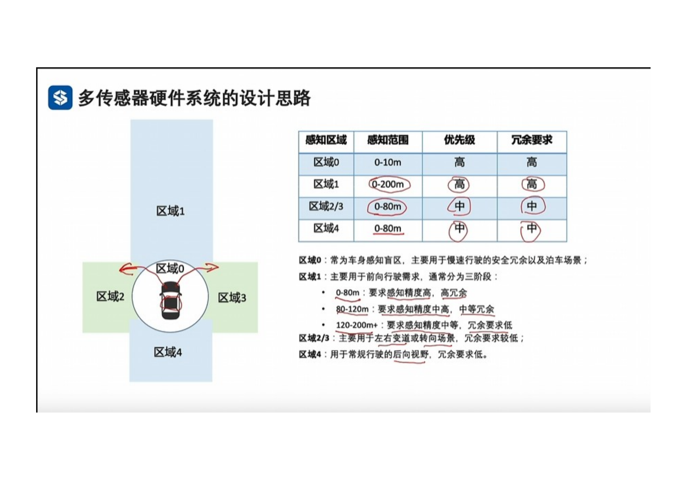 
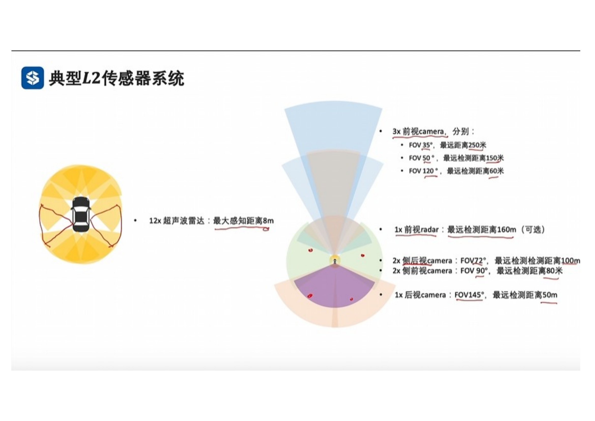
  
 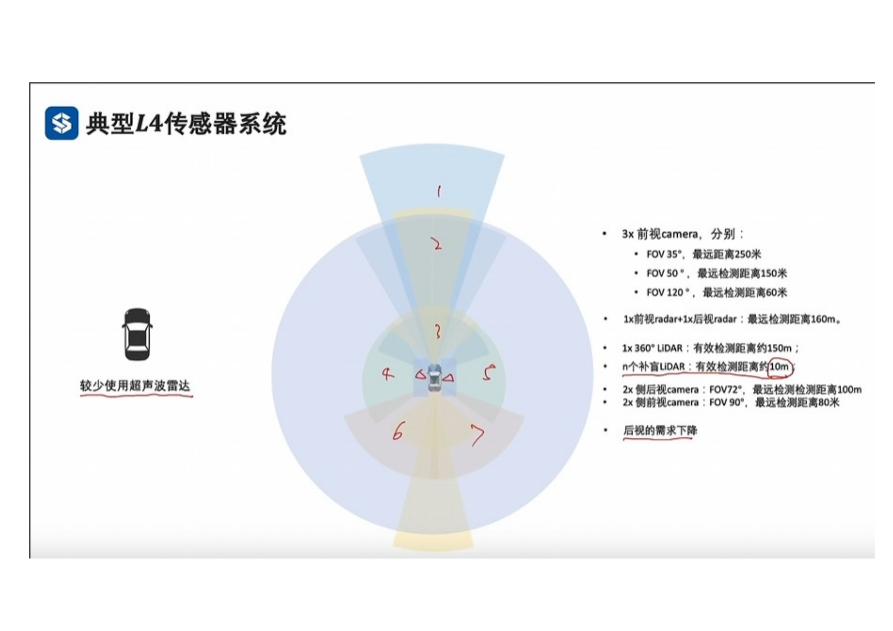 
  
  
 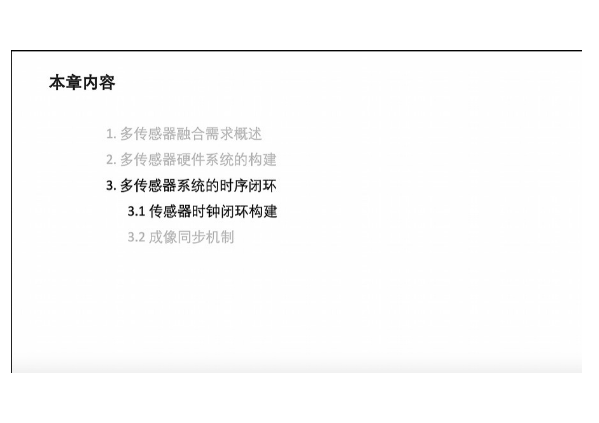 
 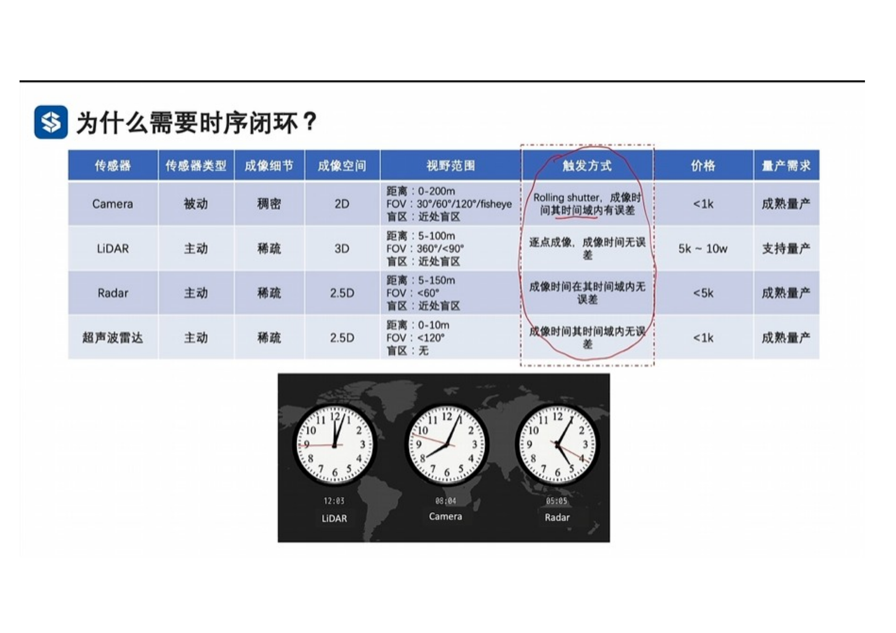 
 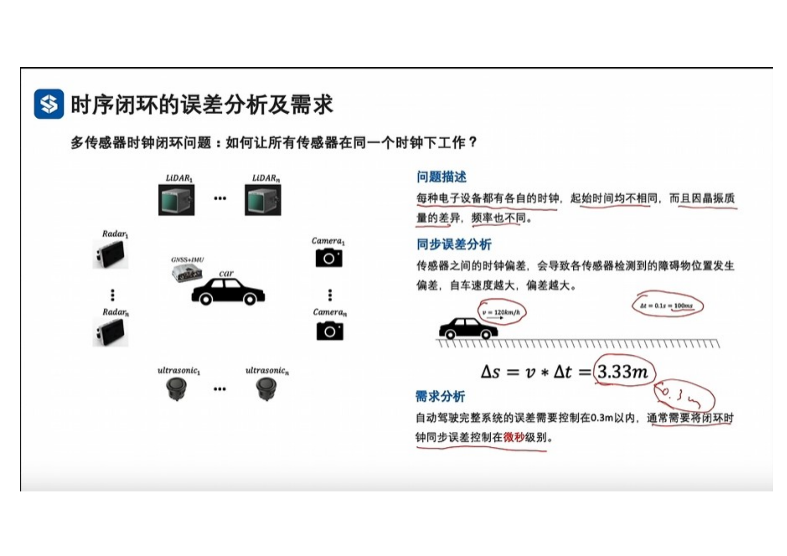 
 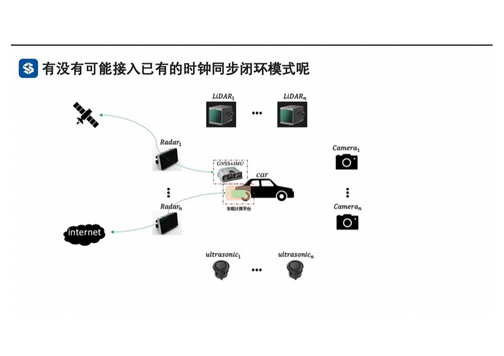 
 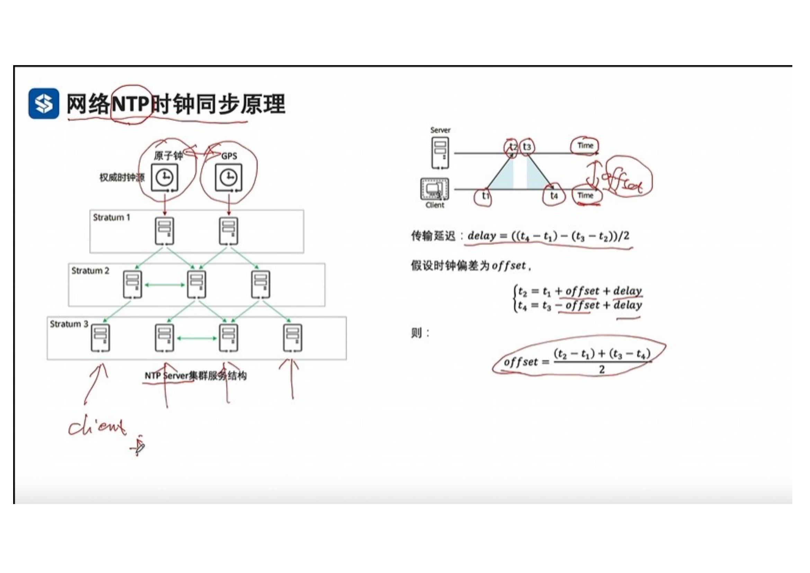 
 