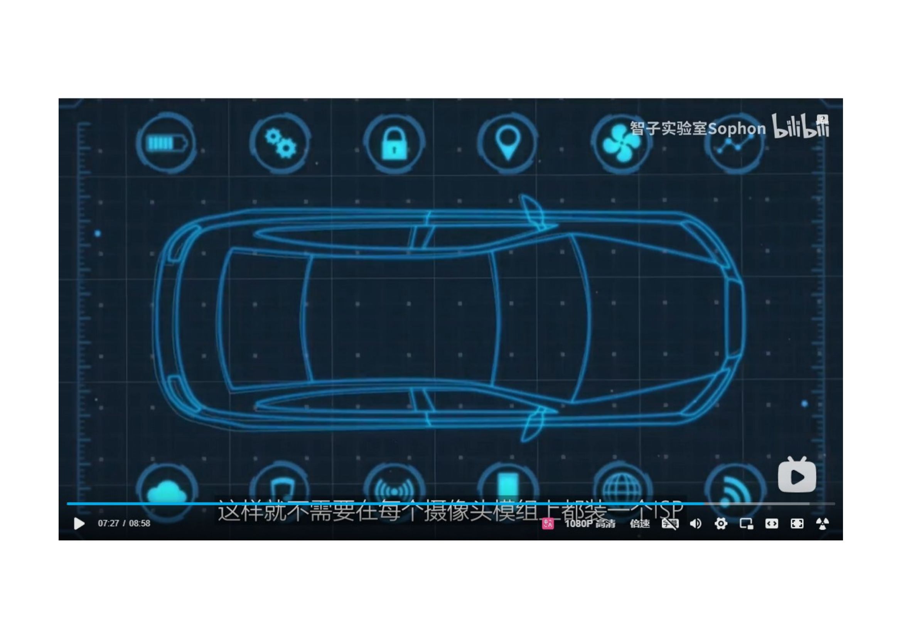

# Camera On Autonomous Car

 
1. 自動運転システムでは、カメラは人間の運転手の目のように重要で、自動運転システムの中で最も重要なセンサーとも言える。
2. ミリ波レーダやライダーに比べ、カメラはコストが低く、色情報が豊富、セメンティク情報を提供できる等多くのメッリトがある。
3. これらのメッリトのため、カメラはスマートカーでよく見られます。１台の車が少ないと３－５台のカメラがり、多いと十数台がある。
4. このような広く使われ、特に重要なセンサーについて、どのぐらい知っていますか。

 

- まずはカメラの基本構造を見てみましょう。　車載カメラは主に光学レンズ、画像センサー、画像信号プロセッサー、シリアル、コネクタで構成されている。
- カメラの動作原理は、外光が物体に照射され、反射と屈折を経て、光学レンズを通して画像センサーに投影されます。
- センサーの光電デバイスは光信号を電気信号に変換し、画像信号プロセッサーを介してRGB、YUV等のフォマットの画像信号に変換して、出力する。
- 光学レンズは光を焦点に合わせ、視野内の物体をイメージング平面に投影する。
- 光学レンズには赤外線フィルターも含まれており、人間の目に見えない赤外光を除去し、人間の目に見える可視光だけを残す。

 
- レンズの焦点距離は撮影画像の視野角の大きさを決定し、レンズの焦点距離が長いほど視野角が狭い。
- １５０メートル離れた物体、例えば交通信号を見るため、一般的には前方に望遠レンズがついていて、FOV　は一般的３０度ぐらいです。
- レンズの焦点距離が短くほど視野角が広い。例えば、アラウンドビューに使われる魚眼カメラは、画像のつなぎ合わせに非常な大きな視野角が必要で、焦点距離は一般的に１６mm未満で、魚眼カメラの水平視野角は一般的に170度以上である180度を超えることもあります。
- 大きな視野角のコストは画像が歪んで、エージに近づくほど歪んでしまうこと、歪が補正する必要がある。
- 現在、主要な光学レンズのサプライヤーは舜宇光学、聯創、欧菲光などがあります。

 
图像传感器利用光电器件的光电转换特性，将感光面上的光信号转换成电信号。车载摄像头普遍采用cmos，而cmos是摄像头最重要的部分，也是价值最高的，约占成本的50%。Cmos决定了摄像头最重要的参数像素，一般常说的200万像素或800万像素，就是说有200万或800万个感光点，也就是说cmos有200万或800万个负责光电转换的光电二极管。还有一个很重要的参数帧率也是由cmos决定的，每秒帧率表示cmos每秒更新的次数，帧率越高画面越清晰，常见的帧率是30或25。目前车规cmos市场主要由安森美和豪威科技两大厂商主导，市场集中度非常高。

- 画像センサーは光電デバースの光電変換特性を利用して、感光面上の光信号を電気信号に変換する。
- 車載カメラは一般的にCMOSを採用している。CMOSはカメラの最も重要な部分であり、コストの約50％を占めている。
- CMOSはカメラのもっとも重要な画素パラメーターを決定し、一般的には200万画素または800万画素、つまり200万または800万の受光点がある、つまりCMOSには200万または800万個の光電変換を担当する光電ダイオードがあります。
- もう一つ重要なフレムレートパラメータはCMOSによって決定され、毎秒フレームレートはCMOSが毎秒更新した回数を表し、フレームレートが高いほど画面がはっきりし、よく見られるフレムレートは30または25である。
- 現在、自動車規格のcmos市場は主に安森美と豪威科技の二大メーカーが主導しています。市場の集中度(しゅちゅうど)は非常に高いです。

 
 
 
- 現在、自動車規格のcmos市場は主に安森美と豪威科技の二大メーカーが主導しています。市場の集中度(しゅちゅうど)は非常に高いです。
  

 
 
 
 
 
 
 
 
 
 
 
 
 
 
 
 
 
 
